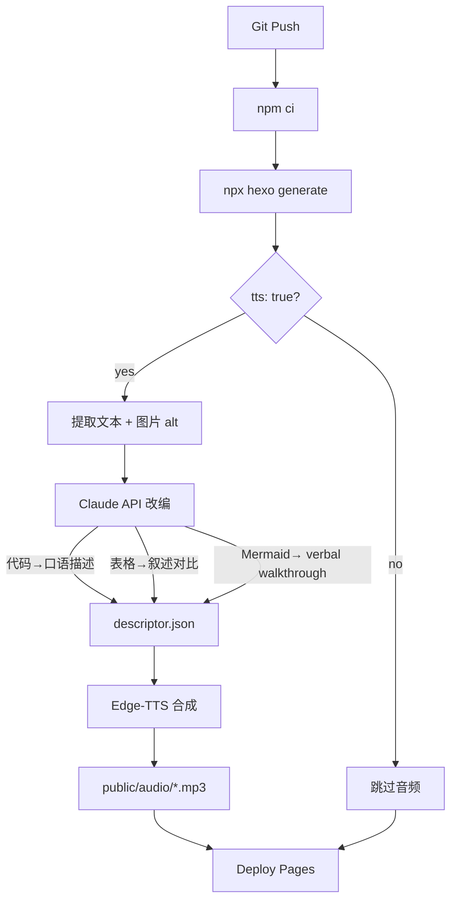

## Goal Capsule

- **Objective:** 为 Hexo 博客构建 build-time 音频朗读系统，让标记 `tts: true` 的文章自动生成带口语化内容改编的 MP3 音频，并在文章页面提供完整的音频播放器。
- **Product authority:** 文章音频生成与播放。类别声音映射（Idea 2）、分层收听（Idea 6）、混合 TTS（Idea 7）、AI 图片描述（Idea 4）、播客目录提交、本地开发音频预览不在本计划范围。
- **Open blockers:** 无。

---

## Product Contract

### Summary

为 Hexo 博客构建 build-time 音频朗读系统。标记 `tts: true` 的文章在 GitHub Actions build 时自动生成 MP3 音频，其中代码块、表格、Mermaid 图由 Claude API 转化为口语化中文描述后合成。文章页面呈现带进度条的 HTML5 播放器，图片读取 markdown alt text 作为语音描述。架构预留播客 RSS 元数据扩展位，但首版不实现目录订阅。

### Problem Frame

博客有 117 篇技术文章，其中大量代码密集（2308 个代码围栏），1,219 张图片引用，51 个 Mermaid 图。用户的核心场景是开车和睡前 — 这些时候无法阅读屏幕，但希望消费技术内容。

直接将 markdown 转 TTS 存在根本问题：代码块被逐字符朗读（`public static void main`），表格逐行念数据，Mermaid 图完全丢失。66% 以上的内容在纯 TTS 下不可听。需要一个内容改编层将非文字元素转化为可听的自然语言描述，同时保持音频质量在 build-time 统一生成而非依赖浏览器的 TTS 能力。

### Requirements

**Build Pipeline**

- R1. 每次 push 到 main 触发 GitHub Actions build 时，对标记 `tts: true` 的文章自动生成 MP3 音频文件。音频文件作为静态资源部署到 `public/audio/{year}/{month}/{day}/{name}.mp3`，路径与文章 permalink 对应。
- R2. 内容改编作为 build-time 后处理步骤运行。提取已生成 HTML 的纯文本内容，将代码块、表格、Mermaid 图发送到 Claude API 生成口语化中文描述。图片元素提取 markdown alt text 作为语音描述；无 alt text 的图片跳过。改编后的完整文本存储为 descriptor JSON（`source/data/descriptors/{slug}.json`）。
- R3. TTS 合成使用 Edge-TTS（Python 库），声音为 YunjianNeural。GHA workflow 需新增 `setup-python` 步骤和 `pip install edge-tts`。接收 descriptor JSON 的文本，生成 MP3 输出到 `public/audio/{year}/{month}/{day}/{name}.mp3`，路径与文章 permalink 对应。语音参数（语速等）可配置。
- R4. Build pipeline 实现 content-hash 缓存。文章内容和配置未变时跳过音频重新生成。典型增量 build 仅重新生成 1-3 个 MP3。

**Audio Player**

- R5. 标记 `tts: true` 的文章页面呈现一个完整的 HTML5 音频播放器。包含：播放/暂停、进度条（可拖拽）、当前时间/总时长、播放速度控制。
- R6. 播放器支持 Media Session API 集成。手机锁屏和车机蓝牙显示播放/暂停/上一曲/下一曲控制。
- R7. 播放器 UI 适配 NexT 暗色模式，遵循现有 CSS 变量体系（`--text-color`, `--border-color` 等）。

**Configuration and Security**

- R8. TTS 功能按文章 opt-in，通过 front-matter `tts: true` 启用。未标记或 `tts: false` 的文章不生成音频。
- R9. 全局 TTS 配置在 `_config.next.yml` 中，包含：voice 名称、语速倍率、Claude model 名称、是否启用音频生成。
- R10. Claude API key 仅通过 GitHub Actions Secrets 注入 build 环境。key 不出现在仓库任何文件中，不写入 `db.json`，不嵌入部署产物。
- R11. 本地 build（`npm run server` / `npx hexo generate`）在无 API key 时优雅降级：跳过 Claude 改编和 TTS 步骤，站点其他功能正常构建。

### Key Decisions

- KTD1. **Build-time TTS 而非客户端 TTS。** Build-time 生成解锁播客 RSS 分发、离线收听、CDN 缓存，且不受浏览器 TTS 质量差异影响。选择客户端 TTS 会锁死这三个能力。(session-settled: user-directed — chose build-time over client-side: unlocks podcast, offline, CDN)
- KTD2. **Claude API 内容改编而非启发式规则。** 2308 个代码围栏和大量表格在纯文本 TTS 下不可听。LLM 生成"这段代码实现了..."的口语化描述，质量远超跳过代码或只读注释的启发式方案。接受 build 时 API 调用成本和 GHA Secrets 管理复杂度。(session-settled: user-directed — chose LLM summaries over heuristics: quality of listening experience)
- KTD3. **API key 存 GHA Secrets，build-time only。** 项目有 API-key-avoidance 模式（Utterances 优于 Gitalk）。Claude API key 是此模式的唯一例外，但限定在 CI 环境。本地 build 无 key 时降级而非报错。(session-settled: user-directed — chose GHA Secrets over frontend key: security concern)
- KTD4. **单声音 MVP (YunjianNeural)。** 117 篇文章跨 10+ 个分类，类别声音映射 (Idea 2) 留给 v2。YunjianNeural 覆盖所有启用音频的文章。(session-settled: user-directed — chose YunjianNeural single voice: steady/authoritative tone)
- KTD5. **Web-only 播放器，播客目录延后。** 首版聚焦网页播放体验，RSS feed 暂不加 `<itunes:>` 元数据。架构预留扩展位，后续添加目录订阅是增量工作。(session-settled: user-directed — chose web-only over directory submission: validate listening experience first)
- KTD6. **图片描述读 alt text。** 当前使用 markdown `` 中的文字。后续 AI vision (Idea 4) 可将更丰富的描述回填到 alt text，一套机制同时服务音频和可访问性。(session-settled: user-approved — alt text now, AI vision later: zero additional work for v1)

### Key Flows

- F1. Build-time 音频生成
  - **Trigger:** push 到 main 分支
  - **Steps:** GHA checkout → `npm ci` → `npx hexo generate` → 筛选 `tts: true` 的文章 → 提取 HTML 纯文本 → Claude API 改编代码块/表格/Mermaid 为口语化描述 → 提取图片 alt text → 组合为 descriptor JSON → Edge-TTS 合成 MP3 到 `public/audio/` → 部署 `public/`（HTML + MP3）
  - **Covered by:** R1, R2, R3, R4, R10

- F2. Reader 音频播放
  - **Trigger:** 读者访问标记 `tts: true` 的文章页面
  - **Steps:** 页面加载 → 检测 `/audio/{year}/{month}/{day}/{name}.mp3` 是否存在 → 若存在则渲染播放器，若不存在则静默隐藏（不显示任何播放器 UI 或提示） → 用户点击播放 → 播放进行中进度条更新 → 用户可拖拽进度条、调整播放速度 → Media Session API 同步到系统媒体控制
  - **Covered by:** R5, R6, R7

### Scope Boundaries

**Deferred for later:**

- 分层收听：概览 / 详解 / 深入三层 (Idea 6) — 独立功能，v2
- 类别声音映射 (Idea 2) — v2 增加声音多样性
- 播客目录提交 (Apple Podcasts, Spotify) — 首版只做网页播放
- AI 图片描述 (Idea 4) — 首版读 alt text，v2 用 vision model 丰富描述
- 混合 TTS fallback (Idea 7) — 首版仅 build-time Edge-TTS
- 本地开发音频预览 — 首版本地 build 跳过 TTS

### Acceptance Examples

- AE1. 代码块改编
  - **Given:** 一篇文章标记 `tts: true`，包含一个 200 行的 Java LRU 缓存实现
  - **When:** build pipeline 处理该文章
  - **Then:** Claude API 生成口语化描述："这段代码实现了一个 LRU 缓存，核心思路是用 HashMap 加双向链表..."。MP3 中播放这段描述而非逐字符读代码。

- AE2. 表格改编
  - **Given:** 文章包含一个对比 5 种并发数据结构的表格（Array, LinkedList, HashMap, ConcurrentHashMap, TreeMap）
  - **When:** build pipeline 处理
  - **Then:** Claude API 生成叙述性摘要，总结关键对比维度和结论。MP3 中播放摘要而非逐行读表格数据。

- AE3. 图片 alt text
  - **Given:** 文章包含 ``
  - **When:** build pipeline 处理
  - **Then:** 音频中读出 "红黑树插入流程"。无额外 API 调用。

- AE4. 本地 build 降级
  - **Given:** 开发者本地运行 `npm run server`，未设置 `ANTHROPIC_API_KEY` 环境变量
  - **When:** build 执行
  - **Then:** 站点正常构建，文章页面不显示播放器（无 MP3 生成）。无报错、无中断。

- AE5. MP3 未生成时的读者体验
  - **Given:** 文章标记 `tts: true`，但 MP3 尚未生成（build 竞态、TTS 失败）
  - **When:** 读者访问该文章页面
  - **Then:** 播放器不显示，无错误提示，无 broken UI。页面表现为普通无音频文章。

### Outstanding Questions

- 59 篇没有 `description` 的文章：音频开头是否由 LLM 自动生成一段简短介绍（标题、分类、核心主题）？还是直接从正文开始？ → Deferred to Planning
- Claude model 具体选择（Haiku 4.5 vs Sonnet 5）？成本和质量权衡 → Deferred to Planning
- Edge-TTS 音频参数：语率、音量、输出格式的默认值 → Deferred to Planning
- 播放器在文章页面的具体位置（正文上方、下方、悬浮） → Deferred to Planning
- Edge-TTS 依赖非官方 Microsoft WebSocket 端点（逆向工程），Microsoft 可能随时改变端点或添加认证。若端点失效，Azure Cognitive Services TTS 作为潜在 fallback（需付费，但已有 API key 管理模式）。 → Deferred to Planning
- Claude API 全量 build 成本未估算：2308 个代码围栏 + 大量表格，首次全量 build 可能触发数百次 API 调用。需估算 per-post token 消耗和总成本。 → Deferred to Planning
- content-hash 缓存 key 的组成：需明确包含 markdown source + TTS config（voice, speed, model）+ adaptation prompt version，任何变更使缓存失效。 → Deferred to Planning
- 播放器 MP3 路径解析机制：播放器 JS 如何发现文章对应的 MP3 URL（Hexo 模板注入 vs JS 按 permalink pattern 请求）→ Deferred to Planning
- Media Session 上一曲/下一曲导航目标：无 playlist 概念，需定义导航到相邻 tts:true 文章还是禁用 prev/next → Deferred to Planning
- CI 日志 API key 泄露防护：R10 需补充 build script 必须 mask ANTHROPIC_API_KEY 于错误输出和日志流（GHA `::add-mask::`） → Deferred to Planning
