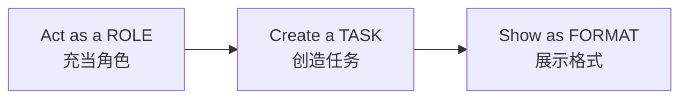
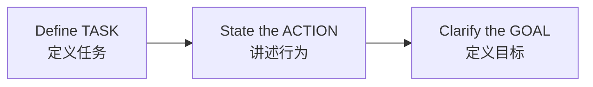
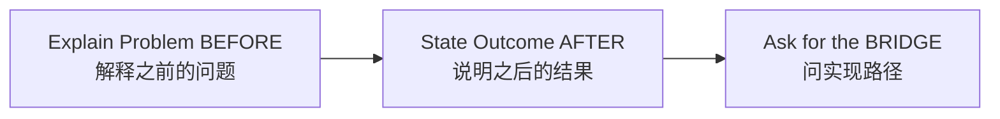
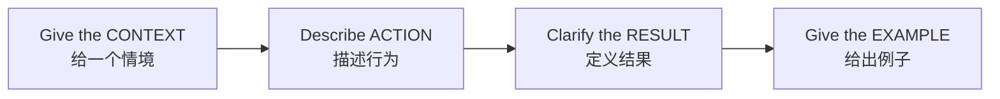
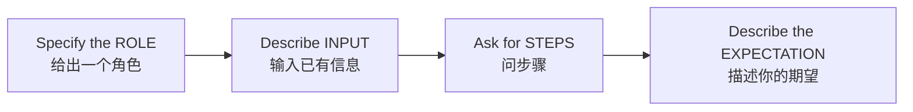

### 1. R-T-F 框架

<!-- more -->

- **ROLE 角色**：FB广告经理
- **TASK 任务**：设计一个吸引人的FB广告来推广一个体育服装品牌的健身服
- **FORMAT 格式**：设计一个广告创意方案的大纲，包括文案，视觉和定位策略

### 2. T-A-G 框架

- **TASK 任务**：任务是评估团队每个成员的绩效表现
- **ACTION 行为**：作为一个经理，来评估每个成员的长处和短处
- **GOAL 目标**：目标是提升每个员工的绩效，所以下一季度用户满意度能提升

### 3. B-A-B 框架

- **BEFORE 之前**：我们现在在搜索引擎SEO上很难被人们发现
- **AFTER 之后**：我们想要在90天内在搜索引擎SEO上成为top10
- **BRIDGE 途径**：设计一个详细计划写出我们要做的所有事情，并列出top20的关键词

### 4. C-A-R-E 框架

- **CONTEXT 情境**：我们想发布一个新的衣服产品线，你可以帮助我们创建一个
- **ACTION 行为**：强调我们对环保和可持续的承诺的广告计划吗？
- **RESULT 结果**：我们想要的结果是提升产品的awareness和销量
- **EXAMPLE 例子**：一个好的例子是Patagonia的广告"不要买这件大衣"因为它强调了品牌对环保可持续的承诺，提升了他们的品牌形象

### 5. R-I-S-E 框架

- **ROLE 角色**：假如你是一个内容策略师
- **INPUT 输入**：我已经收集到了目标用户的信息，包括他们的兴趣，常见问题等
- **STEPS 步骤**：给我提供一个步骤详细的内容策略计划，涵盖关键话题、创建内容日历，写出和我们品牌相符的品牌信息
- **EXPECTATION 期望**：目标是增长40%我们博客的月活量，提高我们的品牌定位