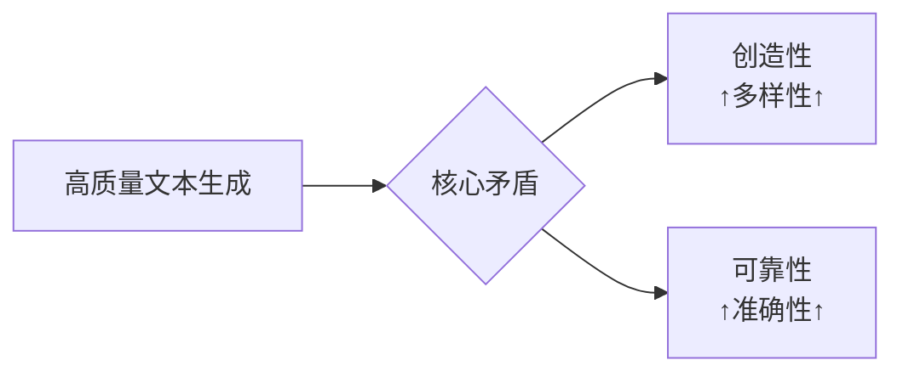
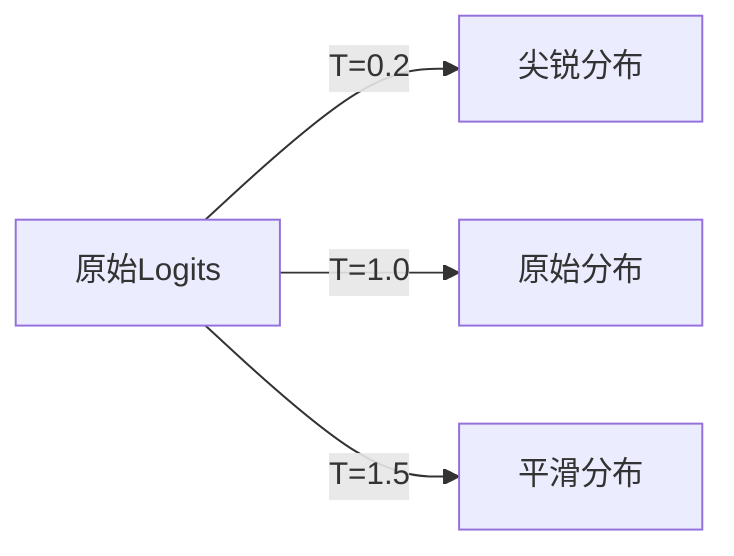
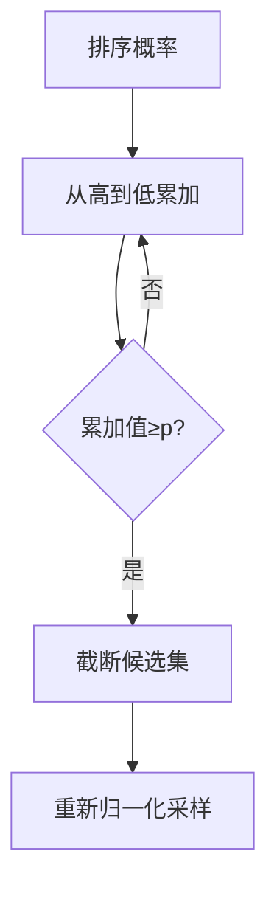
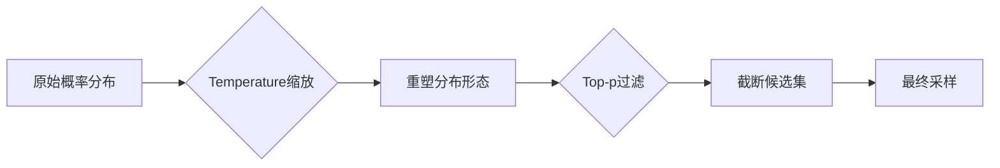
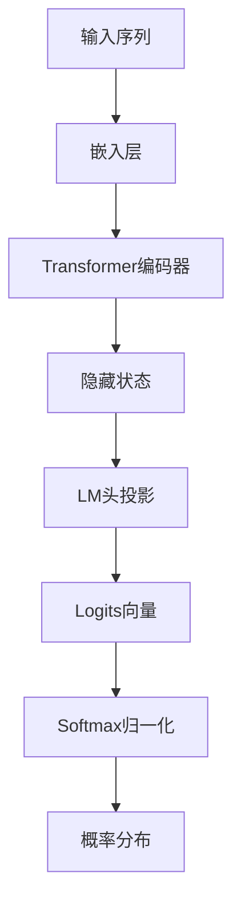
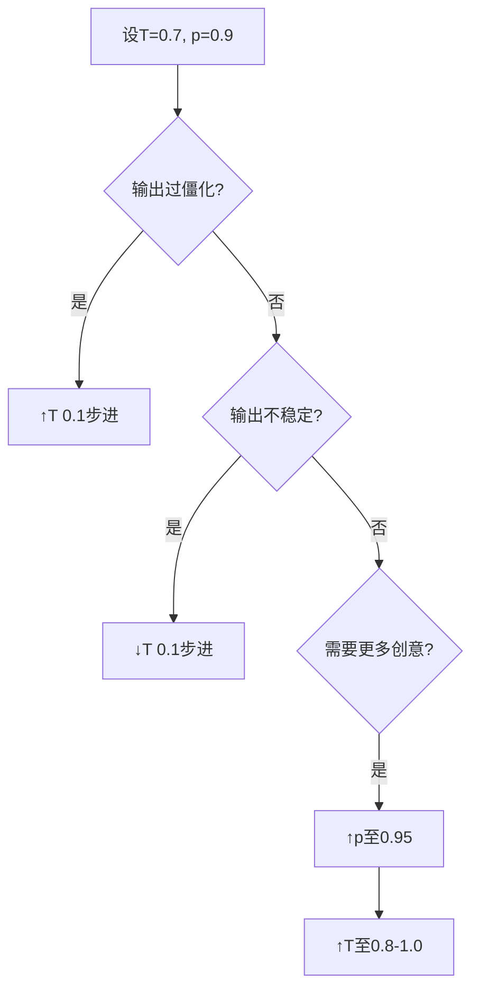

## 一、引言：文本生成的核心挑战
现代大语言模型（LLM）如GPT系列在文本生成中面临**多样性-质量权衡**的核心挑战：


<!-- more -->

**Temperature**和**Top-p**（核采样）作为关键控制参数，共同解决了这一矛盾。本文将深入解析其技术原理、协同机制及工程实践。

## 二、Temperature 技术解析

### 2.1 数学本质
Temperature($T$)通过对logits进行缩放，改变softmax输出的概率分布：

$$ P_T(w_i) = \frac{\exp(z_i / T)}{\sum_{j=1}^{|V|} \exp(z_j / T)} $$

- **$T→0$**：逼近贪心搜索，选择概率最高词
- **$T=1$**：保持原始概率分布
- **$T→∞$**：趋近均匀分布

### 2.2 参数影响可视化


### 2.3 典型取值策略
| $T$ 值范围 | 输出特性         | 适用场景              | 风险控制         |
|------------|------------------|-----------------------|------------------|
| 0.0-0.3    | 高度确定性       | 代码生成, 事实问答    | 可能过于僵化     |
| 0.4-0.7    | 平衡创新与连贯   | 对话系统, 内容摘要    | 最佳实践起点     |
| 0.8-1.2    | 高创造性         | 诗歌创作, 故事生成    | 可能偏离主题     |
| >1.5       | 极端随机性       | 艺术实验              | 语义崩坏风险高   |

## 三、Top-p（核采样）技术解析

### 3.1 算法原理
Top-p动态截断概率分布，仅保留累积概率≥$p$的候选词：
```python
def top_p_sampling(probs, p=0.9):
    sorted_probs = sorted(enumerate(probs), key=lambda x: x[1], reverse=True)
    cumulative = 0
    indices = []
    for idx, prob in sorted_probs:
        cumulative += prob
        indices.append(idx)
        if cumulative >= p: break
    truncated_probs = [probs[i] for i in indices]
    return indices, [p/sum(truncated_probs) for p in truncated_probs]
```

### 3.2 取值区间分析
| $p$ 值范围 | 候选词数量 | 输出特性         | 典型场景         |
|------------|------------|------------------|------------------|
| 0.5-0.8    | 3-10个     | 高度保守         | 法律文本, 医疗报告 |
| **0.8-0.95** | 10-50个    | **最佳平衡**     | 新闻稿, 商业邮件 |
| 0.95-1.0   | 50-1000+个 | 高创造性         | 诗歌, 艺术创作   |
| =1.0       | 全词表     | 无过滤(危险)     | 特殊实验场景     |

### 3.3 动态截断示例


## 四、Temperature 与 Top-p 的协同控制

### 4.1 参数耦合效应
| 组合类型         | $T$ 值   | $p$ 值   | 物理类比       | 输出特性         |
|------------------|----------|----------|---------------|------------------|
| 精准模式         | 0.1-0.3  | 0.8-0.9  | 激光聚焦       | 高度确定         |
| 平衡模式(推荐)   | 0.5-0.7  | 0.9-0.95 | 聚光灯照明     | 主次分明         |
| 创意模式         | 0.8-1.0  | 0.95-0.98| 柔光箱         | 创意弥漫         |
| 危险区域         | >1.5     | =1.0     | 白噪声         | 语义崩坏         |

### 4.2 协同工作流程


### 4.3 场景化配置模板
```python
# 技术文档生成（精准性优先）
generate(text, temperature=0.4, top_p=0.9)

# 营销文案（创意-质量平衡）
generate(text, temperature=0.8, top_p=0.93)

# 小说创作（高创意性）
generate(text, temperature=1.0, top_p=0.97)
```

## 五、候选词概率计算全流程

### 5.1 计算架构


### 5.2 关键计算步骤
1. **输入表示**：
   $$ \mathbf{x}_i = \mathbf{W}_{\text{embed}}[\text{token}_i] $$
   
2. **Transformer编码**：
   $$ \mathbf{h}_t = \text{Transformer}(\mathbf{x}_1, \mathbf{x}_2, ..., \mathbf{x}_{t-1}) $$

3. **Logits计算**：
   $$ \mathbf{z} = \mathbf{W}_{\text{LM}} \mathbf{h}_t + \mathbf{b} $$

4. **概率转换**：
   $$ P(w_i) = \frac{\exp(z_i)}{\sum \exp(z_j)} $$

### 5.3 计算复杂度优化
| 组件            | 计算复杂度           | 优化策略                  |
|-----------------|----------------------|--------------------------|
| Token嵌入       | $O(n \times d)$     | 量化压缩                 |
| Transformer层   | $O(n^2 \times d)$   | 稀疏注意力, 分块计算     |
| LM头投影        | $O(d \times |V|)$   | 分层Softmax, 词表分组    |
| Softmax         | $O(|V|)$            | Top-p提前截断           |

## 六、工程最佳实践

### 6.1 参数调整策略


### 6.2 高级技巧
1. **动态参数调整**：
   ```python
   # 长文本生成：前期创意，后期收敛
   if position < total_length/3:
       params = {"temperature": 1.0, "top_p": 0.97}
   else:
       params = {"temperature": 0.5, "top_p": 0.9}
   ```

2. **概率校准技术**：
   - **重复惩罚**：`logits[repeated_token] -= penalty`
   - **长度归一化**：$\text{score} = \frac{\log P}{(\text{length}+5)^\alpha}$

3. **多采样验证**：
   ```python
   candidates = [generate(params) for _ in range(5)]
   best = rank_by_quality(candidates)
   ```

### 6.3 避坑指南
| 问题现象        | 解决方案                     | 参数调整                |
|-----------------|------------------------------|-------------------------|
| 输出过于随机    | 增强约束                     | ↓T 0.2, ↑p 0.05        |
| 缺乏创意        | 扩大采样空间                 | ↑T 0.3, ↑p 0.03        |
| 主题漂移        | 强化提示工程+参数约束        | ↓T 0.4, ↓p 0.1         |
| 重复生成        | 启用重复惩罚机制             | repetition_penalty=1.2  |

## 七、结论：参数控制的本质

Temperature和Top-p协同工作的**数学本质**是：
$$\text{最终概率} = f_{\text{top-p}}( \text{softmax}( \mathbf{z}/T ) )$$

这一过程实现了：
1. **Temperature**：全局控制概率分布的熵值
   - 低$T$：低熵分布（确定性↑）
   - 高$T$：高熵分布（随机性↑）

2. **Top-p**：局部优化采样空间质量
   - 动态排除低概率干扰项
   - 保持语义连贯性

**工程实践黄金法则**：
```python
# 80%场景的推荐配置
default_config = {
    "temperature": 0.7,    # 平衡点起始值
    "top_p": 0.9,          # 排除后10%低质候选
    "repetition_penalty": 1.1,  # 防重复
    "do_sample": True      # 必须启用采样模式
}
```

通过精准调控这两个参数，开发者可在**创造性探索**与**语义可靠性**之间找到任务特定的最优平衡点，释放大语言模型的最大潜力。