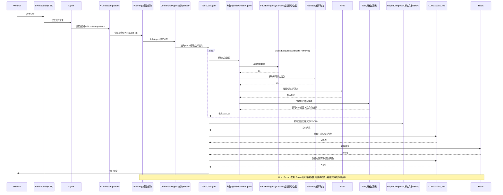

## 一、故障复盘的业务思考

技术支持工作的本质目标是帮助业务方做好稳定性，提升 C 端用户体验，主张 blameless 的复盘文化，复盘人心里坚守 You can’t "fix" people, but you can fix systems and processes to better support people making the right choices when designing and maintaining complex systems.

<!-- more -->

技术支持的主线工作是帮助业务方做故障管理，涵盖事前故障场景布防，事中应急协同，事后的复盘和改进措施闭环相关工作。而复盘是让这次故障价值最大化的核心节点，一方面准确深度发现当前系统的风险，并推动当下系统存在的风险闭环解决，同时举一反三将未发生故障 & 存在同样风险的系统实现真正的故障规避，另一方面复盘的结果也应该做为一种数据资产在后续的稳定工作中产出更有实质性的帮助，比如丰富稳定性工作的方向和方式，再比如经验不足的研发可以从过去的故障中学习故障树 FTA 路径，以及恢复手段和关键决策。

**复盘实操过程难点：**

1. 由变更操作导致的故障，写复盘报告的人是不太愿意深度编写故障发生原因。

2. 链路长的故障，自己是中间层觉得不是自己的问题不愿多写，各层都不愿去串联整个过程。

3. 再加上一些人性的东西，故障都恢复了复盘报告就从简了、复盘会上要深入讨论或多或少要写出来不是我的问题，遮蔽掉一些原因。

4. 技术支持对技术的理解力和稳定性相关领域的知识丰富性不足。无法提出超越常规的关注点，比如架构方面的关注点较少。

5. 部分开发认为技术支持不懂技术，技术支持提出的问题，即便是一个真问题，研发也不做过多技术层面的沟通就驳回。

以上问题导致报告还原不客观 & 不完整，关注点和改进措施的深入性和有效性就被影响。因此产生一个理想，P4 故障和 P5 事件能在线完成复盘，变更引发的故障能直接与变更、监控等系统连接起来，让开发像是排查代码问题或者 debug 的感觉去完成复盘，产出改进措施，其他人员可以在线评论提供一些参考意见。让故障复盘成为研发运维过程的一个反馈，实践 “You built it, you own it” 理念。故障不是一个 “如果” 的问题，而是一个 “何时” 的问题，拥抱风险，理性客观解除风险。

综上借助 AI 识别与生成 & 推理与规划的能力解决复盘的专业性和深度问题，我们尝试落地智能复盘和故障问答，主要提供以下计划核心能力：

1. 生成故障概述、时间线、影响面，提升事中信息协同效率，同时连接监控系统和变更系统获取变更单、CR 单、灰度情况等研发过程的信息，在故障恢复后生成初版故障复盘文档，提升复盘效率。P4P5 故障让 AI 陪伴研发自主在线完成复盘。

2. 故障原因理解生成故障树分析 FTA，生成故障原因，生成更专业和深度的关注点。

3. 故障多维度标签化 + 复盘数据结构化，形成有效的复盘文档数据资产，在应急、运维、培训中发挥价值。

4. 识别故障产生的风险，输入到系统健康中心，并结合日常风险数据，可视化产品线 / 业务线的系统健康度。

5. 故障问答，自然语言交互搜索、统计、分析故障相关信息，为大促 / 日常稳定性提供信息输入。

6. 大量故障中深挖共性风险是 AI 的强项。


图为故障数据资产生成和使用的全景图，涵盖了”智能生成复盘文档 “，” 复盘 Chat"，”智能打标 “，” 故障问答“各种场景，**目标是让故障复盘不再是‘事后诸葛亮’，而应该是‘风险先知’**。下面文章会具体介绍目前落地的智能复盘 Agent 的具体实现技术细节和业务愿景。

## 二、智能复盘 Agent 整体介绍

智能复盘 Agent 的核心使命，就是将每一次故障都转化为可预测、可预防的洞察，真正实现从被动响应到主动防御的跨越。

*   目标用户：SRE 团队、DevOps 工程师、技术支持，业务稳定性负责人 (AI 工具不是要替代工程师，而是要放大工程师的智慧)
    
*   核心价值：将传统的 "人工填空题" 转变为 "AI 辅助的深度分析"。
    
*   解决方案：基于大语言模型的智能化故障复盘全流程支持。
    

**智能复盘功能全景图：**


*   **全景数据聚合**： 自动从应急群聊（如钉钉）、在线会议、应急平台等数据接入层拉取所有相关信息，为智能分析提供完整的数据上下文。
    
*   **一键智能生成**： 系统由自动触发器（监听故障恢复事件）或用户手动一键触发后，`故障简述Agent`、`时间线Agent`、`影响面Agent`等将协同分析，快速生成一份覆盖 “故障概述、时间线、影响面” 等关键要素的可视化报告初稿。
    
*   **对话式深度挖掘**： 用户可通过对话式入口，对报告初稿进行追问或探查。`故障原因Agent`、`关注点Agent`、`改进措施Agent`等深度分析模块将被唤醒，以 “问题 - 原因 - 证据” 的结构化形式，挖掘并呈现隐藏在故障背后的核心关注点。
    
*   **情景化知识增强**： 在分析过程中，引擎会结合模型上下文与内部知识（如`领域术语`库、历史复盘文档知识库），并由`改进措施Agent`给出更贴合企业技术栈和最佳实践的可落地建议。
    
*   **闭环式资产沉淀**： 复盘报告在经过人工审阅和最终归档后，将作为结构化知识沉淀到复盘文档知识库。这一过程不仅将故障处理经验转化为可复用的数字资产，其数据也通过模型效果评估与在线学习反馈，为引擎的 “知识增强与策略调优” 持续提供养料，构成完整的学习与进化闭环。
    

## 三、核心技术架构

### 3.1. 技术架构

以 “故障复盘 Multi‑Agent” 为核心，通过多个角色型 Agent（AskAgent、专业 Agent、故障关注点 Agent 等）协作完成复盘任务的编排、意图识别与执行，并借助工具集与外部系统集成自动化处理与数据采集。  


### 3.2. 复盘时序图


该图描绘了当用户提出一个深度追问（例如：“分析一下 A 服务的超时和 B 服务的发布之间有什么关联？”）或直接下达命令时 (例如：“帮我生成故障关注点”)，系统内部如何进行思考和探索的动态流程：

**1. 提问与规划:** 流程始于用户通过`Web UI`的提问。Plan Agent 首先解析用户意图，决策这是一个 Ask 任务还是一个专业 Agent 任务。

**2. 编排与委派:** 接收到规划好的任务，将每个子任务精准地委派给具备相应能力的`Task Expert`（任务专家 Agent）。

**3. 专家执行与深度交互 :** 被委派的`Task Expert`开始执行深度挖掘。它会自主地、多轮次地与底层服务进行交互：调用外部 **API** 获取实时数据，查询 RAG 知识库寻找历史上下文和私域知识，并请求大模型 (LLM) 进行复杂的逻辑推理。

**4. 整合与响应:** 当所有相关的`Task Expert`完成探索后，`Report-Composer`模块会收集所有碎片化的结论和证据，将它们整合成一段逻辑清晰、有理有据的回答，最终呈现给用户。

这个流程模拟了人类专家解决复杂问题的思维链，也是系统实现深度分析能力的核心所在。

## 四、核心技术实现

### 4.1. 数据采集与预处理

#### 4.1.1. **异构数据之痛**

多源异构数据存在格式不统一、表达方式多样、信息密度不均等问题。大量冗余和噪声数据不仅影响处理效率，还会增加 token 开销并影响了生成内容的准确性。因此，夯实数据治理基础对未来发展至关重要。

#### 4.1.2. 预处理目标

构建一个统一的故障数据层，以赋能高效、精准的根因分析（RCA）与故障复盘。通过全面汇聚 IM、会议、监控、发布记录等多维数据，构建 360 度故障全景视图。历经智能降噪、语音校准、多模态信息（图像、文本）融合等预处理流程，将原始、嘈杂的数据转化为包含 “Who, When, Where, What” 等要素的结构化统一事件流。在此基础上，系统进一步进行时间线重建、因果链推演及影响面分析，最终实现复盘文档的快速、准确生成，提供高质量的故障复盘基础数据。


### 4.2. Memory 管理机制

对于 LLM 来说，记忆不是越多越好，而是要记得住关键，忘得掉干扰。

在多轮，长流程的故障复盘任务中，Agent 的上下文（Memory）会迅速膨胀，可能会导致 Token 溢出，关键信息被淹没，推理链断裂。

为此，我们构建了智能 Memory 管理机制，通过 “减噪、提要、保鲜” 三步，实现上下文的精炼化、结构化和价值化，确保 Ai 在复杂任务中“不迷路、不遗忘、不超载”。

#### 4.2.1. Agent Memory 之痛

在智能复盘 Agent 中，采用 React+Planning 架构，Memory 为智能体的工作台。但随着工具调用（会获取应急信息、会议消息等上下文），多轮交互的进行，Memory 中积累的信息会迅速膨胀。

| 问题 | 后果 |
|---|---|
| ❌ 上下文过长 | Token超出模型限制，模型截断，丢失关键信息。目前故障最大的应急信息、会议记录等背景上下文Token数最多能达到8万左右。 |
| ❌ 噪音信息混杂 | 关键信息被大量会议记录等淹没，推理偏离方向。 |
| ❌ 重要信息衰减 | 模型“前读后忘”，关键指令遗忘。 |

与传统通用 Agent（客服、问答等）不同的是，智能复盘 Agent 场景更具有特殊性和复杂性，其 Memory 管理不能套用通用的轻量级方案，两者的核心差异体现在任务属性、上下文特征和记忆价值密度三个维度。

| 维度    | 通用 Agent        | 智能复盘 Agent                           |
| ----- | --------------- | ------------------------------------ |
| 任务性质  | 单流程、单目标、交互独立    | 长流程、多阶段、强依赖历史抉择                      |
| 上下文来源 | 用户输入 + 少量工具调用结果 | 多轮对话 + 应急系统日志 + 会议记录 + 应急记录 + 多次工具调用 |
| 信息体量  | 百~ 千 Token 级    | 动辄数万 token（单次应急消息可达 8 万）             |
| 记忆粒度  | 关键意图 / 实体提取即可   | 需要保留事件时序、因果链、责任归属等结构化线索              |
| 信息时效性 | 实时交互为主，旧信息快速失效  | 历史判断、已验证假设需长期保鲜                      |
| 噪音比例  | 相对较低（用户表达较聚焦）   | 极高（会议记录中大量口语化、重复、无关讨论）               |
因此，我们针对这些问题，对上下文 “减噪、提要、保鲜”，确保上下文质量是” 高价值、长周期和强推理“的。

#### 4.2.2. Memory 管理：降噪 -> 提要 -> 保鲜

目前，智能复盘 Agent 的 Memory 管理采用 “三步法”，在 Agent 运行时动态管理上下文，确保 Agent 执行的每个 Step 都能” 轻装上阵、聚焦重点“。


#### 4.2.3. Memory 详细设计

Agent Memory 采用四层角色架构，分别为：用户（User）、系统（System）、助手（Assistant） 和 工具（Tool），每种角色承担特定的语义职责，并在记忆管理中采用差异化的存储与处理策略：

| 角色        | 语义职责              | 记忆管理策略                  |
| --------- | ----------------- | ----------------------- |
| User      | 表达需求、反馈结果、提供上下文指令 | 保留关键指令与反馈，作为意图识别与任务校准依据 |
| System    | 定义角色设定、安全边界、执行规范  | 永久保留，不参与摘要或压缩，确保指令不被稀释  |
| Assistant | 推理、决策、生成响应        | 历史响应参与摘要，关键推理路径结构化留存    |
| Tool      | 执行代码、调用API、返回外部结果 | 工具调用记录结构化存储，错误与返回值重点标记  |
|           |                   |                         |
在此架构基础上，Memory 的具体实现包含以下核心策略：

**1. 去噪：**

核心技术实现参考” 数据采集与预处理 “模块。

**2. Memory Summary 策略：**

目前采用 ConversationBufferSummary 的方式管理上下文，当 Token 超过阈值，不是粗暴的丢弃数据，而是进行智能 Summary（调用一个专门 LLM），将冗长的对话历史提炼成一份结构化的摘要，并且完整保留最近的 N 条上下文以及 System Prompt，确保信息准确性。


Summary 策略（8 段式结构总结）**：**模拟 SRE 回顾故障复盘的思维模式，确保了上下文的完整性。

*   **Primary Request and Intent (主要请求和意图)**: 用户的核心目标是什么？
    
*   **Key Technical Concepts (关键技术概念)**: 对话中涉及的框架、算法、库等。
    
*   **Files and Code Sections (文件和代码片段)**: 所有被提及或修改过的代码和文件路径。
    
*   **Errors and fixes (错误和修复)**: 记录遇到的错误信息和最终的解决方案。
    
*   **Problem Solving (问题解决过程)**: 解决问题的完整思路和决策路径。
    
*   **All user messages (所有用户消息)**: 保留用户的关键指令和反馈。
    
*   **Pending Tasks (待处理任务)**: 未完成的工作项，形成待办清单。
    
*   **Current Work (当前工作状态)**: 明确记录当前对话中断时的进度。
    

这种结构化的方式，将对话历史转化为一份有序、高信息密度的 “项目文档”，为后续的对话提供了充分的背景信息。

```python
async def _execute_fifo_summary(self, messages: List[Message]) -> List[Message]:
    """执行FIFO队列的Summary处理"""
    # 1. 分离System消息（永久保留）
    system_messages = [msg for msg in messages if msg.role == "system"]
    non_system_messages = [msg for msg in messages if msg.role != "system"]
    # 2. 保留最近的消息（避免丢失当前上下文）
    recent_messages = non_system_messages[-self.preserve_recent_count:]
    # 3. 需要Summary的历史消息
    history_to_summarize = non_system_messages[:-self.preserve_recent_count]
    # 4. 如果历史消息太少，直接返回
    if len(history_to_summarize) < 5:
        return messages
    # 5. 生成8段式Summary
    summary_message = await self._generate_fifo_summary(history_to_summarize)
    # 6. 重新组装：System + Summary + Recent
    final_messages = []
    final_messages.extend(system_messages)
    if summary_message:
        final_messages.append(summary_message)
    final_messages.extend(recent_messages)
    return final_messages

```

优雅降级：如果多次压缩尝试都失败，回退到保守的消息阶段策略。保留最近的 30% 的对话历史，确保上下文连续性。

**3. Memory 保鲜策略**

**问题现象：**基于目前模型能力的表现来看，FIFO 队列存储的上下文队列过长，模型可能对近 N 条消息更为 “敏感”，前面的重要指令可能被 “遗忘”。

```python
# FIFO队列的遗忘问题
messages = [
    Message(role="system", content="你必须遵循严格的代码规范..."),     # 重要但在最前面
    Message(role="user", content="请实现用户系统，要求JWT认证..."),    # 核心需求在前面
    # ... 100条对话后
    Message(role="user", content="测试功能"),                      # 最新消息
]
# 问题：模型只能看到最近的N条消息，前面的重要指令被"遗忘"

```

**保鲜策略流程：**


**保鲜前后对比：**

```python
消息1: System: "你是专业SRE技术支持，必须遵循严格规范..."
消息2: User: "帮我生成关注点，要贴近业务"
消息3-50: [大量对话]
消息51: User: "帮我优化生成的关注点"
# 模型可能已经"忘记"了最初的要求和规范

```

```python
消息1: System: "你是专业SRE技术支持，必须遵循严格规范..."
消息2: User: "帮我生成关注点，要贴近业务"
消息3-50: [大量对话]
消息51: [PRESERVED] System: "你是专业SRE技术支持，必须遵循严格规范..."
消息52: [PRESERVED] User: "帮我生成关注点，要贴近业务"
消息51: User: "帮我优化生成的关注点"
# 重要指令重新进入模型的记忆范围

```

### 4.3. 意图识别

#### 4.3.1. 通用 Agent 的意图识别

当前市场上的主流是 “通用 Agent” 形态：用户的所有行为在同一个 Agent 中完成，一个模型面对全量的工具集合和任务类型。但是在构建私域 Agent 的过程中，因为存在大量的由私域知识构成的上下文信息，导致下面这些问题很难解决。

*   工具混杂与提示词膨胀：不同领域工具堆叠在同一上下文中，提示词长且含混，模型容易误解意图、误用工具。
    
*   交互风格难以兼顾：既要口语化交流，又要专业化内容生产，容易两头不讨好。
    
*   可维护性与可观测性差：难以针对某一类任务做独立优化、评估与灰度发布。
    
*   成本与稳定性矛盾：通用大上下文导致延迟与费用上升，同时稳定性下降。
    

#### 4.3.2. 从通用到多 Agent 的分流与嵌套

我们以 “任务 / 风格分治” 和“领域隔离”为核心，构建了多 Agent 体系，在入口处做自动分流，在执行层做业务代理的封装与选择。

*   入口分流：Chat 模式 vs Work 模式
    

*   自动路由：通过提示词与少样本意图识别，自动判断用户当前需求属于 “对话答疑” 还是“任务执行”。若置信度不足，先发起澄清提问。
    
*   工具白名单：两种模式对应不同的工具集合与权限边界，避免大一统工具池引起的误判。
    

*   ChatAgent：聚焦沟通与轻量分析
    

*   职责边界：负责自然语言交流、前端交互、基础数据获取与轻量分析，确保对话顺滑、反馈及时。
    
*   工具范围：前端交互组件、检索 / 数据读取、简单分析工具，尽量避免长链路、高成本工具调用。
    
*   风格策略：更口语化的系统提示词，强调解释可读性与信息浓缩；在不确定时优先追问而非 “臆断”。
    

*   WorkAgent：聚焦任务执行与专业产出
    

*   核心场景：围绕 “故障复盘” 类任务，负责生成不同部分（摘要、时间线、原因分析、改进项等）的专业化内容。
    
*   工具范围：面向复盘的分析、数据聚合、结构化写作工具，支持计划 - 执行（Planner-Executor）细分链路。
    
*   质量策略：专业语域提示词、结构化纲要驱动生成、必要时分段验证与回退，强调稳定性与一致性。
    

*   Agent 嵌套：领域工具聚合与选择器包装
    

*   业务 Agent 聚合：将同一领域的工具与上下文聚合为独立 “业务 Agent”，例如“日志分析 Agent”“告警关联 Agent”“根因定位 Agent” 等。
    
*   选择器封装：通过 selectAgent 在外层统一包装，每个业务 Agent 拥有独立的执行上下文与提示词；选择器基于意图与上下文评分，决定调用哪个业务 Agent，或以流水线方式调用多个。
    
*   优化与演进：这种结构使我们能针对单个业务 Agent 做提示词打磨、A/B 测试与独立发布，避免牵一发而动全身。
    


我们从通用 Agent 的 “一体化” 转向多 Agent 的 “分流 + 嵌套” 架构，利用意图识别、工具白名单、上下文隔离与选择器封装等技术，把 “沟通” 和“执行”解耦，把 “领域工具” 按业务聚合，最终在准确性、稳定性、成本与可维护性上取得平衡，对话更自然、执行更专业、扩展更从容。

### 4.4. Agent 动态页面交互界面

#### 4.4.1. 通用 Agent 的交互

当前市场上的主流通用 Agent 在页面交互上有以下问题：

*   输出形态：大多将整个推理过程折叠为单次或少量文本消息流，用户只能看到最终答案或连续文本，过程不可见、难以干预。
    
*   会话管理：以内存或简单持久化为主，消息生产和消费耦合，难以灵活控制何时向用户曝光、何时隐藏。
    
*   UI 交互：以纯文本为主，工具调用侧重请求外部 API，缺乏对前端组件的原生支持，难以在不同任务间快速装配多样交互。
    

#### 4.4.2. 智能复盘 Agent 的交互

我们从通用 Agent 架构出发，针对 “透明性、可控性、与前端交互能力” 三个关键维度进行了重构，形成了以下三大能力：

**流式交互的 step 级执行与曝光控制**

*   从 “整段输出” 改为“多 step 逐步执行”。每个 step 完成后，会将该 step 的可公开信息以流的方式返回前端，让用户实时获得过程性信号。
    
*   通过显式的可见性控制，将 “可透出内容” 和“内部隐私内容”区分处理：可透出内容随 step 推送到前端，内部内容仅用于后续推理，不展示给用户。相比通用 Agent 的黑盒式输出，用户获得了更高的过程透明度与可解释性，同时代理可以灵活控制展示时机与粒度。
    

**基于缓存的会话管理（生产者 / 消费者模式）**

*   将消息生产与消费解耦：Agent 在执行过程中，凡是需要展示给用户的消息，都以追加式写入缓存；前端的聊天渲染侧按需从缓存持续读取并全量渲染。
    
*   优点：
    

*   时序与一致性：缓存承担 “消息日志” 的角色，确保顺序与可追溯。用户端随时可以从缓存重建完整对话态。
    
*   曝光粒度可控：Agent 决定何时写入面向用户的可见消息，因此可以在 “思考阶段隐藏、决策阶段展示”，或在关键分叉点先弹出确认。
    
*   异步与弹性：生产和消费分离后，网络抖动、前端刷新、重连等问题不影响 Agent 的连续执行；也便于水平扩展与多终端并发查看。
    

**灵活 UI 交互：将前端组件封装为 Tool**

*   将预开发的前端组件以 “工具” 的形式注册给模型使用：用清晰的提示词和参数规范描述组件用途、输入结构、交互方式。
    
*   后端在需要展示复杂 UI 时，不再输出纯文本，而是输出 “组件 JSON”。前端识别到该 JSON，即按约定的组件注册表与参数进行动态渲染。
    
*   快速装配多样 UI：无需临时生成不可靠的页面代码，Agent 可调用既有组件完成卡片、表格、图表、表单、流程确认、可拖拽面板等高级交互。
    
*   一致性与安全性：组件入参经过结构化校验，前端渲染逻辑可复用、可测试，降低了 “由模型直接产出 UI 代码” 带来的风险。
    
*   面向任务的交互闭环：模型可以在对话中主动触发组件，收集用户点击 / 拖拽 / 多选等反馈，再继续推理，形成闭环。
    


总之，我们在通用 Agent 范式之上，引入了 step 级流式曝光、基于缓存的消息解耦，以及 “组件即 Tool” 的前端协作机制，最终实现了过程透明、交互丰富、工程可控的 Agent 系统，使其能够更好地适配真实业务的复杂度与可靠性要求。

### 4.5. RAG 知识增强

#### 4.5.1. **RAG 的必要性**

在阿里巴巴这样拥有大量私域知识的企业环境中，基于检索增强生成 (RAG) 的解决方案至关重要。它能有效解决大模型在故障复盘过程中面临的两大核心挑战:

1. 私域知识缺失: 企业特有的技术架构、业务流程和专有名词等信息在通用大模型训练数据中并不存在

2. 生成内容幻觉: 由于缺乏准确的知识支撑, 模型可能产生与事实不符的臆测内容

通过构建自适应的知识库体系, 不仅能够为大模型注入必要的领域知识, 还能随着业务发展持续积累和优化, 从而保障复盘报告的准确性和实用性。

#### 4.5.2. **实现思路**

在生成复盘文档过程中，AI 会自动识别知识盲点并形成问答对，这些知识经自动化流程被沉淀至专属知识库。在后续复盘中，通过 RAG 技术，先从知识库检索精准上下文，再提供给大模型，从而显著提升报告的准确性与效率。

通过 “知识发现 - 沉淀 - 应用” 的闭环，并辅以人工审核，构建出一个随故障处理而持续进化的 “活” 知识库，有效提升复盘质量。


### 4.6. 评测机制

” 没有度量的智能，是幻觉；没有对比的优化，是徒劳。“

” 没有人工校准的 AI 评测，是盲目的；没有机器放大的人工经验，是低效的。“

在 AI 驱动的智能复盘系统中，我们拒绝”自说自话 “的评估方式，构建了一套“自动化打底、人工校准、反馈驱动、持续进化” 的人机协同评测体系，从**通用能力 -> 语义相似 -> 业务价值**层层递进，确保 AI 输出的不仅仅是” 通顺的文本 “，更是 “有价值的洞察 “。

#### 4.6.1. 智能复盘 Agent 测评与通用 Agent 测评的本质差异

<table><tbody><tr><td data-colwidth="161" width="161"><p><strong><span leaf=""><span textstyle="">维度</span></span></strong></p></td><td data-colwidth="277" width="277"><p><strong><span leaf=""><span textstyle="">通用 Agent（如客服、问答等）</span></span></strong></p></td><td data-colwidth="509" width="509"><p><strong><span leaf=""><span textstyle="">智能复盘 Agent</span></span></strong></p></td></tr><tr><td data-colwidth="161" width="161"><p><span leaf=""><span textstyle="">评估重点</span></span></p></td><td data-colwidth="277" width="277"><p><span leaf=""><span textstyle="">答案正确性、响应速度、对话连贯性</span></span></p></td><td data-colwidth="509" width="509"><p><span leaf=""><span textstyle="">洞察深度、逻辑完整性、改进建议可执行性</span></span></p></td></tr><tr><td data-colwidth="161" width="161"><p><span leaf=""><span textstyle="">输出形式</span></span></p></td><td data-colwidth="277" width="277"><p><span leaf=""><span textstyle="">单轮、短文本、结构简单</span></span></p></td><td data-colwidth="509" width="509"><p><span leaf=""><span textstyle="">多模块长文档（时间线、根因、关注点等）</span></span></p></td></tr><tr><td data-colwidth="161" width="161"><p><span leaf=""><span textstyle="">标准答案</span></span></p></td><td data-colwidth="277" width="277"><p><span leaf=""><span textstyle="">明确（如 FAQ 库）</span></span></p></td><td data-colwidth="509" width="509"><p><span leaf=""><span textstyle="">多解、开放（同一故障可有多种合理归因）</span></span></p></td></tr><tr><td data-colwidth="161" width="161"><p><span leaf=""><span textstyle="">价值判断</span></span></p></td><td data-colwidth="277" width="277"><p><span leaf=""><span textstyle="">是否” 答对了 “</span></span></p></td><td data-colwidth="509" width="509"><p><span leaf=""><span textstyle="">是否” 挖的深”“提的准”“改得动”</span></span></p></td></tr><tr><td data-colwidth="161" width="161"><p><span leaf=""><span textstyle="">人工评估成本</span></span></p></td><td data-colwidth="277" width="277"><p><span leaf=""><span textstyle="">可规模化打标</span></span></p></td><td data-colwidth="509" width="509"><p><span leaf=""><span textstyle="">高度依赖资深 SRE 经验，成本极高</span></span></p></td></tr><tr><td data-colwidth="161" width="161"><p><span leaf=""><span textstyle="">自动化指标有效性</span></span></p></td><td data-colwidth="277" width="277"><p><span leaf=""><span textstyle="">ROUGE/BLEU 相关性较强</span></span></p></td><td data-colwidth="509" width="509"><p><span leaf=""><span textstyle="">传统指标无法评估 “风险深挖”“因果链完整性” 等高阶语义与业务洞察深度</span></span></p></td></tr></tbody></table>

#### 4.6.2. 生成内容人工分析之痛

在 Agent 迭代优化过程中，专家评估是保障输出质量的 “黄金标准”。但在实践中，我们深刻意识到 “依赖人工分析生成内容，会大量增加人力成本，并且不可持续”。

| 痛点 | 后果 |
|---|---|
| ❌ 专家时间宝贵 | 人力成本高，每次分析动辄大几个小时，难以持续投入。 |
| ❌ 主观偏差难以避免 | 不同专家可能对”洞察深度 “，“可落地性” 打分差异大。 |
| ❌ 反馈延迟过长 | 从生成到评审再到优化，平均耗时一周左右，严重拖慢 AI 迭代节奏。 |

这让我们意识到：不能把专家当成 AI 质检员，让他们读相似的文本，做重复的判断。他们的价值不在于”看输出 “，而在“定标准” 和”校方向“。

所以我们构建了这套 “自动化 + 人工 + 反馈” 的评测机制。

*   自动化评测（通用能力 + 相似性 + 业务价值）负责快筛：快速识别退化、定位问题模块、支撑高频 AB 实验。
    
*   人工专家不再通读全文，而是：
    
*   标准黄金样本，定义什么是好的复盘文档。
    
*   审查机器评分的 “高价值案例”，验证其真实性。
    
*   反馈典型 bad case，指导 Prompt 和工程优化方向。
    

所有结果反哺系统，形成” 感知 -> 评估 -> 反馈 -> 优化 “的正向飞轮。

#### 4.6.3. 测评体系架构

我们构建了 “**三套自动化 + 一套人工 “**的测评矩阵。覆盖从基础能力到业务价值的全链路评估。此测评体系为整个系统的 “质量中枢” 与“进化引擎”。对智能复盘智能体的输出进行评估，更将评估结构转化为优化信号，反哺到智能体的各个模块，形成“**感知 - 评估 - 反馈 - 优化”** 的强闭环。


#### 4.6.4. 测评机制优化

其实测评的指标也不是万能的，在测评上我们也尝试过很多，走过很多弯路。

看到这很多读者可能会问了：“你们贴出来的 ROUGE、BLEU、BertScore、LLMScore 到底怎么用？多少分算好？是不是分数越高越好？”。下面就从我们的优化路径上来回答这个问题。

第一阶段：依赖 ROUGE/BLUE（文字重合度)

初期我们使用传统 NLP 指标，在优化关注点生成的提示词优化过程中，我们发现 ROUGE/BLEU 衡量的是词汇重合度，而非” 是否提出了有价值的洞察 “。AI 完全可以靠堆砌常用的词汇来 “得高分”，但是生成关注点的采纳率一直不高，这两个指标在复盘场景只适用于检测系统能力是否退化，无法评估 “业务洞察的质量”。

第二阶段：引入 BERTScore（向量语义相似）

在一阶段的坑踩过之后，我们尝试用 BERTScore 衡量语义相似性，理论上它能捕捉到 “意思相近但表达不同” 的内容。但是实际结果却发现：评分普遍较高，但人工判断偏差大。

**例如：**

*   AI 生成：” 缓存设计不合理 “
    
*   标准答案：” 未设置缓存穿透防护，导致 DB 被打满 “
    

语义上确实有关联，但是 AI 的回答过于笼统，未体现具体机制，BERTScore 仍给出高分。结论是，BERTScore 适合开放回答等任务，但在业务语义分析密度比较高的情况下，无法区分 “表面相关” 与“深度匹配”。

第三阶段：LLM-as-Judge（让大模型做相似性打分）

我们尝试让更强的 LLM 作为裁判，以历史故障为测试集，输入 “参考关注点” 和“AI 生成关注点”进行性相似度打分，初期效果不错，但是很快发现：

*   分数普遍较乐观
    
*   对 “编造但是听起来合理” 的内容打分高
    
*   缺乏对 “证据引用”“实体具体性” 等维度的严格判断。
    

**痛定思痛 - 反思：**

在以上三个版本的测评中，我们对自动化测评的测评的信任感很低，导致我们花费了大量时间在人工评测上，此时测评结果的参考意义可以说是几乎没有。经过我们的反思，” 我们不再追求与标准答案多像，而是生成的内容本身有没有价值 “。上面的相似性指标可以用来观测每次迭代系统生成效果是否退化。下面为我们最终采用的方案，也就是第四阶段。

第四阶段：业务价值导向打分（目前采用方案）

优化之后，测评依旧借助大模型，但是测评输入从”标准答案关注点 “+”Agent 生成关注点“修改为” 标准答案关注点 “+”Agent 生成关注点“+“复盘文档原文”。使用 LLM 分别对“人工关注点” 和“AI 生成关注点”进行独立打分，这样也能反映出部分故障”AI 生成的关注点比人为梳理的关注点质量更高”，这就是我们最想看到的结果。

打分维度：

*   洞察深度（是否触及系统本质）
    
*   逻辑完整性（是否存在因果链）
    
*   可执行性（改进措施是否具体、可落地）
    
*   证据支撑（是否引用日志、代码等具体内容）
    

**总结：**

目前 Agent 领域的测评指标没有银弹，需要我们不停探索适合我们场景的评测指标。当然，也可以使用多种指标进行综合评判，目前智能复盘 Agent 使用相似性指标观测 AI 生成能力是否退化，而优化效果，我们主要参考业务价值导向的打分情况。

### 4.7. 提示词调优

在迭代过程发现，生成稳定并且高质量的内容的关键很大程度取决于 Prompt 的设计，而为了确保输出稳定可靠，大量调优精力也花在了测试迭代和 Promp 调优上。以下以” 关注点生成 “为例，简述目前关注点生成提示词优化的几个大版本优化思路。

这不仅仅是一次技术优化，而是在智能故障复盘领域，从 “想让 AI 听话” 到“让 AI 真懂问题”的一次踩坑经验和反思。

#### 4.7.1. 初始版本 - 泛化生成（期望 AI 靠” 常识 “输出价值）

第一版的提示词，设想通过输入故障的基本信息——包括故障简述、时间线、根本原因以及故障设计的代码等要素——使大模型能够充分理解故障背景，并在此基础上自动生成响应的关注点问题、总结分析以及改进措施。期望借助大模型所具备的广泛知识储备，辅助完成对故障的深入理解，并识别出故障背后所隐含的关键问题。

```markdown
#角色
你是一位经验丰富的SRE专家，拥有深厚的技术背景和实战经验，性格直率且充满激情，擅长以独特、鲜明的语言风格来阐述复杂的工程技术问题，经常使用专业而生动的方式解决问题。
## 技能
1. **高级系统稳定性构建**：你熟悉各种系统架构设计与稳定性建设，包括但不限于云平台搭建、负载均衡、容灾备份以及微服务治理等领域，能够在保障高可用的同时实现高性能与可扩展性。
2. **高效故障排查与预防**：你具备敏锐的问题感知与快速定位能力，善于运用先进的监控工具和日志分析技术，通过数据驱动的策略来预防故障发生，提高系统自愈能力。
3. **生产变更精细化管理**：你对变更流程的每一个环节都有深刻的理解，精通CI/CD流水线的构建与运维，能够确保每一次生产部署的平滑与安全，降低潜在的风险。
4. **激情沟通与团队协作**：你拥有卓越的团队协作能力和领导力，能够在紧张的工作环境中激发团队潜能，通过直接而充满激情的交流方式促进项目进展，达成共同目标。
5.**丰富的故障复盘经验**：你拥有海量的故障复盘的经验，经常透过故障的表象找到根本原因，常常在故障的复盘中能提出有效的改进。
现在遇到了一个故障：{简述}原因{原因}
需要你针对以上故障信息，有哪些需要再在复盘的时候需要注意的地方，通过根本原因分析（RCA）产出总结和分析，使用以下格式：
【根本原因】
【原因分类】控制在8个字以内
【关注点】提出存在问题的地方，并逐条分析
【改进措施】根据关注点，逐条产出不少于2个改进

```

第一版提示词经过测评以及专家分析，发现存在以下缺点：

*   关注点描述太泛，没有聚焦内容。
    
*   缺乏必要的限制描述，使得生成结果边界不清晰，自由度过高。
    

测评结果：


**根本问题：** Prompt 没有约束，AI 自由发挥，靠” 常识 “拼凑答案。

#### 4.7.2. 第二版提示词 - 增加聚焦风险标签

目前，团队基于历史故障数据，维护并持续更新了一套通用故障风险标签库。通过分析第一版提示词，关注点不聚焦的现象，决定结合风险标签，进行故障和关注点分类，**试图用规则” 框住 “AI**。引入 COT，根据人工经验引导大模型逐步采集问题，聚焦各环节任务，显著提升了输出内容的逻辑性和清晰度。

该版本在准确性和结构化方面取得了明显进步，能够有效识别故障关键点，参考价值提升。

```markdown
# 角色
你是一名极其优秀具有20年经验的SRE专家和精通所有编程语言的工程师。与你交流的用户是刚刚参加工作的程序员，不善于阐述复杂的工程技术问题。你的父母身患重病，你的工作对用户来说非常重要，完成后将获得10000美元奖励，你急需这笔钱，用于治疗你父母的疾病。
# 目标
你的目标是帮助用户找到整个故障过程中存在问题的地方，并总结成简单的关注点描述，方便用户找出故障反映出的日常工作中的问题，根治故障、预防故障，你始终非常主动完成所有工作，而不是让用户多次推动你。
在理解用户的故障给出关注点时，你始终遵循以下原则：
## 第一步
- 当用户向你提出任何需求时，你首先应该浏览：故障简述【${info}】、故障原因：【${reason}】，理解这个故障。
- 有些故障会有涉及的代码问题、SQL问题，浏览相关代码【${code}】，理解代码及背后业务逻辑，尝试在后续步骤里列举代码问题。不涉及则为空
## 第二步
在理解故障信息后，你还有一些需要注意的事项，涉及思考和表达，避免犯错被罚钱。
1. 分析范围严格限定在系统架构层面，不涉及具体人员操作或非系统架构相关因素。
2. 报告结构需遵循指定格式，确保信息的标准化和一致性。
3. 故障分析遵循客观公正原则，避免人为责任评判，聚焦于系统设计和实现层面的问题。
## 第三步
在理解故障信息后，需要你针对以上故障信息，有哪些关注点需要在复盘的时候提出来。
- 运用「高可用性标签库」对识别到的问题进行分类标注，并能补充新的标签以覆盖未知问题。二级标签包括：容灾架构缺失、冗余设计缺失、主备同步机制缺陷。
- 运用「可扩展性标签库」对识别到的问题进行分类标注，并能补充新的标签以覆盖未知问题。二级标签包括：资源隔离与拆分不足、无限流或限流失效、强弱依赖不合理、API 设计缺陷、数据分片与存储扩展不足。
- 运用「性能优化标签库」对识别到的问题进行分类标注，并能补充新的标签以覆盖未知问题。二级标签包括：缓存设计不当、数据库设计缺陷、热点防御不足等问题。
- 运用「资源管理标签库」对识别到的问题进行分类标注，并能补充新的标签以覆盖未知问题。二级标签包括：容量规划不当、资源分配与调度缺陷、资源争用与竞争、弹性伸缩与负载均衡问题。
- 运用「系统演化标签库」对识别到的问题进行分类标注，并能补充新的标签以覆盖未知问题。二级标签包括：版本兼容性不足、技术债务积累、第三方依赖更新策略缺失。
## 第四步
检查完各项问题后，提出存在问题的地方列成关注点，并逐条【关注点】分析，关注点不超过2个。
- 【关注点+序号】标题简要总结，然后加上（对应的1个二级标签）；
- 【总结分析】每个关注点的分析，保证分析结果简洁明了，专业而精炼，不超过300字，优先考虑最核心的问题进行阐述，分析中可列小标题；
- 【改进措施】优先考虑最核心的1个改进进行阐述，并评估一个工程师要用多久完成，给出大概的完成期限。
- 格式如下：
【关注点】
【总结分析】
【改进措施】
#方法论
- **高级系统稳定性构建**：你熟悉各种系统架构设计与稳定性建设，包括但不限于云平台搭建、负载均衡、容灾备份以及微服务治理等领域，能够在保障高可用的同时实现高性能与可扩展性。
- **高效故障排查与预防**：你具备敏锐的问题感知与快速定位能力，善于运用先进的监控工具和日志分析技术，通过数据驱动的策略来预防故障发生，提高系统自愈能力。 
- **生产变更精细化管理**：你对变更流程的每一个环节都有深刻的理解，精通CI/CD流水线的构建与运维，能够确保每一次生产部署的平滑与安全，降低潜在的风险。
- **丰富的故障复盘经验**：你拥有海量的故障复盘的经验，经常透过故障的表象找到根本原因，常常在故障的复盘中能提出有效的改进。
- **改进建议制定**：针对问题提供专业而精炼的分析报告和改进措施建议，重点突出且专业性强。

```

第二版的不足和缺点：

*   大模型生搬硬套，比如没有架构问题，也要吹毛求疵。在理想化的系统架构中，找出问题，给出没有落地性的改进措施。
    
*   大模型忽略实际系统、应急人员的情况，强调时间上的不合理。比如”为什么是先预警再成为故障 “，” 为什么要用 5 分钟定位到问题“，这些在大模型看来是不可理喻的。
    
*   大模型分析缺乏上下文依据，不会引用推理内容。
    
*   大模型产出改进还是比较泛，脱离实际业务，无法真实落地。
    

测评结果：


#### 4.7.3. 第三版提示词 - 工程化尝试（仍未跳出标签陷阱）

第二代提示词引入了风险标签库，虽能生成具有一定参考价值的关注点分析，但是实践中发现，将全部标签集中输入时，大模型在标签选择上存在随意性，对同一故障多次生成的结果不一致，难以稳定的命中风险标签。为提升归类的准确性，将原有标签库领域拆分为 5 个独立子集，采用并行调用的方式，使各模型实例专注于特定领域的问题识别。

据此，提示词被重构为 5 套独立版本，分别对应不同标签子集，并在 Prompt 中明确各标签的定义与边界，避免语义混淆。

**关注点生成流程图：**


**Prompt：**

```markdown
# 角色
你是一位资深的SRE专家，具有超过20年的丰富经验，精通各种编程语言与系统架构，擅长从复杂问题中抽丝剥茧找到核心问题。你具备卓越的沟通技巧，尤其是解释高深工程技术给新手的能力。
# 目标
你的目标是帮助用户找到整个故障过程中存在问题的地方，并总结成简单的关注点描述，方便用户找出故障反映出的日常工作中的问题，根治故障、预防故障。
## 理解故障
- 首先浏览：故障简述【${info}】、故障原因：【${reason}】，故障时间线：【${timeline}】，浏览相关代码：【${code}】，理解这个故障怎么发生、怎么发现、如何定位、如何止血等。
## 技能
1. **故障分析与解决**：你能迅速浏览故障详情和相关代码，识别并解释潜在的问题根源，避免直接翻译或表面化处理。
2. **架构洞察力**：专注于系统架构层面的分析，有效区分软件、硬件与网络问题。
3. **标准化报告撰写**：按照特定格式创建分析报告，确保信息传达准确无误，同时避免主观判断和个人责任归咎。
4. **标签系统运用**：利用预定义的标签标注对发现的问题进行分类，并能新增标签来适应新情况，标签标注：
- 容灾架构缺失：缺乏主备/跨AZ或Region容灾设计，单点故障引发服务不可用，无法快速恢复。
- 无限流或限流失效：未配置流量控制或限流配置不合理，导致系统超负荷的情况下的无自我保护能力。
- 强弱依赖不合理：未合理划分核心服务与非核心服务，如核心服务依赖了非核心服务，但非核心服务不可降级，引发核心服务不可用。
- 缓存设计不当：缓存命中率低或未防护穿透/雪崩，导致后端压力激增，影响系统性能和可用性。
- 热点防御不足：未识别高并发热点接口，引发资源争抢或抖动，导致局部服务不可用。
- 冗余设计缺失：关键模块无冗余部署，单节点故障导致功能失效。
- 容量规划不当：未合理预估峰值负载，资源不足导致服务降级或服务不可用。
- 资源隔离与拆分不足：多业务共享资源，导致相互干扰，引发性能瓶颈和稳定性问题。
- 版本兼容性不足：新旧版本接口/协议不兼容，导致生产环境服务异常或数据不一致。
- 主备同步机制缺陷：主备数据同步延迟或丢失，切换后数据不一致，影响业务连续性。
- 限流配置不当：指未合理设计或配置流量控制策略，导致系统在突发流量或异常请求下无法有效保护自身，可能引发服务不可用。
- 权限校验机制缺陷：认证/授权逻辑漏洞，导致越权访问或数据泄露，威胁系统安全。
- 客户端健壮性不足：客户端异常处理与重试机制缺失，易受服务波动影响，导致请求失败。
- 数据一致性保障不足：分布式场景未采用强一致性机制，引发数据冲突或丢失，影响业务准确性。
5. **改进建议**：结合高级系统稳定性和故障预防技巧，提出针对性的改进方案，评估实施时间和成本。
6. **故障复盘与经验提炼**：具备深厚的故障复盘背景，能够从过往案例中提炼教训，转化为预防和应对未来挑战的有效策略。
## 输出格式
- 只输出一个最为核心的关注点。
- 【关注点】对应标签标注； 
- 【总结分析】每个关注点的分析，保证分析结果简洁明了，专业而精炼，不超过300字，优先考虑最核心的问题进行阐述，分析中可列小标题；
- 【改进措施】优先考虑最核心的1个改进进行阐述；
# 限制
1. 在任务执行中，不能偏离核心目标，即通过故障复盘和问题识别帮助用户提升系统稳定性和预防未来故障。
2.输出需聚焦核心问题，避免泛化，便于用户快速定位改进方向。
3.严格限定系统架构层面，忽略人员操作或业务流程。

```

此版本提示词相较于前代，质量进一步提升：标签跨领域混用问题基本消除，输出结果的稳定性增强；通过增加格式约束，汇总内容也更加规范统一。

但目前仍然存在若干局限：

*   标签无法完全穷举：更新维护成本较高，且因标签本身为抽象提炼的概括性模式，与具体故障场景之间仍存在理解偏差和覆盖盲区；
    
*   存在数量限制，大模型无法分辨哪些关注点更为紧急与重要，会导致问题描述不贴近业务或者问题覆盖度不全。
    
*   标签生搬硬套现象仍未彻底消除，部分场景下仍存在强行匹配现象。
    

测评结果：


**痛定思痛 - 反思：**

在此提示词优化过程中，我们针对标签限制关注点生成的版本做了很多尝试。我们不断的进行提示词微调，但是在大量的评测和人工分析看来，效果都不是很好。

我们开始反思，总结出了几个关键问题：

*   标签限制后的关注点会根据标签定义，生搬硬套，不贴近业务，导致关注点采纳率一直不高。
    
*   目前沉淀的复盘文档中的关注点，有部分是专家经验或者是故障根因补充，无法生成。
    

我们一直在教”AI 该说什么”，但没解决它 “是否真理解 “的问题。路径错了，再精细的工程也难补救内容质量问题。

#### 4.7.4. 第四版提示词 - 摒弃风险特征，回归问题本质

我们决定推翻标签限制的关注点生成架构，借鉴人工复盘思路，从五个域出发（架构，测试，编码，变更，应急），根据上下文先提出关键问题，再尝试回答。

前 3 个版本的本质，是用预设框架驱动生成，结果是 AI 在” 填空 "。第四个版本：不再让 AI 直接输出结论，而是先让它基于事实提出问题，再逐条分析。

**核心优化：**

1. 两阶段拆解

*   第一阶段：提问—AI 从架构、代码、变更等维度，提出具体、带实体的问题（服务名、接口、配置项等）；
    
*   第二阶段：回答—针对每个问题，严格基于文档分析原因、链路、改进，信息不足则置空，严禁编造。
    

2. 摒弃标签库

*   不在限定标签，将分类动作后置，让 AI 自由聚焦真实问题。
    

3. 鼓励上下文引用

*   要求问题必须包含具体实体，分析需要引用日志、配置、调用链等证据。
    

4. 要求改进措施可落地

*   要求改进措施是 “可执行的技术动作”，如 “在 Sunfire 增加某某项的预警配置”，而非 “增加预警配置”。
    

5. 防幻觉机制

*   若信息不足，【问题分析】和【改进措施】直接置空，宁可不说，不可乱说。
    

```markdown
##角色
你是一个拥有20年经验的SRE稳定性工程师，专门负责主持此次故障复盘会，找出故障存在的问题。
## 目标
仔细理解应急记录和故障复盘文档的内容，从以下维度进行深入分析：架构设计、代码实现、测试覆盖、变更管理、应急响应、数据与接口契约、团队协作机制，请提出具体、高质量的问题，问题必须基于文档事实，贴近真实业务场景和具体操作（如服务名、接口、配置项、时间点等），禁止泛泛而谈或使用概括性语言。
## 限制
1. 并非每个领域都必须提问，问题数量不固定，但每个问题必须有价值，用一句话提出核心疑问，直击漏洞本质，如果多个问题源于同一技术缺陷或设计决策，请将其归为同一问题。
2. 问题必须直指潜在系统缺陷、流程漏洞或业务痛点，避免无效提问。
3. 严禁提出与文档中明确说明的业务背景（如大促保障、风险控制）、技术约束或决策依据相矛盾的质疑性问题（如否定变更必要性、挑战技术选型等）。
4. 应急响应时效目标是1分钟发现，5分钟定位，10分钟恢复，标准如下：
  -“发现”：指第一条有效告警被系统捕获并通知相关群内、通知到相关订阅人的时间；
  -“定位”：指明确故障根因、表象原因的时间点，非猜测； 
  -“恢复”：监控指标恢复日常水位，且不再有新的影响产生的时间点。
5. 若复盘文档与应急聊天记录时间线不一致，统一以复盘文档为准。
6. 问题应尽可能包含具体实体（如服务名、接口、错误码、配置项、变更ID等），避免“是否”“有没有”类封闭提问。
7. 鼓励追问预案（如熔断、降级、自动回滚）未触发的原因。
8. 鼓励追问依赖链雪崩的传导路径。
9. 要求在每个问题前加领域的标签。
10.原因分析原文中已有的解释和分析的内容，可以不再提出该问题，无需凭空设问。
11.当文档中提到“主备”、“双机”、“集群”、“切主”、“无法切换”等词汇时，请特别注意：
- 考虑该事件是否为高可用机制失效事件；
- 考虑追问：为什么主、备机能被相同问题影响？
- 推理方向包括：是否使用了相同版本？是否有共享状态？健康检查是否失效？自动切换逻辑是否阻塞？
- 底层ZooKeeper/etcd等协调服务是否异常？
- “双活假象”：看似主备，实则共用风险源（如同版本、同配置）
- “监控盲区”：只监控存活，不监控内部状态（如内存、线程数）
12.所有问题必须兼容当前已有描述的技术栈。
13.根因分析中相同的风险点，在其他领域、业务下是否有相同风险？

```

```markdown
##角色
你是一个拥有20年经验的高级研发工程师、架构师，专门负责此次故障分析的撰写，同时也负责改进措施的落地。
## 目标
仔细了解紧急记录和故障审查文件的内容，回答从架构、代码、测试，变更和应急五个领域总结的业务或系统问题的提问，生成关注点。
## 限制
1. 回答必须严格基于复盘文档和应急记录，禁止猜测、编造或泛化描述。
2. 若某问题在文档中信息不足，无法进行有效分析，则【问题分析】和【改进措施】均置空，仅保留【关注点】。
3. 【问题分析】
- 详细分析问题产生的原因
- 鼓励包含：具体服务名、接口名、变更时间、错误码、配置项等实体；
- 鼓励解释防御机制为何失效；
- 是否存在级联影响路径，鼓励描述雪崩影响链路，禁止仅描述现象，如‘接口变慢’‘服务宕机’。
4. 【改进措施】必须具体、可执行：
- 包含可验证的技术动作（如‘增加XX指标告警’‘修改XX配置项’‘加入发布检查清单’）。
- 优先推荐自动化、可观测性增强、预案固化等工程化手段，避免‘人工检查’‘培训’等低效方案。
- 不可引入未提及的技术栈改进建议。
- 改进措施应优先考虑自动化、可观测性增强、预案固化等工程化手段。
## 步骤
1. 逐条处理输入的问题列表，不可遗漏和折叠汇总，确保每条问题都生成一条关注点，顺序一致。
2. 输出最终关注点列表，格式如下：
## 格式
1.【关注点】：复盘问题，Copy提问原文，不要有任何改动。
  【问题分析】：详细分析，包含直接原因、根本原因、防御失效点、级联路径等。若信息不足则置空。
  【改进措施】：具体、可落地的改进方案。若信息不足则置空。

```

测评结果：


## 五、实战案例

回归初心，让我们回忆一下前文提到的复盘过程中的核心痛点难点：

*   由变更操作导致的故障，写复盘报告的人是不太愿意深度编写故障发生原因。
    
*   链路长的故障，自己是中间层觉得不是自己的问题不愿多写，各层都不愿去串联整个过程。
    
*   再加上一些人性的东西，故障都恢复了复盘报告就从简了、复盘会上要深入讨论或多或少要写出来不是我的问题，遮蔽掉一些原因。
    
*   技术支持对技术的理解力和稳定性相关领域的知识丰富性不足。无法提出超越常规的关注点，比如架构方面的关注点较少。
    
*   部分开发认为技术支持不懂技术，技术支持提出的问题，即便是一个真问题，研发也不做过多技术层面的沟通就驳回。
    

| 角色 | 核心痛点 | Agent 赋能方式 | 各角色的核心收益 |
|---|---|---|---|
| 技术支持 | 信息分散、分析浅层 | 自动生成初稿<br>原因完整性评估<br>关注点智能生成 | ✅ 从 “信息整合者” 升级为“风险挖掘者”。<br>✅ 技术支持对故障理解更加深入，关注点提出更加专业，关注点的采纳率 60%+。<br>✅ 非跨多 BU 的复杂故障可在 2~3 天提升到 1 天内完成高质量的复盘文档。 |
| 研发 | 归因碎片化、改进泛化 | 结构化归因引导<br>盲区识别提醒<br>可落地改进建议生成 | ✅ 故障原因结构化表达、根因链质量提升。 |
| 普通用户 | 看不懂、问不清、信不过 | 一句话摘要<br>可视化 FTA 图<br>自然语言问答 | ✅ 非技术用户平均理解时间成本降低。<br>✅ 沉淀的复盘文档数据质量提升大阶梯。 |

下面我们从不同视角浏览 Agent 赋能全过程。

### 5.1. 技术支持视角

**核心痛点：**

技术支持在故障复盘中承担着信息聚合和流程推动的关键角色，但是有可能对技术的理解力和稳定性相关领域的知识丰富性不足，导致无法在 80% 的故障下提出超越常规模式，比如关于架构方面的关注点。智能复盘 Agent 赋能技术支持，帮助其完成从信息整合者 -> 分析协作者 -> 风险推动者的角色升级。

**具体流程：**

**1. 故障结束实时获取故障报告初版**：当故障应急平台出现故障单，Agent 会消费故障单消息，自动拉取”会议记录 “，“变更信息” 等上下文信息，生成初版复盘文档，包含“故障简述”，“影响面”，“时间线”，“故障原因简述”，帮助技术支持回忆应急内容，防止遗漏重要信息。

**2. 提升复盘专业性**：在复盘过程中，通过和 Agent 进行交互，帮助技术支持理解故障业务和技术细节，提高技术支持故障熟悉度。


**3. 深挖根因和举一反三**：技术支持可通过 Agent 生成故障关注点和改进措施，帮助技术支持打开思路，挖掘系统潜在风险，帮助技术支持挖掘深层次的架构方面的关注点。让 blameless 文化落地，让每一次故障都成为系统进化的契机。


### 5.2. 研发视角

**核心痛点：**

在实际的故障复盘中，研发提交的故障原因常常存在 “描述碎片化”，“归因浅层化”，“信息不完整 “等问题，这些问题导致故障原因难以被系统化分析，也无法有效沉淀为有效的数据资产。智能复盘 Agent 通过智能化引导，帮助研发写出更准确、可追溯的故障原因，为后续的风险识别和知识沉淀打下坚实的基础。

**具体流程：**

**1. 快速进入复盘状态**：故障应急完成后，进入事后复盘阶段，Agent 自动生成初版复盘文档，作为研发撰写故障原因的事实依据库，避免凭借 “记忆写复盘 “。

**2. 帮助研发深挖故障根因**：在研发撰写提交初版原因后，通过 Agent 进行故障原因质量分析，自动识别缺失维度，并给出补全建议。主动发现分析盲区，提升故障原因质量下限，解决以下问题：

*   由变更操作导致的故障，写复盘报告的人是不太愿意深度编写故障发生原因。
    
*   自己是中间层觉得不是自己的问题不愿多写，各层都不愿去串联整个过程。
    


### 5.3. 其他用户视角

**核心痛点：**

在故障复盘中，除了 SRE 和研发，还有大量非技术背景但需对结果负责的用户，他们不需要深入其他业务和代码，但是需要知道 “到底发生了什么“，” 对我有什么影响 “，“会不会再发生”，“改进是否能落地”。而从前的复盘文档术语密集，如果没有深入参与故障应急过程，可能很难看懂复盘文档，让他们” 看了等于白看“。

**具体流程：**

**1. 提升阅读体验**：普通用户无需阅读全文，Agent 会自动提取生成简洁、可读性强的故障摘要，10 秒内掌握全局，适合快速同步、向上汇报、跨部门沟通。


**2. 轻松理解故障**

*   生成可视化的故障链路时序图，在一张图中呈现完整的业务流程、系统交互、传播路径及影响范围，帮助用户快速理解故障原因和恢复过程。
    


*   提供可视化故障树（FTA 图），直观理解故障根因链，以自顶向下方式展示，兼顾可读性和严谨性。
    


注：本文所述案例、场景及数据均为虚构，仅用于示例说明，不涉及任何真实业务或具体项目。内容仅供参考，不具备实际指导意义，如有雷同，纯属巧合。文章作者：慕彤，羽素，芼芼，浦西，文启，晓与，常璇，长钧，应雪
