所以下面我们就从二叉树到平衡二叉树，再到 B- 树，最后到 B+ 树来一步一步了解数据库索引底层的原理！

# 二叉树（Binary Search Trees）

二叉树是每个结点最多有两个子树的树结构。通常子树被称作“左子树”（Left Subtree）和“右子树”（Right Subtree）。二叉树常被用于实现二叉查找树和二叉堆。

**二叉树有如下特性**：

- 每个结点都包含一个元素以及 n 个子树，这里 0≤n≤2。 
- 左子树和右子树是有顺序的，次序不能任意颠倒。左子树的值要小于父结点，右子树的值要大于父结点。

光看概念有点枯燥，假设我们现在有这样一组数[35 27 48 12 29 38 55]，顺序的插入到一个数的结构中，步骤如下 ：

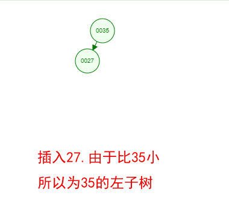

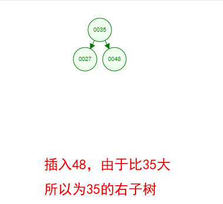

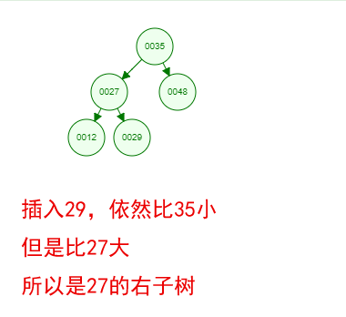

好了，这就是一棵二叉树啦！我们能看到，经过一系列的插入操作之后，原本无序的一组数已经变成一个有序的结构了，并且这个树满足了上面提到的两个二叉树的特性！

但是如果同样是上面那一组数，我们自己升序排列后再插入，也就是说按照[12 27 29 35 38 48 55]的顺序插入，会怎么样呢？

线性退化

由于是升序插入，新插入的数据总是比已存在的结点数据都要大，所以每次都会往结点的右边插入，最终导致这棵树严重偏科！

上图就是最坏的情况，也就是一棵树退化为一个线性链表了，这样查找效率自然就低了，完全没有发挥树的优势了呢！ 

为了较大发挥二叉树的查找效率，让二叉树不再偏科，保持各科平衡，所以有了平衡二叉树！

# 平衡二叉树 (AVL Trees)

平衡二叉树是一种特殊的二叉树，所以他也满足前面说到的二叉树的两个特性，同时还有一个特性：它的左右两个子树的高度差的绝对值不超过 1，并且左右两个子树都是一棵平衡二叉树。

大家也看到了前面[35 27 48 12 29 38 55]插入完成后的图，其实就已经是一棵平衡二叉树啦。

那如果按照[12 27 29 35 38 48 55]的顺序插入一棵平衡二叉树，会怎么样呢？

我们看看插入以及平衡的过程：

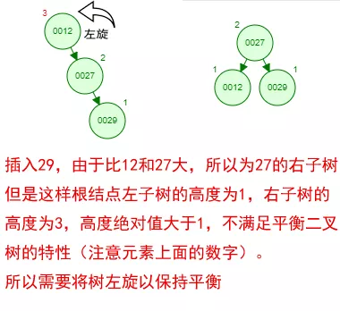

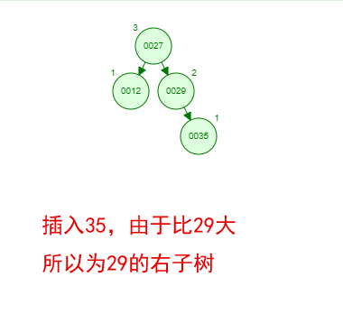

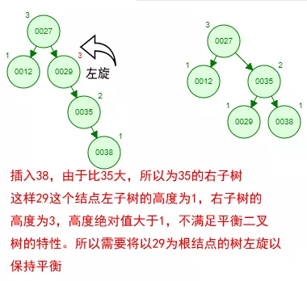

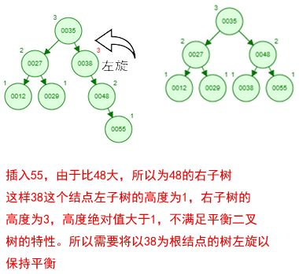

这棵树始终满足平衡二叉树的几个特性而保持平衡！这样我们的树也不会退化为线性链表了！

我们需要查找一个数的时候就能沿着树根一直往下找，这样的查找效率和二分法查找是一样的呢！

一棵平衡二叉树能容纳多少的结点呢？这跟树的高度是有关系的，假设树的高度为 h，那每一层最多容纳的结点数量为 2^(n-1)，整棵树最多容纳节点数为 2^0+2^1+2^2+...+2^(h-1)。

这样计算，100w 数据树的高度大概在 20 左右，也就是说从有着 100w 条数据的平衡二叉树中找一个数据，最坏的情况下需要 20 次查找。

如果是内存操作，效率也是很高的！但是我们数据库中的数据基本都是放在磁盘中的，每读取一个二叉树的结点就是一次磁盘 IO，这样我们找一条数据如果要经过 20 次磁盘的 IO？

那性能就成了一个很大的问题了！那我们是不是可以把这棵树压缩一下，让每一层能够容纳更多的节点呢？虽然我矮，但是我胖啊...

# B-Tree

这颗矮胖的树就是 B-Tree，注意中间是杠精的杠而不是减，所以也不要读成 B 减 Tree 了~

**那 B-Tree 有哪些特性呢？一棵 m 阶的 B-Tree 有如下特性**：

- 每个结点最多 m 个子结点。 
- 除了根结点和叶子结点外，每个结点最少有 m/2（向上取整）个子结点。 
- 如果根结点不是叶子结点，那根结点至少包含两个子结点。 
- 所有的叶子结点都位于同一层。 
- 每个结点都包含 k 个元素（关键字），这里 m/2≤k。
- 每个节点中的元素（关键字）从小到大排列。 
- 每个元素（关键字）字左结点的值，都小于或等于该元素（关键字）。右结点的值都大于或等于该元素（关键字）。

是不是感觉跟丈母娘张口问你要彩礼一样，列一堆的条件，而且每一条都让你很懵逼！

下面我们以一个[0,1,2,3,4,5,6,7]的数组插入一棵 3 阶的 B-Tree 为例，将所有的条件都串起来，你就明白了！

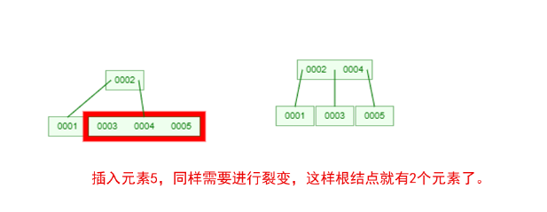

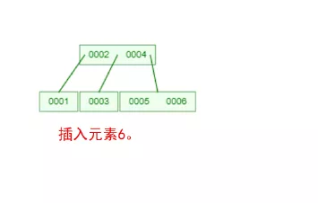

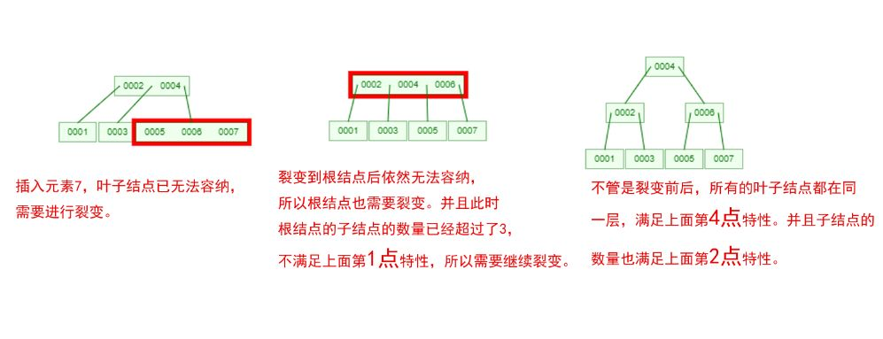

那么，你是否对 B-Tree 的几点特性都清晰了呢？在二叉树中，每个结点只有一个元素。

但是在 B-Tree 中，每个结点都可能包含多个元素，并且非叶子结点在元素的左右都有指向子结点的指针。

如果需要查找一个元素，那流程是怎么样的呢？我们看下图，如果我们要在下面的 B-Tree 中找到关键字 24，那流程如下：

从这个流程我们能看出，B-Tree 的查询效率好像也并不比平衡二叉树高。但是查询所经过的结点数量要少很多，也就意味着要少很多次的磁盘 IO，这对性能的提升是很大的。

从前面对 B-Tree 操作的图，我们能看出来，元素就是类似 1、2、3 这样的数值。

但是数据库的数据都是一条条的数据，如果某个数据库以 B-Tree 的数据结构存储数据，那数据怎么存放的呢？

我们看下一张图：

普通的 B-Tree 的结点中，元素就是一个个的数字。但是上图中，我们把元素部分拆分成了 key-data 的形式，Key 就是数据的主键，Data 就是具体的数据。

这样我们在找一条数的时候，就沿着根结点往下找就 OK 了，效率是比较高的。

# B+Tree

B+Tree 是在 B-Tree 基础上的一种优化，使其更适合实现外存储索引结构。

**B+Tree 与 B-Tree 的结构很像，但是也有几个自己的特性**：

- 所有的非叶子节点只存储关键字信息。 
- 所有卫星数据（具体数据）都存在叶子结点中。 
- 所有的叶子结点中包含了全部元素的信息。 
- 所有叶子节点之间都有一个链指针。

如果上面 B-Tree 的图变成 B+Tree，那应该如下： 

大家仔细对比于 B-Tree 的图能发现什么不同？ 

- 非叶子结点上已经只有 Key 信息了，满足上面第 1 点特性！ 
- 所有叶子结点下面都有一个 Data 区域，满足上面第 2 点特性！ 
- 非叶子结点的数据在叶子结点上都能找到，如根结点的元素 4、8 在最底层的叶子结点上也能找到，满足上面第 3 点特性！ 
- 注意图中叶子结点之间的箭头，满足上面第 4 点特性！

# B-Tree or B+Tree？

在讲这两种数据结构在数据库中的选择之前，我们还需要了解的一个知识点是操作系统从磁盘读取数据到内存是以磁盘块（Block）为基本单位的，位于同一个磁盘块中的数据会被一次性读取出来，而不是需要什么取什么。

即使只需要一个字节，磁盘也会从这个位置开始，顺序向后读取一定长度的数据放入内存。

这样做的理论依据是计算机科学中著名的局部性原理：当一个数据被用到时，其附近的数据也通常会马上被使用。 

预读的长度一般为页（Page）的整倍数。页是计算机管理存储器的逻辑块，硬件及操作系统往往将主存和磁盘存储区分割为连续的大小相等的块，每个存储块称为一页（在许多操作系统中，页的大小通常为 4K）。

**B-Tree 和 B+Tree 该如何选择呢？都有哪些优劣呢？**

①B-Tree 因为非叶子结点也保存具体数据，所以在查找某个关键字的时候找到即可返回。

而 B+Tree 所有的数据都在叶子结点，每次查找都得到叶子结点。所以在同样高度的 B-Tree 和 B+Tree 中，B-Tree 查找某个关键字的效率更高。 

②由于 B+Tree 所有的数据都在叶子结点，并且结点之间有指针连接，在找大于某个关键字或者小于某个关键字的数据的时候，B+Tree 只需要找到该关键字然后沿着链表遍历就可以了，而 B-Tree 还需要遍历该关键字结点的根结点去搜索。 

③由于 B-Tree 的每个结点（这里的结点可以理解为一个数据页）都存储主键+实际数据，而 B+Tree 非叶子结点只存储关键字信息，而每个页的大小是有限的，所以同一页能存储的 B-Tree 的数据会比 B+Tree 存储的更少。

这样同样总量的数据，B-Tree 的深度会更大，增大查询时的磁盘 I/O 次数，进而影响查询效率。 

鉴于以上的比较，所以在常用的关系型数据库中，都是选择 B+Tree 的数据结构来存储数据！

下面我们以 MySQL 的 InnoDB 存储引擎为例讲解，其他类似 SQL Server、Oracle 的原理！

## InnoDB 引擎数据存储

在 InnoDB 存储引擎中，也有页的概念，默认每个页的大小为 16K，也就是每次读取数据时都是读取 4*4K 的大小！

假设我们现在有一个用户表，我们往里面写数据：

这里需要注意的一点是，在某个页内插入新行时，为了减少数据的移动，通常是插入到当前行的后面或者是已删除行留下来的空间，所以在某一个页内的数据并不是完全有序的（后面页结构部分有细讲）。

但是为了数据访问顺序性，在每个记录中都有一个指向下一条记录的指针，以此构成了一条单向有序链表，不过在这里为了方便演示我是按顺序排列的！

由于数据还比较少，一个页就能容下，所以只有一个根结点，主键和数据也都是保存在根结点（左边的数字代表主键，右边名字、性别代表具体的数据）。

假设我们写入 10 条数据之后，Page1 满了，再写入新的数据会怎么存放呢？

我们继续看下图：

有个叫“秦寿生”的朋友来了，但是 Page1 已经放不下数据了，这时候就需要进行页分裂，产生一个新的 Page。

**在 InnoDB 中的流程是怎么样的呢？**

- 产生新的 Page2，然后将 Page1 的内容复制到 Page2。 
- 产生新的 Page3，“秦寿生”的数据放入 Page3。 
- 原来的 Page1 依然作为根结点，但是变成了一个不存放数据只存放索引的页，并且有两个子结点 Page2、Page3。

**这里有两个问题需要注意的是：**

①为什么要复制 Page1 为 Page2 而不是创建一个新的页作为根结点，这样就少了一步复制的开销了？

如果是重新创建根结点，那根结点存储的物理地址可能经常会变，不利于查找。

并且在 InnoDB 中根结点是会预读到内存中的，所以结点的物理地址固定会比较好！

②原来 Page1 有 10 条数据，在插入第 11 条数据的时候进行裂变，根据前面对 B-Tree、B+Tree 特性的了解，那这至少是一棵 11 阶的树，裂变之后每个结点的元素至少为 11/2=5 个。

那是不是应该页裂变之后主键 1-5 的数据还是在原来的页，主键 6-11 的数据会放到新的页，根结点存放主键 6？ 

如果是这样的话，新的页空间利用率只有 50%，并且会导致更为频繁的页分裂。

所以 InnoDB 对这一点做了优化，新的数据放入新创建的页，不移动原有页面的任何记录。

随着数据的不断写入，这棵树也逐渐枝繁叶茂，如下图：

每次新增数据，都是将一个页写满，然后新创建一个页继续写，这里其实是有个隐含条件的，那就是主键自增！

主键自增写入时新插入的数据不会影响到原有页，插入效率高！且页的利用率高！

但是如果主键是无序的或者随机的，那每次的插入可能会导致原有页频繁的分裂，影响插入效率！降低页的利用率！这也是为什么在 InnoDB 中建议设置主键自增的原因！

这棵树的非叶子结点上存的都是主键，那如果一个表没有主键会怎么样？在 InnoDB 中，如果一个表没有主键，那默认会找建了唯一索引的列，如果也没有，则会生成一个隐形的字段作为主键！

有数据插入那就有删除，如果这个用户表频繁的插入和删除，那会导致数据页产生碎片，页的空间利用率低，还会导致树变的“虚高”，降低查询效率！这可以通过索引重建来消除碎片提高查询效率！

## InnoDB 引擎数据查找

数据插入了怎么查找呢？

- **找到数据所在的页。**这个查找过程就跟前面说到的 B+Tree 的搜索过程是一样的，从根结点开始查找一直到叶子结点。 
- **在页内找具体的数据。**读取第 1 步找到的叶子结点数据到内存中，然后通过分块查找的方法找到具体的数据。

这跟我们在新华字典中找某个汉字是一样的，先通过字典的索引定位到该汉字拼音所在的页，然后到指定的页找到具体的汉字。

InnoDB 中定位到页后用了哪种策略快速查找某个主键呢？这我们就需要从页结构开始了解。

左边蓝色区域称为 Page Directory，这块区域由多个 Slot 组成，是一个稀疏索引结构，即一个槽中可能属于多个记录，最少属于 4 条记录，最多属于 8 条记录。

槽内的数据是有序存放的，所以当我们寻找一条数据的时候可以先在槽中通过二分法查找到一个大致的位置。

右边区域为数据区域，每一个数据页中都包含多条行数据。注意看图中最上面和最下面的两条特殊的行记录 Infimum 和 Supremum，这是两个虚拟的行记录。

在没有其他用户数据的时候 Infimum 的下一条记录的指针指向 Supremum。

当有用户数据的时候，Infimum 的下一条记录的指针指向当前页中最小的用户记录，当前页中最大的用户记录的下一条记录的指针指向 Supremum，至此整个页内的所有行记录形成一个单向链表。

行记录被 Page Directory 逻辑的分成了多个块，块与块之间是有序的，也就是说“4”这个槽指向的数据块内最大的行记录的主键都要比“8”这个槽指向的数据块内最小的行记录的主键要小。但是块内部的行记录不一定有序。

每个行记录的都有一个 n_owned 的区域（图中粉红色区域），n_owned 标识这个块有多少条数据。

伪记录 Infimum 的 n_owned 值总是 1，记录 Supremum 的 n_owned 的取值范围为[1,8]，其他用户记录 n_owned 的取值范围[4,8]。

并且只有每个块中最大的那条记录的 n_owned 才会有值，其他的用户记录的 n_owned 为 0。

所以当我们要找主键为 6 的记录时，先通过二分法在稀疏索引中找到对应的槽，也就是 Page Directory 中“8”这个槽。

“8”这个槽指向的是该数据块中最大的记录，而数据是单向链表结构，所以无法逆向查找。

所以需要找到上一个槽即“4”这个槽，然后通过“4”这个槽中最大的用户记录的指针沿着链表顺序查找到目标记录。

## 聚集索引&非聚集索引

前面关于数据存储的都是演示的聚集索引的实现，如果上面的用户表需要以“用户名字”建立一个非聚集索引，是怎么实现的呢？

我们看下图：

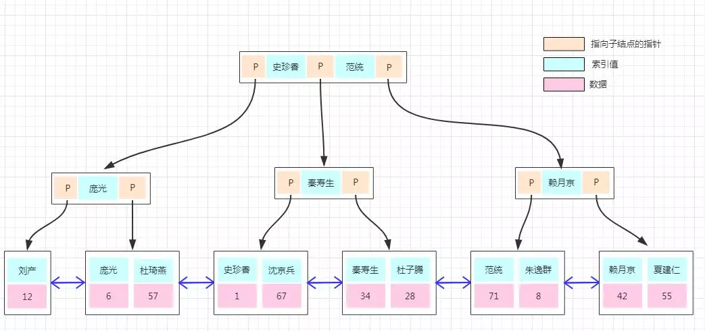

非聚集索引的存储结构与前面是一样的，不同的是在叶子结点的数据部分存的不再是具体的数据，而是数据的聚集索引的 Key。

所以通过非聚集索引查找的过程是先找到该索引 Key 对应的聚集索引的 Key，然后再拿聚集索引的 Key 到主键索引树上查找对应的数据，这个过程称为回表！

*PS：图中的这些名字均来源于网络，希望没有误伤正在看这篇文章的你~^_^*

## InnoDB 与 MyISAM 引擎对比

上面包括存储和搜索都是拿的 InnoDB 引擎为例，那 MyISAM 与 InnoDB 在存储上有啥不同呢？憋缩话，看图：

上图为 MyISAM 主键索引的存储结构，我们能看到的不同是：

- 主键索引树的叶子结点的数据区域没有存放实际的数据，存放的是数据记录的地址。 
- 数据的存储不是按主键顺序存放的，是按写入的顺序存放。

也就是说 InnoDB 引擎数据在物理上是按主键顺序存放，而 MyISAM 引擎数据在物理上按插入的顺序存放。

并且 MyISAM 的叶子结点不存放数据，所以非聚集索引的存储结构与聚集索引类似，在使用非聚集索引查找数据的时候通过非聚集索引树就能直接找到数据的地址了，不需要回表，这比 InnoDB 的搜索效率会更高呢！

## 索引优化建议

大家经常会在很多的文章或书中能看到一些索引的使用建议，比如说：

- like 的模糊查询以 % 开头，会导致索引失效。 
- 一个表建的索引尽量不要超过 5 个。 
- 尽量使用覆盖索引。 
- 尽量不要在重复数据多的列上建索引。 
- ......

很多这里就不一一列举了！那看完这篇文章，我们能否带着疑问去分析一下为什么要有这些建议？

> 原*作者：苏静*，转载自[心里没点B树，怎能吃透数据库索引底层原理？](https://mp.weixin.qq.com/s?__biz=MjM5ODI5Njc2MA==&mid=2655825290&idx=1&sn=455202c916d0a7bd9e3fbbef95ddde76&chksm=bd74e05d8a03694b028c2276d3ddda70e9e966ac98962d503e0c8c5c30bf5f4b6042165387d0&scene=21#wechat_redirect)