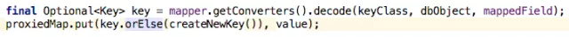
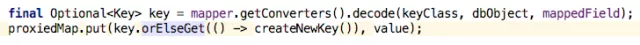
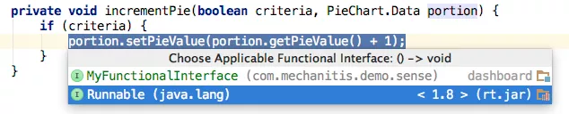
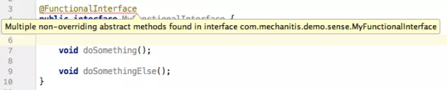
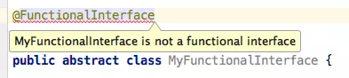
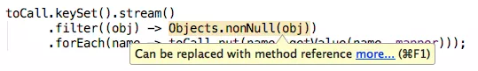
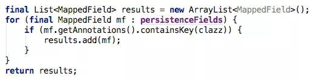
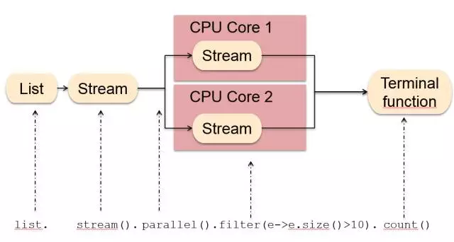

# **1.Optional**

Optional是一个严重被低估的功能，并且有潜力删除很多困扰我们的NullPointerExceptions。这在代码边界中（要么是正在使用的API，要么是正在暴露的API）特别有用，因为它允许你和你的调用代码来推理所期待的东西。

然而，不加思考和设计就应用Optional可能会导致影响大量的类，并可能导致可读性更差。下面是一些关于如何高效使用Optional的技巧。

## **Optional应该只用于返回类型**

……不是参数，也不是字段。幸运的是，IntelliJ IDEA的让你打开检查来查看是是否遵循这些建议。



Optional值应在遇到它们的地方中处理。IntelliJ IDEA的建议会防止代码Optional泄漏，所以请记得在你发现Optional的地方处理它，迅速采取行动。


## **不应该简单调用get()**

Optional的功能是表达这个值可能是空的，并让你应对这种情况。因此，在对它做任何事情之前一定要检查是否有一个值。只是简单得调用get()而不先检查isPresent()在某些时候可能会导致空指针。幸运的是，IntelliJ IDEA也有检查可以提醒你这一点。


## **可能有更优雅的方式**

结合了get()的isPresent()当然会很赞…


但也有更优雅的解决方案。你可以使用orElse在万一是空值的情况下给一个替代方案。


或者你可以使用orElseGet说明在值为空的情况下调用哪个方法。这似乎与上面的例子相同，但supplier方法将只在需要的时候调用，因此，如果这是一种昂贵的方法，那么使用lambda会有更佳性能。



# **2.使用Lambda表达式**

Lambda表达式是Java 8的主要特点之一。即使你还没有使用Java 8，你现在可能已经对它们有了基本的了解。它们是用Java编程的一种新的方式，并且什么是“最佳实践”还不明显。下面是我喜欢遵循的一些指引。

## **保持简短**

函数式程序员与较长的lambda表达式相处会更愉快，但那些淫浸于Java多年的人会发现保持lambda表达式为区区几行代码更容易。你甚至可能更愿意将其限制到一行代码，并且你可以轻松重构较长的表达式为一个方法。


这些甚至可能会成为方法引用。方法引用一开始会觉得有点陌生，但实际上坚持方法引用是有价值的，因为它们在某些情况下有助于可读性，后面我会讨论到这一点。


## **明确**

类型信息缺少lambda表达式，所以你可能会觉得包含类型信息用于参数会很有用。


正如你所见，这回变得相当笨拙。所以我更喜欢给参数取一个有用的名字。当然，不管你有没有这么做，IntelliJ IDEA可以让你看到参数得类型信息。


甚至是lambda所代表的函数式接口：


**3.针对Lambda表达式设计**

我认为lambda表达式有点像泛型——和泛型一起，我们经常使用它们（例如，添加类型信息到List< >），但最好我们可以设计一种方法或一个具有泛型类型（例如Person< T >）的类。

同样的，当使用类似于Streams API的东西时，我们会传递lambda表达式，但更好的是创造一个需要lambda参数的方法。

但是，如果你发现自己处于这类情况下，下面有一些超棒的技巧。

**IntelliJ IDEA可以帮你引进函数式参数**

这让你可以在有人将传递一个lambda而非Object的地方创建一个参数。此功能的好处是，它表明，现有函数式接口匹配规格说明。



这会导致…

**使用现有的函数式接口**

随着开发人员越来越熟悉Java 8代码，我们就能知道当使用如Supplier和 Consumer的接口时，会发生什么，以及创建一个本地的ErrorMessageCreator（举个例子）可能会造成混乱，而且浪费。看看这个函数包了解一下哪些已经是可用的。

**添加@FunctionalInterface到函数式接口**

如果你确实需要创建自己的函数式接口，那么就这样用此注释标记。这似乎没有太大的作用，但IntelliJ IDEA会告诉你，在你的接口不能匹配用于函数式接口的异常的时候。当你没有指定要覆盖的方法时，它会标志：


当你指定了太多方法的时候，它会标志：



并且如果你应用它到一个类而不是接口时，它会警告你：



lambda表达式可用于带有一个单一抽象方法的任何接口，但它们不能用于符合相同标准的抽象类。似乎不合逻辑，但就是这样。

**4.Stream**

Stream API是Java 8另一个大特点，并且我认为我们还真的不知道这对我们的编码方式会产生多大的改变。下面是我发现的一些有用的东西

**排队点操作符**

我个人更喜欢排队我的流操作。当然，你没有必要这样，当我发现这样做对我有帮助：

- 一目了然地看到我有哪些操作
- 调试更容易（虽然IntelliJ IDEA确实提供了对一行中的任意多个lambda表达式设置断点的能力，但是拆分到不同的行会变得更简单）
- 当我测试东西的时候注释操作
- 轻松插入peek()用于调试或测试


此外，在我看来，它更整洁。如果我们按照这个模式，在减少代码行数方面我们并没有增加很多。

你可能需要调整格式设置以排列点操作符。


**使用方法引用**

是的，确实需要一段时间来适应这个奇怪的语法。但是，如果使用得当，它确实可以增加可读性。请看：


与（相对）新的Objects类上的辅助方法相比较：


后者的代码对于哪些值是要保存的更加明确。当lambda可以被折叠到方法参考的时候，IntelliJ IDEA通常会让你知道。



当遍历一个集合时，在可行的情况下使用Streams API

…或者新的集合方法，如forEach。IntelliJ IDEA给你建议是：


一般使用Streams API比循环和if语句的组合更加明确。例如：



IntelliJ IDEA建议这可重构为：


我所做的性能测试表明这种重构令人惊讶——并不总是可预测性能是保持不变，改善还是变得更糟。与往常一样，如果性能在应用程序中是关键，那么在交付一种风格到另一种之前衡量它。

**遍历数组时使用循环**

但是，使用Java 8并不一定意味着你必须到处使用流和新的集合方法。IntelliJ IDEA会建议转换成流，但是，这并不意味着你必须回答“yes”（记得检查是可以抑制或关闭的）。

特别是，遍历原始类型的小型数组几乎肯定会用，以获得更好的性能循环，很可能（至少对于Java开发人员是新的流）更具可读性。


与任何技巧一样，规则并不是一成不变的，但你应该决定是尽可能地使用Streams API，还是依然对一些操作使用循环。总之，要一致。

# 附录

## Lambda表达式



### Lambda语法

一行执行语句的写法：

```java
(parameters) -> expression
```

如果有多行执行语句，可以加上 `{}`

```java
(parameters) -> { statements; }
```

如：

```java
public int add(int x, int y) {    return x + y;}
```

转换成Lambda表达式有以下几种写法：

```java
// 指定参数类型及
return(int x, int y) -> { return x + y; }
// 指定参数类型，不指定
return(int x, int y) -> x + y;
// 不指定参数类型和return，编译器会自动推断
(x, y) -> x + y; 
```

### Lambda用途

#### 1、只有一个抽象方法的函数式接口

Lambda表达式的目标类型是函数式接口，什么是函数式接口之后会讲。

下面拿创建线程来举例，用lambda表达式可以有以下几种写法。

```java
public static void main(String[] args) {    
	new Thread(new Runnable() {        
		@Override        
		public void run() {            
			System.out.println("t1");        
		}    
	}).start();    
	Runnable runnable = () -> System.out.println("t2");    
	new Thread(runnable).start();    
	new Thread(() -> System.out.println("t3")).start();    
	new Thread(() -> run("t4")).start();    
	new Thread(() -> {        
		String str = "t5";        
		System.out.println(str);    
	}).start();
}

private static void run(String str) {
	System.out.println(str);
}
```

最后输出：

```bash
t1t2t3t4t5
```

#### 2、集合批量操作

下面打印list集合的两种写法是等价的。

```java
List<String> list = Arrays.asList("a","b","c");
for(String str : list) {    
	System.out.println(str);
}
list.forEach((e) -> System.out.println(e));
```

#### 3、流操作

下面是流查询list集合中等于 `"a"`的数量。

```java
list.stream().filter((e) -> "a".equals(e)).count();
```