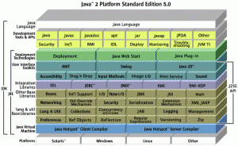

> 本文转载自[java命令学习系列](http://www.hollischuang.com/archives/tag/java%E5%91%BD%E4%BB%A4%E5%AD%A6%E4%B9%A0%E7%B3%BB%E5%88%97)，文章内容略有调整。

# Java开发必须掌握的线上问题排查命令

作为一个合格的开发人员，不仅要能写得一手还代码，还有一项很重要的技能就是排查问题。这里提到的排查问题不仅仅是在coding的过程中debug等，还包括的就是线上问题的排查。由于在生产环境中，一般没办法debug（其实有些问题，debug也白扯。。。）,所以我们需要借助一些常用命令来查看运行时的具体情况，这些运行时信息包括但不限于运行日志、异常堆栈、堆使用情况、GC情况、JVM参数情况、线程情况等。

给一个系统定位问题的时候，知识、经验是关键，数据是依据，工具是运用知识处理数据的手段。为了便于我们排查和解决问题，Sun公司为我们提供了一些常用命令。这些命令一般都是jdk/lib/tools.jar中类库的一层薄包装。随着JVM的安装一起被安装到机器中，在bin目录中。下面就来认识一下这些命令以及具体使用方式。

<!-- MORE -->

## jps

### 功能

显示当前所有java进程pid的命令。

### 常用指令

`jps`：显示当前用户的所有java进程的PID

`jps -v 3331`：显示虚拟机参数

`jps -m 3331`：显示传递给main()函数的参数

`jps -l 3331`：显示主类的全路径

## jinfo

### 功能

实时查看和调整虚拟机参数，可以显示未被显示指定的参数的默认值（`jps -v 则不能`）。

> jdk8中已经不支持该命令。

### 常用指令

`jinfo -flag CMSIniniatingOccupancyFration 1444`：查询CMSIniniatingOccupancyFration参数值

## jstat

### 功能

显示进程中的类装载、内存、垃圾收集、JIT编译等运行数据。

### 常用指令

`jstat -gc 3331 250 20` ：查询进程2764的垃圾收集情况，每250毫秒查询一次，一共查询20次。

`jstat -gccause`：额外输出上次GC原因

`jstat -calss`：件事类装载、类卸载、总空间以及所消耗的时间

## jmap

### 功能

生成堆转储快照（heapdump）

### 常用指令

`jmap -heap 3331`：查看java 堆（heap）使用情况

`jmap -histo 3331`：查看堆内存(histogram)中的对象数量及大小

`jmap -histo:live 3331`：JVM会先触发gc，然后再统计信息

`jmap -dump:format=b,file=heapDump 3331`：将内存使用的详细情况输出到文件，之后一般使用其他工具进行分析。

## jhat

### 功能

一般与jmap搭配使用，用来分析jmap生成的堆转储文件。

> 由于有很多可视化工具（Eclipse Memory Analyzer 、IBM HeapAnalyzer）可以替代，所以很少用。不过在没有可视化工具的机器上也是可用的。

### 常用指令

`jmap -dump:format=b,file=heapDump 3331` + `jhat heapDump`：解析Java堆转储文件,并启动一个 web server

## jstack

### 功能

生成当前时刻的线程快照。

### 常用指令

`jstack 3331`：查看线程情况

`jstack -F 3331`：正常输出不被响应时，使用该指令

`jstack -l 3331`：除堆栈外，显示关于锁的附件信息


## 常见问题定位过程

### 频繁GC问题或内存溢出问题

一、使用`jps`查看线程ID

二、使用`jstat -gc 3331 250 20` 查看gc情况，一般比较关注PERM区的情况，查看GC的增长情况。

三、使用`jstat -gccause`：额外输出上次GC原因

四、使用`jmap -dump:format=b,file=heapDump 3331`生成堆转储文件

五、使用jhat或者可视化工具（Eclipse Memory Analyzer 、IBM HeapAnalyzer）分析堆情况。

六、结合代码解决内存溢出或泄露问题。


### 死锁问题

一、使用`jps`查看线程ID，转换为16进制
```shell
printf %x 线程号
```

二、使用`jstack 3331`：查看线程情况

## 结语

经常使用适当的虚拟机监控和分析工具可以加快我们分析数据、定位解决问题的速度，但也要知道，工具永远都是知识技能的一层包装，没有什么工具是包治百病的。

# Java命令学习系列（零）— 常见命令及Java Dump介绍

## 常用命令：

在JDK的bin目彔下,包含了java命令及其他实用工具。

> jps:查看本机的Java中进程信息。
>
> jstack:打印线程的栈信息,制作线程Dump。
>
> jmap:打印内存映射,制作堆Dump。
>
> jstat:性能监控工具。
>
> jhat:内存分析工具。
>
> jconsole:简易的可视化控制台。
>
> jvisualvm:功能强大的控制台。

## 认识Java Dump：

### 什么是Java Dump？

> Java虚拟机的运行时快照。将Java虚拟机运行时的状态和信息保存到文件。
>
> **线程Dump**,包含所有线程的运行状态。纯文本格式。
>
> **堆Dump**,包含线程Dump,幵包含所有堆对象的状态。二进制格式。

### Java Dump有什么用？

> 补足传统Bug分析手段的不足: 可在任何Java环境使用;信息量充足。 针对非功能正确性的Bug,主要为:多线程幵发、内存泄漏。

## 制作Java Dump

**使用Java虚拟机制作Dump**

指示虚拟机在发生内存不足错误时,自动生成堆Dump

```shell
-XX:+HeapDumpOnOutOfMemoryError
```

**使用图形化工具制作Dump**

使用JDK(1.6)自带的工具:Java VisualVM。

**使用命令行制作Dump**

`jstack`:打印线程的栈信息,制作线程Dump。

`jmap`:打印内存映射,制作堆Dump。

**步骤：**

1. 检查虚拟机版本（java -version）
2. 找出目标Java应用的进程ID（jps）
3. 使用jstack命令制作线程Dump• Linux环境下使用kill命令制作线程Dump
4. 使用jmap命令制作堆Dump


# Java命令学习系列（一）— Jps

> jps位于jdk的bin目录下，其作用是显示当前系统的java进程情况，及其id号。 jps相当于Solaris进程工具ps。不象”pgrep java”或”ps -ef grep java”，jps并不使用应用程序名来查找JVM实例。因此，它查找所有的Java应用程序，包括即使没有使用java执行体的那种（例如，定制的启动 器）。另外，jps仅查找当前用户的Java进程，而不是当前系统中的所有进程。

## 位置

我们知道，很多Java命令都在jdk的JAVA_HOME/bin/目录下面，jps也不例外，他就在bin目录下，所以，他是java自带的一个命令。

## 功能

jps(Java Virtual Machine Process Status Tool)是JDK 1.5提供的一个显示当前所有java进程pid的命令，简单实用，非常适合在linux/unix平台上简单察看当前java进程的一些简单情况。

## 原理

jdk中的jps命令可以显示当前运行的java进程以及相关参数，它的实现机制如下：
java程序在启动以后，会在`java.io.tmpdir`指定的目录下，就是临时文件夹里，生成一个类似于`hsperfdata_User`的文件夹，这个文件夹里（在Linux中为/tmp/hsperfdata_{userName}/），有几个文件，名字就是java进程的pid，因此列出当前运行的java进程，只是把这个目录里的文件名列一下而已。 至于系统的参数什么，就可以解析这几个文件获得。

```shell
hollis@hos:/tmp/hsperfdata_hollis$ pwd
/tmp/hsperfdata_hollis
hollis@hos:/tmp/hsperfdata_hollis$ ll
total 48
drwxr-xr-x 2 hollis hollis  4096  4月 16 10:54 ./
drwxrwxrwt 7 root   root   12288  4月 16 10:56 ../
-rw------- 1 hollis hollis 32768  4月 16 10:57 2679
hollis@hos:/tmp/hsperfdata_hollis$ 
```

上面的内容就是我机器中/tmp/hsperfdata_hollis目录下的内容，其中2679就是我机器上当前运行中的java的进程的pid，我们执行jps验证一下：

```shell
hollis@hos:/tmp/hsperfdata_hollis$ jps
2679 org.eclipse.equinox.launcher_1.3.0.v20130327-1440.jar
4445 Jps
```

执行了jps命令之后，我们发现有两个java进程，一个是pid为2679的eclipse运行的进程，另外一个是pid为4445的jps使用的进程（他也是java命令，也要开一个进程）

## 使用

想要学习一个命令，先来看看帮助，使用`jps -help`查看帮助：

```shell
hollis@hos:/tmp/hsperfdata_hollis$ jps -help
usage: jps [-help]
       jps [-q] [-mlvV] [<hostid>]

Definitions:
    <hostid>:      <hostname>[:<port>]
```

接下来，为了详细介绍这些参数，我们编写几个类，在main方法里写一个while(true)的循环，查看java进程情况。代码如下：

```java
package com.JavaCommand;
/**
 * @author hollis
 */
public class JpsDemo {
    public static void main(String[] args) {
        while(true){
            System.out.println(1);
        }
    }
}
```

**-q 只显示pid，不显示class名称,jar文件名和传递给main 方法的参数**

```shell
hollis@hos:/tmp/hsperfdata_hollis$ jps -q
2679
11421
```

**-m 输出传递给main 方法的参数，在嵌入式jvm上可能是null，** 在这里，在启动main方法的时候，我给String[] args传递两个参数。hollis,chuang,执行`jsp -m`:

```shell
hollis@hos:/tmp/hsperfdata_hollis$ jps -m
12062 JpsDemo hollis,chuang
```

**-l 输出应用程序main class的完整package名 或者 应用程序的jar文件完整路径名**

```shell
hollis@hos:/tmp/hsperfdata_hollis$ jps -l
12356 sun.tools.jps.Jps
2679 /home/hollis/tools/eclipse//plugins/org.eclipse.equinox.launcher_1.3.0.v20130327-1440.jar
12329 com.JavaCommand.JpsDemo
```

**-v 输出传递给JVM的参数** 在这里，在启动main方法的时候，我给jvm传递一个参数：-Dfile.encoding=UTF-8,执行`jps -v`：

```shell
hollis@hos:/tmp/hsperfdata_hollis$ jps -v
2679 org.eclipse.equinox.launcher_1.3.0.v20130327-1440.jar -Djava.library.path=/usr/lib/jni:/usr/lib/x86_64-linux-gnu/jni -Dosgi.requiredJavaVersion=1.6 -XX:MaxPermSize=256m -Xms40m -Xmx512m
13157 Jps -Denv.class.path=/home/hollis/tools/java/jdk1.7.0_71/lib:/home/hollis/tools/java/jdk1.7.0_71/jre/lib: -Dapplication.home=/home/hollis/tools/java/jdk1.7.0_71 -Xms8m
13083 JpsDemo -Dfile.encoding=UTF-8
```

PS:jps命令有个地方很不好，似乎只能显示当前用户的java进程，要显示其他用户的还是只能用unix/linux的ps命令。

> **jps是我最常用的java命令。使用jps可以查看当前有哪些Java进程处于运行状态。如果我运行了一个web应用（使用tomcat、jboss、jetty等启动）的时候，我就可以使用jps查看启动情况。有的时候我想知道这个应用的日志会输出到哪里，或者启动的时候使用了哪些javaagent，那么我可以使用`jps -v` 查看进程的jvm参数情况。**

## JPS失效处理

**现象：** 用ps -ef|grep java能看到启动的java进程，但是用jps查看却不存在该进程的id。待会儿解释过之后就能知道在该情况下，jconsole、jvisualvm可能无法监控该进程，其他java自带工具也可能无法使用

**分析：** jps、jconsole、jvisualvm等工具的数据来源就是这个文件（/tmp/hsperfdata_userName/pid)。所以当该文件不存在或是无法读取时就会出现jps无法查看该进程号，jconsole无法监控等问题

**原因：**

（1）、磁盘读写、目录权限问题 若该用户没有权限写/tmp目录或是磁盘已满，则无法创建/tmp/hsperfdata_userName/pid文件。或该文件已经生成，但用户没有读权限

（2）、临时文件丢失，被删除或是定期清理 对于linux机器，一般都会存在定时任务对临时文件夹进行清理，导致/tmp目录被清空。这也是我第一次碰到该现象的原因。常用的可能定时删除临时目录的工具为crontab、redhat的tmpwatch、ubuntu的tmpreaper等等

这个导致的现象可能会是这样，用jconsole监控进程，发现在某一时段后进程仍然存在，但是却没有监控信息了。

（3）、java进程信息文件存储地址被设置，不在/tmp目录下 上面我们在介绍时说默认会在/tmp/hsperfdata_userName目录保存进程信息，但由于以上1、2所述原因，可能导致该文件无法生成或是丢失，所以java启动时提供了参数(-Djava.io.tmpdir)，可以对这个文件的位置进行设置，而jps、jconsole都只会从/tmp目录读取，而无法从设置后的目录读物信息，这是我第二次碰到该现象的原因

## 附：

1.如何给main传递参数 在eclipse中，鼠标右键->Run As->Run COnfiguations->Arguments->在Program arguments中写下要传的参数值

1.如何给JVM传递参数 在eclipse中，鼠标右键->Run As->Run COnfiguations->Arguments->在VM arguments中写下要传的参数值（一般以-D开头）

# Java命令学习系列（二）— Jstack

> jstack是java虚拟机自带的一种堆栈跟踪工具。

## 功能

jstack用于生成java虚拟机当前时刻的线程快照。线程快照是当前java虚拟机内每一条线程正在执行的方法堆栈的集合，生成线程快照的主要目的是定位线程出现长时间停顿的原因，如线程间死锁、死循环、请求外部资源导致的长时间等待等。 线程出现停顿的时候通过jstack来查看各个线程的调用堆栈，就可以知道没有响应的线程到底在后台做什么事情，或者等待什么资源。 如果java程序崩溃生成core文件，jstack工具可以用来获得core文件的java stack和native stack的信息，从而可以轻松地知道java程序是如何崩溃和在程序何处发生问题。另外，jstack工具还可以附属到正在运行的java程序中，看到当时运行的java程序的java stack和native stack的信息, 如果现在运行的java程序呈现hung的状态，jstack是非常有用的。

> So,**jstack命令主要用来查看Java线程的调用堆栈的，可以用来分析线程问题（如死锁）。**

### 线程状态

想要通过jstack命令来分析线程的情况的话，首先要知道线程都有哪些状态，下面这些状态是我们使用jstack命令查看线程堆栈信息时可能会看到的**线程的几种状态**：

> NEW,未启动的。不会出现在Dump中。
>
> RUNNABLE,在虚拟机内执行的。
>
> BLOCKED,受阻塞并等待监视器锁。
>
> WATING,无限期等待另一个线程执行特定操作。
>
> TIMED_WATING,有时限的等待另一个线程的特定操作。
>
> TERMINATED,已退出的。

### Monitor

在多线程的 JAVA程序中，实现线程之间的同步，就要说说 Monitor。 **Monitor是 Java中用以实现线程之间的互斥与协作的主要手段**，它可以看成是对象或者 Class的锁。每一个对象都有，也仅有一个 monitor。下 面这个图，描述了线程和 Monitor之间关系，以 及线程的状态转换图：


**进入区(Entrt Set)**:表示线程通过synchronized要求获取对象的锁。如果对象未被锁住,则迚入拥有者;否则则在进入区等待。一旦对象锁被其他线程释放,立即参与竞争。

**拥有者(The Owner)**:表示某一线程成功竞争到对象锁。

**等待区(Wait Set)**:表示线程通过对象的wait方法,释放对象的锁,并在等待区等待被唤醒。

从图中可以看出，一个 Monitor在某个时刻，只能被一个线程拥有，该线程就是 `“Active Thread”`，而其它线程都是 `“Waiting Thread”`，分别在两个队列 `“ Entry Set”`和 `“Wait Set”`里面等候。在 `“Entry Set”`中等待的线程状态是 `“Waiting for monitor entry”`，而在 `“Wait Set”`中等待的线程状态是 `“in Object.wait()”`。 先看 “Entry Set”里面的线程。我们称被 synchronized保护起来的代码段为临界区。当一个线程申请进入临界区时，它就进入了 “Entry Set”队列。对应的 code就像：

```java
synchronized(obj) {
.........

}
```

### 调用修饰

表示线程在方法调用时,额外的重要的操作。线程Dump分析的重要信息。修饰上方的方法调用。

> locked <地址> 目标：使用synchronized申请对象锁成功,监视器的拥有者。
>
> waiting to lock <地址> 目标：使用synchronized申请对象锁未成功,在迚入区等待。
>
> waiting on <地址> 目标：使用synchronized申请对象锁成功后,释放锁幵在等待区等待。
>
> parking to wait for <地址> 目标

**locked**

```shell
at oracle.jdbc.driver.PhysicalConnection.prepareStatement
- locked <0x00002aab63bf7f58> (a oracle.jdbc.driver.T4CConnection)
at oracle.jdbc.driver.PhysicalConnection.prepareStatement
- locked <0x00002aab63bf7f58> (a oracle.jdbc.driver.T4CConnection)
at com.jiuqi.dna.core.internal.db.datasource.PooledConnection.prepareStatement
```

通过synchronized关键字,成功获取到了对象的锁,成为监视器的拥有者,在临界区内操作。对象锁是可以线程重入的。

**waiting to lock**

```shell
at com.jiuqi.dna.core.impl.CacheHolder.isVisibleIn(CacheHolder.java:165)
- waiting to lock <0x0000000097ba9aa8> (a CacheHolder)
at com.jiuqi.dna.core.impl.CacheGroup$Index.findHolder
at com.jiuqi.dna.core.impl.ContextImpl.find
at com.jiuqi.dna.bap.basedata.common.util.BaseDataCenter.findInfo
```

通过synchronized关键字,没有获取到了对象的锁,线程在监视器的进入区等待。在调用栈顶出现,线程状态为Blocked。

**waiting on**

```shell
at java.lang.Object.wait(Native Method)
- waiting on <0x00000000da2defb0> (a WorkingThread)
at com.jiuqi.dna.core.impl.WorkingManager.getWorkToDo
- locked <0x00000000da2defb0> (a WorkingThread)
at com.jiuqi.dna.core.impl.WorkingThread.run
```

通过synchronized关键字,成功获取到了对象的锁后,调用了wait方法,进入对象的等待区等待。在调用栈顶出现,线程状态为WAITING或TIMED_WATING。

**parking to wait for**

park是基本的线程阻塞原语,不通过监视器在对象上阻塞。随concurrent包会出现的新的机制,不synchronized体系不同。

### 线程动作

线程状态产生的原因

> runnable:状态一般为RUNNABLE。
>
> in Object.wait():等待区等待,状态为WAITING或TIMED_WAITING。
>
> waiting for monitor entry:进入区等待,状态为BLOCKED。
>
> waiting on condition:等待区等待、被park。
>
> sleeping:休眠的线程,调用了Thread.sleep()。

**Wait on condition** 该状态出现在线程等待某个条件的发生。具体是什么原因，可以结合 stacktrace来分析。 最常见的情况就是线程处于sleep状态，等待被唤醒。 常见的情况还有等待网络IO：在java引入nio之前，对于每个网络连接，都有一个对应的线程来处理网络的读写操作，即使没有可读写的数据，线程仍然阻塞在读写操作上，这样有可能造成资源浪费，而且给操作系统的线程调度也带来压力。在 NewIO里采用了新的机制，编写的服务器程序的性能和可扩展性都得到提高。 正等待网络读写，这可能是一个网络瓶颈的征兆。因为网络阻塞导致线程无法执行。一种情况是网络非常忙，几乎消耗了所有的带宽，仍然有大量数据等待网络读 写；另一种情况也可能是网络空闲，但由于路由等问题，导致包无法正常的到达。所以要结合系统的一些性能观察工具来综合分析，比如 netstat统计单位时间的发送包的数目，如果很明显超过了所在网络带宽的限制 ; 观察 cpu的利用率，如果系统态的 CPU时间，相对于用户态的 CPU时间比例较高；如果程序运行在 Solaris 10平台上，可以用 dtrace工具看系统调用的情况，如果观察到 read/write的系统调用的次数或者运行时间遥遥领先；这些都指向由于网络带宽所限导致的网络瓶颈。

## 线程Dump的分析

### 原则

> 结合代码阅读的推理。需要线程Dump和源码的相互推导和印证。
>
> 造成Bug的根源往往丌会在调用栈上直接体现,一定格外注意线程当前调用之前的所有调用。

### 入手点

**进入区等待**

```shell
"d&a-3588" daemon waiting for monitor entry [0x000000006e5d5000]
java.lang.Thread.State: BLOCKED (on object monitor)
at com.jiuqi.dna.bap.authority.service.UserService$LoginHandler.handle()
- waiting to lock <0x0000000602f38e90> (a java.lang.Object)
at com.jiuqi.dna.bap.authority.service.UserService$LoginHandler.handle()
```

线程状态BLOCKED,线程动作wait on monitor entry,调用修饰waiting to lock总是一起出现。表示在代码级别已经存在冲突的调用。必然有问题的代码,需要尽可能减少其发生。

**同步块阻塞**

一个线程锁住某对象,大量其他线程在该对象上等待。

```shell
"blocker" runnable
java.lang.Thread.State: RUNNABLE
at com.jiuqi.hcl.javadump.Blocker$1.run(Blocker.java:23)
- locked <0x00000000eb8eff68> (a java.lang.Object)
"blockee-11" waiting for monitor entry
java.lang.Thread.State: BLOCKED (on object monitor)
at com.jiuqi.hcl.javadump.Blocker$2.run(Blocker.java:41)
- waiting to lock <0x00000000eb8eff68> (a java.lang.Object)
"blockee-86" waiting for monitor entry
java.lang.Thread.State: BLOCKED (on object monitor)
at com.jiuqi.hcl.javadump.Blocker$2.run(Blocker.java:41)
- waiting to lock <0x00000000eb8eff68> (a java.lang.Object)
```

**持续运行的IO** IO操作是可以以RUNNABLE状态达成阻塞。例如:数据库死锁、网络读写。 格外注意对IO线程的真实状态的分析。 一般来说,被捕捉到RUNNABLE的IO调用,都是有问题的。

以下堆栈显示： 线程状态为RUNNABLE。 调用栈在SocketInputStream或SocketImpl上,socketRead0等方法。 调用栈包含了jdbc相关的包。很可能发生了数据库死锁

```shell
"d&a-614" daemon prio=6 tid=0x0000000022f1f000 nid=0x37c8 runnable
[0x0000000027cbd000]
java.lang.Thread.State: RUNNABLE
at java.net.SocketInputStream.socketRead0(Native Method)
at java.net.SocketInputStream.read(Unknown Source)
at oracle.net.ns.Packet.receive(Packet.java:240)
at oracle.net.ns.DataPacket.receive(DataPacket.java:92)
at oracle.net.ns.NetInputStream.getNextPacket(NetInputStream.java:172)
at oracle.net.ns.NetInputStream.read(NetInputStream.java:117)
at oracle.jdbc.driver.T4CMAREngine.unmarshalUB1(T4CMAREngine.java:1034)
at oracle.jdbc.driver.T4C8Oall.receive(T4C8Oall.java:588)
```

**分线程调度的休眠**

正常的线程池等待

```shell
"d&a-131" in Object.wait()
java.lang.Thread.State: TIMED_WAITING (on object monitor)
at java.lang.Object.wait(Native Method)
at com.jiuqi.dna.core.impl.WorkingManager.getWorkToDo(WorkingManager.java:322)
- locked <0x0000000313f656f8> (a com.jiuqi.dna.core.impl.WorkingThread)
at com.jiuqi.dna.core.impl.WorkingThread.run(WorkingThread.java:40)
```

可疑的线程等待

```shell
"d&a-121" in Object.wait()
java.lang.Thread.State: WAITING (on object monitor)
at java.lang.Object.wait(Native Method)
at java.lang.Object.wait(Object.java:485)
at com.jiuqi.dna.core.impl.AcquirableAccessor.exclusive()
- locked <0x00000003011678d8> (a com.jiuqi.dna.core.impl.CacheGroup)
at com.jiuqi.dna.core.impl.Transaction.lock()
```

### 入手点总结

**wait on monitor entry：** 被阻塞的,肯定有问题

**runnable** ： 注意IO线程

**in Object.wait()**： 注意非线程池等待

## 使用

想要学习一个命令，先来看看帮助，使用jstack -help查看帮助：

```shell
hollis@hos:~$ jstack -help
Usage:
    jstack [-l] <pid>
        (to connect to running process)
    jstack -F [-m] [-l] <pid>
        (to connect to a hung process)
    jstack [-m] [-l] <executable> <core>
        (to connect to a core file)
    jstack [-m] [-l] [server_id@]<remote server IP or hostname>
        (to connect to a remote debug server)

Options:
    -F  to force a thread dump. Use when jstack <pid> does not respond (process is hung)
    -m  to print both java and native frames (mixed mode)
    -l  long listing. Prints additional information about locks
    -h or -help to print this help message
```

`-F`当’jstack [-l] pid’没有相应的时候强制打印栈信息 `-l`长列表. 打印关于锁的附加信息,例如属于java.util.concurrent的ownable synchronizers列表. `-m`打印java和native c/c++框架的所有栈信息. `-h` | -help打印帮助信息 `pid` 需要被打印配置信息的java进程id,可以用jps查询.

首先，我们分析这么一段程序的线程情况：

```java
/**
 * @author hollis
 */
public class JStackDemo1 {
    public static void main(String[] args) {
        while (true) {
            //Do Nothing
        }
    }
}
```

先是有jps查看进程号：

```shell
hollis@hos:~$ jps
29788 JStackDemo1
29834 Jps
22385 org.eclipse.equinox.launcher_1.3.0.v20130327-1440.jar
```

然后使用jstack 查看堆栈信息：

```shell
hollis@hos:~$ jstack 29788
2015-04-17 23:47:31
...此处省略若干内容...
"main" prio=10 tid=0x00007f197800a000 nid=0x7462 runnable [0x00007f197f7e1000]
   java.lang.Thread.State: RUNNABLE
    at javaCommand.JStackDemo1.main(JStackDemo1.java:7)
```

我们可以从这段堆栈信息中看出什么来呢？我们可以看到，当前一共有一条用户级别线程,线程处于runnable状态，执行到JStackDemo1.java的第七行。 看下面代码：

```java
/**
 * @author hollis
 */
public class JStackDemo1 {
    public static void main(String[] args) {
        Thread thread = new Thread(new Thread1());
        thread.start();
    }
}
class Thread1 implements Runnable{
    @Override
    public void run() {
        while(true){
            System.out.println(1);
        }
    }
}
```

线程堆栈信息如下：

```shell
"Reference Handler" daemon prio=10 tid=0x00007fbbcc06e000 nid=0x286c in Object.wait() [0x00007fbbc8dfc000]
   java.lang.Thread.State: WAITING (on object monitor)
    at java.lang.Object.wait(Native Method)
    - waiting on <0x0000000783e066e0> (a java.lang.ref.Reference$Lock)
    at java.lang.Object.wait(Object.java:503)
    at java.lang.ref.Reference$ReferenceHandler.run(Reference.java:133)
    - locked <0x0000000783e066e0> (a java.lang.ref.Reference$Lock)
```

我们能看到：

> 线程的状态： WAITING 线程的调用栈 线程的当前锁住的资源： <0x0000000783e066e0> 线程当前等待的资源：<0x0000000783e066e0>

为什么同时锁住的等待同一个资源：

> 线程的执行中，先获得了这个对象的 Monitor（对应于 locked <0x0000000783e066e0>）。当执行到 obj.wait(), 线程即放弃了 Monitor的所有权，进入 “wait set”队列（对应于 waiting on <0x0000000783e066e0> ）。

### 死锁分析

学会了怎么使用jstack命令之后，我们就可以看看，如何使用jstack分析死锁了，这也是我们一定要掌握的内容。 **啥叫死锁？** 所谓[死锁](http://zh.wikipedia.org/wiki/死锁)： 是指两个或两个以上的进程在执行过程中，由于竞争资源或者由于彼此通信而造成的一种阻塞的现象，若无外力作用，它们都将无法推进下去。此时称系统处于死锁状态或系统产生了死锁，这些永远在互相等待的进程称为死锁进程。 说白了，我现在想吃鸡蛋灌饼，桌子上放着鸡蛋和饼，但是我和我的朋友同时分别拿起了鸡蛋和病，我手里拿着鸡蛋，但是我需要他手里的饼。他手里拿着饼，但是他想要我手里的鸡蛋。就这样，如果不能同时拿到鸡蛋和饼，那我们就不能继续做后面的工作（做鸡蛋灌饼）。所以，这就造成了死锁。 **看一段死锁的程序：**

```java
package javaCommand;
/**
 * @author hollis
 */
public class JStackDemo {
    public static void main(String[] args) {
        Thread t1 = new Thread(new DeadLockclass(true));//建立一个线程
        Thread t2 = new Thread(new DeadLockclass(false));//建立另一个线程
        t1.start();//启动一个线程
        t2.start();//启动另一个线程
    }
}
class DeadLockclass implements Runnable {
    public boolean falg;// 控制线程
    DeadLockclass(boolean falg) {
        this.falg = falg;
    }
    public void run() {
        /**
         * 如果falg的值为true则调用t1线程
         */
        if (falg) {
            while (true) {
                synchronized (Suo.o1) {
                    System.out.println("o1 " + Thread.currentThread().getName());
                    synchronized (Suo.o2) {
                        System.out.println("o2 " + Thread.currentThread().getName());
                    }
                }
            }
        }
        /**
         * 如果falg的值为false则调用t2线程
         */
        else {
            while (true) {
                synchronized (Suo.o2) {
                    System.out.println("o2 " + Thread.currentThread().getName());
                    synchronized (Suo.o1) {
                        System.out.println("o1 " + Thread.currentThread().getName());
                    }
                }
            }
        }
    }
}

class Suo {
    static Object o1 = new Object();
    static Object o2 = new Object();
}
```

当我启动该程序时，我们看一下控制台：


我们发现，程序只输出了两行内容，然后程序就不再打印其它的东西了，但是程序并没有停止。这样就产生了死锁。 当线程1使用`synchronized`锁住了o1的同时，线程2也是用`synchronized`锁住了o2。当两个线程都执行完第一个打印任务的时候，线程1想锁住o2，线程2想锁住o1。但是，线程1当前锁着o1，线程2锁着o2。所以两个想成都无法继续执行下去，就造成了死锁。

然后，我们使用**jstack来看一下线程堆栈信息**：

```shell
Found one Java-level deadlock:
=============================
"Thread-1":
  waiting to lock monitor 0x00007f0134003ae8 (object 0x00000007d6aa2c98, a java.lang.Object),
  which is held by "Thread-0"
"Thread-0":
  waiting to lock monitor 0x00007f0134006168 (object 0x00000007d6aa2ca8, a java.lang.Object),
  which is held by "Thread-1"

Java stack information for the threads listed above:
===================================================
"Thread-1":
    at javaCommand.DeadLockclass.run(JStackDemo.java:40)
    - waiting to lock <0x00000007d6aa2c98> (a java.lang.Object)
    - locked <0x00000007d6aa2ca8> (a java.lang.Object)
    at java.lang.Thread.run(Thread.java:745)
"Thread-0":
    at javaCommand.DeadLockclass.run(JStackDemo.java:27)
    - waiting to lock <0x00000007d6aa2ca8> (a java.lang.Object)
    - locked <0x00000007d6aa2c98> (a java.lang.Object)
    at java.lang.Thread.run(Thread.java:745)

Found 1 deadlock.
```

哈哈，堆栈写的很明显，它告诉我们 `Found one Java-level deadlock`，然后指出造成死锁的两个线程的内容。然后，又通过 `Java stack information for the threads listed above`来显示更详细的死锁的信息。 他说

> Thread-1在想要执行第40行的时候，当前锁住了资源`<0x00000007d6aa2ca8>`,但是他在等待资源`<0x00000007d6aa2c98>` Thread-0在想要执行第27行的时候，当前锁住了资源`<0x00000007d6aa2c98>`,但是他在等待资源`<0x00000007d6aa2ca8>` 由于这两个线程都持有资源，并且都需要对方的资源，所以造成了死锁。 原因我们找到了，就可以具体问题具体分析，解决这个死锁了。

### 其他

**虚拟机执行Full GC时,会阻塞所有的用户线程。因此,即时获取到同步锁的线程也有可能被阻塞。** 在查看线程Dump时,首先查看内存使用情况。

# Java命令学习系列（三）— Jmap

> jmap是JDK自带的工具软件，主要用于打印指定Java进程(或核心文件、远程调试服务器)的共享对象内存映射或堆内存细节。可以使用jmap生成Heap Dump。在`Java命令学习系列（零）— 常见命令及Java Dump`介绍中分别有关于Java Dump以及线程 Dump的介绍。 **这篇文章主要介绍Java的堆Dump以及jamp命令**


## 什么是堆Dump

堆Dump是反应Java堆使用情况的内存镜像，其中主要包括**系统信息**、**虚拟机属性**、**完整的线程Dump**、**所有类和对象的状态**等。 一般，在内存不足、GC异常等情况下，我们就会怀疑有[内存泄露](http://zh.wikipedia.org/zh-cn/内存泄漏)。这个时候我们就可以制作堆Dump来查看具体情况。分析原因。

## 基础知识

《Java虚拟机的内存组成以及堆内存介绍》《Java GC工作原理》常见内存错误：

> outOfMemoryError **年老代内存不足。**
> outOfMemoryError:PermGen Space **永久代内存不足。**
> outOfMemoryError:GC overhead limit exceed **垃圾回收时间占用系统运行时间的98%或以上。**

## jmap

**用法摘要**

```shell
Usage:
    jmap [option] <pid>
        (to connect to running process)
    jmap [option] <executable <core>
        (to connect to a core file)
    jmap [option] [server_id@]<remote server IP or hostname>
        (to connect to remote debug server)

where <option> is one of:
    <none>               to print same info as Solaris pmap
    -heap                to print java heap summary
    -histo[:live]        to print histogram of java object heap; if the "live"
                         suboption is specified, only count live objects
    -permstat            to print permanent generation statistics
    -finalizerinfo       to print information on objects awaiting finalization
    -dump:<dump-options> to dump java heap in hprof binary format
                         dump-options:
                           live         dump only live objects; if not specified,
                                        all objects in the heap are dumped.
                           format=b     binary format
                           file=<file>  dump heap to <file>
                         Example: jmap -dump:live,format=b,file=heap.bin <pid>
    -F                   force. Use with -dump:<dump-options> <pid> or -histo
                         to force a heap dump or histogram when <pid> does not
                         respond. The "live" suboption is not supported
                         in this mode.
    -h | -help           to print this help message
    -J<flag>             to pass <flag> directly to the runtime system
```

> **指定进程号(pid)的进程** jmap [ option ] **指定核心文件** jmap [ option ] **指定远程调试服务器** jmap [ option ] [server-id@]

------

> **参数：**
>
> > **option** 选项参数是互斥的(不可同时使用)。想要使用选项参数，直接跟在命令名称后即可。
> > **pid** 需要打印配置信息的进程ID。该进程必须是一个Java进程。想要获取运行的Java进程列表，你可以使用jps。
> > **executable** 产生核心dump的Java可执行文件。
> > **core** 需要打印配置信息的核心文件。
> > **remote-hostname-or-IP** 远程调试服务器的(请查看jsadebugd)主机名或IP地址。
> > **server-id** 可选的唯一id，如果相同的远程主机上运行了多台调试服务器，用此选项参数标识服务器。
>
> **选项:**
>
> > `<no option>` 如果使用不带选项参数的jmap打印共享对象映射，将会打印目标虚拟机中加载的每个共享对象的起始地址、映射大小以及共享对象文件的路径全称。这与Solaris的pmap工具比较相似。
> > `-dump:[live,]format=b,file=<filename>` 以hprof二进制格式转储Java堆到指定`filename`的文件中。live子选项是可选的。如果指定了live子选项，堆中只有活动的对象会被转储。想要浏览heap dump，你可以使用jhat(Java堆分析工具)读取生成的文件。
> > `-finalizerinfo` 打印等待终结的对象信息。
> > `-heap` 打印一个堆的摘要信息，包括使用的GC算法、堆配置信息和generation wise heap usage。
> > `-histo[:live]` 打印堆的柱状图。其中包括每个Java类、对象数量、内存大小(单位：字节)、完全限定的类名。打印的虚拟机内部的类名称将会带有一个’*’前缀。如果指定了live子选项，则只计算活动的对象。
> > `-permstat` 打印Java堆内存的永久保存区域的类加载器的智能统计信息。对于每个类加载器而言，它的名称、活跃度、地址、父类加载器、它所加载的类的数量和大小都会被打印。此外，包含的字符串数量和大小也会被打印。
> > `-F` 强制模式。如果指定的pid没有响应，请使用jmap -dump或jmap -histo选项。此模式下，不支持live子选项。
> > `-h` 打印帮助信息。
> > `-help` 打印帮助信息。
> > `-J<flag>` 指定传递给运行jmap的JVM的参数。

## 举例

**查看java 堆（heap）使用情况,**执行命令： `hollis@hos:~/workspace/design_apaas/apaasweb/control/bin$ jmap -heap 31846`

```shell
Attaching to process ID 31846, please wait...
Debugger attached successfully.
Server compiler detected.
JVM version is 24.71-b01

using thread-local object allocation.
Parallel GC with 4 thread(s)//GC 方式

Heap Configuration: //堆内存初始化配置
   MinHeapFreeRatio = 0 //对应jvm启动参数-XX:MinHeapFreeRatio设置JVM堆最小空闲比率(default 40)
   MaxHeapFreeRatio = 100 //对应jvm启动参数 -XX:MaxHeapFreeRatio设置JVM堆最大空闲比率(default 70)
   MaxHeapSize      = 2082471936 (1986.0MB) //对应jvm启动参数-XX:MaxHeapSize=设置JVM堆的最大大小
   NewSize          = 1310720 (1.25MB)//对应jvm启动参数-XX:NewSize=设置JVM堆的‘新生代’的默认大小
   MaxNewSize       = 17592186044415 MB//对应jvm启动参数-XX:MaxNewSize=设置JVM堆的‘新生代’的最大大小
   OldSize          = 5439488 (5.1875MB)//对应jvm启动参数-XX:OldSize=<value>:设置JVM堆的‘老生代’的大小
   NewRatio         = 2 //对应jvm启动参数-XX:NewRatio=:‘新生代’和‘老生代’的大小比率
   SurvivorRatio    = 8 //对应jvm启动参数-XX:SurvivorRatio=设置年轻代中Eden区与Survivor区的大小比值 
   PermSize         = 21757952 (20.75MB)  //对应jvm启动参数-XX:PermSize=<value>:设置JVM堆的‘永生代’的初始大小
   MaxPermSize      = 85983232 (82.0MB)//对应jvm启动参数-XX:MaxPermSize=<value>:设置JVM堆的‘永生代’的最大大小
   G1HeapRegionSize = 0 (0.0MB)

Heap Usage://堆内存使用情况
PS Young Generation
Eden Space://Eden区内存分布
   capacity = 33030144 (31.5MB)//Eden区总容量
   used     = 1524040 (1.4534378051757812MB)  //Eden区已使用
   free     = 31506104 (30.04656219482422MB)  //Eden区剩余容量
   4.614088270399305% used //Eden区使用比率
From Space:  //其中一个Survivor区的内存分布
   capacity = 5242880 (5.0MB)
   used     = 0 (0.0MB)
   free     = 5242880 (5.0MB)
   0.0% used
To Space:  //另一个Survivor区的内存分布
   capacity = 5242880 (5.0MB)
   used     = 0 (0.0MB)
   free     = 5242880 (5.0MB)
   0.0% used
PS Old Generation //当前的Old区内存分布
   capacity = 86507520 (82.5MB)
   used     = 0 (0.0MB)
   free     = 86507520 (82.5MB)
   0.0% used
PS Perm Generation//当前的 “永生代” 内存分布
   capacity = 22020096 (21.0MB)
   used     = 2496528 (2.3808746337890625MB)
   free     = 19523568 (18.619125366210938MB)
   11.337498256138392% used

670 interned Strings occupying 43720 bytes.
```

------

**查看堆内存(histogram)中的对象数量及大小**。执行命令： `hollis@hos:~/workspace/design_apaas/apaasweb/control/bin$ jmap -histo 3331`

```shell
num     #instances         #bytes  class name
编号     个数                字节     类名
----------------------------------------------
   1:             7        1322080  [I
   2:          5603         722368  <methodKlass>
   3:          5603         641944  <constMethodKlass>
   4:         34022         544352  java.lang.Integer
   5:           371         437208  <constantPoolKlass>
   6:           336         270624  <constantPoolCacheKlass>
   7:           371         253816  <instanceKlassKlass>
```

> **jmap -histo:live 这个命令执行，JVM会先触发gc，然后再统计信息。**

**将内存使用的详细情况输出到文件**，执行命令： `hollis@hos:~/workspace/design_apaas/apaasweb/control/bin$ jmap -dump:format=b,file=heapDump 6900`

然后用`jhat`命令可以参看 `jhat -port 5000 heapDump` 在浏览器中访问：`http://localhost:5000/` 查看详细信息

> **这个命令执行，JVM会将整个heap的信息dump写入到一个文件，heap如果比较大的话，就会导致这个过程比较耗时，并且执行的过程中为了保证dump的信息是可靠的，所以会暂停应用。**

## 总结

1. 如果程序内存不足或者频繁GC，很有可能存在内存泄露情况，这时候就要借助Java堆Dump查看对象的情况。
2. 要制作堆Dump可以直接使用jvm自带的jmap命令
3. 可以先使用`jmap -heap`命令查看堆的使用情况，看一下各个堆空间的占用情况。
4. 使用`jmap -histo:[live]`查看堆内存中的对象的情况。如果有大量对象在持续被引用，并没有被释放掉，那就产生了内存泄露，就要结合代码，把不用的对象释放掉。
5. 也可以使用 `jmap -dump:format=b,file=<fileName>`命令将堆信息保存到一个文件中，再借助jhat命令查看详细内容
6. 在内存出现泄露、溢出或者其它前提条件下，建议多dump几次内存，把内存文件进行编号归档，便于后续内存整理分析。

**Error attaching to process: sun.jvm.hotspot.debugger.DebuggerException: Can’t attach to the process**

在ubuntu中第一次使用jmap会报错：`Error attaching to process: sun.jvm.hotspot.debugger.DebuggerException: Can't attach to the process`，这是oracla文档中提到的一个bug:http://bugs.java.com/bugdatabase/view_bug.do?bug_id=7050524,解决方式如下：

> 1. echo 0 | sudo tee /proc/sys/kernel/yama/ptrace_scope 该方法在下次重启前有效。
> 2. 永久有效方法 sudo vi /etc/sysctl.d/10-ptrace.conf 编辑下面这行: kernel.yama.ptrace_scope = 1 修改为: kernel.yama.ptrace_scope = 0 重启系统，使修改生效。

# Java命令学习系列（四）— jstat

> jstat(JVM Statistics Monitoring Tool)是用于监控虚拟机各种运行状态信息的命令行工具。他可以显示本地或远程虚拟机进程中的类装载、内存、垃圾收集、JIT编译等运行数据，在没有GUI图形的服务器上，它是运行期定位虚拟机性能问题的首选工具。

jstat位于java的bin目录下，主要利用JVM内建的指令对Java应用程序的资源和性能进行实时的命令行的监控，包括了对Heap size和垃圾回收状况的监控。可见，Jstat是轻量级的、专门针对JVM的工具，非常适用。

## jstat 命令格式

```shell
 jstat -<option> [-t] [-h<lines>] <vmid> [<interval> [<count>]]
```

## 参数解释：

Option — 选项，我们一般使用 -gcutil 查看gc情况

vmid — VM的进程号，即当前运行的java进程号

interval– 间隔时间，单位为秒或者毫秒

count — 打印次数，如果缺省则打印无数次

参数interval和count代表查询间隔和次数，如果省略这两个参数，说明只查询一次。假设需要每250毫秒查询一次进程5828垃圾收集状况，一共查询5次，那命令行如下：

```shell
jstat -gc 5828 250 5
```

> 对于命令格式中的`VMID`与`LVMID`需要特别说明下：如果是本地虚拟机进程，`VMID`(Virtual Machine IDentifier,虚机标识符)和`LVMID`(Local Virtual Machine IDentifier,虚机标识符)是一致的，如果是远程虚拟机进程，那VMID的格式应当是：`[protocol:][//] lvmid [@hostname[:port]/servername]`

## option

选项option代表这用户希望查询的虚拟机信息，主要分为3类：类装载、垃圾收集和运行期编译状况，具体选项及作用如下：

> –`class` 监视类装载、卸载数量、总空间及类装载所耗费的时间 –`gc` 监视Java堆状况，包括Eden区、2个Survivor区、老年代、永久代等的容量 –`gccapacity` 监视内容与-gc基本相同，但输出主要关注Java堆各个区域使用到的最大和最小空间 –`gcutil` 监视内容与-gc基本相同，但输出主要关注已使用空间占总空间的百分比 –`gccause` 与-gcutil功能一样，但是会额外输出导致上一次GC产生的原因 –`gcnew` 监视新生代GC的状况 –`gcnewcapacity` 监视内容与-gcnew基本相同，输出主要关注使用到的最大和最小空间 –`gcold` 监视老年代GC的状况 –`gcoldcapacity` 监视内容与——gcold基本相同，输出主要关注使用到的最大和最小空间 –`gcpermcapacity` 输出永久代使用到的最大和最小空间 –`compiler` 输出JIT编译器编译过的方法、耗时等信息 –`printcompilation` 输出已经被JIT编译的方法

## 常见术语

### 1、`jstat –class<pid> :` 显示加载class的数量，及所占空间等信息。

> `Loaded` 装载的类的数量 `Bytes` 装载类所占用的字节数 `Unloaded` 卸载类的数量 `Bytes` 卸载类的字节数 `Time` 装载和卸载类所花费的时间

### 2、`jstat -compiler <pid>`显示VM实时编译的数量等信息。

> `Compiled` 编译任务执行数量 `Failed` 编译任务执行失败数量 `Invalid` 编译任务执行失效数量 `Time` 编译任务消耗时间 `FailedType` 最后一个编译失败任务的类型 `FailedMethod` 最后一个编译失败任务所在的类及方法

### 3、`jstat -gc <pid>`: 可以显示gc的信息，查看gc的次数，及时间。

> `S0C` 年轻代中第一个survivor（幸存区）的容量 (字节) `S1C` 年轻代中第二个survivor（幸存区）的容量 (字节) `S0U` 年轻代中第一个survivor（幸存区）目前已使用空间 (字节) `S1U` 年轻代中第二个survivor（幸存区）目前已使用空间 (字节) `EC` 年轻代中Eden（伊甸园）的容量 (字节) `EU` 年轻代中Eden（伊甸园）目前已使用空间 (字节) `OC` Old代的容量 (字节) `OU` Old代目前已使用空间 (字节) `PC` Perm(持久代)的容量 (字节) `PU` Perm(持久代)目前已使用空间 (字节) `YGC` 从应用程序启动到采样时年轻代中gc次数 `YGCT` 从应用程序启动到采样时年轻代中gc所用时间(s) `FGC` 从应用程序启动到采样时old代(全gc)gc次数 `FGCT` 从应用程序启动到采样时old代(全gc)gc所用时间(s) `GCT` 从应用程序启动到采样时gc用的总时间(s)

### 4、`jstat -gccapacity <pid>:`可以显示，VM内存中三代（young,old,perm）对象的使用和占用大小

> `NGCMN` 年轻代(young)中初始化(最小)的大小(字节) `NGCMX` 年轻代(young)的最大容量 (字节) `NGC` 年轻代(young)中当前的容量 (字节) `S0C` 年轻代中第一个survivor（幸存区）的容量 (字节) `S1C` 年轻代中第二个survivor（幸存区）的容量 (字节) `EC` 年轻代中Eden（伊甸园）的容量 (字节) `OGCMN` old代中初始化(最小)的大小 (字节) `OGCMX` old代的最大容量(字节) `OGC` old代当前新生成的容量 (字节) `OC` Old代的容量 (字节) `PGCMN` perm代中初始化(最小)的大小 (字节) `PGCMX` perm代的最大容量 (字节)
> `PGC` perm代当前新生成的容量 (字节) `PC` Perm(持久代)的容量 (字节) `YGC` 从应用程序启动到采样时年轻代中gc次数 `FGC` 从应用程序启动到采样时old代(全gc)gc次数

### 5、`jstat -gcutil <pid>`:统计gc信息

> `S0` 年轻代中第一个survivor（幸存区）已使用的占当前容量百分比 `S1` 年轻代中第二个survivor（幸存区）已使用的占当前容量百分比 `E` 年轻代中Eden（伊甸园）已使用的占当前容量百分比 `O` old代已使用的占当前容量百分比 `P` perm代已使用的占当前容量百分比 `YGC` 从应用程序启动到采样时年轻代中gc次数 `YGCT` 从应用程序启动到采样时年轻代中gc所用时间(s) `FGC` 从应用程序启动到采样时old代(全gc)gc次数 `FGCT` 从应用程序启动到采样时old代(全gc)gc所用时间(s) `GCT` 从应用程序启动到采样时gc用的总时间(s)

### 6、`jstat -gcnew <pid>`:年轻代对象的信息。

> `S0C` 年轻代中第一个survivor（幸存区）的容量 (字节) `S1C` 年轻代中第二个survivor（幸存区）的容量 (字节) `S0U` 年轻代中第一个survivor（幸存区）目前已使用空间 (字节) `S1U` 年轻代中第二个survivor（幸存区）目前已使用空间 (字节) `TT` 持有次数限制 `MTT` 最大持有次数限制 `EC` 年轻代中Eden（伊甸园）的容量 (字节) `EU` 年轻代中Eden（伊甸园）目前已使用空间 (字节) `YGC` 从应用程序启动到采样时年轻代中gc次数 `YGCT` 从应用程序启动到采样时年轻代中gc所用时间(s)

### 7、`jstat -gcnewcapacity<pid>`: 年轻代对象的信息及其占用量。

> `NGCMN` 年轻代(young)中初始化(最小)的大小(字节) `NGCMX` 年轻代(young)的最大容量 (字节) `NGC` 年轻代(young)中当前的容量 (字节) `S0CMX` 年轻代中第一个survivor（幸存区）的最大容量 (字节) `S0C` 年轻代中第一个survivor（幸存区）的容量 (字节) `S1CMX` 年轻代中第二个survivor（幸存区）的最大容量 (字节) `S1C` 年轻代中第二个survivor（幸存区）的容量 (字节) `ECMX` 年轻代中Eden（伊甸园）的最大容量 (字节) `EC` 年轻代中Eden（伊甸园）的容量 (字节) `YGC` 从应用程序启动到采样时年轻代中gc次数 `FGC` 从应用程序启动到采样时old代(全gc)gc次数

### 8、`jstat -gcold <pid>：`old代对象的信息。

> `PC` Perm(持久代)的容量 (字节) `PU` Perm(持久代)目前已使用空间 (字节) `OC` Old代的容量 (字节) `OU` Old代目前已使用空间 (字节) `YGC` 从应用程序启动到采样时年轻代中gc次数 `FGC` 从应用程序启动到采样时old代(全gc)gc次数 `FGCT` 从应用程序启动到采样时old代(全gc)gc所用时间(s) `GCT` 从应用程序启动到采样时gc用的总时间(s)

### 9、`stat -gcoldcapacity <pid>`: old代对象的信息及其占用量。

> `OGCMN` old代中初始化(最小)的大小 (字节) `OGCMX` old代的最大容量(字节) `OGC` old代当前新生成的容量 (字节) `OC` Old代的容量 (字节) `YGC` 从应用程序启动到采样时年轻代中gc次数 `FGC` 从应用程序启动到采样时old代(全gc)gc次数 `FGCT` 从应用程序启动到采样时old代(全gc)gc所用时间(s) `GCT` 从应用程序启动到采样时gc用的总时间(s)

### 10、`jstat -gcpermcapacity<pid>`: perm对象的信息及其占用量。

> `PGCMN` perm代中初始化(最小)的大小 (字节) `PGCMX` perm代的最大容量 (字节)
> `PGC` perm代当前新生成的容量 (字节) `PC` Perm(持久代)的容量 (字节) `YGC` 从应用程序启动到采样时年轻代中gc次数 `FGC` 从应用程序启动到采样时old代(全gc)gc次数 `FGCT` 从应用程序启动到采样时old代(全gc)gc所用时间(s) `GCT` 从应用程序启动到采样时gc用的总时间(s)

### 11、`jstat -printcompilation <pid>`：当前VM执行的信息。

> `Compiled` 编译任务的数目 `Size` 方法生成的字节码的大小 `Type` 编译类型 `Method` 类名和方法名用来标识编译的方法。类名使用/做为一个命名空间分隔符。方法名是给定类中的方法。上述格式是由-XX:+PrintComplation选项进行设置的


# Java命令学习系列（五）— jhat

> jhat(Java Heap Analysis Tool),是一个用来分析java的堆情况的命令。之前的文章讲到过，使用jmap可以生成Java堆的Dump文件。生成dump文件之后就可以用jhat命令，将dump文件转成html的形式，然后通过http访问可以查看堆情况。

jhat命令解析会Java堆dump并启动一个web服务器，然后就可以在浏览器中查看堆的dump文件了。

## 实例

### 导出dump文件

关于dump文件的生成可以看`jmap`命令的详细介绍.

**1、运行java程序**

```java
/**
 * Created by hollis on 16/1/21.
 */
public class JhatTest {

    public static void main(String[] args) {
        while(true) {
            String string = new String("hollis");
            System.out.println(string);
        }
    }
}
```

**2、查看该进程的ID**

```shell
HollisMacBook-Air:apaas hollis$ jps -l
68680 org.jetbrains.jps.cmdline.Launcher
62247 com.intellij.rt.execution.application.AppMain
69038 sun.tools.jps.Jps
```

使用`jps`命令查看发现有三个java进程在运行，一个是我的IDEA使用的进程68680，一个是JPS命令使用的进程69038，另外一个就是上面那段代码运行的进程62247。

**3、生成dump文件**

```shell
HollisMacBook-Air:test hollis$ jmap -dump:format=b,file=heapDump 62247
Dumping heap to /Users/hollis/workspace/test/heapDump ...
Heap dump file created
```

以上命令可以将进程6900的堆dump文件导出到heapDump文件中。
查看当前目录就能看到heapDump文件。

除了使用jmap命令，还可以通过以下方式：

> 1、使用 jconsole 选项通过 HotSpotDiagnosticMXBean 从运行时获得堆转储（生成dump文件）、
>
> 2、虚拟机启动时如果指定了 -XX:+HeapDumpOnOutOfMemoryError 选项, 则在抛出 OutOfMemoryError 时, 会自动执行堆转储。
>
> 3、使用 hprof 命令

### 解析Java堆转储文件,并启动一个 web server

```shell
HollisMacBook-Air:apaas hollis$ jhat heapDump
Reading from heapDump...
Dump file created Thu Jan 21 18:59:51 CST 2016
Snapshot read, resolving...
Resolving 341297 objects...
Chasing references, expect 68 dots....................................................................
Eliminating duplicate references....................................................................
Snapshot resolved.
Started HTTP server on port 7000
Server is ready.
```

使用jhat命令，就启动了一个http服务，端口是7000

然后在访问http://localhost:7000/

页面如下：


### 分析

在浏览器里面看到dump文件之后就可以进行分析了。这个页面会列出当前进程中的所有对像情况。

该页面提供了几个查询功能可供使用：

```shell
All classes including platform//
Show all members of the rootset
Show instance counts for all classes (including platform)
Show instance counts for all classes (excluding platform)
Show heap histogram
Show finalizer summary
Execute Object Query Language (OQL) query
```

一般查看堆异常情况主要看这个两个部分：

**Show instance counts for all classes (excluding platform)**，平台外的所有对象信息。如下图：


**Show heap histogram** 以树状图形式展示堆情况。如下图：


具体排查时需要结合代码，观察是否大量应该被回收的对象在一直被引用或者是否有占用内存特别大的对象无法被回收。

## 用法摘要

这一部分放在后面介绍的原因是一般不太使用。

```shell
HollisMacBook-Air:~ hollis$ jhat -help
Usage:  jhat [-stack <bool>] [-refs <bool>] [-port <port>] [-baseline <file>] [-debug <int>] [-version] [-h|-help] <file>

    -J<flag>          Pass <flag> directly to the runtime system. For
              example, -J-mx512m to use a maximum heap size of 512MB
    -stack false:     Turn off tracking object allocation call stack.
    -refs false:      Turn off tracking of references to objects
    -port <port>:     Set the port for the HTTP server.  Defaults to 7000
    -exclude <file>:  Specify a file that lists data members that should
              be excluded from the reachableFrom query.
    -baseline <file>: Specify a baseline object dump.  Objects in
              both heap dumps with the same ID and same class will
              be marked as not being "new".
    -debug <int>:     Set debug level.
                0:  No debug output
                1:  Debug hprof file parsing
                2:  Debug hprof file parsing, no server
    -version          Report version number
    -h|-help          Print this help and exit
    <file>            The file to read
```

> -stack false|true
>
> 关闭对象分配调用栈跟踪(tracking object allocation call stack)。 如果分配位置信息在堆转储中不可用. 则必须将此标志设置为 false. 默认值为 true.
>
> -refs false|true
>
> 关闭对象引用跟踪(tracking of references to objects)。 默认值为 true. 默认情况下, 返回的指针是指向其他特定对象的对象,如反向链接或输入引用(referrers or incoming references), 会统计/计算堆中的所有对象。
>
> **-port port-number**
>
> 设置 jhat HTTP server 的端口号. 默认值 7000.
>
> -exclude exclude-file
>
> 指定对象查询时需要排除的数据成员列表文件(a file that lists data members that should be excluded from the reachable objects query)。 例如, 如果文件列列出了 java.lang.String.value , 那么当从某个特定对象 Object o 计算可达的对象列表时, 引用路径涉及 java.lang.String.value 的都会被排除。
>
> -baseline exclude-file
>
> 指定一个基准堆转储(baseline heap dump)。 在两个 heap dumps 中有相同 object ID 的对象会被标记为不是新的(marked as not being new). 其他对象被标记为新的(new). 在比较两个不同的堆转储时很有用.
>
> -debug int
>
> 设置 debug 级别. 0 表示不输出调试信息。 值越大则表示输出更详细的 debug 信息.
>
> -version
>
> 启动后只显示版本信息就退出
>
> -J< flag >
>
> 因为 jhat 命令实际上会启动一个JVM来执行, 通过 -J 可以在启动JVM时传入一些启动参数. 例如, -J-Xmx512m 则指定运行 jhat 的Java虚拟机使用的最大堆内存为 512 MB. 如果需要使用多个JVM启动参数,则传入多个 -Jxxxxxx.

## OQL

jhat还提供了一种对象查询语言(Object Query Language)，OQL有点类似SQL,可以用来查询。

OQL语句的执行页面: http://localhost:7000/oql/

OQL帮助信息页面为: http://localhost:7000/oqlhelp/

OQL的预发可以在帮助页面查看，这里就不详细讲解了。

## 参考资料

[jhat](https://docs.oracle.com/javase/8/docs/technotes/tools/unix/jhat.html)

# Java命令学习系列（六）— jinfo

jinfo可以输出java进程、core文件或远程debug服务器的配置信息。这些配置信息包括JAVA系统参数及命令行参数,如果进程运行在64位虚拟机上，需要指明`-J-d64`参数，如：`jinfo -J-d64 -sysprops pid`

另外，Java7的官方文档指出，这一命令在后续的版本中可能不再使用。笔者使用的版本(jdk8)中已经不支持该命令(笔者翻阅了[java8中该命令的文档](http://docs.oracle.com/javase/8/docs/technotes/tools/unix/jinfo.html)，其中已经明确说明不再支持)。提示如下：

```shell
HollisMacBook-Air:test-workspace hollis$ jinfo 92520
Attaching to process ID 92520, please wait...
^@

Exception in thread "main" java.lang.reflect.InvocationTargetException
    at sun.reflect.NativeMethodAccessorImpl.invoke0(Native Method)
    at sun.reflect.NativeMethodAccessorImpl.invoke(NativeMethodAccessorImpl.java:57)
    at sun.reflect.DelegatingMethodAccessorImpl.invoke(DelegatingMethodAccessorImpl.java:43)
    at java.lang.reflect.Method.invoke(Method.java:606)
    at sun.tools.jinfo.JInfo.runTool(JInfo.java:97)
    at sun.tools.jinfo.JInfo.main(JInfo.java:71)
Caused by: sun.jvm.hotspot.runtime.VMVersionMismatchException: Supported versions are 24.79-b02. Target VM is 25.40-b25
    at sun.jvm.hotspot.runtime.VM.checkVMVersion(VM.java:234)
    at sun.jvm.hotspot.runtime.VM.<init>(VM.java:297)
    at sun.jvm.hotspot.runtime.VM.initialize(VM.java:368)
    at sun.jvm.hotspot.bugspot.BugSpotAgent.setupVM(BugSpotAgent.java:598)
    at sun.jvm.hotspot.bugspot.BugSpotAgent.go(BugSpotAgent.java:493)
    at sun.jvm.hotspot.bugspot.BugSpotAgent.attach(BugSpotAgent.java:331)
    at sun.jvm.hotspot.tools.Tool.start(Tool.java:163)
    at sun.jvm.hotspot.tools.JInfo.main(JInfo.java:128)
    ... 6 more
```

由于打印jvm常用信息可以使用`jps`命令，并且在后续的java版本中可能不再支持，所以这个命令笔者就不详细介绍了。下面给出help信息，读者可自行阅读使用。（这就好像上高中，老师讲到一些难点的时候说，不明白也不要紧，知道有这么一回事就可以了！）

## 用法摘要

以键值对的形式打印出JAVA系统参数及命令行参数的名称和内容。

```shell
-flag name
prints the name and value of the given command line flag.
-flag [+|-]name
enables or disables the given boolean command line flag.
-flag name=value
sets the given command line flag to the specified value.
-flags
prints command line flags passed to the JVM. pairs.
-sysprops
prints Java System properties as name, value pairs.
-h
prints a help message
-help
prints a help message
```

## 参考资料

[jinfo](http://docs.oracle.com/javase/7/docs/technotes/tools/share/jinfo.html)

# Java命令学习系列（七）— javap

> javap是jdk自带的一个工具，可以对代码`反编译`，也可以查看java编译器生成的字节码。

一般情况下，很少有人使用javap对class文件进行反编译，因为有很多成熟的反编译工具可以使用，比如jad。但是，javap还可以查看java编译器为我们生成的字节码。通过它，可以对照源代码和字节码，从而了解很多编译器内部的工作。

## 实例

javap命令分解一个class文件，它根据options来决定到底输出什么。如果没有使用options,那么javap将会输出包，类里的protected和public域以及类里的所有方法。`javap`将会把它们输出在标准输出上。来看这个例子，先编译(`javac`)下面这个类。

```java
import java.awt.*;
import java.applet.*;

public class DocFooter extends Applet {
        String date;
        String email;

        public void init() {
                resize(500,100);
                date = getParameter("LAST_UPDATED");
                email = getParameter("EMAIL");
        }

        public void paint(Graphics g) {
                g.drawString(date + " by ",100, 15);
                g.drawString(email,290,15);
        }
}
```

在命令行上键入javap DocFooter后，输出结果如下

```shell
Compiled from "DocFooter.java"
public class DocFooter extends java.applet.Applet {
  java.lang.String date;
  java.lang.String email;
  public DocFooter();
  public void init();
  public void paint(java.awt.Graphics);
}
```

如果加入了-c，即javap -c DocFooter，那么输出结果如下

```shell
Compiled from "DocFooter.java"
public class DocFooter extends java.applet.Applet {
  java.lang.String date;

  java.lang.String email;

  public DocFooter();
    Code:
       0: aload_0       
       1: invokespecial #1                  // Method java/applet/Applet."<init>":()V
       4: return        

  public void init();
    Code:
       0: aload_0       
       1: sipush        500
       4: bipush        100
       6: invokevirtual #2                  // Method resize:(II)V
       9: aload_0       
      10: aload_0       
      11: ldc           #3                  // String LAST_UPDATED
      13: invokevirtual #4                  // Method getParameter:(Ljava/lang/String;)Ljava/lang/String;
      16: putfield      #5                  // Field date:Ljava/lang/String;
      19: aload_0       
      20: aload_0       
      21: ldc           #6                  // String EMAIL
      23: invokevirtual #4                  // Method getParameter:(Ljava/lang/String;)Ljava/lang/String;
      26: putfield      #7                  // Field email:Ljava/lang/String;
      29: return        

  public void paint(java.awt.Graphics);
    Code:
       0: aload_1       
       1: new           #8                  // class java/lang/StringBuilder
       4: dup           
       5: invokespecial #9                  // Method java/lang/StringBuilder."<init>":()V
       8: aload_0       
       9: getfield      #5                  // Field date:Ljava/lang/String;
      12: invokevirtual #10                 // Method java/lang/StringBuilder.append:(Ljava/lang/String;)Ljava/lang/StringBuilder;
      15: ldc           #11                 // String  by 
      17: invokevirtual #10                 // Method java/lang/StringBuilder.append:(Ljava/lang/String;)Ljava/lang/StringBuilder;
      20: invokevirtual #12                 // Method java/lang/StringBuilder.toString:()Ljava/lang/String;
      23: bipush        100
      25: bipush        15
      27: invokevirtual #13                 // Method java/awt/Graphics.drawString:(Ljava/lang/String;II)V
      30: aload_1       
      31: aload_0       
      32: getfield      #7                  // Field email:Ljava/lang/String;
      35: sipush        290
      38: bipush        15
      40: invokevirtual #13                 // Method java/awt/Graphics.drawString:(Ljava/lang/String;II)V
      43: return        
}
```

上面输出的内容就是字节码。

## 用法摘要

```shell
-help 帮助
-l 输出行和变量的表
-public 只输出public方法和域
-protected 只输出public和protected类和成员
-package 只输出包，public和protected类和成员，这是默认的
-p -private 输出所有类和成员
-s 输出内部类型签名
-c 输出分解后的代码，例如，类中每一个方法内，包含java字节码的指令，
-verbose 输出栈大小，方法参数的个数
-constants 输出静态final常量
```

## 总结

javap可以用于反编译和查看编译器编译后的字节码。平时一般用`javap -c`比较多，该命令用于列出每个方法所执行的JVM指令，并显示每个方法的字节码的实际作用。可以通过字节码和源代码的对比，深入分析java的编译原理，了解和解决各种Java原理级别的问题。

# Java代码的编译与反编译那些事儿

## 编程语言

在介绍编译和反编译之前，我们先来简单介绍下编程语言（Programming Language）。编程语言（Programming Language）分为低级语言（Low-level Language）和高级语言（High-level Language）。

机器语言（Machine Language）和汇编语言（Assembly Language）属于低级语言，直接用计算机指令编写程序。

而C、C++、Java、Python等属于高级语言，用语句（Statement）编写程序，语句是计算机指令的抽象表示。

举个例子，同样一个语句用C语言、汇编语言和机器语言分别表示如下：


计算机只能对数字做运算，符号、声音、图像在计算机内部都要用数字表示，指令也不例外，上表中的机器语言完全由十六进制数字组成。最早的程序员都是直接用机器语言编程，但是很麻烦，需要查大量的表格来确定每个数字表示什么意思，编写出来的程序很不直观，而且容易出错，于是有了汇编语言，把机器语言中一组一组的数字用助记符（Mnemonic）表示，直接用这些助记符写出汇编程序，然后让汇编器（Assembler）去查表把助记符替换成数字，也就把汇编语言翻译成了机器语言。

但是，汇编语言用起来同样比较复杂，后面，就衍生出了Java、C、C++等高级语言。

## 什么是编译

上面提到语言有两种，一种低级语言，一种高级语言。可以这样简单的理解：低级语言是计算机认识的语言、高级语言是程序员认识的语言。

那么如何从高级语言转换成低级语言呢？这个过程其实就是编译。

从上面的例子还可以看出，C语言的语句和低级语言的指令之间不是简单的一一对应关系，一条`a=b+1`;语句要翻译成三条汇编或机器指令，这个过程称为编译（Compile），由编译器（Compiler）来完成，显然编译器的功能比汇编器要复杂得多。用C语言编写的程序必须经过编译转成机器指令才能被计算机执行，编译需要花一些时间，这是用高级语言编程的一个缺点，然而更多的是优点。首先，用C语言编程更容易，写出来的代码更紧凑，可读性更强，出了错也更容易改正。

**将便于人编写、阅读、维护的高级计算机语言所写作的源代码程序，翻译为计算机能解读、运行的低阶机器语言的程序的过程就是编译。负责这一过程的处理的工具叫做编译器**

现在我们知道了什么是编译，也知道了什么是编译器。不同的语言都有自己的编译器，Java语言中负责编译的编译器是一个命令：`javac`

> javac是收录于JDK中的Java语言编译器。该工具可以将后缀名为.java的源文件编译为后缀名为.class的可以运行于Java虚拟机的字节码。

**当我们写完一个`HelloWorld.java`文件后，我们可以使用`javac HelloWorld.java`命令来生成`HelloWorld.class`文件，这个`class`类型的文件是JVM可以识别的文件。通常我们认为这个过程叫做Java语言的编译。其实，`class`文件仍然不是机器能够识别的语言，因为机器只能识别机器语言，还需要JVM再将这种`class`文件类型字节码转换成机器可以识别的机器语言。**

## 什么是反编译

反编译的过程与编译刚好相反，就是将已编译好的编程语言还原到未编译的状态，也就是找出程序语言的源代码。就是将机器看得懂的语言转换成程序员可以看得懂的语言。Java语言中的反编译一般指将`class`文件转换成`java`文件。

有了反编译工具，我们可以做很多事情，最主要的功能就是有了反编译工具，我们就能读得懂Java编译器生成的字节码。如果你想问读懂字节码有啥用，那么我可以很负责任的告诉你，好处大大的。比如我的博文几篇典型的原理性文章，都是通过反编译工具得到反编译后的代码分析得到的。如深入理解多线程（一）— Synchronized的实现原理、深度分析Java的枚举类型—-枚举的线程安全性及序列化问题、Java中的Switch对整型、字符型、字符串型的具体实现细节、Java的类型擦除等。我最近在GitChat写了一篇关于Java语法糖的文章，其中大部分内容都用到反编译工具来洞悉语法糖背后的原理。

## Java反编译工具

本文主要介绍3个Java的反编译工具：**javap**、**jad**和**cfr**

### javap

`javap`是jdk自带的一个工具，可以对代码反编译，也可以查看java编译器生成的字节码。`javap`和其他两个反编译工具最大的区别是他生成的文件并不是`java`文件，也不像其他两个工具生成代码那样更容易理解。拿一段简单的代码举例，如我们想分析Java 7中的`switch`是如何支持`String`的，我们先有以下可以编译通过的源代码：

```java
public class switchDemoString {
    public static void main(String[] args) {
        String str = "world";
        switch (str) {
            case "hello":
                System.out.println("hello");
                break;
            case "world":
                System.out.println("world");
                break;
            default:
                break;
        }
    }
}
```

执行以下两个命令：

```shell
javac switchDemoString.java
javap -c switchDemoString.class
```

生成代码如下：

```shell
public class com.hollis.suguar.switchDemoString {
  public com.hollis.suguar.switchDemoString();
    Code:
       0: aload_0
       1: invokespecial #1                  // Method java/lang/Object."<init>":()V
       4: return

  public static void main(java.lang.String[]);
    Code:
       0: ldc           #2                  // String world
       2: astore_1
       3: aload_1
       4: astore_2
       5: iconst_m1
       6: istore_3
       7: aload_2
       8: invokevirtual #3                  // Method java/lang/String.hashCode:()I
      11: lookupswitch  { // 2
              99162322: 36
             113318802: 50
               default: 61
          }
      36: aload_2
      37: ldc           #4                  // String hello
      39: invokevirtual #5                  // Method java/lang/String.equals:(Ljava/lang/Object;)Z
      42: ifeq          61
      45: iconst_0
      46: istore_3
      47: goto          61
      50: aload_2
      51: ldc           #2                  // String world
      53: invokevirtual #5                  // Method java/lang/String.equals:(Ljava/lang/Object;)Z
      56: ifeq          61
      59: iconst_1
      60: istore_3
      61: iload_3
      62: lookupswitch  { // 2
                     0: 88
                     1: 99
               default: 110
          }
      88: getstatic     #6                  // Field java/lang/System.out:Ljava/io/PrintStream;
      91: ldc           #4                  // String hello
      93: invokevirtual #7                  // Method java/io/PrintStream.println:(Ljava/lang/String;)V
      96: goto          110
      99: getstatic     #6                  // Field java/lang/System.out:Ljava/io/PrintStream;
     102: ldc           #2                  // String world
     104: invokevirtual #7                  // Method java/io/PrintStream.println:(Ljava/lang/String;)V
     107: goto          110
     110: return
}
```

我个人的理解，`javap`并没有将字节码反编译成`java`文件，而是生成了一种我们可以看得懂字节码。其实javap生成的文件仍然是字节码，只是程序员可以稍微看得懂一些。如果你对字节码有所掌握，还是可以看得懂以上的代码的。其实就是把String转成hashcode，然后进行比较。

个人认为，一般情况下我们会用到`javap`命令的时候不多，一般只有在真的需要看字节码的时候才会用到。但是字节码中间暴露的东西是最全的，你肯定有机会用到，比如我在分析`synchronized`的原理的时候就有是用到`javap`。通过`javap`生成的字节码，我发现`synchronized`底层依赖了`ACC_SYNCHRONIZED`标记和`monitorenter`、`monitorexit`两个指令来实现同步。

### jad

jad是一个比较不错的反编译工具，只要下载一个执行工具，就可以实现对`class`文件的反编译了。还是上面的源代码，使用jad反编译后内容如下：

命令：`jad switchDemoString.class`

```java
public class switchDemoString
{
    public switchDemoString()
    {
    }
    public static void main(String args[])
    {
        String str = "world";
        String s;
        switch((s = str).hashCode())
        {
        default:
            break;
        case 99162322:
            if(s.equals("hello"))
                System.out.println("hello");
            break;
        case 113318802:
            if(s.equals("world"))
                System.out.println("world");
            break;
        }
    }
}
```

看，这个代码你肯定看的懂，因为这不就是标准的java的源代码么。这个就很清楚的可以看到原来**字符串的switch是通过`equals()`和`hashCode()`方法来实现的**。

但是，jad已经很久不更新了，在对Java7生成的字节码进行反编译时，偶尔会出现不支持的问题，在对Java 8的lambda表达式反编译时就彻底失败。

### CFR

jad很好用，但是无奈的是很久没更新了，所以只能用一款新的工具替代他，CFR是一个不错的选择，相比jad来说，他的语法可能会稍微复杂一些，但是好在他可以work。

如，我们使用cfr对刚刚的代码进行反编译。执行一下命令：

```shell
java -jar cfr_0_125.jar switchDemoString.class --decodestringswitch false
```

得到以下代码：

```java
public class switchDemoString {
    public static void main(String[] arrstring) {
        String string;
        String string2 = string = "world";
        int n = -1;
        switch (string2.hashCode()) {
            case 99162322: {
                if (!string2.equals("hello")) break;
                n = 0;
                break;
            }
            case 113318802: {
                if (!string2.equals("world")) break;
                n = 1;
            }
        }
        switch (n) {
            case 0: {
                System.out.println("hello");
                break;
            }
            case 1: {
                System.out.println("world");
                break;
            }
        }
    }
}
```

通过这段代码也能得到字符串的switch是通过`equals()`和`hashCode()`方法来实现的结论。

相比Jad来说，CFR有很多参数，还是刚刚的代码，如果我们使用以下命令，输出结果就会不同：

```shell
java -jar cfr_0_125.jar switchDemoString.class
```
```java
public class switchDemoString {
    public static void main(String[] arrstring) {
        String string;
        switch (string = "world") {
            case "hello": {
                System.out.println("hello");
                break;
            }
            case "world": {
                System.out.println("world");
                break;
            }
        }
    }
}
```

所以`--decodestringswitch`表示对于switch支持string的细节进行解码。类似的还有`--decodeenumswitch`、`--decodefinally`、`--decodelambdas`等。在我的关于语法糖的文章中，我使用`--decodelambdas`对lambda表达式警进行了反编译。 源码：

```java
public static void main(String... args) {
    List<String> strList = ImmutableList.of("Hollis", "公众号：Hollis", "博客：www.hollischuang.com");

    strList.forEach( s -> { System.out.println(s); } );
}
```

`java -jar cfr_0_125.jar lambdaDemo.class --decodelambdas false`反编译后代码：

```java
public static /* varargs */ void main(String ... args) {
    ImmutableList strList = ImmutableList.of((Object)"Hollis", (Object)"\u516c\u4f17\u53f7\uff1aHollis", (Object)"\u535a\u5ba2\uff1awww.hollischuang.com");
    strList.forEach((Consumer<String>)LambdaMetafactory.metafactory(null, null, null, (Ljava/lang/Object;)V, lambda$main$0(java.lang.String ), (Ljava/lang/String;)V)());
}

private static /* synthetic */ void lambda$main$0(String s) {
    System.out.println(s);
}
```

CFR还有很多其他参数，均用于不同场景，读者可以使用`java -jar cfr_0_125.jar --help`进行了解。这里不逐一介绍了。

## 如何防止反编译

由于我们有工具可以对`Class`文件进行反编译，所以，对开发人员来说，如何保护Java程序就变成了一个非常重要的挑战。但是，魔高一尺、道高一丈。当然有对应的技术可以应对反编译咯。但是，这里还是要说明一点，和网络安全的防护一样，无论做出多少努力，其实都只是提高攻击者的成本而已。无法彻底防治。

典型的应对策略有以下几种：

- 隔离Java程序
  - 让用户接触不到你的Class文件
- 对Class文件进行加密
  - 提到破解难度
- 代码混淆
  - 将代码转换成功能上等价，但是难于阅读和理解的形式

# Java虚拟机的内存组成以及堆内存介绍

什么是Java虚拟机这里就不介绍了，不明白的可以另外一篇博文：`JDK,JRE,JVM区别与联系`

## java内存组成介绍：`堆(Heap)`和`非堆(Non-heap)`内存

> 按照官方的说法：“Java 虚拟机具有一个堆，堆是运行时数据区域，所有类实例和数组的内存均从此处分配。堆是在 Java 虚拟机启动时创建的。”“在JVM中堆之外的内存称为非堆内存(Non-heap memory)”。可以看出**JVM主要管理两种类型的内存：堆和非堆**。简单来说堆就是Java代码可及的内存，是留给开发人员使用的；非堆就是JVM留给 自己用的，所以方法区、JVM内部处理或优化所需的内存(如JIT编译后的代码缓存)、每个类结构(如运行时常数池、字段和方法数据)以及方法和构造方法 的代码都在非堆内存中。


## JVM内存区域模型


**1.方法区** 也称”永久代” 、“非堆”， 它用于存储虚拟机加载的类信息、常量、静态变量、是各个线程共享的内存区域。默认最小值为16MB，最大值为64MB，可以通过`-XX:PermSize` 和 `-XX:MaxPermSize` 参数限制方法区的大小。

运行时常量池：是方法区的一部分，其中的主要内容来自于JVM对Class的加载。

Class文件中除了有类的版本、字段、方法、接口等描述信息外，还有一项信息是常量池，用于存放编译器生成的各种符号引用，这部分内容将在类加载后放到方法区的运行时常量池中。

**2.虚拟机栈**

描述的是java 方法执行的内存模型：每个方法被执行的时候 都会创建一个“栈帧”用于存储局部变量表(包括参数)、操作栈、方法出口等信息。每个方法被调用到执行完的过程，就对应着一个栈帧在虚拟机栈中从入栈到出栈的过程。声明周期与线程相同，是线程私有的。

局部变量表存放了编译器可知的各种基本数据类型(`boolean`、`byte`、`char`、`short`、`int`、`float`、`long`、`double`)、对象引用(引用指针，并非对象本身)，其中64位长度的long和double类型的数据会占用2个局部变量的空间，其余数据类型只占1个。局部变量表所需的内存空间在编译期间完成分配，当进入一个方法时，这个方法需要在栈帧中分配多大的局部变量是完全确定的，在运行期间栈帧不会改变局部变量表的大小空间。

**3.本地方法栈**

与虚拟机栈基本类似，区别在于虚拟机栈为虚拟机执行的java方法服务，而本地方法栈则是为Native方法服务。

**4.堆**

也叫做java 堆、GC堆是java虚拟机所管理的内存中最大的一块内存区域，也是被各个线程共享的内存区域，在JVM启动时创建。该内存区域存放了对象实例及数组(所有new的对象)。其大小通过`-Xms`(最小值)和`-Xmx`(最大值)参数设置，-Xms为JVM启动时申请的最小内存，默认为操作系统物理内存的1/64但小于1G，`-Xmx`为JVM可申请的最大内存，默认为物理内存的1/4但小于1G，默认当空余堆内存小于40%时，JVM会增大Heap到`-Xmx`指定的大小，可通过`-XX:MinHeapFreeRation=`来指定这个比列；当空余堆内存大于70%时，JVM会减小heap的大小到-Xms指定的大小，可通过`XX:MaxHeapFreeRation=`来指定这个比列，对于运行系统，为避免在运行时频繁调整Heap的大小，通常-Xms与-Xmx的值设成一样。

由于现在收集器都是采用分代收集算法，堆被划分为新生代和老年代。新生代主要存储新创建的对象和尚未进入老年代的对象。老年代存储经过多次新生代GC(Minor GC)任然存活的对象。

> 新生代： 程序新创建的对象都是从新生代分配内存，新生代由`Eden Space`和两块相同大小的`Survivor Space`(通常又称S0和S1或From和To)构成，可通过-Xmn参数来指定新生代的大小，也可以通过`-XX:SurvivorRation`来调整`Eden Space`及`Survivor Space`的大小。 老年代： 用于存放经过多次新生代GC任然存活的对象，例如缓存对象，新建的对象也有可能直接进入老年代，主要有两种情况：①.大对象，可通过启动参数设置`-XX:PretenureSizeThreshold=1024`(单位为字节，默认为0)来代表超过多大时就不在新生代分配，而是直接在老年代分配。②.大的数组对象，切数组中无引用外部对象。 老年代所占的内存大小为-Xmx对应的值减去-Xmn对应的值。


```shell
Young Generation        即图中的Eden + From Space + To Space
Eden                    存放新生的对象
Survivor Space          有两个，存放每次垃圾回收后存活的对象
Old Generation          Tenured Generation 即图中的Old Space 
                        主要存放应用程序中生命周期长的存活对象
```

**5.程序计数器**

是最小的一块内存区域，它的作用是当前线程所执行的字节码的行号指示器，在虚拟机的模型里，字节码解释器工作时就是通过改变这个计数器的值来选取下一条需要执行的字节码指令，分支、循环、异常处理、线程恢复等基础功能都需要依赖计数器完成。

## 直接内存

直接内存并不是虚拟机内存的一部分，也不是Java虚拟机规范中定义的内存区域。jdk1.4中新加入的NIO，引入了通道与缓冲区的IO方式，它可以调用Native方法直接分配堆外内存，这个堆外内存就是本机内存，不会影响到堆内存的大小。

## Java堆内存的10个要点

> 1. Java堆内存是操作系统分配给JVM的内存的一部分。
> 2. 当我们创建对象时，它们存储在Java堆内存中。
> 3. 为了便于垃圾回收，Java堆空间分成三个区域，分别叫作New Generation, Old Generation或叫作Tenured Generation，还有Perm Space。
> 4. 你可以通过用JVM的命令行选项 -Xms, -Xmx, -Xmn来调整Java堆空间的大小。不要忘了在大小后面加上”M”或者”G”来表示单位。举个例子，你可以用 -Xmx256m来设置堆内存最大的大小为256MB。
> 5. 你可以用JConsole或者 Runtime.maxMemory(), Runtime.totalMemory(), Runtime.freeMemory()来查看Java中堆内存的大小。
> 6. 你可以使用命令“jmap”来获得heap dump，用“jhat”来分析heap dump。
> 7. Java堆空间不同于栈空间，栈空间是用来储存调用栈和局部变量的。
> 8. Java垃圾回收器是用来将死掉的对象(不再使用的对象)所占用的内存回收回来，再释放到Java堆空间中。
> 9. 当你遇到java.lang.outOfMemoryError时，不要紧张，有时候仅仅增加堆空间就可以了，但如果经常出现的话，就要看看Java程序中是不是存在内存泄露了。
> 10. 请使用Profiler和Heap dump分析工具来查看Java堆空间，可以查看给每个对象分配了多少内存。

# Java GC工作原理

## GC的基本原理

GC是什么?为什么要有GC呢?

> GC是垃圾收集的意思（`GarbageCollection`）,内存处理是编程人员容易出现问题的地方，忘记或者错误的内存回收会导致程序或系统的不稳定甚至崩溃，Java提供的GC功能可以自动监测对象是否超过作用域从而达到自动回收内存的目的，Java语言没有提供释放已分配内存的显示操作方法。
>
> 所以，Java的内存管理实际上就是对象的管理，其中包括对象的分配和释放。
> 对于程序员来说，分配对象使用`new`关键字；释放对象时，只要将对象所有引用赋值为null，让程序不能够再访问到这个对象，我们称该对象为”不可达的”.GC将负责回收所有”不可达”对象的内存空间。
> 对于GC来说，**当程序员创建对象时，GC就开始监控这个对象的地址、大小以及使用情况。通常，GC采用有向图的方式记录和管理堆（heap）中的所有对象。通过这种方式确定哪些对象是”可达的”，哪些对象是”不可达的”.当GC确定一些对象为”不可达”时，GC就有责任回收这些内存空间。但是，为了保证GC能够在不同平台实现的问题，Java规范对GC的很多行为都没有进行严格的规定。例如，对于采用什么类型的回收算法、什么时候进行回收等重要问题都没有明确的规定。因此，不同的JVM的实现者往往有不同的实现算法。这也给Java程序员的开发带来行多不确定性。**本文研究了几个与GC工作相关的问题，努力减少这种不确定性给Java程序带来的负面影响。

## 增量式GC（IncrementalGC）

GC在JVM中通常是由一个或一组进程来实现的，它本身也和用户程序一样占用heap空间，运行时也占用CPU.当GC进程运行时，应用程序停止运行。因此，当GC运行时间较长时，用户能够感到Java程序的停顿，另外一方面，如果GC运行时间太短，则可能对象回收率太低，这意味着还有很多应该回收的对象没有被回收，仍然占用大量内存。因此，在设计GC的时候，就必须在停顿时间和回收率之间进行权衡。一个好的GC实现允许用户定义自己所需要的设置，例如有些内存有限有设备，对内存的使用量非常敏感，希望GC能够准确的回收内存，它并不在意程序速度的放慢。另外一些实时网络游戏，就不能够允许程序有长时间的中断。增量式GC就是通过一定的回收算法，把一个长时间的中断，划分为很多个小的中断，通过这种方式减少GC对用户程序的影响。虽然，增量式GC在整体性能上可能不如普通GC的效率高，但是它能够减少程序的最长停顿时间。
SunJDK提供的HotSpotJVM就能支持增量式GC.HotSpotJVM缺省GC方式为不使用增量GC，为了启动增量GC，我们必须在运行Java程序时增加-Xincgc的参数。HotSpotJVM增量式GC的实现是采用TrainGC算法。它的基本想法就是，将堆中的所有对象按照创建和使用情况进行分组（分层），将使用频繁高和具有相关性的对象放在一队中，随着程序的运行，不断对组进行调整。当GC运行时，它总是先回收最老的（最近很少访问的）的对象，如果整组都为可回收对象，GC将整组回收。这样，每次GC运行只回收一定比例的不可达对象，保证程序的顺畅运行。

## 为什么要分代

分代的垃圾回收策略，是基于这样一个事实：不同的对象的生命周期是不一样的。因此，不同生命周期的对象可以采取不同的收集方式，以便提高回收效率。
在Java程序运行的过程中，会产生大量的对象，其中有些对象是与业务信息相关，比如Http请求中的Session对象、线程、Socket连接，这类对象跟业务直接挂钩，因此生命周期比较长。但是还有一些对象，主要是程序运行过程中生成的临时变量，这些对象生命周期会比较短，比如：String对象，由于其不变类的特性，系统会产生大量的这些对象，有些对象甚至只用一次即可回收。
试想，在不进行对象存活时间区分的情况下，每次垃圾回收都是对整个堆空间进行回收，花费时间相对会长，同时，因为每次回收都需要遍历所有存活对象，但实际上，对于生命周期长的对象而言，这种遍历是没有效果的，因为可能进行了很多次遍历，但是他们依旧存在。因此，分代垃圾回收采用分治的思想，进行代的划分，把不同生命周期的对象放在不同代上，不同代上采用最适合它的垃圾回收方式进行回收。

虚拟机中的共划分为三个代：年轻代(Young Generation)、年老点(Old Generation)和持久代(Permanent Generation)。其中持久代主要存放的是Java类的类信息，与垃圾收集要收集的Java对象关系不大。年轻代和年老代的划分是对垃圾收集影响比较大的。

**年轻代**:

所有新生成的对象首先都是放在年轻代的。年轻代的目标就是尽可能快速的收集掉那些生命周期短的对象。年轻代分三个区。一个Eden区，两个Survivor区(一般而言)。大部分对象在Eden区中生成。当Eden区满时，还存活的对象将被复制到Survivor区(两个中的一个)，当这个Survivor区满时，此区的存活对象将被复制到另外一个Survivor区，当这个Survivor去也满了的时候，从第一个Survivor区复制过来的并且此时还存活的对象，将被复制“年老区(Tenured)”。需要注意，Survivor的两个区是对称的，没先后关系，所以同一个区中可能同时存在从Eden复制过来 对象，和从前一个Survivor复制过来的对象，而复制到年老区的只有从第一个Survivor去过来的对象。而且，Survivor区总有一个是空的。同时，根据程序需要，Survivor区是可以配置为多个的(多于两个)，这样可以增加对象在年轻代中的存在时间，减少被放到年老代的可能。

**年老代**:

在年轻代中经历了N次垃圾回收后仍然存活的对象，就会被放到年老代中。因此，可以认为年老代中存放的都是一些生命周期较长的对象。

**持久代**:

用于存放静态文件，如今Java类、方法等。持久代对垃圾回收没有显着影响，但是有些应用可能动态生成或者调用一些class，例如Hibernate等，在这种时候需要设置一个比较大的持久代空间来存放这些运行过程中新增的类。持久代大小通过-XX:MaxPermSize=进行设置。

什么情况下触发垃圾回收
由于对象进行了分代处理，因此垃圾回收区域、时间也不一样。GC有两种类型：`Scavenge GC`和`Full GC`。

> `Scavenge GC`
> 一般情况下，当新对象生成，并且在Eden申请空间失败时，就会触发Scavenge GC，对Eden区域进行GC，清除非存活对象，并且把尚且存活的对象移动到Survivor区。然后整理Survivor的两个区。这种方式的GC是对年轻代的Eden区进行，不会影响到年老代。因为大部分对象都是从Eden区开始的，同时Eden区不会分配的很大，所以Eden区的GC会频繁进行。因而，一般在这里需要使用速度快、效率高的算法，使Eden去能尽快空闲出来。
> `Full GC`
> 对整个堆进行整理，包括Young、Tenured和Perm。Full GC因为需要对整个对进行回收，所以比Scavenge GC要慢，因此应该尽可能减少Full GC的次数。在对JVM调优的过程中，很大一部分工作就是对于FullGC的调节。有如下原因可能导致Full GC：
> · 年老代(Tenured)被写满
> · 持久代(Perm)被写满
> · System.gc()被显示调用
> ·上一次GC之后Heap的各域分配策略动态变化

## 详解`finalize`函数

`finalize`是位于Object类的一个方法，该方法的访问修饰符为`protected`，由于所有类为Object的子类，因此用户类很容易访问到这个方法。由于，finalize函数没有自动实现链式调用，我们必须手动的实现，因此finalize函数的最后一个语句通常是`super.finalize（）`。通过这种方式，我们可以实现从下到上实现finalize的调用，即先释放自己的资源，然后再释放父类的资源。
**根据Java语言规范，JVM保证调用finalize函数之前，这个对象是不可达的，但是JVM不保证这个函数一定会被调用。另外，规范还保证finalize函数最多运行一次。**
很多Java初学者会认为这个方法类似与C++中的析构函数，将很多对象、资源的释放都放在这一函数里面。其实，这不是一种很好的方式。原因有三，其一，GC为了能够支持finalize函数，要对覆盖这个函数的对象作很多附加的工作。其二，在finalize运行完成之后，该对象可能变成可达的，GC还要再检查一次该对象是否是可达的。因此，使用finalize会降低GC的运行性能。其三，由于GC调用finalize的时间是不确定的，因此通过这种方式释放资源也是不确定的。
通常，finalize用于一些不容易控制、并且非常重要资源的释放，例如一些I/O的操作，数据的连接。这些资源的释放对整个应用程序是非常关键的。在这种情况下，程序员应该以通过程序本身管理（包括释放）这些资源为主，以finalize函数释放资源方式为辅，形成一种双保险的管理机制，而不应该仅仅依靠finalize来释放资源。
下面给出一个例子说明，finalize函数被调用以后，仍然可能是可达的，同时也可说明一个对象的finalize只可能运行一次。

```java
class MyObject{
　　Testmain;//记录Test对象，在finalize中时用于恢复可达性
　　publicMyObject(Testt)
　　{
　　main=t;//保存Test对象
　　}
　　protectedvoidfinalize()
　　{
　　main.ref=this;//恢复本对象，让本对象可达
　　System.out.println("Thisisfinalize");//用于测试finalize只运行一次
　　}
}
```

```java
classTest{
　　MyObjectref;
　　publicstaticvoidmain(String[]args)
{
　　Testtest=newTest();
　　test.ref=newMyObject(test);
　　test.ref=null;//MyObject对象为不可达对象，finalize将被调用
　　System.gc();
　　if(test.ref!=null)System.out.println("MyObject还活着");
　　}
}

运行结果：
Thisisfinalize
```

`MyObject`还活着：此例子中，需要注意的是虽然MyObject对象在finalize中变成可达对象，但是下次回收时候，finalize却不再被调用，因为finalize函数最多只调用一次。

## 程序如何与GC进行交互

Java2增强了内存管理功能，增加了一个`java.lang.ref`包，其中定义了三种引用类。这三种引用类分别为`SoftReference`、`WeakReference`和`PhantomReference`.通过使用这些引用类，程序员可以在一定程度与GC进行交互，以便改善GC的工作效率。这些引用类的引用强度介于可达对象和不可达对象之间。
创建一个引用对象也非常容易，例如如果你需要创建一个`SoftReference`对象，那么首先创建一个对象，并采用普通引用方式（可达对象）；然后再创建一个`SoftReference`引用该对象；最后将普通引用设置为`null`.通过这种方式，这个对象就只有一个`SoftReference`引用。同时，我们称这个对象为`SoftReference`对象。
`SoftReference`的主要特点是据有较强的引用功能。只有当内存不够的时候，才进行回收这类内存，因此在内存足够的时候，它们通常不被回收。另外，这些引用对象还能保证在Java抛出`OutOfMemory`异常之前，被设置为null.它可以用于实现一些常用图片的缓存，实现Cache的功能，保证最大限度的使用内存而不引起`OutOfMemory`.以下给出这种引用类型的使用伪代码；

```java
//申请一个图像对象
Imageimage=newImage();//创建Image对象
　　…
//使用image
　　…
//使用完了image，将它设置为soft引用类型，并且释放强引用；
SoftReferencesr=newSoftReference(image);
image=null;
　　…
//下次使用时
if(sr!=null)image=sr.get();
else{
//由于GC由于低内存，已释放image，因此需要重新装载；
image=newImage();
sr=newSoftReference(image);
}
```

Weak引用对象与Soft引用对象的最大不同就在于：GC在进行回收时，需要通过算法检查是否回收Soft引用对象，而对于Weak引用对象，GC总是进行回收。Weak引用对象更容易、更快被GC回收。虽然，GC在运行时一定回收Weak对象，但是复杂关系的Weak对象群常常需要好几次GC的运行才能完成。Weak引用对象常常用于Map结构中，引用数据量较大的对象，一旦该对象的强引用为null时，GC能够快速地回收该对象空间。
Phantom引用的用途较少，主要用于辅助finalize函数的使用。Phantom对象指一些对象，它们执行完了finalize函数，并为不可达对象，但是它们还没有被GC回收。这种对象可以辅助finalize进行一些后期的回收工作，我们通过覆盖Reference的clear（）方法，增强资源回收机制的灵活性。

## 一些Java编程的建议

根据GC的工作原理，我们可以通过一些技巧和方式，让GC运行更加有效率，更加符合应用程序的要求。一些关于程序设计的几点建议：

　　1. 最基本的建议就是尽早释放无用对象的引用。大多数程序员在使用临时变量的时候，都是让引用变量在退出活动域（scope）后，自动设置为null.我们在使用这种方式时候，必须特别注意一些复杂的对象图，例如数组，队列，树，图等，这些对象之间有相互引用关系较为复杂。对于这类对象，GC回收它们一般效率较低。如果程序允许，尽早将不用的引用对象赋为null.这样可以加速GC的工作。
  　　2. 尽量少用finalize函数。finalize函数是Java提供给程序员一个释放对象或资源的机会。但是，它会加大GC的工作量，因此尽量少采用finalize方式回收资源。
  　　3. 如果需要使用经常使用的图片，可以使用soft应用类型。它可以尽可能将图片保存在内存中，供程序调用，而不引起OutOfMemory.
  　　4. 注意集合数据类型，包括数组，树，图，链表等数据结构，这些数据结构对GC来说，回收更为复杂。另外，注意一些全局的变量，以及一些静态变量。这些变量往往容易引起悬挂对象（danglingreference），造成内存浪费。
  　　5. 当程序有一定的等待时间，程序员可以手动执行System.gc（），通知GC运行，但是Java语言规范并不保证GC一定会执行。使用增量式GC可以缩短Java程序的暂停时间。

## Java的垃圾回收机制

**a、 停止—复制(stop-and-copy)**：先暂停程序的运行，然后将所有存活的对象从当前堆复制到另一个堆，没有复制的全部都是垃圾。当对象被复制到新堆时，它们是一个挨着一个的，紧凑的。效率很低：首先，得有两个堆空间占用率200%;其次，垃圾较少时，复制大量的活着的对象，是很大的浪费。

**b、 标记—清扫(mark-and-sweep)**：从对战和静态存储区出发，遍历所有的引用，进而找出所有存活的对象，如果活着，就标记。只有全部标记完毕的时候，清理动作才开始。在清理的时候，没有标记的对象将会被释放，不会发生任何肤质动作。但是盛夏的对空间是不连续的，垃圾回收器要是希望得到连续空间的话，就得重新整理剩下的对象。

c、 注意：“停止—复制”的意思是这种垃圾回收动作不是在后台进行的;相反，垃圾回收动作发生的同时，程序将会被暂停。有人将垃圾回收视为低优先级的后台进程，而事实上并不是这样，当可用内存数量比较低的时候，Sun版本的垃圾回收器就会暂停运行程序。同样，“标记-清扫”工作也必须在程序暂停的情况下才能进行。

d、 在java虚拟机中，内存分配是以较大的块为单位的。每个块内都用相应的代数(generation count)来记录它是否还存活。代数随着引用的次数而增加。垃圾回收器将对上次回收动作之后的新分配的块进行整理。这对处理大量短命的临时对象很有帮助。垃圾回收器会定期进行完整的清理动作——大型对象仍然不会被复制(只是代数增加)，内涵小型对象的那些块则被复制并整理。Java虚拟机会进行监视，如果所有对象都很稳定，垃圾回收器的效率降低的话，就切换到“标记—清扫”方式;同样，java虚拟机会追踪“标记—清扫”的效果，要是堆空间出现很多碎片，就会切换到“停止—复制”方式。这就是“自适应”技术。

**总结：Java垃圾回收器是一种“自适应的、分代的、停止—复制、标记-清扫”式的垃圾回收器**


# JAVA线程dump的分析 --- jstack pid

## Java 的线程

线程是指能独立于程序的其它部分运行的执行单元。 JAVA语言能够很好的实现多线程的程序。我们在调试程序，或者在开发后期需要做性能调优的时候，往往也需要了解当前程序正在运行的线程的状态，正在执行的操作，从而分析系统可能存在的问题。

在阅读本文之间，应对 Java线程的编程原理，同步机制有一定了解 

## 产生 JAVA线程 dump

JAVA 的线程 DUMP，就象当前 JAVA进程的一个快照，打印出所有线程的状态和调用堆栈，以及 Monitor的状态。在不同的操作系统下，产生线程 DUMP的方式是不同的。

- 在 windows环境中，
在启动程序的控制台里敲： Ctrl - Break，线程的 dump会产生在标准输出中（ 缺省标准输出就是控制台，如果对输出进行了重定向，则要查看输出文件）。

- 在 unix， linux和 MacOS 环境中，
在控制台中敲： Ctrl-\，或者，
用 “kill -3 <pid>” ，或者 “kill – QUIT <pid>”。 Pid是用所关注的 JAVA进程号，您可以用 “ps -ef | grep java” 找到，或者使用 JDK 5.0中的 “jps -v” 命令获得。

- 在各个操作系统平台，都可以用 JDK 5.0工具包中的 jstack <pid>

这里要注意的是：

1.   不同的 JAVA虚机的线程 DUMP的创建方法和文件格式是不一样的，不同的 JVM版本， dump信息也有差别。本文中，只以 SUN的 hotspot JVM 5.0_06 为例。
2.   在实际运行中，往往一次 dump的信息，还不足以确认问题。建议产生三次 dump信息，如果每次 dump都指向同一个问题，我们才确定问题的典型性。

## 线程分析 

### JVM 线程

在线程中，有一些 JVM内部的后台线程，来执行譬如垃圾回收，或者低内存的检测等等任务，这些线程往往在 JVM初始化的时候就存在，如下所示：

```shell
"Low Memory Detector" daemon prio=10 tid=0x081465f8 nid=0x7 runnable [0x00000000..0x00000000]

"CompilerThread0" daemon prio=10 tid=0x08143c58 nid=0x6 waiting on condition [0x00000000..0xfb5fd798]

"Signal Dispatcher" daemon prio=10 tid=0x08142f08 nid=0x5 waiting on condition [0x00000000..0x00000000]

"Finalizer" daemon prio=10 tid=0x08137ca0 nid=0x4 in Object.wait() [0xfbeed000..0xfbeeddb8]

at java.lang.Object.wait(Native Method)

- waiting on <0xef600848> (a java.lang.ref.ReferenceQueue$Lock)

at java.lang.ref.ReferenceQueue.remove(ReferenceQueue.java:116)

- locked <0xef600848> (a java.lang.ref.ReferenceQueue$Lock)

at java.lang.ref.ReferenceQueue.remove(ReferenceQueue.java:132)

at java.lang.ref.Finalizer$FinalizerThread.run(Finalizer.java:159)

"Reference Handler" daemon prio=10 tid=0x081370f0 nid=0x3 in Object.wait() [0xfbf4a000..0xfbf4aa38]

at java.lang.Object.wait(Native Method)

- waiting on <0xef600758> (a java.lang.ref.Reference$Lock)

at java.lang.Object.wait(Object.java:474)

at java.lang.ref.Reference$ReferenceHandler.run(Reference.java:116)

- locked <0xef600758> (a java.lang.ref.Reference$Lock)

"VM Thread" prio=10 tid=0x08134878 nid=0x2 runnable

"VM Periodic Task Thread" prio=10 tid=0x08147768 nid=0x8 waiting on condition
```

我们更多的是要观察用户级别的线程，如下所示：

```shell
"Thread-1" prio=10 tid=0x08223860 nid=0xa waiting on condition [0xef47a000..0xef47ac38]

at java.lang.Thread.sleep(Native Method)

at testthread.MySleepingThread.method2(MySleepingThread.java:53)

- locked <0xef63d600> (a testthread.MySleepingThread)

at testthread.MySleepingThread.run(MySleepingThread.java:35)

at java.lang.Thread.run(Thread.java:595)
```

我们能看到：

- 线程的状态： waiting on condition

- 线程的调用栈

- 线程的当前锁住的资源： <0xef63d600>


    这些信息对我们随后的分析都有用处。

### 线程的状态分析

正如我们刚看到的那样，线程的状态是一个重要的指标，它会显示在线程 Stacktrace的头一行结尾的地方。那么线程常见的有哪些状态呢？线程在什么样的情况下会进入这种状态呢？我们能从中发现什么线索？< /span>

#### Runnable

该状态表示线程具备所有运行条件，在运行队列中准备操作系统的调度，或者正在运行。

#### Wait on condition

该状态出现在线程等待某个条件的发生。具体是什么原因，可以结合 stacktrace来分析。最常见的情况是线程在等待网络的读写，比如当网络数据没有准备好读时，线程处于这种等待状态，而一旦有数据准备好读之后，线程会重新激活，读取并处理数据。在 Java引入 NewIO之前，对于每个网络连接，都有一个对应的线程来处理网络的读写操作，即使没有可读写的数据，线程仍然阻塞在读写操作上，这样有可能造成资源浪费，而且给操作系统的线程调度也带来压力。在 NewIO里采用了新的机制，编写的服务器程序的性能和可扩展性都得到提高。

如果发现有大量的线程都在处在 Wait on condition，从线程 stack看， 正等待网络读写，这可能是一个网络瓶颈的征兆。因为网络阻塞导致线程无法执行。一种情况是网络非常忙，几 乎消耗了所有的带宽，仍然有大量数据等待网络读 写；另一种情况也可能是网络空闲，但由于路由等问题，导致包无法正常的到达。所以要结合系统的一些性能观察工具来综合分析，比如 netstat统计单位时间的发送包的数目，如果很明显超过了所在网络带宽的限制 ; 观察 cpu的利用率，如果系统态的 CPU时间，相对于用户态的 CPU时间比例较高；如果程序运行在 Solaris 10平台上，可以用 dtrace工具看系统调用的情况，如果观察到 read/write的系统调用的次数或者运行时间遥遥领先；这些都指向由于网络带宽所限导致的网络瓶颈。

另外一种出现 Wait on condition的常见情况是该线程在 sleep，等待 sleep的时间到了时候，将被唤醒。

1.3 Waiting for monitor entry 和 in Object.wait()

在多线程的 JAVA程序中，实现线程之间的同步，就要说说 Monitor。 Monitor是 Java中用以实现线程之间的互斥与协作的主要手段，它可以看成是对象或者 Class的锁。每一个对象都有，也仅有一个 monitor。下 面这个图，描述了线程和 Monitor之间关系，以 及线程的状态转换图： 


从图中可以看出，每个 Monitor在某个时刻，只能被一个线程拥有，该线程就是 “Active Thread”，而其它线程都是 “Waiting Thread”，分别在两个队列 “ Entry Set”和 “Wait Set”里面等候。在 “Entry Set”中等待的线程状态是 “Waiting for monitor entry”，而在 “Wait Set”中等待的线程状态是 “in Object.wait()”。

先看 “Entry Set”里面的线程。我们称被 synchronized保护起来的代码段为临界区。当一个线程申请进入临界区时，它就进入了 “Entry Set”队列。对应的 code就像：

```java
synchronized(obj) {
.........

}
```

这时有两种可能性：

1. 该 monitor不被其它线程拥有， Entry Set里面也没有其它等待线程。本线程即成为相应类或者对象的 Monitor的 Owner，执行临界区的代码
2.  该 monitor被其它线程拥有，本线程在 Entry Set队列中等待。

在第一种情况下，线程将处于 “Runnable”的状态，而第二种情况下，线程 DUMP会显示处于 “waiting for monitor entry”。如下所示：

```shell
"Thread-0" prio=10 tid=0x08222eb0 nid=0x9 waiting for monitor entry [0xf927b000..0xf927bdb8]

at testthread.WaitThread.run(WaitThread.java:39)

- waiting to lock <0xef63bf08> (a java.lang.Object)

- locked <0xef63beb8> (a java.util.ArrayList)

at java.lang.Thread.run(Thread.java:595)
```

临界区的设置，是为了保证其内部的代码执行的原子性和完整性。但是因为临界区在任何时间只允许线程串行通过，这 和我们多线程的程序的初衷是相反的。 如果在多线程的程序中，大量使用 synchronized，或者不适当的使用了它，会造成大量线程在临界区的入口等待，造成系统的性能大幅下降。如果在线程 DUMP中发现了这个情况，应该审查源码，改进程序。

现在我们再来看现在线程为什么会进入 “Wait Set”。当线程获得了 Monitor，进入了临界区之后，如果发现线程继续运行的条件没有满足，它则调用对象（一般就是被 synchronized 的对象）的 wait() 方法，放弃了 Monitor，进入 “Wait Set”队列。只有当别的线程在该对象上调用了 notify() 或者 notifyAll() ， “ Wait Set”队列中线程才得到机会去竞争，但是只有一个线程获得对象的 Monitor，恢复到运行态。在 “Wait Set”中的线程， DUMP中表现为： in Object.wait()，类似于：

```shell
"Thread-1" prio=10 tid=0x08223250 nid=0xa in Object.wait() [0xef47a000..0xef47aa38]

at java.lang.Object.wait(Native Method)

- waiting on <0xef63beb8> (a java.util.ArrayList)

at java.lang.Object.wait(Object.java:474)

at testthread.MyWaitThread.run(MyWaitThread.java:40)

- locked <0xef63beb8> (a java.util.ArrayList)

at java.lang.Thread.run(Thread.java:595)
```

仔细观察上面的 DUMP信息，你会发现它有以下两行：

```shell
- locked <0xef63beb8> (a java.util.ArrayList)

- waiting on <0xef63beb8> (a java.util.ArrayList)
```

这里需要解释一下，为什么先 lock了这个对象，然后又 waiting on同一个对象呢？让我们看看这个线程对应的代码：

```java
synchronized(obj) {
    .........
    obj.wait();
    .........
}
```

线程的执行中，先用 synchronized 获得了这个对象的 Monitor（对应于 locked <0xef63beb8> ）。当执行到 obj.wait(), 线程即放弃了 Monitor的所有权，进入 “wait set”队列（对应于 waiting on <0xef63beb8> ）。

往往在你的程序中，会出现多个类似的线程，他们都有相似的 DUMP信息。这也可能是正常的。比如，在程序中，有多个服务线程，设计成从一个队列里面读取请求数据。这个队列就是 lock以及 waiting on的对象。当队列为空的时候，这些线程都会在这个队列上等待，直到队列有了数据，这些线程被 Notify，当然只有一个线程获得了 lock，继续执行，而其它线程继续等待。

3.   JDK 5.0 的 lock

上面我们提到如果 synchronized和 monitor机制运用不当，可能会造成多线程程序的性能问题。在 JDK 5.0中，引入了 Lock机制，从而使开发者能更灵活的开发高性能的并发多线程程序，可以替代以往 JDK中的 synchronized和 Monitor的 机制。但是，要注意的是，因为 Lock类只是一个普通类， JVM无从得知 Lock对象的占用情况，所以在线程 DUMP中，也不会包含关于 Lock的信息， 关于死锁等问题，就不如用 synchronized的编程方式容易识别。

## 案例分析

### 死锁

在多线程程序的编写中，如果不适当的运用同步机制，则有可能造成程序的死锁，经常表现为程序的停顿，或者不再响应用户的请求。

比如在下面这个示例中，是个较为典型的死锁情况：

```shell
"Thread-1" prio=5 tid=0x00acc490 nid=0xe50 waiting for monitor entry [0x02d3f000

..0x02d3fd68]

at deadlockthreads.TestThread.run(TestThread.java:31)

- waiting to lock <0x22c19f18> (a java.lang.Object)

- locked <0x22c19f20> (a java.lang.Object)


"Thread-0" prio=5 tid=0x00accdb0 nid=0xdec waiting for monitor entry [0x02cff000

..0x02cff9e8]

at deadlockthreads.TestThread.run(TestThread.java:31)

- waiting to lock <0x22c19f20> (a java.lang.Object)

- locked <0x22c19f18> (a java.lang.Object)
```

在 JAVA 5中加强了对死锁的检测。线程 Dump中可以直接报告出 Java级别的死锁，如下所示：

Found one Java-level deadlock:

=============================
```shell
"Thread-1":

waiting to lock monitor 0x0003f334 (object 0x22c19f18, a java.lang.Object),

which is held by "Thread-0"

"Thread-0":

waiting to lock monitor 0x0003f314 (object 0x22c19f20, a java.lang.Object),

which is held by "Thread-1"
```

### 热锁

热锁，也往往是导致系统性能瓶颈的主要因素。其表现特征为，由于多个线程对临界区，或者锁的竞争，可能出现：

- 频繁的线程的上下文切换：从操作系统对线程的调度来看，当 线程在等待资源而阻塞的时候，操作系统会将之切换出来，放到等待的队列，当线程获得资源之后，调度算法会将这个线程切换进去，放到执行队列中。

- 大量的系统调用：因为线程的上下文切换，以及热锁的竞争，或 者临界区的频繁的进出，都可能导致大量的系统调用。

- 大部分 CPU开销用在 “系统态 ”：线程上下文切换，和系统调用，都会导致 CPU在 “系统态 ”运行，换而言之，虽然系统很忙碌，但是 CPU用在 “用户态 ”的比例较小，应用程序得不到充分的 CPU资源。

- 随着 CPU数目的增多，系统的性能反而下降。因为 CPU数目多，同 时运行的线程就越多，可能就会造成更频繁的线程上下文切换和系统态的 CPU开销，从而导致更糟糕的性能。


上面的描述，都是一个 scalability（可扩展性）很差的系统的表现。从整体的性能指标看，由于线程热锁的存在，程序的响应时间会变长，吞吐量会降低。< /span>

那么，怎么去了解 “热锁 ”出现在什么地方呢？一个重要的方法还是结合操作系统的各种工具观察系统资源使用状况，以及收集 Java线程的 DUMP信息，看线程都阻塞在什么方法上，了解原因，才能找到对应的解决方法。

我们曾经遇到过这样的例子，程序运行时，出现了以上指出的各种现象，通过观察操作系统的资源使用统计信息，以及线程 DUMP信息，确定了程序中热锁的存在，并发现大多数的线程状态都是 Waiting for monitor entry或者 Wait on monitor，且是阻塞在压缩和解压缩的方法上。后来采用第三方的压缩包 javalib替代 JDK自带的压缩包后，系统的性能提高了几倍。

## 总结

本文就介绍了 Java线程 DUMP的基本知识和分析的基本方法，并且解释了如何利用线程的 DUMP信息，以及结合操作系统的各种资源使用情况，分析程序的性能问题，从而达到改进程序，提高性能的目的。

# JDK,JRE,JVM区别与联系

**JDK** : `Java Development ToolKit`(Java开发工具包)。JDK是整个JAVA的核心，*包括了Java运行环境（Java Runtime Envirnment），一堆Java工具（javac/java/jdb等）和Java基础的类库（即Java API 包括rt.jar）*。

> JDK有以下三种版本： `J2SE`，standard edition，标准版，是我们通常用的一个版本 `J2EE`，enterpsise edtion，企业版，使用这种JDK开发J2EE应用程序 `J2ME`，micro edtion，主要用于移动设备、嵌入式设备上的java应用程序

我们常常用JDK来代指`Java API`，Java API是Java的应用程序接口，其实就是前辈们写好的一些java Class，包括一些重要的语言结构以及基本图形，网络和文件I/O等等 ，我们在自己的程序中，调用前辈们写好的这些Class，来作为我们自己开发的一个基础。当然，现在已经有越来越多的性能更好或者功能更强大的第三方类库供我们使用。

**JRE**:`Java Runtime Enviromental`(java运行时环境)。也就是我们说的JAVA平台，所有的Java程序都要在JRE下才能运行。包括JVM和JAVA核心类库和支持文件。**与JDK相比，它不包含开发工具——编译器、调试器和其它工具。**

`JVM`：`Java Virtual Mechinal`(JAVA虚拟机)。JVM是JRE的一部分，它是一个虚构出来的计算机，是通过在实际的计算机上仿真模拟各种计算机功能来实现的。JVM有自己完善的硬件架构，如处理器、堆栈、寄存器等，还具有相应的指令系统。JVM 的主要工作是解释自己的指令集（即字节码）并映射到本地的 CPU 的指令集或 OS 的系统调用。Java语言是跨平台运行的，其实就是不同的操作系统，使用不同的JVM映射规则，让其与操作系统无关，完成了跨平台性。JVM 对上层的 Java 源文件是不关心的，它关注的只是由源文件生成的类文件（ class file ）。类文件的组成包括 JVM 指令集，符号表以及一些补助信息。 关于JVM的内存结构请看这篇文章：`Java虚拟机的内存组成以及堆内存介绍`

下图很好的表面了JDK,JRE,JVM三者间的关系：



#Linux端口被占用的解决

> Error: JBoss port is in use. Please check

原因：原因很简单，端口被占用

解决：

**知道端口号，直接查找进程ID，杀掉进程**

1. 知道端口号，查看是否被占用，比如说知道jboss用的是8080端口，那就直接使用命令：

```
netstat -tln | grep 8080 
```

`netstat -tln` 查看端口使用情况，而`netstat -tln | grep 8080` 则是只查看端口8080的使用情况

2. 查看端口属于哪个程序？端口被哪个进程占用

```
lsof -i :8080
```

可以看到端口使用情况如下

> COMMAND PID USER FD TYPE DEVICE SIZE/OFF NODE NAME
> java 8253 hollis 143u IPv4 757826 0t0 TCP *:http-alt (LISTEN)
> java 8253 hollis 737u IPv4 756898 0t0 TCP 10.16.47.163:39451->10.101.104.55:http-alt (ESTABLISHED)
> java 8253 hollis 806u IPv4 757695 0t0 TCP 10.16.47.163:50381->10.101.104.50:http-alt (ESTABLISHED)

3. 使用命令 `kill -9 进程id(8253)`杀掉进程

**不知道知道端口号，但是知道进程的名字，比如知道是个java进程，找到进程ID，直接杀死**

1. 使用命令

```
ps aux|grep java
```

查找哪些进程适合java相关的进程

> hollis 15690 1.2 6.4 3537252 524812 pts/28 Sl 3月12 0:17 /home/hollis/tools/java/jdk1.7.0_71/bin/java -D[Standalone] -XX:+UseCompressedOops -server -Xms1024m -Xmx1024m -XX:PermSize=128m -XX:MaxPermSize=192m -Djava.awt.headless=true -Djava.net.preferIPv4Stack=true -Dorg.jboss.boot.log.file=/home/hollis/out/logs/jboss_stdout.log -Dlogging.configuration=file:/home/hollis/workspace/stand/standalone/control/jboss/config/logging.properties -Djboss.modules.system.pkgs=com.sun.btrace -Dapplication.name=standalone-sync-appinfo -Dlog4j.ignoreTCL=true -Dlogback.ignoreTCL=true -Xdebug -Xnoagent -Djava.compiler=NONE -Xrunjdwp:transport=dt_socket,address=7001,server=y,suspend=n -Dproject.name=standalone-sync-appinfo -Dorg.apache.tomcat.util.http.ServerCookie.ALLOW_EQUALS_IN_VALUE=true -DloggingRoot=/home/hollis/out/logs -DloggingCharset=UTF-8 -DloggingLevel=DEBUG -jar /opt/taobao/install/jboss-7.2.0/jboss-modules.jar -mp /opt/taobao/install/jboss-7.2.0/modules:/home/hollis/workspace/stand/standalone/control/jboss/hilton/modules -jaxpmodule javax.xml.jaxp-provider org.jboss.as.standalone -Djboss.home.dir=/opt/taobao/install/jboss-7.2.0 -Djboss.server.base.dir=/home/hollis/workspace/stand/standalone/deploy/target -Djboss.server.config.dir=/home/hollis/workspace/stand/standalone/control/jboss/config -Djboss.server.log.dir=/home/hollis/out/logs

2. 使用命令 `kill -9 进程id(15690)`杀掉进程