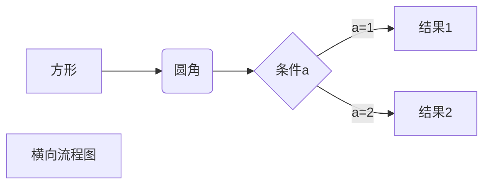
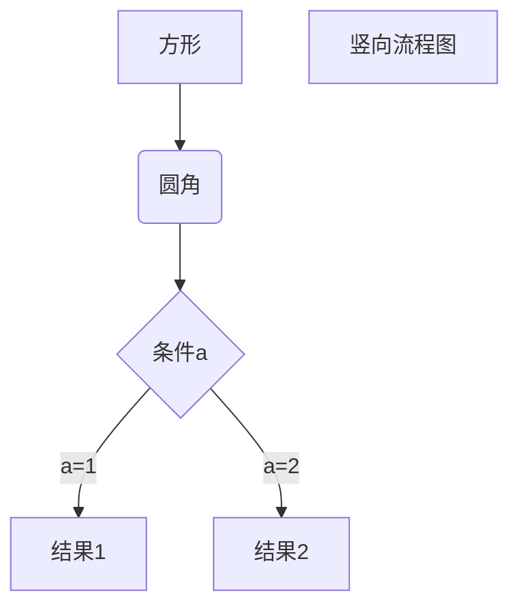
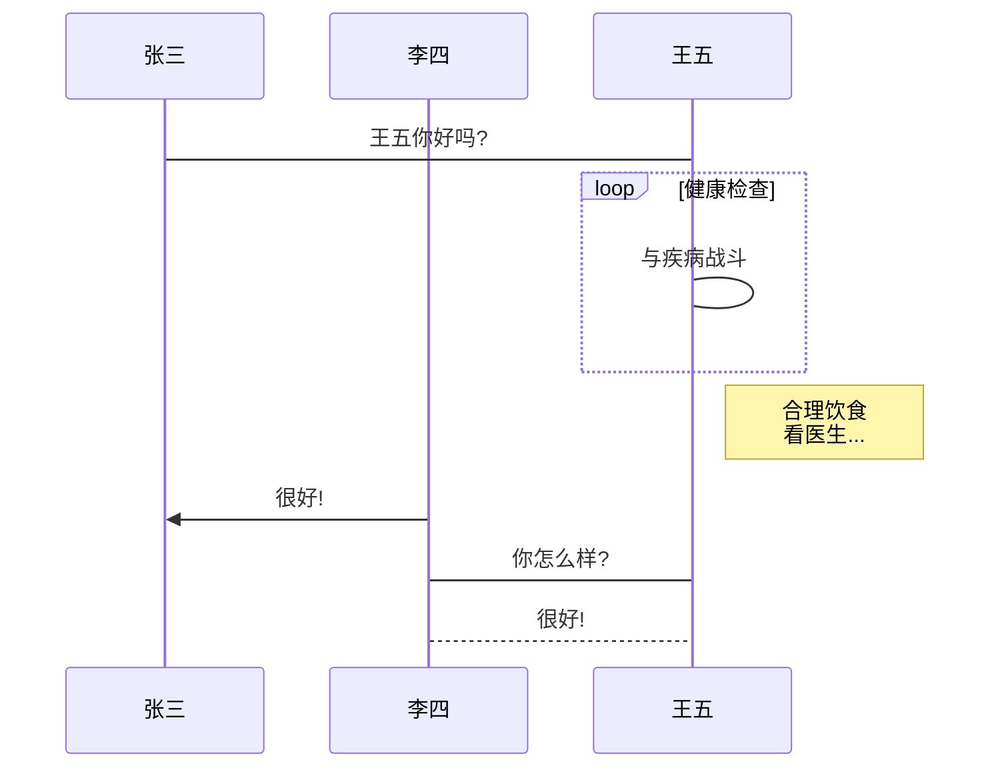
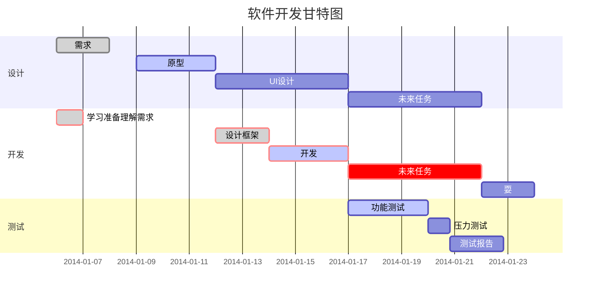

# markdown 介绍
> Markdown 是一种轻量级标记语言，它允许人们“使用易读易写的纯文本格式编写文档，然后转换成有效的XHTML(或者HTML)文档”。 - **wikipedia**

- [Daring Fireball: Markdown](http://daringfireball.net/projects/markdown/) Project markdown
- [Markdown wikipedia 介绍](https://zh.wikipedia.org/wiki/Markdown)
- [MultiMarkdown](http://fletcherpenney.net/multimarkdown/) 引入更多标记特性和输出选项的改进版Markdown

<!-- more -->

# why markdown

- 纯文本，兼容性极强，可以用任意文本编辑器打开.
- 语法简单（the syntax is so simple you can barely call it “syntax.”），零学习成本，极好的可读性，让你专注于文字写作而不是页面排版，并且兼容 HTML，simple but powerful .
- 格式转换方便，Markdown 的文本你可以轻松转换为 html、pdf、epub、电子书等。
- 适合团队协作，可以使用 git/svn 等进行版本控制管理。
- [阳志平：为什么 Markdown 成为科技界写作主流？](http://www.yangzhiping.com/tech/r-markdown-knitr.html)
- [图灵社区：用Markdown来写自由书籍-开源技术的方案](http://www.ituring.com.cn/article/828?q=markdown)

目前很多在线服务商均支持使用markdown编写：

- [Github](https://github.com) 最先支持，使用Markdown的一个分支版本来格式化评论、消息以及其它内容。
- [Stack Overflow](http://stackoverflow.com/) 使用一种 Markdown 的分支作为它的文章格式化系统。
- [博客园](http://www.cnblogs.com/) 国内技术人的博客家园，每天活跃上万用户，高质量社区。
- [CSDN](http://www.csdn.net/) 号称全球最大中文IT社区，涵盖了多种语言、架构、博客、俱乐部等模块的技术论坛。
- [图灵社区](http://www.ituring.com.cn/) 使用markdown语法供用户写作电子书.
- [简书](http://www.jianshu.com/) 重拾文字的力量，交流故事，沟通想法，一个基于内容分享的社区。
- [为知笔记](http://www.wiz.cn/) 国内顶尖笔记软件，支持使用Markdown语法编辑笔记。
- [有道云笔记](http://note.youdao.com/noteintro.html) 最新版本开始支持，并且支持一些扩展语法。
- ……

# markdown 使用

- [Markdown: Basics （快速入门）](http://wowubuntu.com/markdown/basic.html)
- [Markdown 完整语法说明 (简体中文版)](http://wowubuntu.com/markdown/)
- [Github: Mastering Markdown](https://guides.github.com/features/mastering-markdown/) GitHub 帮助中关于 Markdown 的语法帮助
- [MarkDown 语法团队规范](https://github.com/hzlzh/1MarkDown) 语法规范简洁版
- [Markdown Style Guide](http://www.cirosantilli.com/markdown-style-guide/) 语法规范复杂版
- [Markdown Cheatsheet](https://github.com/adam-p/markdown-here/wiki/Markdown-Cheatsheet)
- [GitHub Flavored Markdown](https://help.github.com/articles/github-flavored-markdown/) GitHub 使用的 Markdown 语法，略微不同于标准 Markdown 语法。提供了一些更加简洁的语法，类似 URL autolinking, Strikethrough, Fenced code blocks, Syntax highlighting 等等
- [MultiMarkdown 介绍](http://fletcherpenney.net/multimarkdown/) 对 markdown 进行的扩展功能

# markdown 工具

- [马克飞象](https://maxiang.info/) web/chrome 离线客户端，markdown 全功能支持，最大特点内容能够同步到印象笔记（evernote）中，笔记的用户重度推荐，按年收费，目前作者 [@weibo](http://weibo.com/u/2788354117) 正在开发跨平台的客户端。
- [StackEdit](https://stackedit.io/) 在线 markdown 编辑器，可同步文档到Google Drive和 Dropbox，可发布文章到 Blogger，GitHub，Google Drive，Dropbox，Tumblr和WordPress。
- [cmd 作业部落](https://www.zybuluo.com/mdeditor) 支持 win/mac/linux/web/chrome 全平台，支持实时同步预览，支持代码高亮、数学公式，区分写作和阅读模式，支持在线存储，分享文稿网址。
- [MacDown](http://macdown.uranusjr.com/) OSX 上的 Markdown 开源编辑器，支持代码高亮，实时预览等。
- [MarkdownPad](http://www.markdownpad.com/) Windows上的全功能Markdown编辑器，推荐win上使用，基本全部功能。
- [Marked2](http://marked2app.com/) 多种 md 显示方案，不能够编辑文件，只用来展示文件，配合 [subline text markdown edit](https://packagecontrol.io/packages/MarkdownEditing) 插件，完美使用；
- [MWeb](http://zh.mweb.im/) 专业的 Markdown 写作、记笔记、静态博客生成软件，由国内独立开发者[@oulvhai](http://weibo.com/oulvhai)开发，支持Toc、Table、代码高亮、支持发布到 Wordrpess 博客、支持 Metaweblog API 的博客服务、Wordpress.com、Evernote 和印象笔记、Blogger、Scriptogr.am、Tumblr等服务。
- [Haroopad](http://pad.haroopress.com/user.html) 又一款简洁多功能的跨平台编辑器，全功能支持，再加上对社交网络友好的连接，多种主题等，感兴趣的可以看看。详情参考[issue#1](https://github.com/xirong/my-markdown/issues/1)
- [Typora](http://www.typora.io/) 不分栏，实时展示看到写出的内容，对于不喜欢「两栏」设计的人来说是一个选择
- [MarkEditor - ME](http://markeditor.com/app/markeditor) MarkEditor以markdown为基础语法，多标签栏、文件夹结构，纯文本的方式带来优雅、高效的体验。 确实很棒的工具，带来很多新鲜的理念，支持、重构、提升 markdown，加快写作的体验。具体可以查看几篇评测文章：
    - [简洁与强大，从不是矛盾的事物：写作工具 MarkEditor 功能详解](http://sspai.com/34317)
    - [不止是一款简单的码字工具：MarkEditor 进阶功能介绍](http://sspai.com/34656)
- [码字必备：18 款优秀的 Markdown 写作工具 | 2015 年度盘点](http://sspai.com/32483) 喜欢哪一款，就看你的了。
- 这几款就够了，多了就有选择症 ……

# markdown流程图

## 1.1 流程图

### 1.1 横向流程图源码格式:




### 1.2 竖向流程图源码格式:




### 1.3 标准流程图源码格式:


```flow
st=>start: 开始框
op=>operation: 处理框
cond=>condition: 判断框
sub1=>subroutine: 子流程
io=>inputoutput: 输入输出框
e=>end: 结束框
st->op->cond
cond(yes)->io->e
cond(no)->sub1(right)->op
```

### 1.4 标准流程图源码格式(横向):


```flow
st=>start: 开始框
op=>operation: 处理框
cond=>condition: 判断框(是或否?)
sub1=>subroutine: 子流程
io=>inputoutput: 输入输出框
e=>end: 结束框
st(right)->op(right)->cond
cond(yes)->io(bottom)->e
cond(no)->sub1(right)->op
```

## 1.2 UML时序图

### 1.2.1 UML时序图源码样例:


```sequence
对象A->对象B: 对象B你好吗? (请求)
Note right of 对象B: 对象B的描述
Note left of 对象A: 对象A的描述(提示)
对象B --> 对象A: 我很好(响应)
对象A --> 对象B: 你真的好吗?
```

### 1.2.2 UML时序图源码复杂样例:

```sequence
Title: 标题: 复杂使用
对象A -> 对象B: 对象B你好吗? (请求)
Note right of 对象B: 对象B的描述
Note right of 对象A: 对象A的描述(提示)
对象B --> 对象A: 我很好(响应)
对象B --> 小三: 你好吗?
小三 -> 对象A: 对象B找我了
对象A --> 对象B: 你真的好吗?
Note over 小三, 对象B: 我们是朋友
participant C
Note right of C: 没人陪我玩
```

### 1.2.3 UML标准时序图样例:




## 1.3 甘特图样例:




# 数学公式

## 矩阵方程

$$
\begin{matrix}
    1 & x & x^2 \\
    1 & y & y^2 \\
    1 & z & z^2 \\
    \end{matrix}
$$

# reference 参考

- [Why Markdown? A two-minute explanation](http://brettterpstra.com/2011/08/31/why-markdown-a-two-minute-explanation/)
- [简书：献给写作者的 Markdown 新手指南](http://www.jianshu.com/p/q81RER)
- [Markdown simple world](https://wizardforcel.gitbooks.io/markdown-simple-world/content/0.html)
- [MathJax语法规则](https://math.meta.stackexchange.com/questions/5020/mathjax-basic-tutorial-and-quick-reference/5044 MathJax basic tutorial and quick reference)
- [Mermaid语法规则](https://www.jianshu.com/p/7ddbb7dc8fec)
- [Mermaid官方教程](https://mermaidjs.github.io/demos.html)
- [Mermaid Github仓库](https://github.com/webappdevelp/hexo-filter-mermaid-diagrams)
- [MathJax Github仓库](https://github.com/mathjax/MathJax
