# 相关文档

[官方文档](https://mermaidjs.github.io/)

[Github地址](https://github.com/knsv/mermaid)

语句末尾分号是可选的。`%%` 行注释。


# 流程图
## 语法说明

### 图表方向
Mermaid 支持多种图表的方向，语法如下：

```js
graph 方向描述
    图表中的其他语句...
```

其中“方向描述”为

| 用词 | 含义     |
| ---- | -------- |
| TB   | 从上到下 |
| BT   | 从下到上 |
| RL   | 从右到左 |
| LR   | 从左到右 |

### 节点定义
即流程图中每个文本块，包括开始、结束、处理、判断等。Mermaid 中每个节点都有一个 id，以及节点的文字。

| 表述         | 说明           |
| ------------ | -------------- |
| `id[文字]`   | 矩形节点       |
| `id(文字)`   | 圆角矩形节点   |
| `id((文字))` | 圆形节点       |
| `id>文字]`   | 右向旗帜状节点 |
| `id{文字}`   | 菱形节点       |

需要注意的是，如果节点的文字中包含标点符号，需要时用双引号包裹起来。
另外如果希望在文字中使用换行，请使用
替换换行

### 节点间的连线

| 表述       | 说明           |
| ---------- | -------------- |
| `>`        | 添加尾部箭头   |
| `-`        | 不添加尾部箭头 |
| `--`       | 单线           |
| `--text--` | 单线上加文字   |
| `==`       | 粗线           |
| `==text==` | 粗线加文字     |
| `-.-`      | 虚线           |
| `-.text.-` | 虚线加文字     |

### 子图表

使用以下语法添加子图表

```js
subgraph 子图表名称
    子图表中的描述语句...
end123
```

### 对 font awesome 的支持

使用 `fa: #图表名称#` 的语法添加 fontawesome。

```javascript
graph TD;
    A-->B;
    A-->C;
    B-->D;
    C-->D;
```

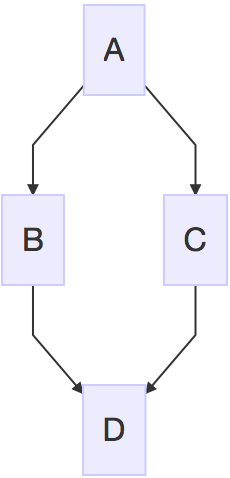

## 方向

- TB/TD - top bottom
- BT - bottom top
- RL - right left
- LR - left right

```javascript
graph TB
    Start --> Stop
```


## 节点

```javascript
graph LR
    id
```


```javascript
graph LR
    id[带文字节点]
```

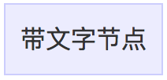

```javascript
graph LR
    id(圆角节点)
```


```javascript
graph LR
    id((圆形节点))
```


```javascript
graph LR
    id>不对称节点]
```

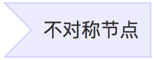

```javascript
graph LR
    id{菱形节点}
```


## 连接线

### 实线，箭头，无文字

```javascript
graph LR
    A-->B
```

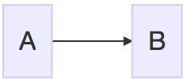

### 实线，无箭头，无文字

```javascript
graph LR
    A---B
```


### 实线，无箭头，文字

前面**两个** `-`，后面**三个** `-`

```javascript
graph LR
    A-- 文字 ---B
```

或

```javascript
graph LR
    A--- |文字| B
```


### 实线，箭头，文字

```javascript
graph LR
    A-- 文字 -->B
```

或

```javascript
graph LR
    A--> |文字| B
```


### 虚线，箭头，无文字

```javascript
graph LR;
   A-.->B;
```


### 虚线，箭头，文字

```javascript
graph LR
   A-. text .-> B
```


### 大箭头，无文字

```javascript
graph LR
   A ==> B
```

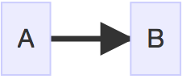

### 大箭头，文字

```javascript
graph LR
   A == text ==> B
```

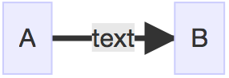

## 特殊语法

### 引号

文字里用引号避免一些特殊字符的错误。比如矩形节点里有 `()` 时就无法渲染，所以加上引号。

```javascript
graph LR
    id1["This is the (text) in the box"]
```

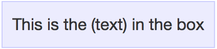

### 实体字符

可以使用 HTML 中的实体字符。

```javascript
graph LR
     A["A double quote:#quot;"] -->B["A dec char:#9829;"]
```


## 子图

```javascript
graph TB
    c1-->a2
    subgraph one
    a1-->a2
    end
    subgraph two
    b1-->b2
    end
    subgraph three
    c1-->c2
    end
```

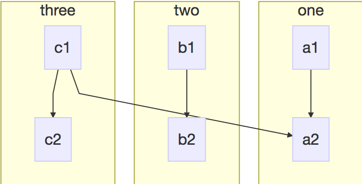

## 样式

linkStyle 后面的数字表示第几根线，从 0 开始。可以指定颜色和粗细。

```javascript
graph TD;
    A-->B;
    A-->C;
    B-->D;
    C-->D;
    linkStyle 0 stroke:#0ff,stroke-width:2px;
    linkStyle 3 stroke:#ff3,stroke-width:4px;
```

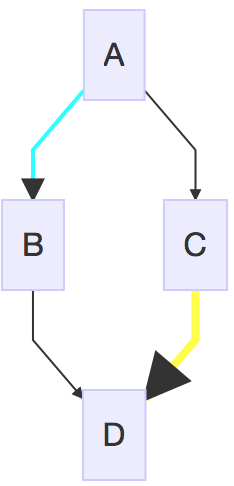

可以设置节点背景，边框颜色，粗细，实线还是虚线

```javascript
graph LR
    id1(Start)-->id2(Stop)
    style id1 fill:#f9f,stroke:#333,stroke-width:4px
    style id2 fill:#ccf,stroke:#f66,stroke-width:2px,stroke-dasharray: 5, 5
```


### 样式类

```javascript
graph LR
    A-->B

    %% 定义样式类
    classDef className fill:#f9f,stroke:#333,stroke-width:4px;

    %% 应用样式类，markdown里没效果
    class A className
```


```javascript
classDef default fill:#f9f,stroke:#333,stroke-width:4px;
```

定义一个名为 `default` 的类，节点没有指定特定样式类时，将都会应用这个样式类。

## 图标

可以使用 [Font Awesome](https://fontawesome.com/) 图标。语法 `fa:icon class name`。

```javascript
graph TD
   B["fa:fa-twitter for peace"]
   B-->C[fa:fa-ban forbidden]
   B-->D(fa:fa-spinner);
   B-->E(A fa:fa-camera-retro perhaps?);
```


# 时序图

```javascript
sequenceDiagram
    participant Alice
    participant Bob
    Alice->John: Hello John, how are you?
    loop Healthcheck
        John->John: Fight against hypochondria
    end
    Note right of John: Rational thoughts <br/>prevail...
    John-->Alice: Great!
    John->Bob: How about you?
    Bob-->John: Jolly good!
```


## 参与者

如果不显示声明，参与者将根据第一次出现的顺序排列，如：

```javascript
sequenceDiagram
    Alice->>John: Hello John, how are you?
    John-->>Alice: Great!
```

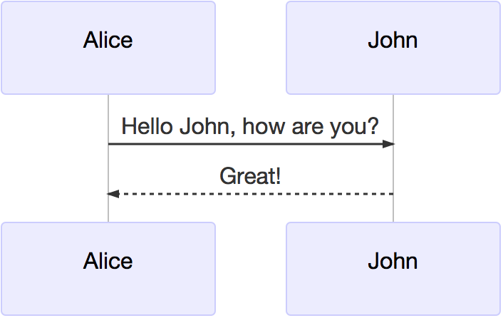

第一条语句出现了两个参与者角色，而在这条语句中，Alice 在 John 之前，所以图中也是这个顺序。如果不想根据第一次出现的顺序来排，可以主动声明以定义顺序：

```javascript
sequenceDiagram
    participant John
    participant Alice
    Alice->>John: Hello John, how are you?
    John-->>Alice: Great!
```

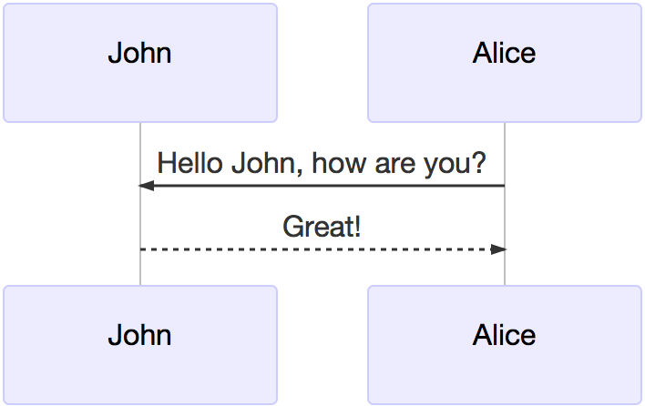

### 别名

可以给角色写一个简短的别名以方便书写。

```javascript
sequenceDiagram
    participant A as Alice
    participant J as John
    A->>J: Hello John, how are you?
    J->>A: Great!
```

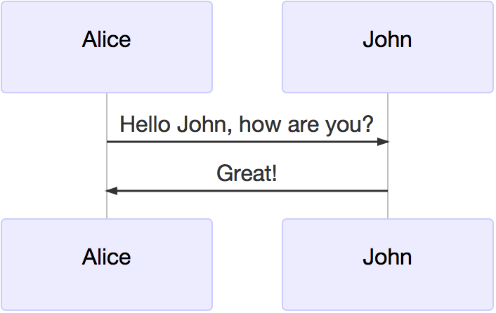

## 消息

消息连线有六种样式。

有**一个**`-`是实线，**两个**`-`是虚线。

```javascript
sequenceDiagram
    A->B: 无箭头实线
    A-->B: 无箭头虚线(点线)
    A->>B: 有箭头实线
    A-->>B: 有箭头实线
    A-x B: 有箭头实线，加上叉
    A--x B: 有箭头虚线，加上叉
```


## 活动期

```javascript
sequenceDiagram
    Alice->>John: Hello John, how are you?
    %% activate 角色名 表示激活控制焦点
    activate John
    John-->>Alice: Great!
    %% deactivate 角色名 表示控制焦点结束
    deactivate John
```

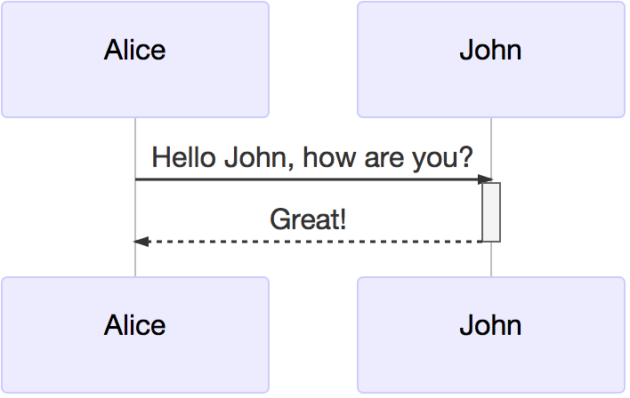

使用 `+/-` 的更方便的写法：

```javascript
sequenceDiagram
    Alice->>+John: Hello John, how are you?
    John-->>-Alice: Great!
```

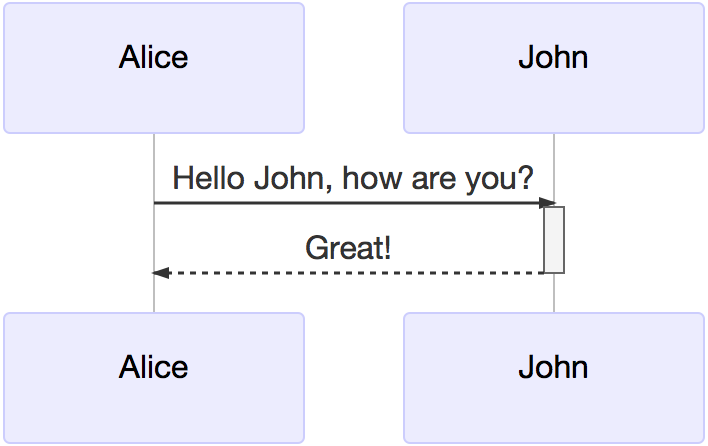

可以嵌套：

```javascript
sequenceDiagram
    Alice->>+John: Hello John, how are you?
    Alice->>+John: John, can you hear me?
    John-->>-Alice: Hi Alice, I can hear you!
    John-->>-Alice: I feel great!
```


## 备注

语法：Note [ right of | left of | over ] [Actor]。

| 表述     | 含义                       |
| -------- | -------------------------- |
| right of | 右侧                       |
| left of  | 左侧                       |
| over     | 在当中，可以横跨多个参与者 |

```javascript
sequenceDiagram
    participant John
    Note right of John: Text in note
```


over 可用于单独一个角色上，也可以用于相邻两个角色间：

```javascript
sequenceDiagram
    Alice->John: Hello John, how are you?
    Note over Alice,John: A typical interaction
```


## 循环

语法：

```javascript
loop Loop text
... statements ...
end
sequenceDiagram
    Alice->John: Hello John, how are you?
    %% loop 后跟循环体说明文字
    loop Every minute
        John-->Alice: Great!
    %% 标记循环结束
    end
```

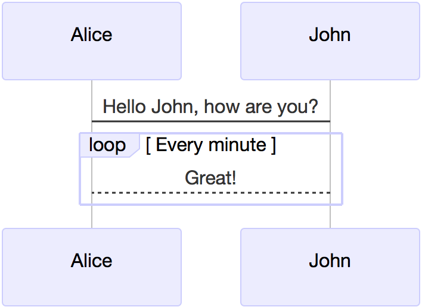

## 选择

语法：

```javascript
alt Describing text
... statements ...
else
... statements ...
end
```

可选条件，比如在没有 else 分支的情况下使用，有点类似 java 中的 switch 的 default 分支，代表剩下所有情况。

```javascript
opt Describing text
... statements ...
end
sequenceDiagram
    Alice->>Bob: Hello Bob, how are you?
    alt is sick
        Bob->>Alice: Not so good :(
    else is well
        Bob->>Alice: Feeling fresh like a daisy
    end
    opt Extra response
        Bob->>Alice: Thanks for asking
    end
```

