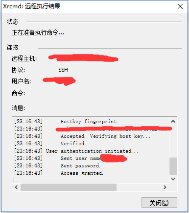
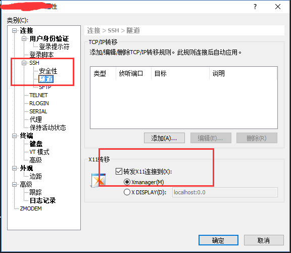

### 安装Xmanager全家桶

使用前检查一下是否安装了Xshell、Xstart、Xmanager - Passive，正常安装Xmanager全家桶应该是全的


### 使用XStart登录

通过SSH的方式尝试登录VPS，


正常成功后会这样提示



当然更多的可能是弹出个错误框提示“已拒绝X11转移申请”，这是因为默认的VPS一般不会安装XAUTH导致，

```shell
sudo yum install xorg-x11-xauth
```

这里可能会缺一些其他组件，见招拆招即可，谷歌或者百度解决

### 设置XSHELL

1. 打开会话对话框
2. 选择要激活X11转发功能的会话
3. 点击[属性]按钮
4. 在[类别]中选择[连接->SSH->隧道]
5. 选择[转发X11连接到]
6. 如用户的PC上已[安装Xmanager](http://www.xshellcn.com/xmg_column/xm-az.html)，请勾选[Xmanager(M)]。如使用其他PC X 服务器，请选择[X DISPLAY(D)]后输入适用的DISPLAY 
7. 点击[确定] 



### 检查当前监听端口

**IMPORTANT**

```shell
sudo netstat -tnlp|grep sshd
```


注意上面监听的6010，Xmanager会把X DISPLAY选项自动查找为[Xshell](http://www.xshellcn.com/)。其他 PC X 服务器程序需由用户进行设置。如果PC X 服务器使用TCP 6000号端口，DISPLAY设置为“localhost:0.0” ，也就是说，X11的**偏移量是6000**，因此下面需要设置一个最终要的DISPLAY的值**:10.0**，如下

```shell
export DISPLAY=:10.0
或者
export DISPLAY=localhost:10.0
```

### 测试X11 DISPLAY

如果本地已经有需要X11界面展示的应用，直接运行查看即可，如无，推荐使用xclock检查是否生效[以下步骤不是必须，自行选择]

```shell
sudo yum install xclock
```

这里可能出现乱码之类的，可能需要安装x窗口相关包，和字体显示包 

```shell
sudo yum groupinstall "X Window System" "Fonts"
```

然后执行xclock，看是否在PC桌面显示对应的时钟图形。如果xclock出现[Warning: Missing charsets in String to FontSet conversion](https://access.redhat.com/solutions/409033)，可以执行下面执行，然后重新执行

```shell
export LC_ALL=C
```

