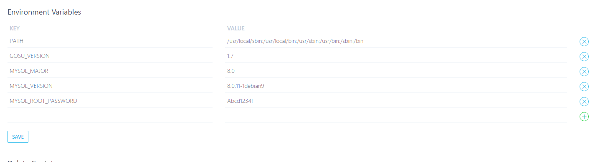

### 进入shell环境

```
docker ps
docker exec -it <container> bash
```

and run

```
apt-get update
apt-get install vim
```

### ！不要去改系统配置

正常运行的docker先保存一下docker的ID，之后不要去改下面的配置，否则docker会更新为新的那个，导致数据丢失



