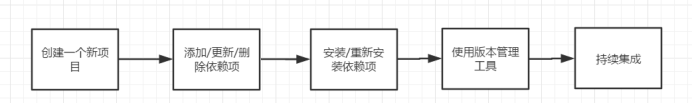

# Electron概述


1. [GitHub](https://github.com/electron/electron) 官网不翻墙太卡，本着能偷懒就偷懒，GayHub就够了，不用翻官网了
2. [中文文档](https://github.com/electron/i18n/tree/master/content/zh-CN)
3. [W3C教程](https://www.w3cschool.cn/electronmanual/wcx31ql6.html)

# VUE概述


1. [GitHub](https://github.com/vuejs/vue)
2. [VUE官网](https://cn.vuejs.org/) 官网资料齐全，中英文档都齐备，基本看完够搞个工程了

# Electron + Vue 联合使用

## 安装Nodejs

安装成功之后`node -v`，会显示版本，版本可以不用这么新，看心情安装。

```css
$ node -v
v12.14.0
```

## 搭建Vue开发环境

直接使用脚手架工具vue-cli，因为在国内的npm非常慢，所以需要重新设置npm镜像，设置为淘宝的镜像

```bash
npm config set registry https://registry.npm.taobao.org/
```

我们可以看一下镜像地址是：

```bash
vue npm config get registry  
https://registry.npm.taobao.org/
```

如果不想修改默认npm地址，也可以[设置cnpm](https://npm.taobao.org/)(因为自带翻墙光环，考虑到后面可能不方便翻墙，后面全程优先使用墙内网络操作。)

```bash
npm install -g cnpm --registry=https://registry.npm.taobao.org
//输入命令,查看是否安装成功
cnpm 
```

安装脚手架工具：

```bash
npm install --global vue-cli
```

安装web-pack：

```bash
npm install -g webpack
```

yarn 使用国内镜像

```bash
yarn config set registry https://registry.npm.taobao.org
yarn config list
```

### npm更新package.json

将package.json中的依赖更新为最新版

安装

```bash
npm install -g npm-check-updates
```


显示当前目录下项目中所有新的依赖包

```
ncu
```


更新项目package文件

```
ncu -u
```

[npm-check-updates更多参数](https://www.npmjs.com/package/npm-check-updates)

### 什么是Yarn和NPM?

**Yarn:Yet Another Resource Negotiator，是一个快速、可靠、安全的依赖管理工具，一款新的JavaScript包管理工具。**

Yarn工作流：

 

Yarn使用方法：[https://yarn.bootcss.com/docs/usage](https://yarn.bootcss.com/docs/usage/)/

Yarn使用方法-如图：


 

Yarn是什么：https://yarn.bootcss.com

Npm是什么 :https://www.npmjs.cn/

### yarn和npm命令对比

#### 一、命令对比

|                yarn                 |                     npm                     | 命令功能                                |
| :---------------------------------: | :-----------------------------------------: | :-------------------------------------- |
|         **`yarn install`**          |              **`npm install`**              | **根据`pack.json`安装项目所需的依赖包** |
|      **`yarn install --flat`**      |                  **`--`**                   | **注释1**                               |
|  **`yarn install --no-lockfile`**   |     **`npm install --no-package-lock`**     | **不读取或生成`yarn.lock`锁文件**       |
| **`yarn install --pure-lockfile`**  |                  **`--`**                   | **不要生成`yarn.lock`锁文件**           |
|      **`yarn add [package]`**       |         **`npm install [package]`**         | **安装需要的依赖包**                    |
|   **`yarn add [package] --dev`**    |   **`npm install [package] --save-dev`**    | **注释2**                               |
|    **`yarn add [package] --D`**     |   **`npm install [package] --save-dev`**    | **同上**                                |
|   **`yarn add [package] --peer`**   |                  **`--`**                   | **注释3**                               |
|    **`yarn add [package] --P`**     |                  **`--`**                   | **同上**                                |
| **`yarn add [package] --optional`** | **`npm install [package] --save-optional`** | **注释4**                               |
|    **`yarn add [package] --O`**     | **`npm install [package] --save-optional`** | **同上**                                |
|  **`yarn add [package] --exact`**   |  **`npm install [package] --save-exact`**   | **注释5**                               |
|    **`yarn add [package] --E`**     |  **`npm install [package] --save-exact`**   | **同上**                                |
|   **`yarn global add [package]`**   |    **`npm install [package] --global`**     | **全局安装依赖包**                      |
|      **`yarn global upgrade`**      |          **`npm update --global`**          | **全局更新依赖包**                      |
|       **`yarn add --force`**        |              **`npm rebuild`**              | **更改包内容后进行重建**                |
|     **`yarn remove [package]`**     |        **`npm uninstall [package]`**        | **卸载已经安装的依赖包**                |
|  **`yarn cache clean [package]`**   |            **`npm cache clean`**            | **注释6**                               |
|         **`yarn upgrade`**          |  **`rm -rf node_modules && npm install`**   | **更新依赖包**                          |
|     **`yarn version --major`**      |           **`npm version major`**           | **更新依赖包的版本**                    |
|     **`yarn version --minor`**      |           **`npm version minor`**           | **更新依赖包的版本**                    |
|     **`yarn version --patch`**      |           **`npm version patch`**           | **更新依赖包的版本**                    |

#### 二、命令注释

- **注释1** ：安装所有依赖项，但每个依赖项只允许一个版本。在第一次运行时，这将提示你为多版本的依赖包选择一个版本，进行安装。这些将添加到您package.json的 resolutions字段下。


```json
"resolutions": {
  "package-a": "2.0.0",
  "package-b": "5.0.0",
  "package-c": "1.5.2"
}
```

- **注释2** ：安装所需的依赖包，并将该包的记录写到`package.json`文件的 **devDependencies** 选项中。


```json
"devDependencies": {
    "autoprefixer": "^7.1.2",
    "babel-core": "^6.22.1",
    "babel-helper-vue-jsx-merge-props": "^2.0.3",
    "babel-loader": "^7.1.1",
    "babel-plugin-syntax-jsx": "^6.18.0",
}
```

- **注释3** ：安装所需的依赖包，并将该包的记录写到`package.json`文件的 **peerDependencies** 选项中。
- **注释4** ：安装所需的依赖包，并将该包的记录写到`package.json`文件的 **optionalDependencies** 选项中。
- **注释5** ：安装依赖包的确切版本，默认设置是使用依赖包的最新版本。例如， `yarn add foo@1.2.3`将接受版本1.9.1，但 `yarn add foo@1.2.3 --exact` 只接受版本1.2.3。
- **注释6** ：运行此命令将清除全局缓存依赖包。当再次yarn或yarn install运行，进行下载依赖包

## 安装Electron

```bash
 cnpm install -g electron
```

验证

```bash
>electron -v

 v7.1.10
```

## 搭建electron-vue项目

simulatedgreg/electron-vue用的vue-cli2，***不建议再使用***，如果vue-cli用的3或者4，建议直接跳到下面的章节

### 相关文档

- [electron-vue](https://simulatedgreg.gitbooks.io/electron-vue/content/cn/)文档

### 使用electron-vue脚手架工具初始化项目

可能会比较慢，可以通过webpack方式初始化vue项目，然后在引入electron方式，这个会快很多

```bash
$ vue init simulatedgreg/electron-vue alistar

? Application Name alistar
? Application Id org.evue.alistar
? Application Version 0.0.1
? Project description 哞利斯塔, 快乐辅助
? Use Sass / Scss? Yes
? Select which Vue plugins to install axios, vue-electron, vue-router, vuex, vuex-electron
? Use linting with ESLint? Yes
? Which ESLint config would you like to use? Standard
? Set up unit testing with Karma + Mocha? Yes
? Set up end-to-end testing with Spectron + Mocha? Yes
? What build tool would you like to use? builder
? author vincentruan <rzw0813@gmail.com>

   vue-cli · Generated "alistar".

---

All set. Welcome to your new electron-vue project!

Make sure to check out the documentation for this boilerplate at
https://simulatedgreg.gitbooks.io/electron-vue/content/.

Next Steps:

  $ cd alistar
  $ yarn (or `npm install`)
  $ yarn run dev (or `npm run dev`)

```

上面已经有提示下一步做什么了，`cd alistar`目录下，之后对照执行，如果用yarn记得设置代理或者用国内镜像。

```bash
$ cnpm install
| [22/67] Installing get-stdin@^4.0.1platform unsupported babel-loader@7.1.5 › webpack@4.41.5 › watchpack@1.6.0 › chokidar@2.1.8 › fsevents@^1.2.7 Package require os(darwin) not compatible with your platform(win32)
[fsevents@^1.2.7] optional install error: Package require os(darwin) not compatible with your platform(win32)
√ Installed 67 packages
√ Linked 1218 latest versions
[1/7] scripts.postinstall babel-core@6.26.3 › babel-register@6.26.0 › core-js@^2.5.0 run "node -e \"try{require('./postinstall')}catch(e){}\"", root: "D:\\gitspace\\alistar\\node_modules\\_core-js@2.6.11@core-js"
Thank you for using core-js ( https://github.com/zloirock/core-js ) for polyfilling JavaScript standard library!

The project needs your help! Please consider supporting of core-js on Open Collective or Patreon:
> https://opencollective.com/core-js
> https://www.patreon.com/zloirock

Also, the author of core-js ( https://github.com/zloirock ) is looking for a good job -)

[1/7] scripts.postinstall babel-core@6.26.3 › babel-register@6.26.0 › core-js@^2.5.0 finished in 2s
[2/7] scripts.postinstall electron-builder@20.44.4 › app-builder-lib@20.44.4 › ejs@^2.6.2 run "node ./postinstall.js", root: "D:\\gitspace\\alistar\\node_modules\\_ejs@2.7.4@ejs"
Thank you for installing EJS: built with the Jake JavaScript build tool (https://jakejs.com/)

[2/7] scripts.postinstall electron-builder@20.44.4 › app-builder-lib@20.44.4 › ejs@^2.6.2 finished in 2s
[3/7] scripts.postinstall electron@^2.0.4 run "node install.js", root: "D:\\gitspace\\alistar\\node_modules\\_electron@2.0.18@electron"
Downloading SHASUMS256.txt
[============================================>] 100.0% of 5.39 kB (5.39 kB/s)
[3/7] scripts.postinstall electron@^2.0.4 finished in 17s
[4/7] scripts.install spectron@3.8.0 › electron-chromedriver@~1.8.0 run "node ./download-chromedriver.js", root: "D:\\gitspace\\alistar\\node_modules\\_electron-chromedriver@1.8.0@electron-chromedriver"
Downloading tmp-2644-1-SHASUMS256.txt-1.8.0
[============================================>] 100.0% of 8.02 kB (8.02 kB/s)
successfully dowloaded and extracted!
[4/7] scripts.install spectron@3.8.0 › electron-chromedriver@~1.8.0 finished in 5s
[5/7] scripts.install karma@2.0.5 › socket.io@2.0.4 › engine.io@3.1.5 › uws@~9.14.0 run "node-gyp rebuild > build_log.txt 2>&1 || exit 0", root: "D:\\gitspace\\alistar\\node_modules\\_uws@9.14.0@uws"
[5/7] scripts.install karma@2.0.5 › socket.io@2.0.4 › engine.io@3.1.5 › uws@~9.14.0 finished in 3s
[6/7] scripts.install node-sass@^4.9.2 run "node scripts/install.js", root: "D:\\gitspace\\alistar\\node_modules\\_node-sass@4.13.1@node-sass"
Downloading binary from https://cdn.npm.taobao.org/dist/node-sass/v4.13.1/win32-x64-72_binding.node
Download complete
Binary saved to D:\gitspace\alistar\node_modules\_node-sass@4.13.1@node-sass\vendor\win32-x64-72\binding.node
Caching binary to C:\Users\vincentruan\.npminstall_tarball\node-sass\4.13.1\win32-x64-72_binding.node
[6/7] scripts.install node-sass@^4.9.2 finished in 4s
[6/7] scripts.postinstall node-sass@^4.9.2 run "node scripts/build.js", root: "D:\\gitspace\\alistar\\node_modules\\_node-sass@4.13.1@node-sass"
Binary found at D:\gitspace\alistar\node_modules\_node-sass@4.13.1@node-sass\vendor\win32-x64-72\binding.node
Testing binary
Binary is fine
[6/7] scripts.postinstall node-sass@^4.9.2 finished in 2s
[7/7] scripts.postinstall alistar@0.0.1 run "npm run lint:fix", root: "D:\\gitspace\\alistar"

> alistar@0.0.1 lint:fix D:\gitspace\alistar
> eslint --ext .js,.vue -f ./node_modules/eslint-friendly-formatter --fix src test

[7/7] scripts.postinstall alistar@0.0.1 finished in 11s
√ Run 7 scripts
peerDependencies link ajv@5.5.2 in D:\gitspace\alistar\node_modules\_ajv-keywords@2.1.1@ajv-keywords unmet with D:\gitspace\alistar\node_modules\ajv(6.11.0)
peerDependencies WARNING karma-webpack@^3.0.0 requires a peer of webpack@^2.0.0 || ^3.0.0 but webpack@4.41.5 was installed
deprecate css-loader@0.28.11 › cssnano@3.10.0 › autoprefixer@6.7.7 › browserslist@^1.7.6 Browserslist 2 could fail on reading Browserslist >3.0 config used in other tools.
deprecate babel-core@6.26.3 › babel-register@6.26.0 › core-js@^2.5.0 core-js@<3 is no longer maintained and not recommended for usage due to the number of issues. Please, upgrade your dependencies to the actual version of core-js@3.
deprecate eslint@4.19.1 › file-entry-cache@2.0.0 › flat-cache@1.3.4 › circular-json@^0.3.1 CircularJSON is in maintenance only, flatted is its successor.
deprecate karma-coverage@1.1.2 › istanbul@^0.4.0 This module is no longer maintained, try this instead:
  npm i nyc
Visit https://istanbul.js.org/integrations for other alternatives.
deprecate karma@2.0.5 › log4js@2.11.0 › circular-json@^0.5.4 CircularJSON is in maintenance only, flatted is its successor.
deprecate karma@2.0.5 › log4js@2.11.0 › nodemailer@^2.5.0 All versions below 4.0.1 of Nodemailer are deprecated. See https://nodemailer.com/status/
deprecate karma@2.0.5 › log4js@2.11.0 › nodemailer@2.7.2 › socks@1.1.9 If using 2.x branch, please upgrade to at least 2.1.6 to avoid a serious bug with socket data flow and an import issue introduced in 2.1.0
deprecate karma@2.0.5 › log4js@2.11.0 › nodemailer@2.7.2 › mailcomposer@4.0.1 This project is unmaintained
deprecate karma@2.0.5 › log4js@2.11.0 › loggly@1.1.1 › request@2.75.0 › node-uuid@~1.4.7 Use uuid module instead
deprecate karma@2.0.5 › log4js@2.11.0 › loggly@1.1.1 › request@2.75.0 › hawk@~3.1.3 This module moved to @hapi/hawk. Please make sure to switch over as this distribution is no longer supported and may contain bugs and critical security issues.
deprecate karma@2.0.5 › log4js@2.11.0 › nodemailer@2.7.2 › mailcomposer@4.0.1 › buildmail@4.0.1 This project is unmaintained
deprecate karma@2.0.5 › log4js@2.11.0 › loggly@1.1.1 › request@2.75.0 › hawk@3.1.3 › cryptiles@2.x.x This version has been deprecated in accordance with the hapi support policy (hapi.im/support). Please upgrade to the latest version to get the best features, bug fixes, and security patches. If you are unable to upgrade at this time, paid support is available for older versions (hapi.im/commercial).
deprecate karma@2.0.5 › log4js@2.11.0 › loggly@1.1.1 › request@2.75.0 › hawk@3.1.3 › sntp@1.x.x This module moved to @hapi/sntp. Please make sure to switch over as this distribution is no longer supported and may contain bugs and critical security issues.
deprecate karma@2.0.5 › log4js@2.11.0 › loggly@1.1.1 › request@2.75.0 › hawk@3.1.3 › hoek@2.x.x This version has been deprecated in accordance with the hapi support policy (hapi.im/support). Please upgrade to the latest version to get the best features, bug fixes, and security patches. If you are unable to upgrade at this time, paid support is available for older versions (hapi.im/commercial).
deprecate karma@2.0.5 › log4js@2.11.0 › loggly@1.1.1 › request@2.75.0 › hawk@3.1.3 › boom@2.x.x This version has been deprecated in accordance with the hapi support policy (hapi.im/support). Please upgrade to the latest version to get the best features, bug fixes, and security patches. If you are unable to upgrade at this time, paid support is available for older versions (hapi.im/commercial).
deprecate spectron@3.8.0 › webdriverio@^4.8.0 outdated version, please use @next
deprecate karma@2.0.5 › socket.io@2.0.4 › engine.io@3.1.5 › uws@~9.14.0 New code is available at github.com/uNetworking/uWebSockets.js
Recently updated (since 2020-01-23): 10 packages (detail see file D:\gitspace\alistar\node_modules\.recently_updates.txt)
  Today:
    → babel-preset-env@1.7.0 › browserslist@3.2.8 › electron-to-chromium@^1.3.47(1.3.342) (09:02:31)
    → webpack-dev-server@3.10.1 › del@4.1.1 › @types/glob@7.1.1 › @types/node@*(13.5.2) (05:51:42)
√ All packages installed (1560 packages installed from npm registry, used 1m(network 27s), speed 2.23MB/s, json 1285(3.12MB), tarball 58.05MB)
```

编译完成后`run dev`，

```bash
$ cnpm run dev
```


### 问题收集与处理

**修复问题前先将项目初始化提交github**

#### 问题一：ERROR in Template execution failed: ReferenceError: process is not defined

高版本的node，大于12的版本时候。使用electron-vue项目时候会报错！Webpack ReferenceError: process is not defined!

```bash
ReferenceError: process is not defined
  
  - index.ejs:11 eval
    [.]/[_html-webpack-plugin@3.2.0@html-webpack-plugin]/lib/loader.js!./src/index.ejs:11:2
  
  - index.ejs:16 module.exports
    [.]/[_html-webpack-plugin@3.2.0@html-webpack-plugin]/lib/loader.js!./src/index.ejs:16:3
  
  - index.js:284 
    [alistar]/[_html-webpack-plugin@3.2.0@html-webpack-plugin]/index.js:284:18
  
  - runMicrotasks
  
  - task_queues.js:93 processTicksAndRejections
    internal/process/task_queues.js:93:5
```

修改 .electron-vue/webpack.renderer.config.js 和  .electron-vue/webpack.web.config.js如下

webpack.renderer.config.js：L125

```js
new HtmlWebpackPlugin({
  filename: 'index.html',
  template: path.resolve(__dirname, '../src/index.ejs'),
  minify: {
    collapseWhitespace: true,
    removeAttributeQuotes: true,
    removeComments: true
  },
  templateParameters(compilation, assets, options) {
    return {
      compilation: compilation,
      webpack: compilation.getStats().toJson(),
      webpackConfig: compilation.options,
      htmlWebpackPlugin: {
        files: assets,
        options: options
      },
      process,
    };
  },
  nodeModules: process.env.NODE_ENV !== 'production'
    ? path.resolve(__dirname, '../node_modules')
    : false
}),
```
webpack.web.config.js: L97

```js
new HtmlWebpackPlugin({
  filename: 'index.html',
  template: path.resolve(__dirname, '../src/index.ejs'),
  templateParameters(compilation, assets, options) {
    return {
      compilation: compilation,
      webpack: compilation.getStats().toJson(),
      webpackConfig: compilation.options,
      htmlWebpackPlugin: {
        files: assets,
        options: options
      },
      process,
    };
  },
  minify: {
    collapseWhitespace: true,
    removeAttributeQuotes: true,
    removeComments: true
  },
  nodeModules: false
}),
```
重新执行`run dev`

#### 问题二： Unable to install `vue-devtools`

electron-devtools-installer无法安装远程的vue-devtool，采用手动安装方式。

从本地浏览器已安装的插件中拷贝到项目路径，在项目目录下创建文件夹`devTools\vue-devtools`，拷贝

C:\Users\${userName}\AppData\Local\Google\Chrome\User Data\Default\Extensions\nhdogjmejiglipccpnnnanhbledajbpd\5.1.1_0文件夹内容`devTools\vue-devtools`下，

修改src/main/index.dev.js

```js
/**
 * This file is used specifically and only for development. It installs
 * `electron-debug` & `vue-devtools`. There shouldn't be any need to
 *  modify this file, but it can be used to extend your development
 *  environment.
 */

/* eslint-disable */

// Install `electron-debug` with `devtron`
require('electron-debug')({ showDevTools: true })

// 新增变量定义
import { BrowserWindow } from 'electron';
import path from 'path';

// Install `vue-devtools`
require('electron').app.on('ready', () => {
  // 注释掉的这部分是 Electron-Vue 中预装devtool的代码，没有用
  // let installExtension = require('electron-devtools-installer')
  // installExtension.default(installExtension.VUEJS_DEVTOOLS)
  //   .then(() => {})
  //   .catch(err => {
  //     console.log('Unable to install `vue-devtools`: \n', err)
  //   })
  
  // 安装vue-devtools
  BrowserWindow.addDevToolsExtension(path.resolve(__dirname, '../../devTools/vue-devtools'));
})

// Require `main` process to boot app
require('./index')
```

应用自动重启，注意首次启动vue插件被>>这个隐藏了，需要手动拖动一下


#### 问题三：ERROR in  Error: .\node_modules\html-webpack-plugin\node_modules\clean-css\index.js:1 SyntaxError: Invalid or unexpected token

找到这个文件发现下载的是一串ASII乱码，尝试删除重新安装，发现用yarn install下载的这个文件总有问题，改为cnpm下载就行了

#### 问题四： ERROR in   TypeError: compilation.templatesPlugin is not a function

webpack不是最新版

解决方法：

1.删除node_modules，重新安装

```bash
npm install
```

2.安装最新webpack

```bash
 npm add webpack@latest
```

# 知识库

## vue项目转换为electron-vue

1. 把原有项目package.json的dependencies，devDependencies中不同的配置项，添加到 my-project 的package.json中
2. 把vue项目src的内容全部拷贝到 my-project/src/renderer 中
3. 安装依赖 npm install
4. 运行 npm run dev 就可以看到跑起来的客户端
5. 打包 npm run build 项目的安装文件放进build里面，执行.exe文件就可以安装了（build文件有点大）

## electron-vue使用electron-builder指定打包32位

//package.json

```js
    "win": {
      "icon": "build/icons/icon.ico",
      "target": [
        {
          "target": "nsis",
          "arch": [
            "ia32"
          ]
        }
      ]
    },
```

## electron-vue开发环境跨域代理设置

//.electron-vue/dev-runner.js

```js
function startRenderer(){
...
        proxy: {
          '/api': {
            target: 'http://192.168.74.222:6019',
            // secure: false,  // 如果是https接口，需要配置这个参数
            changeOrigin: true, // 如果接口跨域，需要进行这个参数配置
            pathRewrite: {
              '^/api': ''
            }
          }
        }
        ...
}
```

## 通过[BrowserWindow](https://electronjs.org/docs/api/browser-window#browserwindow)新窗口打开项目内页面

```js
      const BrowserWindow = require('electron').remote.BrowserWindow
      const winURL = process.env.NODE_ENV === 'development'
        ? `http://localhost:9080/#/new`
        : `file://${__dirname}/index.html#new`
      let newWindow = new BrowserWindow({
        height: 600,
        width: 800
      })
      newWindow.loadURL(winURL)
      newWindow.on('closed', () => {
        newWindow = null
      })
```

# 放弃SimulatedGREG/electron-vue

SimulatedGREG/electron-vue已经很久没有更新了，而且其生成的工程结构并不是vue-cli3，在尝试升级vue-cli3过程中，发现简直是无底洞，直接放弃治疗，重头升级！！！

# electron-vue3/4从0单排

## 安装/升级vue-cli3/4

先执行以下命令，确认下本地安装的vue-cli版本：

```undefined
vue -V
```

如果本地使用的是vue-cli2.x或者更早版本，可先卸载：

```undefined
cnpm uninstall vue-cli -g
```

> ※注：vue-cli3和vue-cli4使用了新的npm包名，与旧版本不一样。

如果还没有安装vue-cli3/4，先执行以下命令安装：

```css
cnpm install @vue/cli -g
```

如果你已安装vue-cli3/4，但不是最新版本，可执行以下命令升级：

```css
cnpm update @vue/cli -g
```

直接安装vue-cli4

## 创建vue项目

找个喜欢的目录，执行以下命令，创建vue项目：

（这里把项目名称定为alistar）

``` bash
vue create alistar
```

会出现以下选项（如果熟悉此步骤可跳过本节内容）：**这里建议直接选择default一步搞定，后续有需要插件自己在package.json选配，刚创建项目没必要折腾**

```csharp
Vue CLI v3.8.4
? Please pick a preset: (Use arrow keys)
  default (babel, eslint) 
> Manually select features 
```

选择“Manually select features” (自定义安装)。

```xml
? Check the features needed for your project: (Press <space> to select, <a> to t
oggle all, <i> to invert selection)
❯◉ Babel
 ◯ TypeScript
 ◯ Progressive Web App (PWA) Support
 ◉ Router
 ◉ Vuex
 ◉ CSS Pre-processors
 ◉ Linter / Formatter
 ◯ Unit Testing
 ◯ E2E Testing
```

这里选择了常用的模块，请根据实际需求进行选择。

------

```bash
? Use history mode for router? (Requires proper server setup for index fallback 
in production) (Y/n)  n
```

如果选择了router，这里会询问是否使用history模式。

vue-router 默认使用hash模式（即通过url#hash来跳转页面），使用URL的hash来模拟一个完整的 URL，当URL改变时，页面不会重新加载。
 如果使用history，URL就像正常的url，比较好看。但是还需要后台配置支持。

这里我们选择“n”。

------

```dart
? Pick a CSS pre-processor (PostCSS, Autoprefixer and CSS Modules are supported 
by default): (Use arrow keys)
  Sass/SCSS (with dart-sass) 
  Sass/SCSS (with node-sass) 
  Less 
❯ Stylus 
```

选择CSS预处理模块，这里我们使用“Stylus”。

------

```dart
? Pick a linter / formatter config: (Use arrow keys)
  ESLint with error prevention only 
  ESLint + Airbnb config 
❯ ESLint + Standard config 
  ESLint + Prettier 
```

选择ESLint代码格式检查工具的配置，选择“ESLint + Standard config”，标准配置。

------

```csharp
? Pick additional lint features: (Press <space> to select, <a> to toggle all, <i
> to invert selection)
❯◉ Lint on save
 ◯ Lint and fix on commit
```

Line on save表示在保存代码的时候，进行格式检查。

Lint and fix on commit表示在git commit的时候自动纠正格式。

这里只选择“Lint on save”。

------

```java
? Where do you prefer placing config for Babel, PostCSS, ESLint, etc.? 
  In dedicated config files 
❯ In package.json 
```

这里问把 babel, postcss, eslint 这些配置文件放哪？

In dedicated config files 表示独立文件

In package.json 表示放在package.json里

这里选择“In package.json”。

------

```kotlin
? Save this as a preset for future projects? (y/N) N
```

是否为以后的项目保留这些设置？选择“N”。

然后耐心等待项目安装完成。

## 自动安装electron

使用[electron-builder](https://github.com/nklayman/vue-cli-plugin-electron-builder)安装

进入到项目根目录，执行：

```csharp
vue add electron-builder
```

在安装过程中，很可能会卡在这一步不动了：

```undefined
node ./download-chromedriver.js
```

没关系，我们先强制结束掉。再执行一次vue add electron-builder，然后就可以顺利通过了。

接下来出现配置选项：

```css
? Choose Electron Version
  ^4.0.0
> ^5.0.0
  ^6.0.0
```

选择Electron版本为`5.0.0`

> Electron`5.0`和`6.0`的语法变化不大 选用`5.0`是因为`node-ffi`第三方修改版也只能支持到`5.0`

然后耐心等待安装完成。出现报错，跟上面安装的一样VueDevtools不翻墙安装不了，不理他，直接用本地方案开搞

```bash
-  Running completion hooks...error: Unexpected console statement (no-console) at src\background.js:64:3:
  62 |   await installVueDevtools()
  63 | } catch (e) {
> 64 |   console.error('Vue Devtools failed to install:', e.toString())
     |   ^
  65 | }
  66 |
  67 |   }


1 error found.
```

安装完成后会自动在src目录下生成background.js并修改了package.json。

## 安装依赖包

在项目根目录执行，安装全部依赖包：

```bash
yarn
```

如果安装过程中报错：Error: post install error, please remove node_modules before retry!可以忽略，不影响后续使用。

## 编译并启动APP

执行以下命令，开始编译APP，并启动开发环境APP：

```css
yarn electron:serve
```

首次启动可能会等待很久，出现以下信息：

```bash
INFO  Launching Electron...
Failed to fetch extension, trying 4 more times
Failed to fetch extension, trying 3 more times
Failed to fetch extension, trying 2 more times
...
```

这是因为在请求安装vuejs devtools插件。需要科学上网才能安装成功。如果不能科学上网也没关系，耐心等待5次请求失败后会自动跳过(可以本地安装）。编译成功后，就会出现开发环境的APP了。

## 配置ESLint代码格式检查工具

ESlint可以高效的检查代码格式，让参与项目的所有工程师都能保持统一的代码风格。其检测精度甚至可以精确到是否多一个空格或者少一个空格。代码格式的统一对提高团队的协同开发效率有很大的帮助，特别是对有代码洁癖的工程师。

在项目根目录下创建.eslintrc.js （注意文件名前面有个“.”）

请粘贴以下代码：

```java
module.exports = {
  root: true,
  env: {
    node: true
  },
  'extends': [
    'plugin:vue/essential',
    '@vue/standard'
  ],
  rules: {
    'no-debugger': process.env.NODE_ENV === 'production' ? 'error' : 'off',
    // 不检测语句末尾的分号
    'semi': ['off', 'always'],
    // 强制缩进为2个空格
    'indent': ['error', 2],
    // 关闭函数名称跟括号之间的空格检测
    'space-before-function-paren': 0,
    // 忽略大括号内的空格
    'object-curly-spacing': 0
  },
  parserOptions: {
    parser: 'babel-eslint'
  }
}
```

这里说明下关于indent缩进的配置，要配合项目根目录下的.editorconfig

```csharp
[*.{js,jsx,ts,tsx,vue}]
indent_style = space   <--这里定义缩进类型是空格还是tab
indent_size = 2        <--这里需要与.eslintrc.js的indent对应
trim_trailing_whitespace = true
insert_final_newline = true
```

> .editorconfig 用于IDE自动格式化代码
>  .eslintrc.js 用于ESlint检测

以上是常用的配置。如果你有更多的配置需求，可参阅： [https://cloud.tencent.com/developer/doc/1078](https://cloud.tencent.com/developer/doc/1078)

## 配置vue

在项目根目录下创建vue.config.js，粘贴以下代码：

```csharp
const path = require('path');

function resolve (dir) {
  return path.join(__dirname, dir);
}

module.exports = {
  publicPath: './',
  devServer: {
    // can be overwritten by process.env.HOST
    host: '0.0.0.0',  
    port: 8080
  },
  chainWebpack: config => {
    config.resolve.alias
      .set('@', resolve('src'))
      .set('src', resolve('src'))
      .set('common', resolve('src/common'))
      .set('components', resolve('src/components'));
  }
};
```

devServer 用于设置开发环境的服务，这里表示在本地8080端口启动web服务。

chainWebpack 我们给项目目录起了“别名(alias)”，在代码中，我们可以直接用“别名”访问资源，省去了每次输入完整相对路径的麻烦。

> ※注：
>  ◉ 在js代码中可直接使用别名，例如：
>  @/common/js/xxx.js 等价于 src/common/js/xxx.js
>  common/js/xxx.js 等价于 src/common/js/xxx.js
>  ◉ 在css或者html中使用别名，需要在别名前加“~”，例如：
>  @import "~common/stylus/font.styl";

## 项目基本设定

### 主进程和渲染进程简介

在开始下面的步骤之前，很有必要简单了解下Electron的应用架构。

#### 主进程

Electron 运行 package.json 的 main 脚本（background.js）的进程被称为主进程。 在主进程中运行的脚本通过创建web页面来展示用户界面。 一个 Electron 应用总是有且只有一个主进程。

#### 渲染进程

由于 Electron 使用了 Chromium 来展示 web 页面，所以 Chromium 的多进程架构也被使用到。 每个 Electron 中的 web 页面运行在它自己的渲染进程中。

在普通的浏览器中，web页面通常在一个沙盒环境中运行，不被允许去接触原生的资源。 然而 Electron 的用户在 Node.js 的 API 支持下可以在页面中和操作系统进行一些底层交互。

#### 主进程与渲染进程的关系

主进程使用 BrowserWindow 实例创建页面。 每个 BrowserWindow 实例都在自己的渲染进程里运行页面。 当一个 BrowserWindow 实例被销毁后，相应的渲染进程也会被终止。

主进程管理所有的web页面和它们对应的渲染进程。 每个渲染进程都是独立的，它只关心它所运行的 web 页面。

具体可参阅官方文档： [https://electronjs.org/docs/tutorial/application-architecture#main-and-renderer-processes](https://electronjs.org/docs/tutorial/application-architecture#main-and-renderer-processes)

### APP窗口大小

修改background.js：

```jsx
    function createWindow () {
      // Create the browser window.
      win = new BrowserWindow({
M       width: 1200,
M       height: 620,
        webPreferences: {
          nodeIntegration: true
        }
      })
```

### 取消跨域限制

修改background.js：

```jsx
    function createWindow () {
      // Create the browser window.
      win = new BrowserWindow({
        width: 1200,
        height: 620,
        webPreferences: {
+         webSecurity: false,
          nodeIntegration: true
        }
      })
```

### 取消菜单栏

在我们生成的桌面APP中，我们可以看到默认的菜单栏。

在windows中，菜单栏在APP窗口内的顶部；在macOS中，菜单栏位于电脑屏幕顶部。

为了方便项目将来也能直接生成纯web应用，尽量把APP的全部功能都做到渲染进程里，这里我们取消菜单栏。

由于macOS的特殊性，顶部菜单栏无法删除，所以我们针对macOS特殊处理，把菜单栏只保留“关于”和“退出”。

修改background.js：

```tsx
M   import { app, protocol, BrowserWindow, Menu } from 'electron'
    ...
    function createWindow () {
        ...
        win.on('closed', () => {
            win = null
        })
        
+       createMenu()
    }
    
+   // 设置菜单栏
+   function createMenu() {
+       // darwin表示macOS，针对macOS的设置
+       if (process.platform === 'darwin') {
+           const template = [
+           {
+               label: 'App Demo',
+               submenu: [
+                   {
+                       role: 'about'
+                   },
+                   {
+                       role: 'quit'
+                   }]
+           }]
+           let menu = Menu.buildFromTemplate(template)
+           Menu.setApplicationMenu(menu)
+       } else {
+           // windows及linux系统
+           Menu.setApplicationMenu(null)
+       }
+   }
```

> macOS菜单栏名称label的“App Demo”会在build版本生效，dev版本会显示“Electron”

更多关于菜单栏设置，请参阅：[https://electronjs.org/docs/api/menu](https://links.jianshu.com/go?to=https%3A%2F%2Felectronjs.org%2Fdocs%2Fapi%2Fmenu)

### 设置APP窗口图标

准备windows和macOS两版图标。

> windows:  app.ico  最小尺寸：256x256
>  macOS:  app.png或app.icns  最小尺寸：512x512

把图标文件放到public/目录下，项目结构如下：

```java
|- /dist_electron
  （略）
|- /public
   |- app.icns  <-- 本教程暂时未使用icns
   |- app.ico
   |- app.png
   |- favicon.ico
   |- index.html
|- /src
  （略）
|- .editorconfig    
|- .eslintrc.js
|- .gitignore
|- babel.config.js
|- package.json
|- package-lock.json
|- README.md
```

可以顺便把favicon.ico也修改一下，但是在桌面版APP上是用不到的。如果以后生成纯web项目才会用到。

修改background.js，让APP窗口应用图标：

```jsx
    function createWindow () {
      // Create the browser window.
      win = new BrowserWindow({
        width: 1200,
        height: 620,
        webPreferences: {
          nodeIntegration: true
        },
+       // eslint-disable-next-line no-undef
+       icon: `${__static}/app.ico`
      })
```

> 这里的${__static}对应的是public目录

现在，Windows系统上可以看到开发环境的APP窗口图标已经生效了。

macOS图标请参照相关章节，并且需要在build后才能生效。

### 设置APP窗口标题栏名称

修改public/index.html:

我们把electron-vue-demo改为App Demo。

```xml
    <head>
        <meta charset="utf-8">
        <meta http-equiv="X-UA-Compatible" content="IE=edge">
        <meta name="viewport" content="width=device-width,initial-scale=1.0">
        <link rel="icon" href="<%= BASE_URL %>favicon.ico">
M       <title>App Demo</title>
  </head>
```

## build最终产品

这里我们已经集成了electron-builder工具，官方文档可以参阅：[https://www.electron.build/](https://www.electron.build/)

### 设置APP及安装包图标

在窗口图标章节，我们的图标生效于运行APP的窗口。本小节将生效于最终生成的可执行文件和安装包图标。需要准备的图标文件请回看对应章节。

修改vue.config.js

```jsx
    chainWebpack: config => {...},
+   pluginOptions: {
+       electronBuilder: {
+           builderOptions: {
+               win: {
+                   icon: './public/app.ico'
+               },
+               mac: {
+                   icon: './public/app.png'
+               }
+           }
+       }
+   }
    ...
```

运行build后的mac版本，可以看到图标都已生效了。

安装包和可执行文件的截图就不再放出了。

更多详细介绍，可参阅： [https://www.electron.build/icons.html](https://www.electron.build/icons.html)

### 设置APP名称

APP名称包括安装包中APP的名称、可执行文件的文件名。

修改vue.config.js:

```bash
    pluginOptions: {
        electronBuilder: {
            builderOptions: {
                win: {
                    icon: './public/app.ico'
                },
                mac: {
                    icon: './public/app.png'
                },
+               productName: 'AppDemo'
            }
        }
    }
```

### 打包APP

执行以下命令，可以build工程：

```css
npm run electron:build
```

最终在dist_electron目录下生成build后的产品。

#### windows版本

目录如下：

```undefined
/dist_electron
|- /bundled
  （略）
|- /win-unpacked  <-- 绿色版
  （略）
|- AppDemo Setup 0.1.0.exe  <-- 安装文件
|- AppDemo Setup 0.1.0.exe.blockmap
|- builder-effective-config.yaml
|- index.js
```

这里其实就win-unpacked和AppDemo Setup 0.1.0.exe有用。

> ※注：在32位环境下打包生成的是32位APP，在64位环境下打包生成的是64位APP。

#### mac版本

```swift
/dist_electron
|- /bundled
  （略）
|- /mac
   |- AppDemo   <-- 绿色版
|- AppDemo-0.1.0-mac.zip  <-- 绿色版压缩包
|- AppDemo-0.1.0-mac.dmg  <-- 安装包
|- AppDemo-0.1.0.dmg.blockmap
|- builder-effective-config.yaml
|- index.js
```

### 可能出现的错误

我曾经在Win10 64bit 1809版本上build失败，保存信息中提示：

```rust
Error output:
Can't open output file
Error - aborting creation process
```

与此同时，在win7和win10 1803版本build正常。经研究，无果。后来把windows升级到1903版本，问题解决了。应该是vue-cli-plugin-electron-builder插件与系统之间的问题导致。

## 关于项目开发的一些经验

在完成以上章节后，后面基本可以完全按照web方式开发了。这里简单分享下一些小经验。

### src目录结构参考

```csharp
/src
|- /common
   |- /fonts
   |- /images
   |- /js
      |- api
      |- libs
   |- /stylus
   |- /components
   |- /base
   |- /modules
      |- /moduleA
      |- /moduleB
      ...
   |- /views
   |- App.vue
   |- background.js
   |- main.js
   |- router.js
   |- store.js
```

下面对部分重要目录简要说明：

```bash
common/ - 项目公用库
common/fonts/ - 字体文件
common/images/ - 公用图片
common/js/ - 公用js目录
common/js/api/ - 把api按类别封装成函数，并export出去，减少业务逻辑中的重复代码
common/js/lib/ - 存放一些公用函数库、定义的常量库等
common/stylus/ - Stylus样式文件
components/ - vue组件目录
component/base/ - vue基础组件，例如自定义的CheckBox、日期选择器、Dialog、Toaster、分页组件等
component/modules/ - vue模块
views/ - vue页面
```

### 换肤功能的实现

很多项目都有实时换肤的需求，在实际开发中，虽然我们使用了Sass、Less、Stylus等高端样式工具，但最终经过编译还是要回归到最原始的CSS。换肤的本质还是实时替换皮肤样式文件。

#### 失败案例

以Stylus为例，抽象出皮肤文件skin.styl:

```bash
$color-bg = #fff
$color-text = #333
```

在业务样式中引用：

```bash
@import 'skin.styl'

body
 background: $color-bg
 color: $color-text
```

当经过编译后，生成的css为：

```css
body {background: #fff; color: #333;}
```

样式已经写死了，无法换肤。

那么应该怎么做呢？

#### 成功案例

项目根目录下的public目录是静态目录，也就是说在build最终产品的时候，它里面的文件将原封不动保留。所以，可以将皮肤文件放在这里。

```cpp
|- /public
+  |- /skin
+     |- /skin01
+        |- skin.css
+     |- /skin02
+        |- skin.css     
   |- app.icns
   |- app.ico
   |- app.png
   |- favicon.ico
   |- index.html
```

由于Electron的是基于chromium内核，所以不用担心代码的浏览器兼容问题。接下来就是发挥CSS3变量var(--*)的时候了。

public/skin/skin01/skin.css：

```css
:root {
    --color-bg: #fff;
    --color-text: #333;
}
```

public/skin/skin02/skin.css：

```css
:root {
    --color-bg: #263238;
    --color-text: #b2ccd6;
}
```

修改src/App.vue：

```csharp
    ...
    <style lang="stylus">
+   body
+     background: var(--color-bg)
+     color: var(--color-text)
    #app
      font-family 'Avenir', Helvetica, Arial, sans-serif
      -webkit-font-smoothing antialiased
      -moz-osx-font-smoothing grayscale
      text-align center
M     color: var(--color-text)
    
    #nav
      padding 30px
      a
        font-weight bold
M       color: var(--color-text)
        &.router-link-exact-active
          color #42b983
    </style>
```

在public/index.html引入皮肤样式，注意加上id="app-skin"：

```xml
    <head>
        <meta charset="utf-8">
        <meta http-equiv="X-UA-Compatible" content="IE=edge">
        <meta name="viewport" content="width=device-width,initial-scale=1.0">
        <link rel="icon" href="<%= BASE_URL %>favicon.ico">
+       <link rel="stylesheet" href="<%= BASE_URL %>skin/skin01/skin.css" id="app-skin">
        <title>App Demo</title>
  </head>
```

篇幅有限，这里就不写通过js修改皮肤的代码了。通过调试工具手动修改skin的css路径，可看到换肤效果

### 从Electron4.x升级到5.x

如果你之前用的是Electron4.x，升级到5.x很简单。

修改package.json中electron的版本(写作本文时是5.0.6)：

```bash
    ...
M   "electron": "^5.0.6",
    ...
```

修改background.js中的这部分：

```swift
// Scheme must be registered before the app is ready
// Electron 4.x代码
// protocol.registerStandardSchemes(['app'], {secure: true})
// Electron 5.x代码
protocol.registerSchemesAsPrivileged([{
  scheme: 'app',
  privileges: {
    secure: true,
    standard: true
  }
}])
```

然后执行，等待升级安装完成：

```bash
yarn
```

