> 注：本文转载自[常用数据结构及复杂度 - sangmado - 博客园](https://www.cnblogs.com/gaochundong/p/data_structures_and_asymptotic_analysis.html)，原文基础上略有删减。

# 常用数据结构的时间复杂度

| **Data Structure**                                | **Add**  | **Find** | **Delete** | **GetByIndex** |
| ------------------------------------------------- | -------- | -------- | ---------- | -------------- |
| Array (**T[]**)                                   | O(n)     | O(n)     | O(n)       | O(1)           |
| Linked list (**LinkedList<T>**)                   | O(1)     | O(n)     | O(n)       | O(n)           |
| Resizable array list (**List<T>**)                | O(1)     | O(n)     | O(n)       | O(1)           |
| Stack (**Stack<T>**)                              | O(1)     | -        | O(1)       | -              |
| Queue (**Queue<T>**)                              | O(1)     | -        | O(1)       | -              |
| Hash table (**Dictionary<K,T>**)                  | O(1)     | O(1)     | O(1)       | -              |
| Tree-based dictionary (**SortedDictionary<K,T>**) | O(log n) | O(log n) | O(log n)   | -              |
| Hash table based set (**HashSet<T>**)             | O(1)     | O(1)     | O(1)       | -              |
| Tree based set (**SortedSet<T>**)                 | O(log n) | O(log n) | O(log n)   | -              |

# 如何选择数据结构

- Array (**T[]**)
  
  当元素的数量是固定的，并且需要使用下标时。

- Linked list (**LinkedList<T>**
  
  当元素需要能够在列表的两端添加时。否则使用 List<T>。

- Resizable array list (**List<T>**)
  
  当元素的数量不是固定的，并且需要使用下标时。

- Stack (**Stack<T>**)
  
  当需要实现 LIFO（Last In First Out）时。

- Queue (**Queue<T>**)
  
  当需要实现 FIFO（First In First Out）时。

- Hash table (**Dictionary<K,T>**)
  
  当需要使用键值对（Key-Value）来快速添加和查找，并且元素没有特定的顺序时。

- Tree-based dictionary (**SortedDictionary<K,T>**)
  
  当需要使用价值对（Key-Value）来快速添加和查找，并且元素根据 Key 来排序时。

- Hash table based set (**HashSet<T>**)
  
  当需要保存一组唯一的值，并且元素没有特定顺序时。

- Tree based set (**SortedSet<T>**)
  
  当需要保存一组唯一的值，并且元素需要排序时。

# Array

在计算机程序设计中，数组（Array）是最简单的而且应用最广泛的数据结构之一。在任何编程语言中，数组都有一些共性：

- 数组中的内容是使用连续的内存（Contiguous Memory）来存储的。
- 数组中的所有元素必须是相同的类型，或者类型的衍生类型。因此数组又被认为是同质数据结构（Homegeneous Data Structures）。
- 数组的元素可以直接被访问。比如你需要访问数组的第 i 个元素，则可以直接使用 arrayName[i] 来访问。

对于数组的常规操作包括：

- 分配空间（Allocation）
- 数据访问（Accessing）

在 C# 中，可以通过如下的方式声明数组变量。

```
1 int allocationSize = 10;
2 bool[] booleanArray = new bool[allocationSize];
3 FileInfo[] fileInfoArray = new FileInfo[allocationSize];
```

上面的代码将在 CLR 托管堆中分配一块连续的内存空间，用以容纳数量为 allocationSize ，类型为 arrayType 的数组元素。**如果 arrayType 为值类型，则将会有 allocationSize 个未封箱（unboxed）的 arrayType 值被创建。如果 arrayType 为引用类型，则将会有 allocationSize 个 arrayType 类型的引用被创建。**

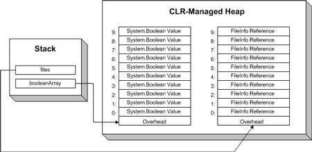

如果我们为 FileInfo[] 数组中的一些位置赋上值，则引用关系为下图所示。

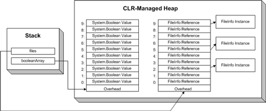

.NET 中的数组都支持对元素的直接读写操作。语法如下：

```c#
1 // 读数组元素
2 bool b = booleanArray[7];
3 
4 // 写数组元素
5 booleanArray[0] = false;
```

访问一个数组元素的[时间复杂度](http://www.cnblogs.com/gaochundong/p/complexity_of_algorithms.html)为 O(1)，因此对数组的访问时间是恒定的。也就是说，与数组中包含的元素数量没有直接关系，访问一个元素的时间是相同的。

# ArrayList

由于数组是固定长度的，并且数组中只能存储同一种类型或类型的衍生类型。这在使用中会受到一些限制。.NET 提供了一种数据结构 ArrayList 来解决这些问题。

```c#
1   ArrayList countDown = new ArrayList();
2   countDown.Add(3);
3   countDown.Add(2);
4   countDown.Add(1);
5   countDown.Add("blast off!");
6   countDown.Add(new ArrayList());
```

ArrayList 是长度可变的数组，并且它可以存储不同类型的元素。

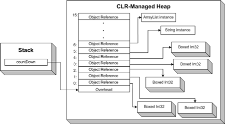

但这些灵活性是以牺牲性能为代价的。在上面 Array 的描述中，我们知道 Array 在存储值类型时是采用未装箱（unboxed）的方式。由于 ArrayList 的 Add 方法接受 object 类型的参数，导致如果添加值类型的值会发生装箱（boxing）操作。这在频繁读写 ArrayList 时会产生额外的开销，导致性能下降。

# List<T>

当 .NET 中引入泛型功能后，上面 ArrayList 所带来的性能代价可以使用泛型来消除。.NET 提供了新的数组类型 List<T>。

泛型允许开发人员在创建数据结构时推迟数据类型的选择，直到使用时才确定选择哪种类型。泛型（Generics）的主要优点包括：

- **类型安全（Type Safety）**：使用泛型定义的类型，在使用时仅能使用指定的类型或类型的衍生类型。
- **性能（Performance）**：泛型移除了运行时类型检测，消除了装箱和拆箱的开销。
- **可重用（Reusability）**：泛型打破了数据结构与存储数据类型之间的紧耦合。这提高了数据结构的可重用性。

List<T> 等同于同质的一维数组（Homogeneous self-redimensioning array）。它像 Array 一样可以快速的读取元素，还可以保持长度可变的灵活性。

```c#
1       // 创建 int 类型列表
2       List<int> myFavoriteIntegers = new List<int>();
3 
4       // 创建 string 类型列表
5       List<string> friendsNames = new List<string>();
```

List<T> 内部同样使用 Array 来实现，但它隐藏了这些实现的复杂性。当创建 List<T> 时无需指定初始长度，当添加元素到 List<T> 中时，也无需关心数组大小的调整（resize）问题。

```c#
1   List<int> powersOf2 = new List<int>();
2 
3   powersOf2.Add(1);
4   powersOf2.Add(2);
5 
6   powersOf2[1] = 10;
7 
8   int sum = powersOf2[1] + powersOf2[2];
```

List<T> 的渐进运行时（Asymptotic Running Time）复杂度与 Array 是相同的。

# LinkedList<T>

在链表（Linked List）中，每一个元素都指向下一个元素，以此来形成了一个链（chain）。

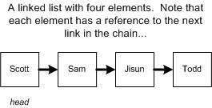

在创建一个链表时，我们仅需持有头节点 head 的引用，这样通过逐个遍历下一个节点 next 即可找到所有的节点。

链表与数组有着同样的线性运行时间 O(n)。例如在上图中，如果我们要查找 Sam 节点，则必须从头节点 Scott 开始查找，逐个遍历下一个节点直到找到 Sam。

同样，从链表中删除一个节点的渐进时间也是线性的O(n)。因为在删除之前我们仍然需要从 head 开始遍历以找到需要被删除的节点。而删除操作本身则变得简单，即让被删除节点的左节点的 next 指针指向其右节点。下图展示了如何删除一个节点。

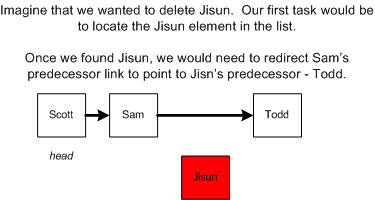

向链表中插入一个新的节点的渐进时间取决于链表是否是有序的。如果链表不需要保持顺序，则插入操作就是常量时间O(1)，可以在链表的头部或尾部添加新的节点。而如果需要保持链表的顺序结构，则需要查找到新节点被插入的位置，这使得需要从链表的头部 head 开始逐个遍历，结果就是操作变成了O(n)。下图展示了插入节点的示例。

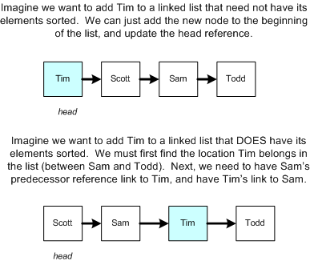

链表与数组的不同之处在于，数组的中的内容在内存中时连续排列的，可以通过下标来访问，而链表中内容的顺序则是由各对象的指针所决定，这就决定了其内容的排列不一定是连续的，所以不能通过下标来访问。如果需要更快速的查找操作，使用数组可能是更好的选择。

使用链表的最主要的优势就是，向链表中插入或删除节点无需调整结构的容量。而相反，对于数组来说容量始终是固定的，如果需要存放更多的数据，则需要调整数组的容量，这就会发生新建数组、数据拷贝等一系列复杂且影响效率的操作。即使是 List<T> 类，虽然其隐藏了容量调整的复杂性，但仍然难逃性能损耗的惩罚。

链表的另一个优点就是特别适合以排序的顺序动态的添加新元素。如果要在数组的中间的某个位置添加新元素，不仅要移动所有其余的元素，甚至还有可能需要重新调整容量。

所以总结来说，数组适合数据的数量是有上限的情况，而链表适合元素数量不固定的情况。

在 .NET 中已经内置了[LinkedList 类](http://msdn.microsoft.com/zh-cn/library/k87xw3hb(v=vs.110).aspx)，该类实现了双向链表（doubly-linked list）功能，也就是节点同时持有其左右节点的引用。而对于删除操作，如果使用 Remove(T)，则运算复杂度为 O(n)，其中 n 为链表的长度。而如果使用 Remove(LinkedListNode<T>)， 则运算复杂度为 O(1)。

# Queue<T>

当我们需要使用先进先出顺序（FIFO）的数据结构时，.NET 为我们提供了 Queue<T>。Queue<T> 类提供了 Enqueue 和 Dequeue 方法来实现对 Queue<T> 的存取。

Queue<T> 内部建立了一个存放 T 对象的环形数组，并通过 head 和 tail 变量来指向该数组的头和尾。

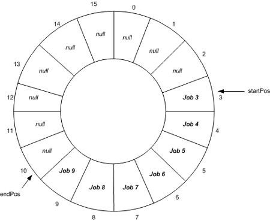

默认情况下，Queue<T> 的初始化容量是 32，也可以通过构造函数指定容量。

Enqueue 方法会判断 Queue<T> 中是否有足够容量存放新元素。如果有，则直接添加元素，并使索引 tail 递增。在这里的 tail 使用求模操作以保证 tail 不会超过数组长度。如果容量不够，则 Queue<T> 根据特定的增长因子扩充数组容量。

默认情况下，增长因子（growth factor）的值为 2.0，所以内部数组的长度会增加一倍。也可以通过构造函数中指定增长因子。Queue<T> 的容量也可以通过 TrimExcess 方法来减少。

Dequeue 方法根据 head 索引返回当前元素，之后将 head 索引指向 null，再递增 head 的值。

# Stack<T>

当需要使用后进先出顺序（LIFO）的数据结构时，.NET 为我们提供了 Stack<T>。Stack<T> 类提供了 Push 和 Pop 方法来实现对 Stack<T> 的存取。

Stack<T> 中存储的元素可以通过一个垂直的集合来形象的表示。当新的元素压入栈中（Push）时，新元素被放到所有其他元素的顶端。当需要弹出栈（Pop）时，元素则被从顶端移除。

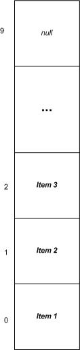

Stack<T> 的默认容量是 10。和 Queue<T> 类似，Stack<T> 的初始容量也可以在构造函数中指定。Stack<T> 的容量可以根据实际的使用自动的扩展，并且可以通过 TrimExcess 方法来减少容量。

如果 Stack<T> 中元素的数量 Count 小于其容量，则 Push 操作的复杂度为 O(1)。如果容量需要被扩展，则 Push 操作的复杂度变为 O(n)。Pop 操作的复杂度始终为 O(1)。

# Hashtable

现在假设我们要使用员工的社保号作为唯一标识进行存储。社保号的格式为 DDD-DD-DDDD（D 的范围为数字 0-9）。

如果使用 Array 存储员工信息，要查询社保号为 111-22-3333 的员工，则将会尝试遍历数组的所有位置，即执行渐进时间为 O(n) 的查询操作。好一些的办法是将社保号排序，以使查询渐进时间降低到 O(log(n))。但理想情况下，我们更希望查询渐进时间为 O(1)。

一种方案是建立一个大数组，范围从 000-00-0000 到 999-99-9999 。

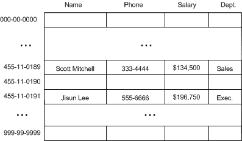

这种方案的缺点是浪费空间。如果我们仅需要存储 1000 个员工的信息，那么仅利用了 0.0001% 的空间。

第二种方案就是用**哈希函数（Hash Function）**压缩序列。

我们选择使用社保号的后四位作为索引，以减少区间的跨度。这样范围将从 0000 到 9999。

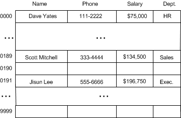

在数学上，将这种从 9 位数转换为 4 位数的方式称为**哈希转换（Hashing）**。可以将一个数组的索引空间（indexers space）压缩至相应的哈希表（Hash Table）。

在上面的例子中，哈希函数的输入为 9 位数的社保号，输出结果为后 4 位。

```
H(x) = last four digits of x
```

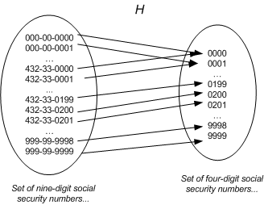

上图中也说明在哈希函数计算中常见的一种行为：**哈希冲突（Hash Collisions）**。即有可能两个社保号的后 4 位均为 0000。

当要添加新元素到 Hashtable 中时，哈希冲突是导致操作被破坏的一个因素。如果没有冲突发生，则元素被成功插入。如果发生了冲突，则需要判断冲突的原因。因此，**哈希冲突提高了操作的代价，Hashtable 的设计目标就是要尽可能减低冲突的发生**。

**处理哈希冲突的方式有两种：避免和解决，即冲突避免机制（Collision Avoidance）和冲突解决机制（Collision Resolution）。**

避免哈希冲突的一个方法就是选择合适的哈希函数。哈希函数中的冲突发生的几率与数据的分布有关。例如，如果社保号的后 4 位是随即分布的，则使用后 4 位数字比较合适。但如果后 4 位是以员工的出生年份来分配的，则显然出生年份不是均匀分布的，则选择后 4 位会造成大量的冲突。我们将这种选择合适的哈希函数的方法称为冲突避免机制（Collision Avoidance）。

在处理冲突时，有很多策略可以实施，这些策略称为冲突解决机制（Collision Resolution）。其中一种方法就是将要插入的元素放到另外一个块空间中，因为相同的哈希位置已经被占用。

通常采用的冲突解决策略为**开放寻址法（Open Addressing）**，所有的元素仍然都存放在哈希表内的数组中。

开放寻址法的最简单的一种实现就是**线性探查（Linear Probing）**，步骤如下：

1. 当插入新的元素时，使用哈希函数在哈希表中定位元素位置；
2. 检查哈希表中该位置是否已经存在元素。如果该位置内容为空，则插入并返回，否则转向步骤 3。
3. 如果该位置为 i，则检查 i+1 是否为空，如果已被占用，则检查 i+2，依此类推，直到找到一个内容为空的位置。

现在如果我们要将五个员工的信息插入到哈希表中：

- Alice (333-33-1234)
- Bob (444-44-1234)
- Cal (555-55-1237)
- Danny (000-00-1235)
- Edward (111-00-1235)

则插入后的哈希表可能如下：

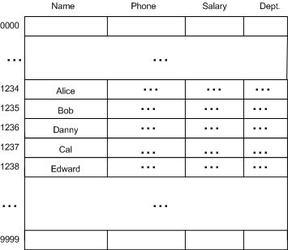

元素的插入过程：

- Alice 的社保号被哈希为 1234，因此存放在位置 1234。
- Bob 的社保号被哈希为 1234，但由于位置 1234 处已经存放 Alice 的信息，则检查下一个位置 1235，1235 为空，则 Bob 的信息就被放到 1235。
- Cal 的社保号被哈希为 1237，1237 位置为空，所以 Cal 就放到 1237 处。
- Danny 的社保号被哈希为 1235，1235 已被占用，则检查 1236 位置是否为空，1236 为空，所以 Danny 就被放到 1236。
- Edward 的社保号被哈希为 1235，1235 已被占用，检查1236，也被占用，再检查1237，直到检查到 1238时，该位置为空，于是 Edward 被放到了1238 位置。

线性探查（Linear Probing）方式虽然简单，但并不是解决冲突的最好的策略，因为它会导致同类哈希的聚集（Primary Clustering）。这导致搜索哈希表时，冲突依然存在。例如上面例子中的哈希表，如果我们要访问 Edward 的信息，因为 Edward 的社保号 111-00-1235 哈希为 1235，然而我们在 1235 位置找到的是 Bob，所以再搜索 1236，找到的却是 Danny，以此类推直到找到 Edward。

一种改进的方式为**二次探查（Quadratic Probing）**，即每次检查位置空间的步长为平方倍数。也就是说，如果位置 s 被占用，则首先检查 s + 12 处，然后检查s - 12，s + 22，s - 22，s + 32 依此类推，而不是象线性探查那样以 s + 1，s + 2 ... 方式增长。尽管如此，二次探查同样也会导致同类哈希聚集问题（Secondary Clustering）。

.NET 中的 Hashtable 类的实现，要求添加元素时不仅要提供元素（Item），还要为该元素提供一个键（Key）。例如，Key 为员工社保号，Item 为员工信息对象。可以通过 Key 作为索引来查找 Item。

```
 1       Hashtable employees = new Hashtable();
 2 
 3       // Add some values to the Hashtable, indexed by a string key
 4       employees.Add("111-22-3333", "Scott");
 5       employees.Add("222-33-4444", "Sam");
 6       employees.Add("333-44-55555", "Jisun");
 7 
 8       // Access a particular key
 9       if (employees.ContainsKey("111-22-3333"))
10       {
11         string empName = (string)employees["111-22-3333"];
12         Console.WriteLine("Employee 111-22-3333's name is: " + empName);
13       }
14       else
15         Console.WriteLine("Employee 111-22-3333 is not in the hash table...");
```

Hashtable 类中的哈希函数比前面介绍的社保号的实现要更为复杂。哈希函数必须返回一个序数（Ordinal Value）。对于社保号的例子，通过截取后四位就可以实现。但实际上 Hashtable 类可以接受任意类型的值作为 Key，这都要归功于 GetHashCode 方法，一个定义在 System.Object 中的方法。GetHashCode 的默认实现将返回一个唯一的整数，并且保证在对象的生命周期内保持不变。

Hashtable 类中的哈希函数定义如下：

```
H(key) = [GetHash(key) + 1 + (((GetHash(key) >> 5) + 1) % (hashsize – 1))] % hashsize
```

这里的 GetHash(key) 默认是调用 key 的 GetHashCode 方法以获取返回的哈希值。hashsize 指的是哈希表的长度。因为要进行求模，所以最后的结果 H(key) 的范围在 0 至 hashsize - 1 之间。

当在哈希表中添加或获取一个元素时，会发生哈希冲突。前面我们简单地介绍了两种冲突解决策略：

- 线性探查（Linear Probing）
- 二次探查（Quadratic Probing）

在 Hashtable 类中则使用的是一种完全不同的技术，称为**二度哈希（rehashing）**（有些资料中也将其称为双重哈希（double hashing））。

二度哈希的工作原理如下：

有一个包含一组哈希函数 H1...Hn 的集合。当需要从哈希表中添加或获取元素时，首先使用哈希函数 H1。如果导致冲突，则尝试使用 H2，以此类推，直到 Hn。所有的哈希函数都与 H1 十分相似，不同的是它们选用的乘法因子（multiplicative factor）。

通常，哈希函数 Hk 的定义如下：

```
Hk(key) = [GetHash(key) + k * (1 + (((GetHash(key) >> 5) + 1) % (hashsize – 1)))] % hashsize
```

当使用二度哈希时，重要的是在执行了 hashsize 次探查后，哈希表中的每一个位置都有且只有一次被访问到。也就是说，对于给定的 key，对哈希表中的同一位置不会同时使用 Hi 和 Hj。在 Hashtable 类中使用二度哈希公式，其始终保持 (1 + (((GetHash(key) >> 5) + 1) % (hashsize – 1)) 与 hashsize 互为素数（两数互为素数表示两者没有共同的质因子）。

二度哈希使用了 Θ(m2) 种探查序列，而线性探查（Linear Probing）和二次探查（Quadratic Probing）使用了Θ(m) 种探查序列，故二度哈希提供了更好的避免冲突的策略。

Hashtable 类中包含一个私有成员变量 loadFactor，loadFactor 指定了哈希表中元素数量与位置（slot）数量之间的最大比例。例如：如果 loadFactor 等于 0.5，则说明哈希表中只有一半的空间存放了元素值，其余一半都为空。

哈希表的构造函数允许用户指定 loadFactor 值，定义范围为 0.1 到 1.0。然而，不管你提供的值是多少，范围都不会超过 72%。即使你传递的值为 1.0，Hashtable 类的 loadFactor 值还是 0.72。微软认为loadFactor 的最佳值为 0.72，这平衡了速度与空间。因此虽然默认的 loadFactor 为 1.0，但系统内部却自动地将其改变为 0.72。所以，建议你使用缺省值1.0（但实际上是 0.72）。

向 Hashtable 中添加新元素时，需要检查以保证元素与空间大小的比例不会超过最大比例。如果超过了，哈希表空间将被扩充。步骤如下：

- 哈希表的位置空间几乎被翻倍。准确地说，位置空间值从当前的素数值增加到下一个最大的素数值。
- 因为二度哈希时，哈希表中的所有元素值将依赖于哈希表的位置空间值，所以表中所有值也需要重新二度哈希。

由此看出，对哈希表的扩充将是以性能损耗为代价。因此，我们应该预先估计哈希表中最有可能容纳的元素数量，在初始化哈希表时给予合适的值进行构造，以避免不必要的扩充。

# Dictionary<K,T>

Hashtable类是一个类型松耦合的数据结构，开发人员可以指定任意的类型作为 Key 或 Item。当 .NET 引入泛型支持后，类型安全的 Dictionary<K,T> 类出现。Dictionary<K,T> 使用强类型来限制 Key 和 Item，当创建 Dictionary<K,T> 实例时，必须指定 Key 和 Item 的类型。

```
Dictionary<keyType, valueType> variableName = new Dictionary<keyType, valueType>();
```

如果继续使用上面描述的社保号和员工的示例，我们可以创建一个 Dictionary<K,T> 的实例：

```
Dictionary<int, Employee> employeeData = new Dictionary<int, Employee>();
```

这样我们就可以添加和删除员工信息了。

```
1 // Add some employees
2 employeeData.Add(455110189) = new Employee("Scott Mitchell");
3 employeeData.Add(455110191) = new Employee("Jisun Lee");
4 
5 // See if employee with SSN 123-45-6789 works here
6 if (employeeData.ContainsKey(123456789))
```

Dictionary<K,T> 与 Hashtable的不同之处还不止一处。除了支持强类型外，Dictionary<K,T> 还采用了不同的冲突解决策略（Collision Resolution Strategy），这种技术称为**链接技术（chaining）**。

前面使用的探查技术（probing），如果发生冲突，则将尝试列表中的下一个位置。如果使用二度哈希（rehashing），则将导致所有的哈希被重新计算。而**链接技术（chaining）**将采用额外的数据结构来处理冲突。Dictionary<K,T> 中的每个位置（slot）都映射到了一个链表。当冲突发生时，冲突的元素将被添加到桶（bucket）列表中。

下面的示意图中描述了 Dictionary<K,T> 中的每个桶（bucket）都包含了一个链表以存储相同哈希的元素。

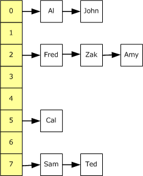

上图中，该 Dictionary 包含了 8 个桶，也就是自顶向下的黄色背景的位置。一定数量的 Employee 对象已经被添加至 Dictionary 中。如果一个新的 Employee 要被添加至 Dictionary 中，将会被添加至其 Key 的哈希所对应的桶中。如果在相同位置已经有一个 Employee 存在了，则将会将新元素添加到列表的前面。

向 Dictionary 中添加元素的操作涉及到哈希计算和链表操作，但其仍为常量，渐进时间为 O(1)。

对 Dictionary 进行查询和删除操作时，其平均时间取决于 Dictionary 中元素的数量和桶（bucket）的数量。具体的说就是运行时间为 O(n/m)，这里 n 为元素的总数量，m 是桶的数量。但 Dictionary 几乎总是被实现为 n = O(m)，也就是说，元素的总数绝不会超过桶的总数，所以 O(n/m) 也变成了常量 O(1)。
