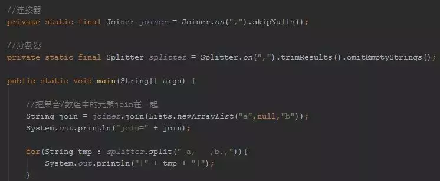
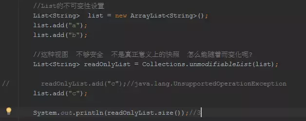
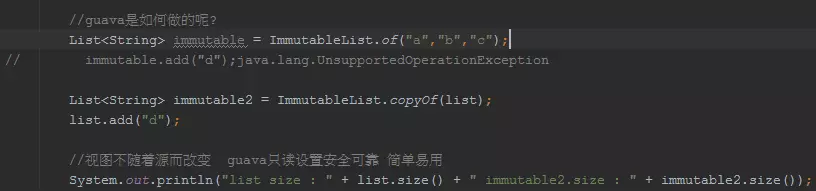
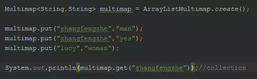
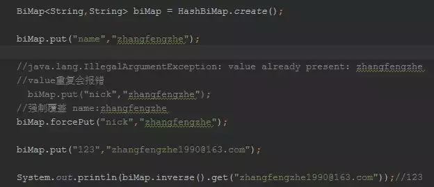
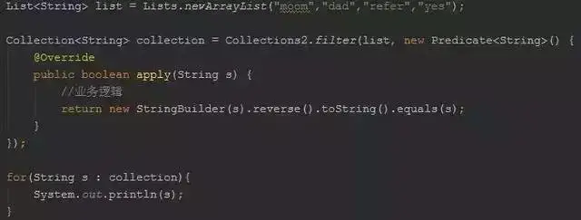
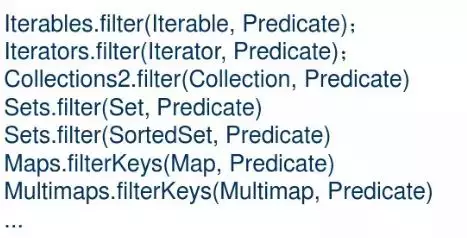
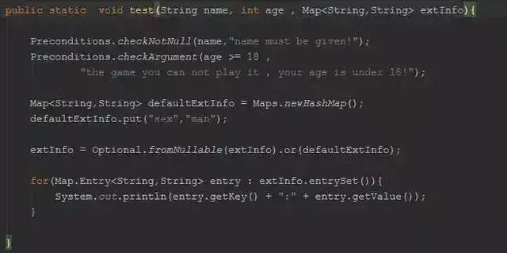
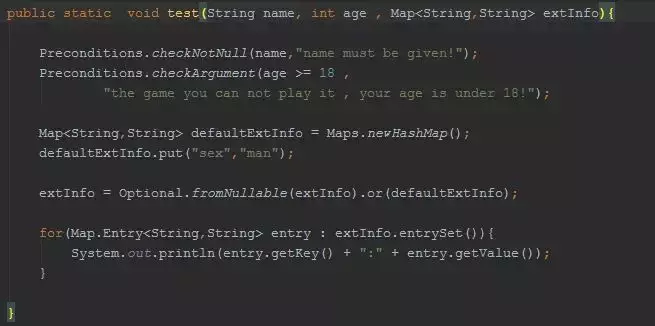

学习使用Google Guava可以让你快乐编程，写出优雅的JAVA代码！

以面向对象思想处理字符串:Joiner/Splitter/CharMatcher

# Joiner/Splitter/CharMatcher

JDK提供的String还不够好么？

也许还不够友好，至少让我们用起来还不够爽，还得操心！

举个栗子，比如String提供的split方法，我们得关心空字符串吧，还得考虑返回的结果中存在null元素吧，只提供了前后trim的方法（如果我想对中间元素进行trim呢）。

那么，看下面的代码示例，guava让你不必在操心这些：



Joiner是连接器，Splitter是分割器，通常我们会把它们定义为static final，利用on生成对象后在应用到String进行处理，这是可以复用的。要知道apache commons StringUtils提供的都是static method。更加重要的是，guava提供的Joiner/Splitter是经过充分测试，它的稳定性和效率要比apache高出不少，这个你可以自行测试下。

发现没有我们想对String做什么操作，就是生成自己定制化的Joiner/Splitter，多么直白，简单，流畅的API！

对于Joiner，常用的方法是  跳过NULL元素：skipNulls()  /  对于NULL元素使用其他替代：useForNull(String)

对于Splitter，常用的方法是：trimResults()/omitEmptyStrings()。注意拆分的方式，有字符串，还有正则，还有固定长度分割（太贴心了！）

其实除了Joiner/Splitter外，guava还提供了字符串匹配器：CharMatcher


CharMatcher，将字符的匹配和处理解耦，并提供丰富的方法供你使用！

------

**对基本类型的支持**

guava对JDK提供的原生类型操作进行了扩展，使得功能更加强大

```java
// 快速完成到集合的转换
List<Integer> list = Ints.asList(1, 2, 6, 20, 7);
// 快速按分隔符连接
String join = Ints.join(",", 1, 2, 6, 20, 7);
// 原生数组快速合并
int[] newIntArray = Ints.concat(new int[]{1,2}, new int[]{4,5,6});
// 最大
int max = Ints.max(newIntArray);
// 最小
int min = Ints.min(newIntArray);
boolean contains = Ints.contains(newIntArray, 1);
// 集合到数组的转换
int[] array = Ints.toArray(list);
```

guava提供了Bytes/Shorts/Ints/Iongs/Floats/Doubles/Chars/Booleans这些基本数据类型的扩展支持，只有你想不到的，没有它没有的！

# 对 JDK 的有效补充

## 灰色地带：Multiset

JDK的集合，提供了有序且可以重复的List，无序且不可以重复的Set。那这里其实对于集合涉及到了2个概念，一个order，一个dups。那么List vs Set，and then some ?


**Multiset**

Multiset是什么，我想上面的图，你应该了解它的概念了。Multiset就是无序的，但是可以重复的集合，它就是游离在List/Set之间的“灰色地带”！（至于有序的，不允许重复的集合嘛，guava还没有提供，当然在未来应该会提供UniqueList，我猜的，哈哈）

来看一个Multiset的示例：


Multiset自带一个有用的功能，就是可以跟踪每个对象的数量。

## Immutable vs unmodifiable

来我们先看一个unmodifiable的例子：



你看到JDK提供的unmodifiable的缺陷了吗？

实际上，Collections.unmodifiableXxx所返回的集合和源集合是同一个对象，只不过可以对集合做出改变的API都被override，会抛出UnsupportedOperationException。

也即是说我们改变源集合，导致不可变视图（unmodifiable View）也会发生变化，oh my god!

当然，在不使用guava的情况下，我们是怎么避免上面的问题的呢？


上面揭示了一个概念：Defensive Copies，保护性拷贝。

OK，unmodifiable看上去没有问题呢，但是guava依然觉得可以改进，于是提出了Immutable的概念，来看：



就一个copyOf，你不会忘记，如此cheap

用Google官方的说法是：we're using just one class,just say exactly what we mean，很了不起吗（不仅仅是个概念，Immutable在COPY阶段还考虑了线程的并发性等，很智能的！）

guava提供了很多Immutable集合，比如ImmutableList/ImmutableSet/ImmutableSortedSet/ImmutableMap/......

看一个ImmutableMap的例子：


## 可不可以一对多：Multimap

JDK提供给我们的Map是一个键，一个值，一对一的，那么在实际开发中，显然存在一个KEY多个VALUE的情况（比如一个分类下的书本），我们往往这样表达：Map<k,List<v>>，好像有点臃肿！臃肿也就算了，更加不爽的事，我们还得判断KEY是否存在来决定是否new 一个LIST出来，有点麻烦！更加麻烦的事情还在后头，比如遍历，比如删除，so hard......

来看guava如何替你解决这个大麻烦的：



友情提示下，guava所有的集合都有create方法，这样的好处在于简单，而且我们不必在重复泛型信息了。

get()/keys()/keySet()/values()/entries()/asMap()都是非常有用的返回view collection的方法。

Multimap的实现类有：ArrayListMultimap/HashMultimap/LinkedHashMultimap/TreeMultimap/ImmutableMultimap/......

## 可不可以双向：BiMap

JDK提供的MAP让我们可以find value by key，那么能不能通过find key by value呢，能不能KEY和VALUE都是唯一的呢。这是一个双向的概念，即forward+backward。

在实际场景中有这样的需求吗？比如通过用户ID找到mail，也需要通过mail找回用户名。没有guava的时候，我们需要create forward map AND create backward map，and now just let guava do that for you.



biMap / biMap.inverse() / biMap.inverse().inverse() 它们是什么关系呢？

你可以稍微看一下BiMap的源码实现，实际上，当你创建BiMap的时候，在内部维护了2个map，一个forward map，一个backward map，并且设置了它们之间的关系。

因此，biMap.inverse()  != biMap ；biMap.inverse().inverse() == biMap

## 可不可以多个KEY：Table

我们知道数据库除了主键外，还提供了复合索引，而且实际中这样的多级关系查找也是比较多的，当然我们可以利用嵌套的Map来实现：Map<k1,Map<k2,v2>>。为了让我们的代码看起来不那么丑陋，guava为我们提供了Table。


Table涉及到3个概念：rowKey,columnKey,value，并提供了多种视图以及操作方法让你更加轻松的处理多个KEY的场景。

## 函数式编程：Funcitons


上面的代码是为了完成将List集合中的元素，先截取5个长度，然后转成大写。

函数式编程的好处在于在集合遍历操作中提供自定义Function的操作，比如transform转换。我们再也不需要一遍遍的遍历集合，显著的简化了代码！


对集合的transform操作可以通过Function完成

## 断言：Predicate



Predicate最常用的功能就是运用在集合的过滤当中！



## filter

需要注意的是Lists并没有提供filter方法，不过你可以使用Collections2.filter完成！

check null and other：Optional、Preconditions

在guava中，对于null的处理手段是快速失败，你可以看看guava的源码，很多方法的第一行就是：Preconditions.checkNotNull(elements);

要知道null是模糊的概念，是成功呢，还是失败呢，还是别的什么含义呢？



Preconditions/Optional

## Optional、Preconditions

在guava中，对于null的处理手段是快速失败，

```java
String name = "";
Preconditions.checkNotNull(name, "name is not null");
Integer age = 30;
Preconditions.checkArgument(age>=18, "your age is under 18");
```

你可以看看guava的源码，很多方法的第一行就是：Preconditions.checkNotNull(elements);

要知道null是模糊的概念，是成功呢，还是失败呢，还是别的什么含义呢？



## Cache

对于大多数互联网项目而言，缓存的重要性，不言而喻！

如果我们的应用系统，并不想使用一些第三方缓存组件（如redis），我们仅仅想在本地有一个功能足够强大的缓存，很可惜JDK提供的那些SET/MAP还不行！

```java
// 缓存的实现
private static final CacheLoader<Long, String> cacheLoader = new CacheLoader<Long, String>() {
    @Override
    public String load(Long key) throws Exception {
        // TODO 从数据库加载数据
        System.out.println("从数据库加载数据");
        return key + ":value";
    }
};

// 定义缓存的策略
private static final LoadingCache<Long, String> loadingCache = CacheBuilder.newBuilder()
        .expireAfterAccess(2, TimeUnit.SECONDS) // 设置在2秒内未访问则过期
        .expireAfterWrite(2, TimeUnit.SECONDS) // 设置缓存在写入2秒后失效
        .refreshAfterWrite(3, TimeUnit.SECONDS) // 设置缓存在写入3秒后，通过CacheLoader的load方法进行刷新
        .maximumSize(100L) // 设置缓存数量上限为100
        .build(cacheLoader);


public static void main(String[] args) throws Exception {
    //loadingCache.put(1L, "James");
    System.out.println(loadingCache.get(1L));
    Thread.sleep(5000L);
    System.out.println(loadingCache.get(1L));
}
```

首先，这是一个本地缓存，guava提供的cache是一个简洁、高效，易于维护的。为什么这么说呢？因为并没有一个单独的线程用于刷新 OR 清理cache，对于cache的操作，都是通过访问/读写带来的，也就是说在读写中完成缓存的刷新操作！

其次，我们看到了，我们非常通俗的告诉cache，我们的缓存策略是什么，SO EASY！在如此简单的背后，是guava帮助我们做了很多事情，比如线程安全。

# 让异步回调更加简单

JDK中提供了Future/FutureTask/Callable来对异步回调进行支持，但是还是看上去挺复杂的，能不能更加简单呢？比如注册一个监听回调。

```java
ExecutorService es = Executors.newFixedThreadPool(3);
ListeningExecutorService listeningExecutorService = MoreExecutors.listeningDecorator(es);

ListenableFuture<?> listenableFuture = listeningExecutorService.submit(() -> {
    if(new Random().nextInt(3) == 2){
        throw new NullPointerException();
    }
    return 1;
});

FutureCallback<Integer> futureCallback = new FutureCallback<Integer>() {
    @Override
    public void onSuccess(@Nullable Integer o) {
        System.out.println("------" + o);
    }

    @Override
    public void onFailure(Throwable throwable) {
        System.out.println("------" + throwable.getMessage());
    }
};

Futures.addCallback(listenableFuture,futureCallback);
```

我们可以通过guava对JDK提供的线程池进行装饰，让其具有异步回调监听功能，然后在设置监听器即可！

# 计算中间代码的运行时间

```java
Stopwatch stopwatch = Stopwatch.createStarted();
for(int i=0; i<100000; i++){
    // do some thing
}
long nanos = stopwatch.elapsed(TimeUnit.MILLISECONDS);
System.out.println(nanos);
```

TimeUnit 可以指定时间输出精确到多少时间。

------

到这里，这篇文章也只介绍了guava的冰山一角，其实还有很多内容：比如反射、注解、网络、并发、IO等等，好了，希望这篇文章让你快速进阶，快乐编程！

https://www.yiibai.com/guava/guava_optional_class.html#article-start

#### 1.集合的创建

```
// 普通Collection的创建
List<String> list = Lists.newArrayList();
Set<String> set = Sets.newHashSet();
Map<String, String> map = Maps.newHashMap();

// 不变Collection的创建
ImmutableList<String> iList = ImmutableList.of("a", "b", "c");
ImmutableSet<String> iSet = ImmutableSet.of("e1", "e2");
ImmutableMap<String, String> iMap = ImmutableMap.of("k1", "v1", "k2", "v2");
```

> 创建不可变集合 先理解什么是immutable(不可变)对象
>
> 1.在多线程操作下，是线程安全的。
>
> 2.所有不可变集合会比可变集合更有效的利用资源。
>
> 3.中途不可改变

> ```
> ImmutableList<String> immutableList = ImmutableList.of("1","2","3","4");
> ```
>
> 这句话就声明了一个不可变的list集合，里面有数据1，2，3，4。方法中的==操作集合的方法都声明过期==，并且抛出异常。
>
> 没用guava之前是需要声明并且加各种包裹集合才能实现这个功能。

当我们需要一个map中包含key为String value为List类型的时候 以前我们是这样写的

```
Map<String,List<Integer>> map = new HashMap<String,List<Integer>>();
List<Integer> list = new ArrayList<Integer>();
list.add(1);
list.add(2);
map.put("aa", list);
System.out.println(map.get("aa"));//[1, 2]
```

而现在

```
Multimap<String,Integer> map = ArrayListMultimap.create();		
map.put("aa", 1);
map.put("aa", 2);
System.out.println(map.get("aa"));  //[1, 2]
```

##### 其他的黑科技集合

```
MultiSet: 无序+可重复   count()方法获取单词的次数  增强了可读性+操作简单
创建方式:  Multiset<String> set = HashMultiset.create();

Multimap: key-value  key可以重复  
创建方式: Multimap<String, String> teachers = ArrayListMultimap.create();

BiMap: 双向Map(Bidirectional Map) 键与值都不能重复
创建方式:  BiMap<String, String> biMap = HashBiMap.create();

Table: 双键的Map Map--> Table-->rowKey+columnKey+value  //和sql中的联合主键有点像
创建方式: Table<String, String, Integer> tables = HashBasedTable.create();

...等等(guava中还有很多java里面没有给出的集合类型)
```

#### 2.将集合转换为特定规则的字符串

以前我们将list转换为特定规则的字符串是这样写的:

```
//use java
List<String> list = new ArrayList<String>();
list.add("aa");
list.add("bb");
list.add("cc");
String str = "";
for(int i=0; i<list.size(); i++){
	str = str + "-" +list.get(i);
}
//str 为-aa-bb-cc

//use guava
List<String> list = new ArrayList<String>();
list.add("aa");
list.add("bb");
list.add("cc");
String result = Joiner.on("-").join(list);
//result为  aa-bb-cc
```

##### 把map集合转换为特定规则的字符串

```
Map<String, Integer> map = Maps.newHashMap();
map.put("xiaoming", 12);
map.put("xiaohong",13);
String result = Joiner.on(",").withKeyValueSeparator("=").join(map);
// result为 xiaoming=12,xiaohong=13
```

#### 3.将String转换为特定的集合

```
//use java
List<String> list = new ArrayList<String>();
String a = "1-2-3-4-5-6";
String[] strs = a.split("-");
for(int i=0; i<strs.length; i++){
	list.add(strs[i]);
}

//use guava
String str = "1-2-3-4-5-6";
List<String> list = Splitter.on("-").splitToList(str);
//list为  [1, 2, 3, 4, 5, 6]
```

如果

```
str="1-2-3-4- 5-  6  ";
```

guava还可以使用

> ==使用 "-" 切分字符串并去除空串与空格== omitEmptyStrings().trimResults() 去除空串与空格

```
String str = "1-2-3-4-  5-  6   ";  
List<String> list = Splitter.on("-").omitEmptyStrings().trimResults().splitToList(str);
System.out.println(list);
```

就能忽略中间的空格

###### 将String转换为map

```
String str = "xiaoming=11,xiaohong=23";
Map<String,String> map = Splitter.on(",").withKeyValueSeparator("=").split(str);
```

#### 4.guava还支持多个字符切割，或者特定的正则分隔

```
String input = "aa.dd,,ff,,.";
List<String> result = Splitter.onPattern("[.|,]").omitEmptyStrings().splitToList(input);
```

==关于字符串的操作 都是在Splitter这个类上进行的。==

```
// 判断匹配结果
boolean result = CharMatcher.inRange('a', 'z').or(CharMatcher.inRange('A', 'Z')).matches('K'); //true
// 保留数字文本
String s1 = CharMatcher.digit().retainFrom("abc 123 efg"); //123
// 删除数字文本
String s2 = CharMatcher.digit().removeFrom("abc 123 efg");    //abc  efg
```

#### 5. 集合的过滤

我们对于集合的过滤，思路就是迭代，然后再具体对每一个数判断，这样的代码放在程序中，难免会显得很臃肿，虽然功能都有，但是很不好看。

guava写法

```
//按照条件过滤
ImmutableList<String> names = ImmutableList.of("begin", "code", "Guava", "Java");
Iterable<String> fitered = Iterables.filter(names, Predicates.or(Predicates.equalTo("Guava"), Predicates.equalTo("Java")));
System.out.println(fitered); // [Guava, Java]

//自定义过滤条件   使用自定义回调方法对Map的每个Value进行操作
ImmutableMap<String, Integer> m = ImmutableMap.of("begin", 12, "code", 15);
        // Function<F, T> F表示apply()方法input的类型，T表示apply()方法返回类型
        Map<String, Integer> m2 = Maps.transformValues(m, new Function<Integer, Integer>() {
            public Integer apply(Integer input) {
            	if(input>12){
            		return input;
            	}else{
            		return input+1;
            	}
            }
        });
System.out.println(m2);   //{begin=13, code=15}
```

set的交集, 并集, 差集

```
HashSet setA = newHashSet(1, 2, 3, 4, 5);  
HashSet setB = newHashSet(4, 5, 6, 7, 8);  
   
SetView union = Sets.union(setA, setB);  
System.out.println("union:");  
for (Integer integer : union)  
    System.out.println(integer);           //union:12345867
   
SetView difference = Sets.difference(setA, setB);  
System.out.println("difference:");  
for (Integer integer : difference)  
    System.out.println(integer);        //difference:123
   
SetView intersection = Sets.intersection(setA, setB);  
System.out.println("intersection:");  
for (Integer integer : intersection)  
    System.out.println(integer);  //intersection:45

    
```

map的交集，并集，差集

```
MapDifference differenceMap = Maps.difference(mapA, mapB);  
differenceMap.areEqual();  
Map entriesDiffering = differenceMap.entriesDiffering();  
Map entriesOnlyOnLeft = differenceMap.entriesOnlyOnLeft();  
Map entriesOnlyOnRight = differenceMap.entriesOnlyOnRight();  
Map entriesInCommon = differenceMap.entriesInCommon();  
```

#### 6.检查参数

```
//use java
if(list!=null && list.size()>0)
'''
if(str!=null && str.length()>0)
'''
if(str !=null && !str.isEmpty())

//use guava
if(!Strings.isNullOrEmpty(str))

//use java
if (count <= 0) {                                                                                           
    throw new IllegalArgumentException("must be positive: " + count);         
}    

//use guava
Preconditions.checkArgument(count > 0, "must be positive: %s", count);  
```

免去了很多麻烦！并且会使你的代码看上去更好看。而不是代码里面充斥着!=null， !=""

> (问答系统源码里面有很多这种代码，后一版得抓紧改掉。。)

检查是否为空,不仅仅是字符串类型，其他类型的判断 全部都封装在 Preconditions类里 里面的方法全为静态。

其中的一个方法的源码

```
@CanIgnoreReturnValue
public static <T> T checkNotNull(T reference) {
    if (reference == null) {
      throw new NullPointerException();
    }
    return reference;
}
```

| 方法声明（不包括额外参数）                         | 描述                                                         | 检查失败时抛出的异常      |
| -------------------------------------------------- | ------------------------------------------------------------ | ------------------------- |
| checkArgument(boolean)                             | 检查boolean是否为true，用来检查传递给方法的参数。            | IllegalArgumentException  |
| checkNotNull(T)                                    | 检查value是否为null，该方法直接返回value，因此可以内嵌使用checkNotNull。 | NullPointerException      |
| checkState(boolean)                                | 用来检查对象的某些状态。                                     | IllegalStateException     |
| checkElementIndex(int index, int size)             | 检查index作为索引值对某个列表、字符串或数组是否有效。index>=0 && index<size * | IndexOutOfBoundsException |
| checkPositionIndexes(int start, int end, int size) | 检查[start, end]表示的位置范围对某个列表、字符串或数组是否有效* | IndexOutOfBoundsException |

#### 7.MoreObjects

这个方法是在Objects过期后 官方推荐使用的替代品，该类最大的好处就是不用大量的重写toString，用一种很优雅的方式实现重写，或者在某个场景定制使用。

```
Person person = new Person("aa",11);
String str = MoreObjects.toStringHelper("Person").add("age", person.getAge()).toString();
System.out.println(str);  
//输出Person{age=11}
```

#### 8.强大的Ordering排序器

排序器[Ordering]是Guava流畅风格比较器[Comparator]的实现，它可以用来为构建复杂的比较器，以完成集合排序的功能。

```
natural()	对可排序类型做自然排序，如数字按大小，日期按先后排序
usingToString()	按对象的字符串形式做字典排序[lexicographical ordering]
from(Comparator)	把给定的Comparator转化为排序器
reverse()	获取语义相反的排序器
nullsFirst()	使用当前排序器，但额外把null值排到最前面。
nullsLast()	使用当前排序器，但额外把null值排到最后面。
compound(Comparator)	合成另一个比较器，以处理当前排序器中的相等情况。
lexicographical()	基于处理类型T的排序器，返回该类型的可迭代对象Iterable<T>的排序器。
onResultOf(Function)	对集合中元素调用Function，再按返回值用当前排序器排序。
Person person = new Person("aa",14);  //String name  ,Integer age
Person ps = new Person("bb",13);
Ordering<Person> byOrdering = Ordering.natural().nullsFirst().onResultOf(new Function<Person,String>(){
	public String apply(Person person){
		return person.age.toString();
	}
});
byOrdering.compare(person, ps);
System.out.println(byOrdering.compare(person, ps)); //1      person的年龄比ps大 所以输出1
```

#### 9.计算中间代码的运行时间

```
Stopwatch stopwatch = Stopwatch.createStarted();
for(int i=0; i<100000; i++){
	
}
long nanos = stopwatch.elapsed(TimeUnit.MILLISECONDS);
System.out.println(nanos);
```

TimeUnit 可以指定时间输出精确到多少时间

#### 10.文件操作

以前我们写文件读取的时候要定义缓冲区，各种条件判断，各种$%#$[@#](https://my.oschina.net/u/2839266)

而现在我们只需要使用好guava的api 就能使代码变得简洁，并且不用担心因为写错逻辑而背锅了

```
File file = new File("/test.txt");
List<String> list = null;
try {
	list = Files.readLines(file, Charsets.UTF_8);
} catch (Exception e) {
}

Files.copy(from,to);  //复制文件
Files.deleteDirectoryContents(File directory); //删除文件夹下的内容(包括文件与子文件夹)  
Files.deleteRecursively(File file); //删除文件或者文件夹  
Files.move(File from, File to); //移动文件
URL url = Resources.getResource("abc.xml"); //获取classpath根下的abc.xml文件url
```

Files类中还有许多方法可以用，可以多多翻阅。

#### 11.guava缓存

guava的缓存设计的比较巧妙，可以很精巧的使用。guava缓存创建分为两种，一种是CacheLoader,另一种则是callback方式

CacheLoader:

```
LoadingCache<String,String> cahceBuilder=CacheBuilder
		        .newBuilder()
		        .build(new CacheLoader<String, String>(){
		            @Override
		            public String load(String key) throws Exception {        
		                String strProValue="hello "+key+"!";                
		                return strProValue;
		            }
		        });        
System.out.println(cahceBuilder.apply("begincode"));  //hello begincode!
System.out.println(cahceBuilder.get("begincode")); //hello begincode!
System.out.println(cahceBuilder.get("wen")); //hello wen!
System.out.println(cahceBuilder.apply("wen")); //hello wen!
System.out.println(cahceBuilder.apply("da"));//hello da!
cahceBuilder.put("begin", "code");
System.out.println(cahceBuilder.get("begin")); //code
```

##### api中已经把apply声明为过期，声明中推荐使用get方法获取值

callback方式:

```
 Cache<String, String> cache = CacheBuilder.newBuilder().maximumSize(1000).build();  
	        String resultVal = cache.get("code", new Callable<String>() {  
	            public String call() {  
	                String strProValue="begin "+"code"+"!";                
	                return strProValue;
	            }  
	        });  
 System.out.println("value : " + resultVal); //value : begin code!
```

------

以上只是guava使用的一小部分，guava是个大的工具类，第一版guava是2010年发布的，每一版的更新和迭代都是一种创新。

jdk的升级很多都是借鉴guava里面的思想来进行的。

https://my.oschina.net/u/2551035/blog/802634