# API 网关
## 什么是 API 网关
既然需要 API 网关为我所用，首先就让我们来了解一下什么是 API 网关。

### 什么是 API 网关

网关一词最早出现在网络设备，比如两个相互独立的局域网之间通过路由器进行通信，中间的路由被称之为网关。

任何一个应用系统如果需要被其他系统调用，就需要暴露 API，这些 API 代表着一个一个的功能点。

如果两个系统中间通信，在系统之间加上一个中介者协助 API 的调用，这个中介者就是 API 网关。

<!-- more -->


<center><i>对接两个系统的 API 网关</i></center>

当然，API 网关可以放在两个系统之间，同时也可以放在客户端与服务端之间。


<center><i>对接客户端和服务端的 API 网关</i></center>

知道了 API 网关的基本定义，再来看看为什么我们要使用它。

### 为何要使用 API 网关

网关作为系统的唯一入口，也就是说，进入系统的所有请求都需要经过 API 网关。

**当系统外部的应用或者客户端访问系统的时候，都会遇到这样的情况：**

- 系统要判断它们的权限
- 如果传输协议不一致，需要对协议进行转换
- 如果调用水平扩展的服务，需要做负载均衡
- 一旦请求流量超出系统承受的范围，需要做限流操作
- 针对每个请求以及回复，系统会记录响应的日志

也就是说，只要是涉及到对系统的请求，并且能够从业务中抽离出来的功能，都有可能在网关上实现。

例如：协议转换，负载均衡，请求路由，流量控制等等。后面我们会一一给大家介绍这些功能。

在了解 API 网关有哪些基本功能以后，来看看它可以服务于哪些系统或者客户端。

### API 网关服务定位

API 网关拥有处理请求的能力，从定位来看分为 5 类：

**①面向 WebApp，**这部分的系统以网站和 H5 应用为主。通过前后端分离的设计，将大部分的业务功能都放在了后端，前面的 Web App 只展示页面的内容。

**②MobileApp，**这里的 Mobile 指的是 iOS 和 Android，设计思路和 WebApp 基本相同。
区别是 API 网关需要做一些移动设备管理的工作（MDM）。例如：设备的注册，激活，使用，淘汰等，全生命周期的管理。
由于移动设备的特殊性，导致了我们在考虑移动设备请求的时候，需要考虑请求，设备，使用者之间的关系。

**③面向合作伙伴的 OpenAPI，**通常系统会给合作伙伴提供接口。这些接口会全部开放或者部分开发，在有条件限制（时间，流量）的情况下给合作伙伴访问。因此需要更多考虑 API 网关的流量和安全以及协议转换的管理。

**④企业内部可扩展 API，**给企业内部的其他部门或者项目使用，也可以作为中台输出的一部分，支持其他系统。这里需要更多地考虑划分功能边界，认证和授权问题。

**⑤面向 IOT 设备，**会接收来自 IOT 设备的请求，特别是工业传感器等设备。这里需要考虑协议转换和数据过滤。

### API 网关架构

既然谈了 API 网关的功能和定位，接下来说说它的架构：

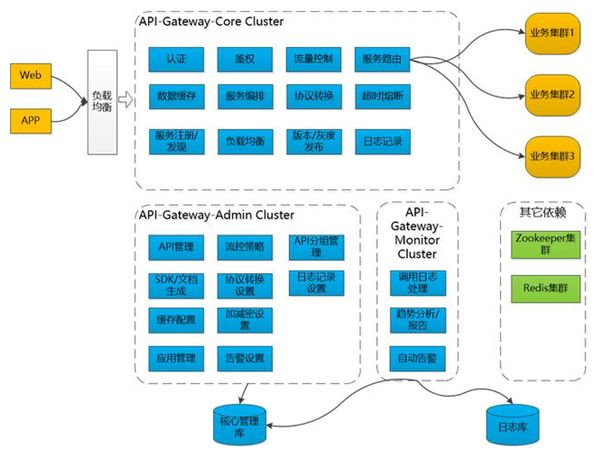

<center><i>API 网关系统架构图</i></center>

API 网关拆分成为 3 个系统：

- **Gateway-Core（核心）**
- **Gateway-Admin（管理）**
- **Gateway-Monitor（监控）**

Gateway-Core 核心网关，负责接收客户端请求，调度、加载和执行组件，将请求路由到上游服务端，并处理其返回的结果。

大多数的功能都在这一层完成，例如：验证，鉴权，负载均衡，协议转换，服务路由，数据缓存。如果没有其他两个子系统，它也是可以单独运行的。

Gateway-Admin 网关管理界面，可以进行 API、组件等系统基础信息的配置；例如：限流的策略，缓存配置，告警设置。

Gateway-Monitor 监控日志、生成各种运维管理报表、自动告警等；管理和监控系统主要是为核心系统服务的，起到支撑的作用。

## API 网关技术原理

上面谈到了网关的架构思路，这里谈几点技术原理。平时我们在使用网关的时候，多注重其实现的功能。例如：路由，负载均衡，限流，缓存，日志，发布等等。

实际上这些功能的背后有一些原理我们可以了解，这样在应用功能的时候会更加笃定。下面是几个原理分享给大家。

### 协议转换

每个系统内部服务之间的调用，可以统一使用一种协议，例如：HTTP，GRPC。

假设每个系统使用的协议不同，那么系统之间的调用或者数据传输，就存在协议转换的问题了。如果解决这个问题呢？API 网关通过泛化调用的方式实现协议之间的转化。

实际上就是将不同的协议转换成“通用协议”，然后再将通用协议转化成本地系统能够识别的协议。

这一转化工作通常在 API 网关完成。通用协议用得比较多的有 JSON，当然也有使用 XML 或者自定义 JSON 文件的。


<center><i>不同的协议需要转化成共同语言进行传输</i></center>

### 链式处理

设计模式中有一种责任链模式，它将“处理请求”和“处理步骤”分开。每个处理步骤，只关心这个步骤上需要做的处理操作，处理步骤存在先后顺序。

消息从第一个“处理步骤”流入，从最后一个“处理步骤”流出，每个步骤对经过的消息进行处理，整个过程形成了一个链条。在 API 网关中也用到了类似的模式。


<center><i>Zuul 网关过滤器链式处理</i></center>

下面以 Zuul 为例，当消息出入网关需要经历一系列的过滤器。这些过滤器之间是有先后顺序的，并且在每个过滤器需要进行的工作也是各不一样：

- **PRE：**前置过滤器，用来处理通用事务，比如鉴权，限流，熔断降级，缓存。并且可以通过 Custom 过滤器进行扩展。
- **ROUTING：**路由过滤器，在这种过滤器中把用户请求发送给 Origin Server。它主要负责：协议转化和路由的工作。
- **POST：**后置过滤器，从 Origin Server 返回的响应信息会经过它，再返回给调用者。在返回的 Response 上加入 Response Header，同时可以做 Response 的统计和日志记录。
- **ERROR：**错误过滤器，当上面三个过滤器发生异常时，错误信息会进到这里，并对错误进行处理。


### 异步请求

所有的请求通过 API 网关访问应用服务，一旦吞吐量上去了，如何高效地处理这些请求？

**拿 Zuul 为例，Zuul1 采用：**一个线程处理一个请求的方式。线程负责接受请求，然后调用应用返回结果。

如果把网络请求看成一次 IO 操作的话，处理请求的线程，从接受请求，到服务返回响应，都是阻塞状态。

同时，如果多个线程都处在这种状态，会导致系统缓慢。因为每个网关能够开启的线程数量是有限的，特别是在访问的高峰期。


<center><i>每个线程处理一个请求</i></center>


为了解决这个问题，Zuul2 启动了异步请求的机制。每个请求进入网关的时候，会被包装成一个事件，CPU 内核会维持一个监听器，不断轮询“请求事件”。

一旦，发现请求事件，就会调用对应的应用。获取应用返回的信息以后，按照请求的要求把数据/文件放到指定的缓冲区，同时发送一个通知事件，告诉请求端数据已经就绪，可以从这个缓冲获取数据/文件。

这个过程是异步的，请求的线程不用一直等待数据的返回。它在请求完毕以后，就直接返回了，这时它可以做其他的事情。

当请求数据被 CPU 内核获取，并且发送到指定的数据缓冲区时，请求的线程会接到“数据返回”的通知，然后就直接使用数据，不用自己去做取数据的操作。


<center><i>异步请求处理，CPU 处理数据以后通知请求端</i></center>

实现异步处理请求有两种模式，分别是：

- **Reactor**
- **Proactor**


<center><i>Reactor 工作原理流水图</i></center>

**Reactor：**通过 handle_events 事件循环处理请求。用户线程注册事件处理器之后，可以继续执行其他的工作（异步），而 Reactor 线程负责调用内核的 Select 函数检查 Socket 状态。


当有 Socket 被激活时（获取网络数据），则通知相应的用户线程，执行 handle_event 进行数据读取、处理的工作。


<center><i>Proactor 工作原理流水图</i></center>

**Proactor：**用户线程使用 CPU 内核提供的异步 IO 发起请求，请求发起以后立即返回。CPU 内核继续执行用户请求线程代码。

此时用户线程已将 AsynchronousOperation（异步处理）和 CompletionHandler（完成获取资源）注册到内核。之后操作系统开启独立的内核线程去处理 IO 操作。

当请求的数据到达时，由内核负责读取 Socket（网络请求）中的数据，并写入用户指定的缓冲区中。

最后内核将数据和用户线程注册的 CompletionHandler 分发给内部 Proactor，Proactor 将 IO 完成的信息通知给用户线程（一般通过调用用户线程注册的完成事件处理函数），完成异步 IO。

## API 网关实现功能

说起对 API 网关的使用，我们还是对具体功能更加感兴趣。让我们一起来看看它实现了哪些功能。

### 负载均衡

当网关后面挂接同一应用的多个副本时，每次用户的请求都会通过网关的负载均衡算法，路由到对应的服务上面。例如：随机算法，权重算法，Hash 算法等等。

如果上游服务采取微服务的架构，也可以和注册中心合作实现动态的负载均衡。

当微服务动态挂载（动态扩容）的时候，可以通过服务注册中心获取微服务的注册信息，从而实现负载均衡。

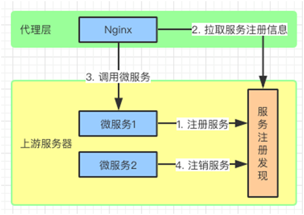

<center><i>Nginx+Lua+服务注册中心实现动态负载均衡</i></center>

### 路由选择

这个不言而喻，网关可以根据请求的 URL 地址解析，知道需要访问的服务。再通过路由表把请求路由到目标服务上去。

有时候因为网络原因，服务可能会暂时的不可用，这个时候我们希望可以再次对服务进行重试。

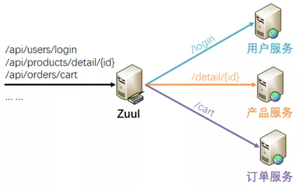

<center><i>Zuul 作为 API 网关将请求路由到上游服务器</i></center>

例如：Zuul 与 Spring Retry 合作完成路由重试。

```properties
#是否开启重试功能
zuul.retryable=true
#对当前服务的重试次数
ribbon.MaxAutoRetries=2
```

### 流量控制

限流是 API 网关常用的功能之一，当上游服务超出请求承载范围，或者服务因为某种原因无法正常使用，都会导致服务处理能力下滑。

这个时候，API 网关作为“看门人”，就可以限制流入的请求，让应用服务器免受冲击。

限流实际上就是限制流入请求的数量，其算法不少，有令牌桶算法，漏桶算法，连接数限制等等。这里我们就介绍三个常用的，一般通过 Nginx+Lua 来实现。


<center><i>令牌桶限流</i></center>


### 统一鉴权

访问应用服务器的请求都需要拥有一定权限，如果说每访问一个服务都需要验证一次权限，这个对效率是很大的影响。可以把权限认证放到 API 网关来进行。

目前比较常见的做法是，用户通过登录服务获取 Token，把它存放到客户端，在每次请求的时候把这个 Token 放入请求头，一起发送给服务器。

API 网关要做的事情就是解析这个 Token，知道访问者是谁（鉴定），他能做什么/访问什么（权限）。

说白了就是看访问者能够访问哪些 URL，这里根据权限/角色定义一个访问列表。

如果要实现多个系统的 OSS（Single Sign On 单点登录），API 网关需要和 CAS（Central Authentication Service 中心鉴权服务）做连接，来确定请求者的身份和权限。


### 熔断降级

当应用服务出现异常，不能继续提供服务的时候，也就是说应用服务不可用了。作为 API 网关需要做出处理，把请求导入到其他服务上。

或者对服务进行降级处理，例如：用兜底的服务数据返回客户端，或者提示服务暂时不可用。

同时通过服务注册中心，监听存在问题的服务，一旦服务恢复，随即恢复路由请求到该服务。

例如：Zuul 中提供了 ZuulFallbackProvider 接口来实现熔断，它提供两个方法，一个指明熔断拦截的服务 getRoute，一个指定返回内容 ClientHttpResponse。

```java
public  interface ZuulFallbackProvider {
   /**
     * The route this fallback will be used  for.
     * @return The route the fallback will be  used for.
     */
    public String getRoute();

    /**
     * Provides a fallback response.
     * @return The fallback response.
     */
    public  ClientHttpResponsefallbackResponse();
}
```


我们通过自定义的 Fallback 方法，并且将其指定给某个 Route 来实现该 Route 访问出问题的熔断处理。

主要继承 ZuulFallbackProvider 接口来实现，ZuulFallbackProvider 默认有两个方法，一个用来指明熔断拦截哪个服务，一个定制返回内容。

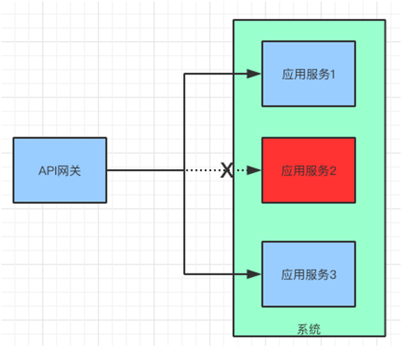

<center><i>API 网关熔断降级</i></center>


### 发布测试

在发布版本的时候会采用：金丝雀发布和蓝绿发布。作为 API 网关可以使用路由选择和流量切换来协助上述行为。这里以金丝雀发布为例，看看 API 网关如何做路由转换的。

假设将 4 个服务从 V1 更新到 V2 版本，这 4 个服务的流量请求由 1 个 API 网关管理。

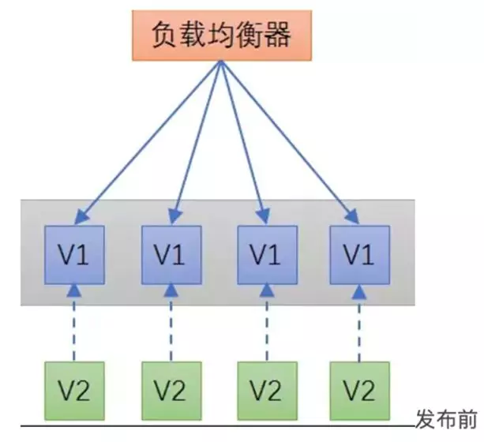

那么先将一台服务与 API 网关断开，部署 V2 版本的服务，然后 API 网关再将流量导入到 V2 版本的服务上。


这里流量的导入可以是逐步进行的，一旦 V2 版本的服务趋于稳定。再如法炮制，将其他服务替换成 V2 版本。


金丝雀发布一般先发 1 台，或者一个小比例，例如 2% 的服务器，主要做流量验证用，也称为金丝雀（Canary）测试（灰度测试）。

其来历是，旷工下矿洞前，先放一只金丝雀探查是否有毒气，金丝雀发布由此得名。

金丝雀测试需要完善的监控设施配合，通过监控指标反馈，观察金丝雀的健康状况，作为后续发布或回滚的依据。

如果金丝测试通过，则把剩余的 V1 版本全部升级为 V2 版本。如果金丝雀测试失败，则直接回退金丝雀，发布失败。


### 缓存数据


我们可以在 API 网关缓存一些修改频率不高的数据。*例如：用户信息，配置信息，通过服务定期刷新这个缓存就行了*：

- 用户请求先访问 API 网关，如果发现有缓存信息，直接返回给用户。
- 如果没有发现缓存信息，回源到应用服务器获取信息。
- 另外，有一个缓存更新服务，定期把应用服务器中的信息更新到网关本地缓存中。


### 日志记录

通过 API 网关上的过滤器我们可以加入日志服务，记录请求和返回信息。同时可以建立一个管理员的界面去监控这些数据。


<center><i>日志服务简图</i></center>


日志记录了以后，可以做很多功能扩展。我们整理了以下几点供大家参考：

- **报表分析：**针对服务访问情况，提供可视化展示。
- **实时查询：**了解实时关键信息，例如：吞吐量，并发数。在秒杀活动的时候，会特别关注。
- **异常告警：**针对关键参数进行监控，对于统计结果支持阈值报警，对接阿里云通知中心、短信、钉钉进行告警。
- **日志投递：**将日志进行归档，存放到文件库或者数据仓库中，以便后期分析。


<center><i>日志记录衍生的功能</i></center>


## 流行 API 网关对比

在介绍了 API 网关的功能以后，再来看看目前几个流行的 API 网关项目。看看他们各自的特点，并且把他们做一个简单的比较。这些网关目前都是开源的，大家可以有选择地在项目中使用。

### Kong

Kong 是 Mash ape 公司的开源项目，它是一个在 Nginx 中运行的 Lua 应用程序，并且可以通过 Lua-Nginx 模块实现扩展。

所以，可以通过插件集合的方式定制功能，例如：HTTP 基本认证、密钥认证、CORS（Cross-origin Resource Sharing，跨域资源共享）、TCP、UDP、日志、API 限流、请求转发以及监控，都是目前已有的插件。

由于是基于 Nginx 的，所以可以对网关进行水平扩展，来应对大批量的网络请求。

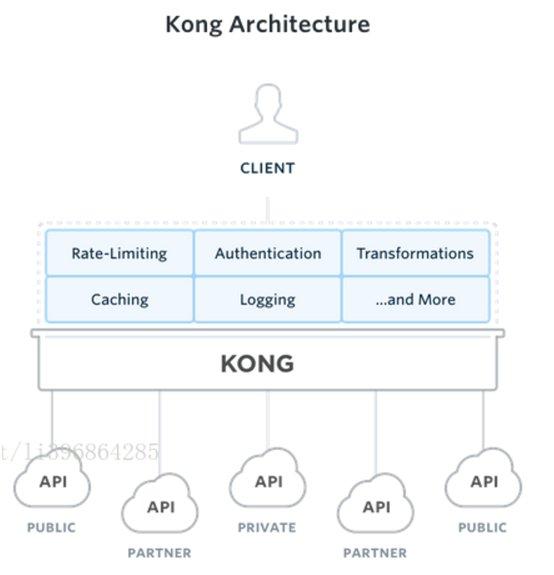

<center><i>Kong 架构图</i></center>

Kong 主要有三个组件：

- **KongServer ：**基于 Nginx 的服务器，用来接收 API 请求。
- **ApacheCassandra/PostgreSQL：**用来存储操作数据。
- **Kongdashboard：**UI 管理工具。


### Traefik


<center><i>Traefik 架构图</i></center>


Traefik 是 HTTP 反向代理和负载均衡器，可以轻松部署微服务，可以与现有的组件（Docker、Swarm，Kubernetes，Marathon，Consul，Etcd）做集成。

因为支持动态配置，所以它的伸缩性很好。不过它只支持 HTTP、HTTPS 和 GRPC。如果你需要 TCP 负载均衡，那么您需要选择其他方案了。


### Ambassador


<center><i>Ambassador 架构图</i></center>

Ambassador 是一个基于 Envoy Proxy 构建的，Kubernetes 原生的开源微服务网关。

它在构建之初就致力于支持多个独立的团队，这些团队需要为最终用户快速发布、监控和更新服务。

Ambassador 还具有 Kubernetes Ingress 和负载均衡的能力。它支持处理 Kubernetes Ingress Controller 和负载均衡等功能，可以与 Istio 无缝集成。


### Zuul


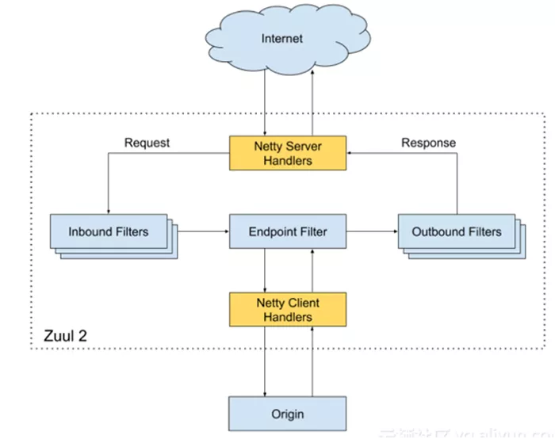

<center><i>Zuul 2 结构图</i></center>


Zuul 是 Spring Cloud 全家桶中的微服务 API 网关。所有从设备或网站来的请求都会经过 Zuul 到达后端的 Netflix 应用程序。

作为一个边界性质的应用程序，Zuul 提供了动态路由、监控、弹性负载和安全功能。包括 Zuul1 和 Zuul2 两个版本。


介绍了几个开源 API 网关的基本信息以后，我们从几个维度对他们进行比较：


从开源社区活跃度来说，Kong 和 Traefik 较好；从成熟度来看，较好的是 Kong、Traefik；从架构优势的扩展性来看，Kong 有丰富的插件，Ambassador 也有插件但不多，而 Zuul 是需要自研。

但 Zuul 由于与 Spring Cloud 集成，如果使用 Spring Cloud 的小伙伴可以考虑使用。


## 总结

API 网关是系统内外通讯的中介者。从定位上来说它服务 WebApp，MobileApp，合作伙伴 OpenAPI，企业内部可扩展 API，以及 IOT 设备。

从架构设计角度来说，分为 Gateway-Core（核心）、Gateway-Admin（管理）、Gateway-Monitor（监控）三部分。

API 网关需要注意的技术原理有，协议转换，链式处理以及异步请求。它的应用比较广泛，例如：负载均衡，路由选择，流量控制，统一鉴权，熔断降级，发布测试，缓存数据，日志记录等。

比较流行的开源 API网关有 Kong，Traefik，Ambassador，Zuul。从使用上来说他们各有千秋，可以根据项目的情况选取。

> 转载自https://mp.weixin.qq.com/s?__biz=MjM5ODI5Njc2MA==&mid=2655826846&idx=1&sn=483ea4f2d1d34f921ef07e35a4af63c1&chksm=bd74fe498a03775fc5980c568e1af13f53c64ebaaedea643dc4ec03acc338fac7a323e3656a7&scene=21#wechat_redirect 原*作者：崔皓*


# 各大API网关性能比较

API网关最基本的功能就是反向代理，所以在对API网关做技术选型的时候需要着重考察其性能表现，本文对Nginx、Haproxy、Netty、Spring Cloud Gateway、Zuul2做了性能测试，测试代码可以在[github](https://github.com/chanjarster/api-gateways-comparison)获得。

## 测试方法

- 准备了三台2CPU 4G内存的服务器，分别运行Tomcat、API Gateway、Gatling（压测工具）
- 先对Tomcat做压测，取Tomcat充分预热后的压测结果作为基准。压的是Tomcat自带的example：`/examples/jsp/jsp2/simpletag/book.jsp`
- 在对Netty、Zuul2、Spring Cloud Gateway做压测时候也是先压个几轮做预热。
- 被测的API网关都没有添加额外业务，只做反向代理

## 吞吐量

下图是吞吐量的情况，可以看到Netty、Nginx、Haproxy均比直压Tomcat低一点点，而Spring Cloud Gateway和Zuul2则要低得多。

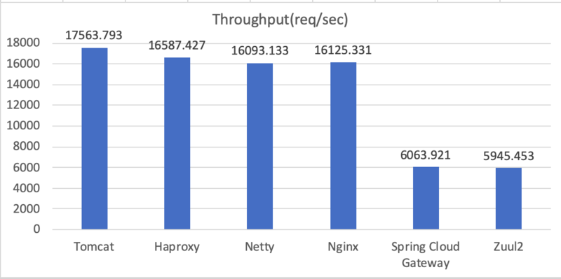

下面这张图可以更明显的看到吞吐量比较，Tomcat为100%因为它是基准值，Netty、Nginx、Haproxy的只比基准值低8%，而Spring Cloud Gateway和Zuul2则只是基准值的35%和34%（难兄难弟）。

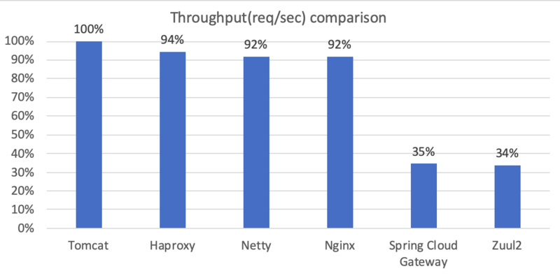

## 平均响应时间

下图可以看到Netty、Nginx、Haproxy的平均响应时间与Tomcat差不多。但是Spring Cloud Gateway和Zuul2则是Tomcat的3倍多，不出所料。

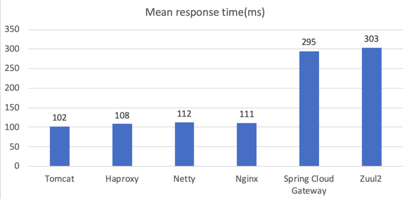

下图同样是以Tomcat作为基准值的比较：


## 响应时间分布

光看平均响应时间是不够的，我们还得看P50、P90、P99、P99.9以及Max响应时间（可惜Gatling只能设置4个百分位，否则我还想看看P99.99的响应时间）。

> 为何要观察P99.9的响应时间？光看P90不够吗？理由有两个：
>
> 1）观察P99、P99.9、P99.99的响应时间可以观察系统的在高压情况下的稳定性，如果这三个时间的增长比较平滑那么说明该系统在高压力情况下比较稳定，如果这个曲线非常陡峭则说明不稳定。
>
> 2）观察P99、P99.9、P99.99的响应时间能够帮助你估算用户体验。假设你有一个页面会发出5次请求，那么这5次请求均落在P90以内概率是多少？90%^5=59%，至少会经历一次 > P90响应时间的概率是 100%-59%=41%，如果你的P90=10s，那么就意味着用户有41%的概率会在加载页面的时候超过10s，是不是很惊人？如果你的P99=10s，那么用户只有5%的概率会在访问页面的时候超过10s。如果P99.9=10s，则有0.4%的概率。
>
> 关于如何正确测量系统可以看 [“How NOT to Measure Latency” by Gil Tene](https://www.youtube.com/watch?v=lJ8ydIuPFeU)

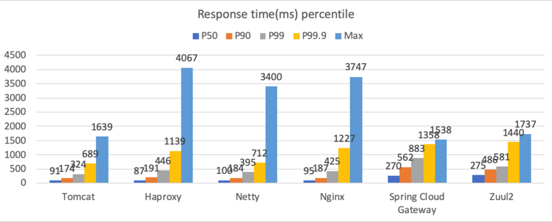

下面同样是把结果与Tomcat基准值做对比：


可以看到几个很有趣的现象：

- Haproxy、Nginx的P50、P90、P99、P99.9、Max都是逐渐递增的。
- Netty的P50、P90、P99、P99.9是很平坦的，Max则为基准值的207%。
- Spring Cloud Gateway和Zuul2则是相反的，它们的平面呈现下降趋势。Spring Cloud Gateway的Max甚至还比基准值低了一点点（94%），我相信这只是一个随机出现的数字，不要太在意。

## 结论

Nginx、Haproxy、Netty三者的表现均很不错，其对于吞吐量和响应时间的性能损耗很低，可以忽略不计。

但是目前最为火热的Spring Cloud Gateway和Zuul2则表现得比较糟糕，因我没有写额外的业务逻辑这，可以推测这和它们的内置逻辑有关，那么大致有这么几种可能：

1. 内置逻辑比较多
2. 内置逻辑算法存在问题，占用了太多CPU时间
3. 内置逻辑存在阻塞
4. 内置逻辑没有用正确姿势使用Netty（两者皆基于Netty）

不管是上面的哪一种都需要再后续分析。

不过话说回来考虑选用那种作为API网关（的基础技术）不光要看性能，还要看：

- 是否易于扩展自己的业务逻辑
- API使用的便利性
- 代码的可维护性
- 文档是否齐全
- ...

性能只是我们手里的一个筹码，当我们知道这个东西性能到底几何后，才可以与上面的这些做交换（trade-off）。比如Nginx和Haproxy的可扩展性很差，那么我们可以使用Netty。如果你觉得Netty的API太底层了太难用了，那么可以考虑`Spring Cloud Gateway`或`Zuul2`。前提是你知道你会失去多少性能。