# 基本概念

## 概念一：单库


## 概念二：分片


分片解决“数据量太大”这一问题，也就是通常说的“水平切分”。

一旦引入分片，势必面临“数据路由”的新问题，数据到底要访问哪个库。路由规则通常有3种方法：

<!-- more -->

### （1）范围：range

优点：简单，容易扩展。

缺点：各库压力不均（新号段更活跃）。

### （2）哈希：hash

优点：简单，数据均衡，负载均匀。

缺点：迁移麻烦（2库扩3库数据要迁移）。

### （3）统一路由服务：router-config-server

优点：灵活性强，业务与路由算法解耦。

缺点：每次访问数据库前多一次查询。

大部分互联网公司采用的方案二：哈希路由。


## 概念三：分组


分组解决“可用性，性能提升”这一问题，分组通常通过主从复制的方式实现。

互联网公司数据库实际软件架构是“既分片，又分组”：


------

数据库软件架构，究竟设计些什么呢，至少要考虑以下四点：

- 如何保证数据可用性
- 如何提高数据库读性能（大部分应用读多写少，读会先成为瓶颈）
- 如何保证一致性
- 如何提高扩展性

------

# 如何保证数据的可用性？

解决可用性问题的思路是：冗余。

> 如何保证站点的可用性？冗余站点。
> 如何保证服务的可用性？冗余服务。
> 如何保证数据的可用性？冗余数据。

数据的冗余，会带来一个副作用：一致性问题。

## 如何保证数据库“读”高可用？

> 冗余读库


冗余读库带来什么副作用？

读写有延时，数据可能不一致。

上图是很多互联网公司mysql的架构，写仍然是单点，不能保证写高可用。


## 如何保证数据库“写”高可用？

> 冗余写库。


采用双主互备的方式，可以冗余写库。

冗余写库带来什么副作用？

双写同步，数据可能冲突（例如“自增id”同步冲突）。

> 如何解决同步冲突，有两种常见解决方案：
> （1）两个写库使用不同的初始值，相同的步长来增加id：1写库的id为0,2,4,6...；2写库的id为1,3,5,7…；
> （2）不使用数据的id，业务层自己生成唯一的id，保证数据不冲突；

阿里云的RDS服务号称写高可用，是如何实现的呢？

他们采用的就是类似于“双主同步”的方式（不再有从库了）。

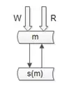
仍是双主，但只有一个主提供读写服务，另一个主是“shadow-master”，只用来保证高可用，平时不提供服务。

master挂了，shadow-master顶上，虚IP漂移，对业务层透明，不需要人工介入。

> 这种方式的好处：
> （1）读写没有延时，无一致性问题；
> （2）读写高可用；

> 不足是：
> （1）不能通过加从库的方式扩展读性能；
> （2）资源利用率为50%，一台冗余主没有提供服务；

*画外音：所以，高可用RDS还挺贵的。*

# 如何扩展读性能？

提高读性能的方式大致有三种，

## 第一种是增加索引。

这种方式不展开，要提到的一点是，不同的库可以建立不同的索引。


如上图：

（1）写库不建立索引；
（2）线上读库建立线上访问索引，例如uid；
（3）线下读库建立线下访问索引，例如time；


## 第二种扩充读性能的方式是，增加从库。

这种方法大家用的比较多，存在两个缺点：

（1）从库越多，同步越慢；
（2）同步越慢，数据不一致窗口越大；


## 第三种增加系统读性能的方式是，增加缓存。

常见的缓存架构如下：


（1）上游是业务应用；
（2）下游是主库，从库（读写分离），缓存；


如果系统架构实施了服务化：

（1）上游是业务应用；
（2）中间是服务；
（3）下游是主库，从库，缓存；

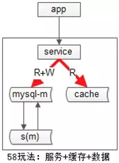
业务层不直接面向db和cache，服务层屏蔽了底层db、cache的复杂性。

不管采用主从的方式扩展读性能，还是缓存的方式扩展读性能，数据都要复制多份（主+从，db+cache），一定会引发一致性问题。


# 如何保证一致性？

主从数据库的一致性，通常有两种解决方案：

## 中间件


如果某一个key有写操作，在不一致时间窗口内，中间件会将这个key的读操作也路由到主库上。


## 强制读主


“双主高可用”的架构，主从一致性的问题能够大大缓解。


第二类不一致，是db与缓存间的不一致。


这一类不一致，[《缓存架构，一篇足够？》](http://mp.weixin.qq.com/s?__biz=MjM5ODYxMDA5OQ==&mid=2651961368&idx=1&sn=82a59f41332e11a29c5759248bc1ba17&chksm=bd2d0dc48a5a84d293f5999760b994cee9b7e20e240c04d0ed442e139f84ebacf608d51f4342&scene=21#wechat_redirect)里有非常详细的叙述，本文不再展开。

另外建议，所有允许cache miss的业务场景，缓存中的KEY都设置一个超时时间，这样即使出现不一致，有机会得到自修复。


# 如何保障数据库的扩展性？

## 秒级成倍数据库扩容

《[亿级数据DB秒级平滑扩容](http://mp.weixin.qq.com/s?__biz=MjM5ODYxMDA5OQ==&mid=2651962231&idx=1&sn=1b51d042c243f0b3ce0b748ddbcff865&chksm=bd2d0eab8a5a87bdcbe7dd08fb4c969ad76fa0ea00b2c78645db8561fd2a78d813d7b8bef2ac&scene=21#wechat_redirect)》

一步一步，娓娓道来。

**一般来说，并发量大，吞吐量大的互联网分层架构是怎么样的？**

数据库上层都有一个微服务，服务层记录“业务库”与“数据库实例配置”的映射关系，通过数据库连接池向数据库路由sql语句。


如上图所示，服务层配置用户库user对应的数据库实例ip。

*画外音：其实是一个内网域名。*


### 该分层架构，如何应对数据库的高可用？

数据库高可用，很常见的一种方式，使用双主同步+keepalived+虚ip的方式进行。


如上图所示，两个相互同步的主库使用相同的虚ip。


当主库挂掉的时候，虚ip自动漂移到另一个主库，整个过程对调用方透明，通过这种方式保证数据库的高可用。

*画外音：关于高可用，《[互联网分层架构如何保证“高可用“？](http://mp.weixin.qq.com/s?__biz=MjM5ODYxMDA5OQ==&mid=2651962050&idx=1&sn=f60b8bb833fe3425f5227da42e3b3adf&chksm=bd2d0f1e8a5a8608f81d42a16eea476d0bd4763f84f9a008ed616d1cfa050a4015780f898eb1&scene=21#wechat_redirect)》专题介绍过，本文不再展开。*

-----

### 该分层架构，如何应对数据量的暴增？

随着数据量的增大，数据库要进行水平切分，分库后将数据分布到不同的数据库实例（甚至物理机器）上，以达到降低数据量，增强性能的扩容目的。


如上图所示，用户库user分布在两个实例上，ip0和ip1，服务层通过用户标识uid取模的方式进行寻库路由，模2余0的访问ip0上的user库，模2余1的访问ip1上的user库。

*画外音：此时，水平切分集群的读写实例加倍，单个实例的数据量减半，性能增长可不止一倍。*

综上三点所述，大数据量，高可用的互联网微服务分层的架构如下：


既有水平切分，又保证高可用。


**如果数据量持续增大，2个库性能扛不住了，该怎么办呢？**

此时，需要继续水平拆分，拆成更多的库，降低单库数据量，增加库主库实例（机器）数量，提高性能。


**新的问题来了，分成n个库后，随着数据量的增加，要增加到2\*n个库，数据库如何扩容，数据能否平滑迁移，能够持续对外提供服务，保证服务的可用性？**

*画外音：你遇到过类似的问题么？*

 

**停服扩容，是最容易想到的方案？**

在讨论秒级平滑扩容方案之前，先简要说明下停服务扩容的方案的步骤：

（1）站点挂一个公告“为了为广大用户提供更好的服务，本站点/游戏将在今晚00:00-2:00之间升级，届时将不能登录，用户周知”；

*画外音：见过这样的公告么，实际上在迁移数据。*

（2）**微服务停止服务**，数据库不再有流量写入；

（3）**新建2*n个新库**，并做好高可用；

**（4）**写一个小脚本进行**数据迁移**，把数据从n个库里select出来，insert到2*n个库里；

（5）**修改微服务的数据库路由配置**，模n变为模2*n；


（6）**微服务重启**，连接新库重新对外提供服务；

整个过程中，最耗时的是第四步数据迁移。


**如果出现问题，如何进行回滚？**

如果数据迁移失败，或者迁移后测试失败，则将**配置改回旧库，恢复服务**即可。

**停服方案有什么优劣？**

优点：**简单**。

缺点：

（1）需要停止服务，**方案不高可用**；

（2）技术同学压力大，所有工作要在规定时间内完成，根据经验，压力越大约容易出错；

*画外音：这一点很致命。*

（3）如果有问题第一时间没检查出来，启动了服务，运行一段时间后再发现有问题，则难以回滚，如果**回档会丢失一部分数据**；


### 有没有秒级实施、更平滑、更帅气的方案呢？


再次看一眼扩容前的架构，分两个库，假设每个库1亿数据量，**如何**平滑扩容，增加实例数，降低单库数据量呢？三个简单步骤搞定。

#### 步骤一：修改配置


主要修改两处：

- 数据库实例所在的机器做**双虚ip**：

（1）原%2=0的库是虚ip0，现增加一个虚ip00；

（2）原%2=1的库是虚ip1，现增加一个虚ip11；

- 修改服务的配置，将2个库的**数据库配置**，改为4个库的数据库配置，修改的时候要注意旧库与新库的映射关系：

（1）%2=0的库，会变为%4=0与%4=2；

（2）%2=1的部分，会变为%4=1与%4=3；

*画外音：这样能够保证，依然路由到正确的数据。*

 

#### 步骤二：reload配置，实例扩容


服务层reload配置，reload可能是这么几种方式：

（a）比较原始的，重启服务，读新的配置文件；
（b）高级一点的，配置中心给服务发信号，重读配置文件，重新初始化数据库连接池；

不管哪种方式，reload之后，数据库的实例扩容就完成了，原来是2个数据库实例提供服务，现在变为4个数据库实例提供服务，这个过程一般可以在秒级完成。


整个过程可以逐步重启，对服务的正确性和可用性完全没有影响：

（a）**即使%2寻库和%4寻库同时存在，也不影响数据的正确性**，因为此时仍然是双主数据同步的；
（b）**即使%4=0与%4=2的寻库落到同一个数据库实例上，也不影响数据的正确性**，因为此时仍然是双主数据同步的；

完成了实例的扩展，会发现每个数据库的数据量依然没有下降，所以第三个步骤还要做一些收尾工作。

*画外音：这一步，数据库实例个数加倍了。*


#### 步骤三：收尾工作，数据收缩


有这些一些收尾工作：

（a）把双虚ip修改回单虚ip；

（b）解除旧的双主同步，让成对库的数据不再同步增加；

（c）增加新的双主同步，保证高可用；

（d）删除掉冗余数据，例如：ip0里%4=2的数据全部删除，只为%4=0的数据提供服务；

*画外音：这一步，数据库单实例数据量减半了。*

### 总结


互联网大数据量，高吞吐量，高可用微服务分层架构，数据库实现秒级平滑扩容的三个步骤为：

（1）修改配置（双虚ip，微服务数据库路由）；

（2）reload配置，**实例增倍**完成；

（3）删除冗余数据等收尾工作，**数据量减半**完成；

**思路**比结论重要，希望大家有收获。

## 100亿数据，非“双倍”扩容，如何不影响服务，数据平滑迁移？

如果不是成倍扩容：

《[100亿数据平滑数据迁移,不影响服务](http://mp.weixin.qq.com/s?__biz=MjM5ODYxMDA5OQ==&mid=2651962270&idx=1&sn=3131888f29d0d137d02703a6dc91fa56&chksm=bd2d0e428a5a87547dfc6a0a292a7746ad50b74a078e29b4b8024633fa42db6ccc5f47435063&scene=21#wechat_redirect)》

如果不是“双倍”扩容，能否做到平滑迁移，不影响服务呢？

### 适用什么场景？

互联网有很多“数据量较大，并发量较大，业务复杂度较高”的业务场景，其典型系统分层架构如下：

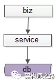

（1）上游是**业务层biz**，实现个性化的业务逻辑；
（2）中游是**服务层service**，封装数据访问；
（3）下游是**数据层db**，存储固化的业务数据；


服务化分层架构的好处是，服务层屏蔽下游数据层的复杂性，例如缓存、分库分表、存储引擎等存储细节不需要向调用方暴露，而只向上游提供方便的RPC访问接口，当有一些数据层变化的时候，所有的调用方也不需要升级，只需要服务层升级即可。

互联网架构，很多时候面临着这样一些需求：


**（1）底层表结构变更**：数据量非常大的情况下，数据表增加了一些属性，删除了一些属性，修改了一些属性。


**（2）分库个数变化**：由于数据量的持续增加，底层分库个数非成倍增加。

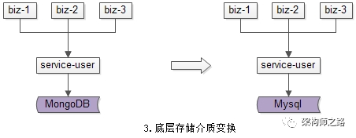

**（3）底层存储介质变化**：底层存储引擎由一个数据库换为另一个数据库。

种种需求，都需要进行数据迁移，如何平滑迁移数据，迁移过程不停机，保证系统持续服务，是文本将要讨论的问题。

#### 方案一：停机方案

在讨论平滑迁移数据方案之前，先看下不平滑的停机数据迁移方案，主要分三个步骤。


**步骤一**：**挂**一个类似“为了给广大用户提供更好的服务，服务器会在凌晨0:00-0:400进行停机维护”的**公告**，并在对应时段进行**停机**，这个时段系统没有流量进入。


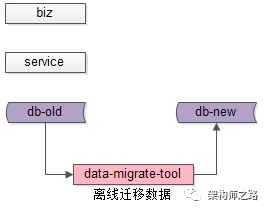

**步骤二**：停机后，研发一个**离线**的数据迁移工具，进行**数据迁移**。针对第一节的三类需求，会分别开发不同的数据迁移工具。

（1）底层表结构变更需求：开发旧表导新表的工具；

（2）分库个数变换需求：开发2库导3库的工具；

（3）底层存储介质变换需求：开发Mongo导Mysql工具；


**步骤三**：**恢复服务**，并将流量切到新库，不同的需求，可能会涉及不同服务升级。

（1）底层表结构变更需求：服务要升级到访问新表；
（2）分库个数变换需求：服务不需要升级，只需要改寻库路由配置；
（3）底层存储介质变换需求：服务升级到访问新的存储介质；

总的来说，停机方案是**相对直观和简单**的，但对**服务的可用性有影响**，许多游戏公司的服务器升级，游戏分区与合区，可能会采用类似的方案。


除了影响服务的可用性，这个方案还有一个缺点，就是必须在指定时间完成升级，这个对研发、测试、运维同学来说，**压力会非常大**，一旦出现问题例如数据不一致，必须在规定时间内解决，否则只能回滚。根据经验，**人压力越大越容易出错**，这个缺点一定程度上是致命的。


无论如何，停机方案并不是今天要讨论的重点，接下来看一下常见的平滑数据迁移方案。

#### 方案二：追日志方案

追日志方案，是一个高可用的平滑迁移方案，这个方案主要分为五个步骤。

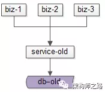

数据迁移前，上游业务应用通过旧的服务访问旧的数据。


**步骤一**：服务进行升级，**记录“对旧库上的数据修改”的日志**（这里的修改，为数据的insert, delete, update），这个日志不需要记录详细数据，主要记录：

（1）被修改的**库**；
（2）被修改的**表**；
（3）被修改的**唯一主键**；

具体新增了什么行，修改后的数据格式是什么，不需要详细记录。这样的好处是，不管业务细节如何变化，日志的格式是固定的，这样能保证方案的通用性。

这个服务升级风险较小：

（1）写接口是少数接口，改动点较少；
（2）升级只是增加了一些日志，对业务功能没有任何影响；


**步骤二**：*研发一个数据迁移工具，进行数据迁移*。这个数据迁移工具和离线迁移工具一样，把旧库中的数据转移到新库中来。

这个小工具的风险较小：

（1）整个过程依然是旧库对线上提供服务；
（2）小工具的复杂度较低；
（3）任何时间发现问题，都可以把新库中的数据干掉重来；
（4）可以限速慢慢迁移，技术同学没有时间压力；

**数据迁移完成之后，就能够切到新库提供服务了么？**

**答案是否定的**，在数据迁移的过程中，旧库依然对线上提供着服务，库中的数据随时可能变化，这个变化并没有反映到新库中来，于是旧库和新库的数据并不一致，所以不能直接切库，需要将数据追平。

**哪些数据发生了变化呢？**

步骤一中日志里记录的，正是变化的数据。


**步骤三**：**研发一个读取日志并迁移数据的小工具，要把步骤二迁移数据过程中产生的差异数据追平**。这个小工具需要做的是：
（1）读取日志，得到哪个库、哪个表、哪个主键发生了变化；
（2）把旧库中对应主键的记录读取出来；
（3）把新库中对应主键的记录替换掉；

无论如何，**原则是数据以旧库为准**。

这个小工具的风险也很小：
（1）整个过程依然是旧库对线上提供服务；
（2）小工具的复杂度较低；
（3）任何时间发现问题，大不了从步骤二开始重来；
（4）可以限速慢慢重放日志，技术同学没有时间压力；

**日志重放之后，就能够切到新库提供服务了么？**

**答案依然是否定的**，在日志重放的过程中，旧库中又可能有数据发生了变化，导致数据不一致，所以还是不能切库，需要进一步读取日志，追平记录。可以看到，重放日志追平数据的程序是一个while(1)的程序，新库与旧库中的**数据追平也会是一个“无限逼近”的过程**。

**什么时候数据会完全一致呢？**


**步骤四**：在持续重放日志，**追平数据的过程中，研发一个数据校验的小工具，将旧库和新库中的数据进行比对，直到数据完全一致**。

这个小工具的风险依旧很小：
（1）整个过程依然是旧库对线上提供服务；
（2）小工具的复杂度较低；
（3）任何时间发现问题，大不了从步骤二开始重来；
（4）可以限速慢慢比对数据，技术同学没有时间压力；

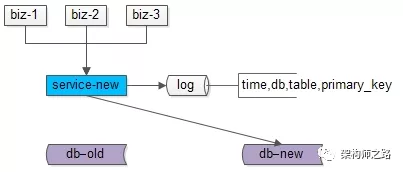

**步骤五**：在数据比对完全一致之后，将**流量迁移到新库**，新库提供服务，完成迁移。

如果步骤四数据一直是99.9%的一致，不能完全一致，也是正常的，可以做一个秒级的旧库readonly，等日志重放程序完全追上数据后，再进行切库切流量。

至此，升级完毕，整个过程能够持续对线上提供服务，不影响服务的可用性。

#### 方案三：双写方案

双写方案，也是一个高可用的平滑迁移方案，这个方案主要分为四个步骤。

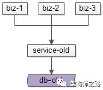

数据迁移前，上游业务应用通过旧的服务访问旧的数据。


**步骤一**：**服务进行升级**，对“对旧库上的数据修改”（这里的修改，为数据的insert, delete, update），在新库上进行相同的修改操作，这就是所谓的“**双写**”，主要修改操作包括：
（1）旧库与新库的同时insert；
（2）旧库与新库的同时delete；
（3）旧库与新库的同时update；

由于新库中此时是没有数据的，所以双写旧库与新库中的affect rows可能不一样，不过这完全不影响业务功能，只要不切库，依然是旧库提供业务服务。

这个服务升级风险较小：
（1）写接口是少数接口，改动点较少；
（2）新库的写操作执行成功与否，对业务功能没有任何影响；


**步骤二**：研发一个数据迁移工具，进行**数据迁移**。这个数据迁移工具在本文中已经出现第三次了，把旧库中的数据转移到新库中来。

这个小工具的风险较小：
（1）整个过程依然是旧库对线上提供服务；
（2）小工具的复杂度较低；
（3）任何时间发现问题，都可以把新库中的数据干掉重来；
（4）可以限速慢慢迁移，技术同学没有时间压力；

**数据迁移完成之后，就能够切到新库提供服务了么？**

**答案是肯定的**，因为前置步骤进行了双写，所以理论上数据迁移完之后，新库与旧库的数据应该完全一致。


由于迁移数据的过程中，旧库新库双写操作在同时进行，**怎么证明数据迁移完成之后数据就完全一致了呢？**

 


如上图所示：

（1）左侧是旧库中的数据，右侧是新库中的数据；

（2）按照primary key从min到max的顺序，分段，限速进行数据的迁移，假设已经迁移到now这个数据段，数据迁移过程中的修改操作分别讨论：

- 假设迁移过程中进行了一个**双insert操作**，旧库新库都插入了数据，数据一致性没有被破坏
- 假设迁移过程中进行了一个**双delete操作**，这又分为两种情况

**情况一**：假设这delete的数据属于[min,now]范围，即已经完成迁移，则旧库新库都删除了数据，`数据一致性`没有被破坏；
**情况二**：假设这delete的数据属于[now,max]范围，即未完成迁移，则旧库中删除操作的affect rows为1，新库中删除操作的affect rows为0，但是数据迁移工具在后续数据迁移中，并不会将这条旧库中被删除的数据迁移到新库中，所以数据一致性仍没有被破坏；

- 假设迁移过程中进行了一个**双update操作**，可以认为update操作是一个delete加一个insert操作的复合操作，所以数据仍然是`一致`的


除非，在一种非常极限的情况下：
（1）date-migrate-tool**刚好**从旧库中将某一条数据X取出；
（2）在X插入到新库中之前，旧库与新库中**刚好**对X进行了双delete操作；
（3）date-migrate-tool再将X插入到新库中；

这样，会出现新库比旧库多出一条数据X。

但无论如何，为了保证数据的一致性，切库之前，还是需要进行数据校验的。


**步骤三**：在数据迁移完成之后，需要**使用数据校验的小工具**，将旧库和新库中的数据进行比对，完全一致则符合预期，如果出现步骤二中的极限不一致情况，则以旧库中的数据为准。

这个小工具的风险依旧很小：
（1）整个过程依然是旧库对线上提供服务；
（2）小工具的复杂度较低；
（3）任何时间发现问题，大不了从步骤二开始重来；
（4）可以限速慢慢比对数据，技术同学没有时间压力；


**步骤四**：数据完全一致之后，将**流量切到新库**，完成平滑数据迁移。

至此，升级完毕，整个过程能够持续对线上提供服务，不影响服务的可用性。

### 总结

针对互联网很多“数据量较大，并发量较大，业务复杂度较高”的业务场景，在：
（1）底层表结构变更；
（2）分库个数变化；
（3）底层存储介质变化；

的众多需求下，需要进行数据迁移，完成**“平滑迁移数据，迁移过程不停机，保证系统持续服务”**有两种常见的解决方案。

**追日志方案**，五个步骤：
（1）**服务进行升级**，`记录`“对旧库上的数据修改”的`日志`；
（2）研发一个数据迁移**小工具**，进行`数据迁移`；
（3）研发一个读取日志**小工具**，`追平数据差异`；
（4）研发一个数据比对**小工具**，`校验数据`一致性；
（5）`流量切到新库`，完成平滑迁移；

**双写方案**，四个步骤：
（1）**服务进行升级**，记录“对旧库上的数据修改”进行新库的`双写`；
（2）研发一个数据迁移**小工具**，进行`数据迁移`；
（3）研发一个数据比对**小工具**，`校验数据`一致性；
（4）`流量切到新库`，完成平滑迁移；

**思路**比结论重要。

## 1万属性，100亿数据，每秒10万吞吐，架构如何设计？

也可能，是要对字段进行扩展：《[1万属性，100亿数据，架构设计？](http://mp.weixin.qq.com/s?__biz=MjM5ODYxMDA5OQ==&mid=2651962219&idx=1&sn=30545c7a9f46fa74a61cc09323a6a8c9&chksm=bd2d0eb78a5a87a1c16b1d10fbb688adb2848345b70fa2fbc161b3a566c7c3e02adaccd5981e&scene=21#wechat_redirect)》，如下：

有一类业务场景，没有固定的schema存储，却有着海量的数据行数，架构上如何来实现这类业务的存储与检索呢？58最核心的数据“帖子”的架构实现技术细节，今天和大家聊一聊。

### 背景描述及业务介绍

**什么是58最核心的数据？**

58是一个信息平台，有很多垂直品类：招聘、房产、二手物品、二手车、黄页等等，每个品类又有很多子品类，不管哪个品类，最核心的数据都是“帖子信息”。

*画外音：像不像一个大论坛？*

**各分类帖子的信息有什么特点？**

逛过58的朋友很容易了解到，这里的帖子信息：
（1）**各品类的属性千差万别**，招聘帖子和二手帖子属性完全不同，二手手机和二手家电的属性又完全不同，目前恐怕有`近万个属性`；
（2）**数据量巨大**，`100亿`级别；
（3）**每个属性上都有查询需求**，各组合属性上都可能有组合查询需求，招聘要查职位/经验/薪酬范围，二手手机要查颜色/价格/型号，二手要查冰箱/洗衣机/空调；
（4）**吞吐量很大**，`每秒几十万吞吐`；

如何解决100亿数据量，1万属性，多属性组合查询，10万并发查询的技术难题呢？一步步来。

### 最容易想到的方案

每个公司的发展都是一个从小到大的过程，撇开并发量和数据量不谈，先看看
（1）如何实现属性扩展性需求；
（2）多属性组合查询需求；
*画外音：公司初期并发量和数据量都不大，必须先解决业务问题。*

**如何满足业务的存储需求呢？**

最开始，业务只有一个招聘品类，那帖子表可能是这么设计的：
tiezi(tid, uid, c1, c2, c3);

**那如何满足各属性之间的组合查询需求呢？**

最容易想到的是通过组合索引满足查询需求：
```
index_1(c1, c2)
index_2(c2, c3)
index_3(c1, c3)
```

**随着业务的发展，又新增了一个房产类别，存储问题又该如何解决呢？**

可以新增若干属性满足存储需求，于是帖子表变成了：
```
tiezi(tid, uid, c1, c2, c3, c10, c11, c12, c13); 
```
其中：
- c1,c2,c3是招聘类别属性
- c10,c11,c12,c13是房产类别属性

通过扩展属性，可以解决存储的问题。

**查询需求，又该如何满足呢？**

首先，跨业务属性一般没有组合查询需求。只能建立了若干组合索引，满足房产类别的查询需求。

*画外音：不敢想有多少个索引能覆盖所有两属性查询，三属性查询。*

**当业务越来越多时，是不是发现玩不下去了？**

### 垂直拆分是一个思路

新增属性是一种扩展方式，新增表也是一种方式，垂直拆分也是常见的存储扩展方案。

**如何按照业务进行垂直拆分？**

可以这么玩：
```
tiezi_zhaopin(tid, uid, c1, c2, c3);

tiezi_fangchan(tid, uid, c10, c11, c12, c13);
```

**在业务各异，数据量和吞吐量都巨大的情况下，垂直拆分会遇到什么问题呢？**

这些表，以及对应的服务维护在不同的部门，看上去各业务灵活性强，研发闭环，这恰恰是悲剧的开始：
（1）tid如何规范？
（2）属性如何规范？
（3）按照uid来查询怎么办（查询自己发布的所有帖子）？
（4）按照时间来查询怎么办（最新发布的帖子）？
（5）跨品类查询怎么办（例如首页搜索框）？
（6）技术范围的扩散，有的用mongo存储，有的用mysql存储，有的自研存储；
（7）重复开发了不少组件；
（8）维护成本过高；
（9）…

*画外音：想想看，电商的商品表，不可能一个类目一个表的。*


### 58的玩法：三大中心服务

#### 第一：统一帖子中心服务

`平台型`创业型公司，可能有多个品类，各品类有很多异构数据的存储需求，到底是分还是合，无需纠结：**基础数据基础服务的统一**，是一个很好的实践。

*画外音：这里说的是平台型业务。*

**如何将不同品类，异构的数据统一存储起来呢？**

（1）全品类通用属性统一存储；
（2）单品类特有属性，品类类型与通用属性json来进行存储；

更具体的：

tiezi(tid, uid, time, title, cate, subcate, xxid, ext);

（1）一些通用的字段抽取出来单独存储；
（2）通过cate, subcate, xxid等来定义ext是何种含义；


（3）通过ext来存储不同业务线的个性化需求

例如：

招聘的帖子，ext为：
```json
{“job”:”driver”,”salary”:8000,”location”:”bj”}
```
而二手的帖子，ext为：
```json
{”type”:”iphone”,”money”:3500}
```

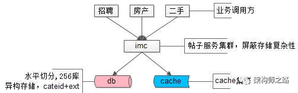

帖子数据，100亿的数据量，分256库，通过ext存储异构业务数据，使用mysql存储，上层架了一个帖子中心服务，使用memcache做缓存，就是这样一个并不复杂的架构，解决了业务的大问题。这是58最核心的帖子中心服务IMC（Info Management Center）。

*画外音：该服务的底层存储在16年全面切换为了自研存储引擎，替换了mysql，但架构理念仍未变。*

解决了海量异构数据的存储问题，遇到的**新问题**是：

（1）每条记录ext内key都需要重复存储，占据了大量的空间，能否压缩存储；
（2）cateid已经不足以描述ext内的内容，品类有层级，深度不确定，ext能否具备自描述性；
（3）随时可以增加属性，保证扩展性；

解决完海量异构数据的存储问题，接下来，要解决的是类目的扩展性问题。

#### 第二：统一类目属性服务

**每个业务有多少属性，这些属性是什么含义，值的约束等，****耦合到帖子服务里****显然是不合理的，那怎么办呢？**

抽象出一个统一的类目、属性服务，单独来管理这些信息，而帖子库ext字段里json的key，统一由数字来表示，减少存储空间。


*画外音：帖子表只存元信息，不管业务含义。*

如上图所示，json里的key不再是”salary” ”location” ”money” 这样的长字符串了，取而代之的是数字1,2,3,4，这些数字是什么含义，属于哪个子分类，值的校验约束，统一都存储在类目、属性服务里。

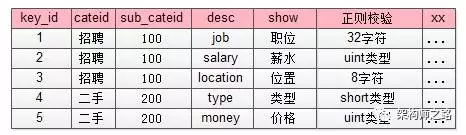

*画外音：类目表存业务信息，以及约束信息，与帖子表解耦。*

这个表里对帖子中心服务里ext字段里的数字key进行了解释：
（1）1代表job，属于招聘品类下100子品类，其value必须是一个小于32的[a-z]字符；
（2）4代表type，属于二手品类下200子品类，其value必须是一个short；

这样就对原来帖子表ext扩展属性：
```json
{“1”:”driver”,”2”:8000,”3”:”bj”}

{”4”:”iphone”,”5”:3500}
```
`key和value都做了统一约束。`


除此之外，如果ext里某个key的value不是正则校验的值，而是枚举值时，需要有一个对值进行限定的枚举表来进行校验：


这个枚举校验，说明key=4的属性（对应属性表里二手，手机类型字段），其值不只是要进行“short类型”校验，而是value必须是固定的枚举值。
```json
{”4”:”iphone”,”5”:3500}
```
这个ext就是不合法的，key=4的value=iphone不合法，而应该是枚举属性，合法的应该为：
```json
{”4”:”5”,”5”:3500}
```

此外，*类目属性服务还能记录类目之间的层级关系*：
（1）一级类目是招聘、房产、二手…
（2）二手下有二级类目二手家具、二手手机…
（3）二手手机下有三级类目二手iphone，二手小米，二手三星…
（4）…


类目服务`解释了帖子数据，描述品类层级关系，保证各类目属性扩展性，保证各属性值合理性校验`，就是58另一个统一的核心服务CMC（Category Management Center）。


> *画外音：类目、属性服务像不像电商系统里的SKU扩展服务？*
> *（1）品类层级关系，对应电商里的类别层级体系；*
> *（2）属性扩展，对应电商里各类别商品SKU的属性；*
> *（3）枚举值校验，对应属性的枚举值，例如颜色：红，黄，蓝；*


通过品类服务，解决了key压缩，key描述，key扩展，value校验，品类层级的问题，还有这样的一个问题没有解决：每个品类下帖子的属性各不相同，查询需求各不相同，**如何解决100亿数据量，1万属性的检索与联合检索需求呢？**

#### 第三：统一检索服务

数据量很大的时候，不同属性上的查询需求，不可能通过组合索引来满足所有查询需求，“外置索引，统一检索服务”是一个很常用的实践：

（1）数据库提供“帖子id”的正排查询需求；
（2）所有非“帖子id”的个性化检索需求，统一走外置索引；


元数据与索引数据的操作遵循：
（1）对帖子进行tid正排查询，直接访问帖子服务；
（2）对帖子进行修改，帖子服务通知检索服务，同时对索引进行修改；
（3）对帖子进行复杂查询，通过检索服务满足需求；

> *画外音：这个检索服务，扛起了58同城80%的请求（不管来自PC还是APP，不管是主页、城市页、分类页、列表页、详情页，最终都会转化为一个检索请求），它就是58另一个统一的核心服务E-search，这个搜索引擎，是完全自研的。*


对于这个内核自研服务的搜索引擎架构，简单说明一下：

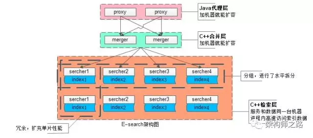

为应对100亿级别数据量、几十万级别的吞吐量，业务线各种复杂的复杂检索查询，`扩展性是设计重点`：
（1）统一的**代理层**，作为入口，其无状态性能够保证增加机器就能扩充系统性能；
（2）统一的**结果聚合层**，其无状态性也能够保证增加机器就能扩充系统性能；
（3）搜索内核**检索层**，服务和索引数据部署在同一台机器上，服务启动时可以加载索引数据到内存，请求访问时从内存中load数据，访问速度很快：

- 为了满足`数据容量的扩展性`，索引数据进行了水平切分，增加切分份数，就能够无限扩展性能
- 为了满足一份`数据的性能扩展性`，同一份数据进行了冗余，理论上做到增加机器就无限扩展性能

系统时延，100亿级别帖子检索，包含请求分合，拉链求交集，从聚合层均可以做到10ms返回。

*画外音：入口层是Java研发的，聚合层与检索层都是C语言研发的。*

帖子业务，一致性不是主要矛盾，E-search会定期全量重建索引，以保证即使数据不一致，也不会持续很长的时间。

### 总结


文章写了很长，最后做一个简单总结，面对100亿数据量，1万列属性，10万吞吐量的业务需求，可以采用了**元数据服务、属性服务、搜索服务来**解决：

- 一个解决存储问题
- 一个解决品类解耦问题
- 一个解决检索问题

任何复杂问题的解决，都是`循序渐进`的。

**思路**比结论重要，希望大家有收获。

## 100亿数据1万属性数据架构设计

《[100亿数据1万属性数据架构设计](https://mp.weixin.qq.com/s?__biz=MjM5ODYxMDA5OQ==&mid=2651959855&idx=1&sn=f33abe8ec598c273f29cebb9365ece59&chksm=bd2d07f38a5a8ee58a944507a134e1da1efc3ac9c4d1c4cff261137cd986e51f5fe7cee9de15&scene=25#wechat_redirect)》

对于version + ext方案，还是有很多朋友质疑“线上不可能这么用”。本篇将讲述一下58同城最核心的数据“帖子”的架构实现技术细节，说明不仅不是“不可能这么用”，而是大数据，可变属性，高吞吐场景下的“常用手段”。

### 背景描述及业务介绍

**问：什么是数据库扩展的version + ext方案？**

使用ext来承载不同业务需求的个性化属性，使用version来标识ext里各个字段的含义。


例如上述user表：
verion=0表示ext里是passwd/nick
version=1表示ext里是passwd/nick/age/sex


**优点？**

（1）可以随时动态扩展属性，扩展性好
（2）新旧两种数据可以同时存在，兼容性好

**不足？**

（1）ext里的字段无法建立索引
（2）ext里的key值有大量冗余，建议key短一些

***问：*什么是58同城最核心的数据？**

58同城是一个信息平台，有很多垂直品类：招聘、房产、二手物品、二手车、黄页等等，每个品类又有很多子品类，不管哪个品类，最核心的数据都是“帖子信息”（业务像一个大论坛？）。


***问：*帖子信息有什么特点？**
大家去58同城的首页上看看就知道了：

（1）`每个品类的属性千差万别`，招聘帖子和二手帖子属性完全不同，二手手机和二手家电的属性又完全不同，目前恐怕有近万个属性
（2）`帖子量很大，100亿级别`
（3）`每个属性上都有查询需求`（各组合属性上都可能有组合查询需求），招聘要查职位/经验/薪酬范围，二手手机要查颜色/价格/型号，二手要查冰箱/洗衣机/空调
（4）`查询量很大，每秒几十万级别`


如何解决**100亿数据量，1万属性，多属性组合查询，10万并发查询**的技术难题，是今天要讨论的内容。

### 最容易想到的方案

每个公司的发展都是一个从小到大的过程，撇开并发量和数据量不谈，先看看

（1）如何实现属性扩展性需求
（2）多属性组合查询需求


最开始，可能只有一个**招聘品类**，那帖子表可能是这么设计的：

tiezi(tid,uid, c1, c2, c3)


那如何满足各属性之间的组合查询需求呢？

最容易想到的是通过组合索引：

index_1(c1,c2) index_2(c2, c3) index_3(c1, c3)


随着业务的发展，又新增了一个**房产类别**，新增了若干属性，新增了若干组合查询，于是帖子表变成了：

tiezi(tid,uid, c1, c2, c3, c10, c11, c12, c13)

其中c1,c2,c3是招聘类别属性，c10,c11,c12,c13是房产类别属性，这两块属性一般没有组合查询需求

但为了满足房产类别的查询需求，又要建立了若干组合索引（不敢想有多少个索引能覆盖所有两属性查询，三属性查询）

是不是发现玩不下去了？


### 友商的玩法

新增属性是一种扩展方式，新增表也是一种方式，有友商是这么玩的，按照业务进行垂直拆分：

> tiezi_zhaopin(tid,uid, c1, c2, c3)
> tiezi_fangchan(tid,uid, c10, c11, c12, c13)

这些表，这些服务维护在不同的部门，不同的研发同学手里，看上去各业务线灵活性强，这恰恰是悲剧的开始：

（1）tid如何规范？
（2）属性如何规范？
（3）按照uid来查询怎么办（查询自己发布的所有帖子）？
（4）按照时间来查询怎么办（最新发布的帖子）？
（5）跨品类查询怎么办（例如首页搜索框）？
（6）技术范围的扩散，有的用mongo存储，有的用mysql存储，有的自研存储
（7）重复开发了不少组件
（8）维护成本过高
（9）…

想想看，电商的商品表，不可能一个类目一个表的。


### 58同城的玩法

#### 【统一帖子中心服务】

平台型创业型公司，可能有多个品类，例如58同城的招聘房产二手，很多异构数据的存储需求，到底是分还是合，无需纠结：**基础数据基础服务的统一**，无疑是58同城技术路线发展roadmap上最正确的决策之一，把这个方针坚持下来，@老崔 @晓飞 这些高瞻远瞩的先贤功不可没，业务线会有“扩展性”“灵活性”上的微词，后文看看先贤们如何通过一些巧妙的技术方案来解决的。

如何将不同品类，异构的数据统一存储起来，采用的就是类似`version+ext`的方式：

tiezi(tid,uid, time, title, cate, subcate, xxid, ext)

（1）`一些通用的字段抽取出来单独存储`
（2）`通过cate, subcate, xxid等来定义ext是何种含义`（和version有点像？）


（3）通过ext来存储不同业务线的个性化需求

例如招聘的帖子：
```json
ext : {“job”:”driver”,”salary”:8000,”location”:”bj”}
```
而二手的帖子：
```json
ext : {”type”:”iphone”,”money”:3500}
```


58同城最核心的帖子数据，100亿的数据量，分256库，异构数据mysql存储，上层架了一个服务，使用memcache做缓存，就是这样一个简单的架构，一直坚持这这么多年。上层的这个服务，就是**58同城最核心的统一服务IMC（Imformation Management Center）**，注意这个最核心，是没有之一。


解决了海量异构数据的存储问题，遇到的**新问题**是：

（1）每条记录ext内key都需要重复存储，占据了大量的空间，能否压缩存储
（2）cateid已经不足以描述ext内的内容，品类有层级，深度不确定，ext能否具备自描述性
（3）随时可以增加属性，保证扩展性

#### 【统一类目属性服务】

每个业务有多少属性，这些属性是什么含义，值的约束等揉不到帖子服务里，怎么办呢？

58同城的先贤们抽象出一个统一的类目、属性服务，单独来管理这些信息，而帖子库ext字段里json的key，统一由数字来表示，减少存储空间。


如上图所示，json里的key不再是”salary” ”location” ”money” 这样的长字符串了，取而代之的是数字1,2,3,4，这些数字是什么含义，属于哪个子分类，值的校验约束，统一都存储在类目、属性服务里。


这个表里对帖子中心服务里ext字段里的数字key进行了解释：

1代表job，属于招聘品类下100子品类，其value必须是一个小于32的[a-z]字符

4代表type，属于二手品类下200子品类，其value必须是一个short

这样就对原来帖子表ext里的
```json
ext : {“1”:”driver”,”2”:8000,”3”:”bj”}

ext : {”4”:”iphone”,”5”:3500}
```
key和value都做了统一约束。

除此之外，如果ext里某个key的value不是正则校验的值，而是枚举值时，需要有一个对值进行限定的枚举表来进行校验：


这个枚举校验，说明key=4的属性（对应属性表里二手，手机类型字段），其值不只是要进行“short类型”校验，而是value必须是固定的枚举值。
```json
ext : {”4”:”iphone”,”5”:3500} 这个ext就是不合法的（key=4的value=iphone不合法），合法的应该为

ext : {”4”:”5”,”5”:3500}
```

此外，类目属性服务还能记录类目之间的层级关系：

（1）一级类目是招聘、房产、二手…
（2）二手下有二级类目二手家具、二手手机…
（3）二手手机下有三级类目二手iphone，二手小米，二手三星…
（4）…


协助解释58同城最核心的帖子数据，描述品类层级关系，保证各类目属性扩展性，保证各属性值合理性校验，就是**58同城另一个统一的核心服务CMC（Category Management Center）**。

 

多提一句，类目、属性服务像不像电商系统里的SKU扩展服务？

（1）品类层级关系，对应电商里的类别层级体系
（2）属性扩展，对应电商里各类别商品SKU的属性
（3）枚举值校验，对应属性的枚举值，例如颜色：红，黄，蓝

解决了key压缩，key描述，key扩展，value校验，品类层级的问题，**还有这样的一个问题**没有解决：每个品类下帖子的属性各不相同，查询需求各不相同，如何解决100亿数据量，1万属性的查询需求，是58同城面临的新问题。

 

####【统一检索服务】

数据量很大的时候，不同属性上的查询需求，不可能通过组合索引来满足所有查询需求，怎么办呢？

58同城的先贤们，从一早就确定了“外置索引，统一检索服务”的技术路线：

（1）数据库提供“帖子id”的正排查询需求
（2）所有非“帖子id”的个性化检索需求，统一走外置索引


元数据与索引数据的操作遵循：

（1）对帖子进行tid正排查询，直接访问帖子服务
（2）对帖子进行修改，帖子服务通知检索服务，同时对索引进行修改
（3）对帖子进行复杂查询，通过检索服务满足需求

这个扛起58同城80%终端请求（不管来自PC还是APP，不管是主页、城市页、分类页、列表页、详情页，很可能这个请求最终会是一个检索请求）的服务，就是**58同城另一个统一的核心服务E-search**，这个搜索引擎的每一行代码都来自58同城@老崔 @老龚 等先贤们，目前系统维护者，就是“架构师之路”里屡次提到的@龙神 。

对于这个服务的架构，简单展开说明一下：


为应对100亿级别数据量、几十万级别的吞吐量，业务线各种复杂的复杂检索查询，扩展性是设计重点：

（1）**统一的Java代理层集群**，其无状态性能够保证增加机器就能扩充系统性能
（2）**统一的合并层C服务集群**，其无状态性也能够保证增加机器就能扩充系统性能
（3）**搜索内核检索层C服务集群**，服务和索引数据部署在同一台机器上，服务启动时可以加载索引数据到内存，请求访问时从内存中load数据，访问速度很快
（3.1）为了满足数据容量的扩展性，索引数据进行了水平切分，增加切分份数，就能够无限扩展性能
（3.2）为了满足一份数据的性能扩展性，同一份数据进行了冗余，理论上做到增加机器就无限扩展性能

系统时延，100亿级别帖子检索，包含请求分合，拉链求交集，从merger层均可以做到10ms返回。

58同城的帖子业务，一致性不是主要矛盾，E-search会定期全量重建索引，以保证即使数据不一致，也不会持续很长的时间。


### 总结

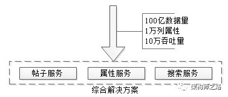

文章写了很长，最后做一个简单总结，面对**100亿数据量，1万列属性，10万吞吐量的业务需求**，58同城的经验，是采用了`元数据服务、属性服务、搜索服务`来解决的。

# 总结

数据库软件架构，到底要设计些什么？

- 可用性
- 读性能
- 一致性
- 扩展性

> 转载自[数据库软件架构，到底要设计些什么？](https://mp.weixin.qq.com/s?__biz=MjM5ODYxMDA5OQ==&mid=2651962610&idx=1&sn=e5ddf9d321139b143186f2ee596c1f06&chksm=bd2d092e8a5a8038ac72b243f7114d41a754dddfff4177eeb9d897443a3ec01922bbc4ae02cd&scene=21#wechat_redirect)，在原文基础上有修改